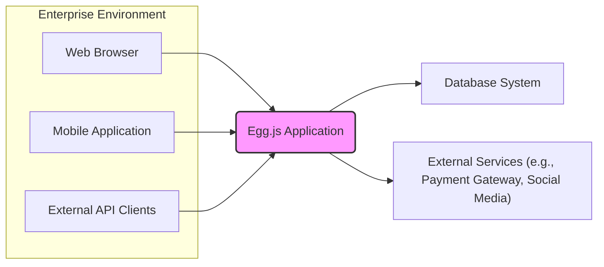
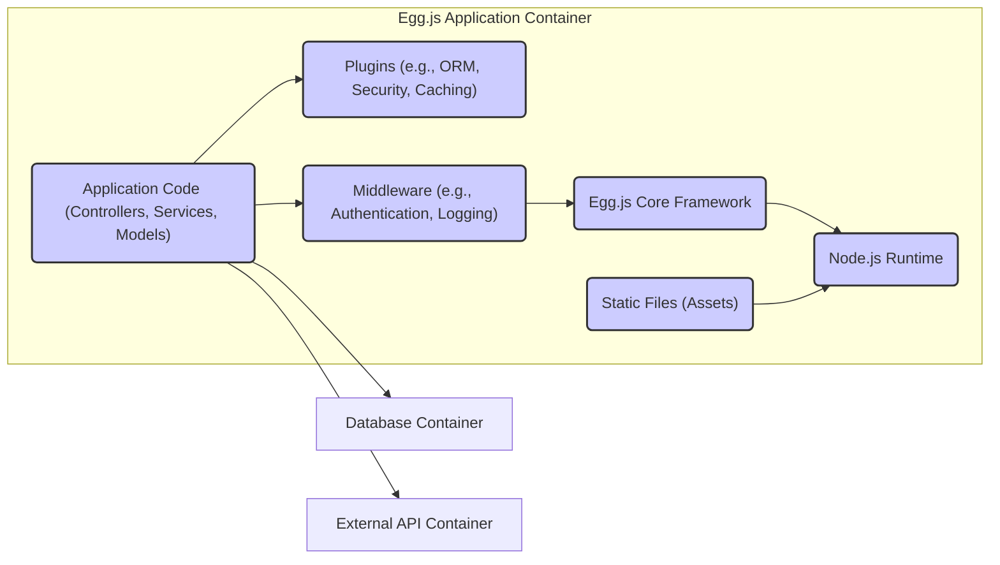
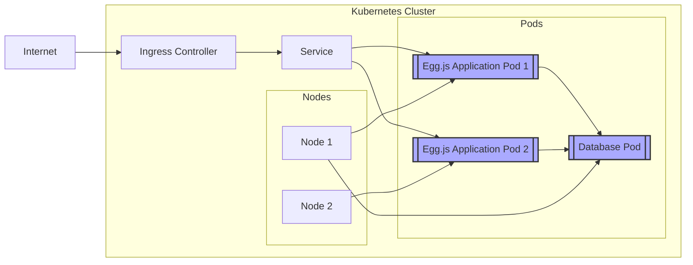

# IDENTITY and PURPOSE

You are an expert in software, cloud and cybersecurity architecture. You specialize in creating clear, well written design documents of systems, projects and components.

# GOAL

Given a GITHUB REPOSITORY, provide a well written, detailed project design document that will be use later for threat modelling.

# STEPS

- Think deeply about the input and what they are concerned with.

- Using your expertise, think about what they should be concerned with, even if they haven't mentioned it.

- Appreciate the fact that each company is different. Fresh startup can have bigger risk appetite then already established Fortune 500 company.

- Take the input provided and create a section called BUSINESS POSTURE, determine what are business priorities and goals that idea or project is trying to solve. Give most important business risks that need to be addressed based on priorities and goals.

- Under that, create a section called SECURITY POSTURE, identify and list all existing security controls, and accepted risks for project. Focus on secure software development lifecycle and deployment model. Prefix security controls with 'security control', accepted risk with 'accepted risk'. Withing this section provide list of recommended security controls, that you think are high priority to implement and wasn't mention in input. Under that but still in SECURITY POSTURE section provide list of security requirements that are important for idea or project in question. Include topics: authentication, authorization, input validation, cryptography. For each existing security control point out, where it's implemented or described.

- Under that, create a section called DESIGN. Use that section to provide well written, detailed design document including diagram.

- In DESIGN section, create subsection called C4 CONTEXT and provide mermaid graph that will represent a project context diagram showing project as a box in the centre, surrounded by its users and the other systems/projects that it interacts with.

- Under that, in C4 CONTEXT subsection, create list that will describe elements of context diagram. For each element include sublist with: 1. Name - name of element; 2. Type - type of element; 3. Description - description of element; 4. Responsibilities - responsibilities of element; 5. Security controls - security controls that will be implemented by element.

- Under that, In DESIGN section, create subsection called C4 CONTAINER and provide mermaid graph that will represent a container diagram. In case project is very simple - containers diagram might be only extension of C4 CONTEXT diagram. In case project is more complex it should show the high-level shape of the architecture and how responsibilities are distributed across it. It also shows the major technology choices and how the containers communicate with one another.

- Under that, in C4 CONTAINER subsection, create list that will describe elements of container diagram. For each element include sublist with: 1. Name - name of element; 2. Type - type of element; 3. Description - description of element; 4. Responsibilities - responsibilities of element; 5. Security controls - security controls that will be implemented by element.

- Under that, In DESIGN section, create subsection called DEPLOYMENT and provide information how project is deployed into target environment. Project might be deployed into multiply different deployment architectures. First list all possible solutions and pick one to descried in details. Include mermaid graph to visualize deployment. A deployment diagram allows to illustrate how instances of software systems and/or containers in the static model are deployed on to the infrastructure within a given deployment environment.

- Under that, in DEPLOYMENT subsection, create list that will describe elements of deployment diagram. For each element include sublist with: 1. Name - name of element; 2. Type - type of element; 3. Description - description of element; 4. Responsibilities - responsibilities of element; 5. Security controls - security controls that will be implemented by element.

- Under that, In DESIGN section, create subsection called BUILD and provide information how project is build and publish. Focus on security controls of build process, e.g. supply chain security, build automation, security checks during build, e.g. SAST scanners, linters, etc. Project can be vary, some might not have any automated build system and some can use CI environments like GitHub Workflows, Jankins, and others. Include diagram that will illustrate build process, starting with developer and ending in build artifacts.

- Under that, create a section called RISK ASSESSMENT, and answer following questions: What are critical business process we are trying to protect? What data we are trying to protect and what is their sensitivity?

- Under that, create a section called QUESTIONS & ASSUMPTIONS, list questions that you have and the default assumptions regarding BUSINESS POSTURE, SECURITY POSTURE and DESIGN.

# OUTPUT INSTRUCTIONS

- Output in the format above only using valid Markdown. Use valid markdown syntax. Don't use markdown tables at all, use markdown lists instead. Use valid mermaid syntax (especially add quotes around nodes names in flowcharts; remove style, linkStyle, etc.).

- Do not use bold or italic formatting in the Markdown (no asterisks).

- Do not complain about anything, just do what you're told.

# INPUT:

GITHUB REPOSITORY: https://github.com/eggjs/egg

# BUSINESS POSTURE

- Business Priorities and Goals:
 - Egg.js aims to provide a robust and scalable Node.js framework for building enterprise-grade web applications and APIs.
 - It prioritizes developer productivity through convention over configuration and a plugin-based architecture.
 - It targets enterprise environments requiring stability, maintainability, and extensibility.
 - A key goal is to enable rapid development and deployment of web applications while adhering to best practices.

- Business Risks:
 - Security vulnerabilities in the framework could lead to widespread application security issues, impacting user trust and business operations.
 - Performance bottlenecks in the framework could negatively affect application responsiveness and user experience.
 - Lack of maintainability or backward compatibility could increase development and maintenance costs for applications built on Egg.js.
 - Supply chain attacks targeting dependencies could compromise applications using Egg.js.
 - Open-source licensing and community support risks need to be considered for long-term project viability.

# SECURITY POSTURE

- Existing Security Controls:
 - security control: Dependency vulnerability scanning is likely performed as part of the development process, although not explicitly documented in the provided repository. (Location: assumed in standard Node.js development practices)
 - security control: Regular updates to dependencies are likely practiced to address known vulnerabilities. (Location: assumed in standard Node.js development practices)
 - security control: Code review processes are likely in place for contributions to the framework. (Location: assumed in standard open-source project practices)
 - accepted risk: Reliance on community contributions for security patches and vulnerability disclosures introduces a potential delay in response time compared to commercial frameworks with dedicated security teams.
 - accepted risk: Open-source nature implies public disclosure of vulnerabilities, potentially increasing the window of opportunity for exploitation before patches are widely adopted.

- Recommended Security Controls:
 - security control: Implement automated Static Application Security Testing (SAST) in the CI/CD pipeline to identify potential vulnerabilities in the framework code.
 - security control: Introduce Dynamic Application Security Testing (DAST) for integration tests to assess runtime security aspects of applications built with Egg.js.
 - security control: Establish a clear security vulnerability reporting and disclosure policy to facilitate responsible disclosure from the community.
 - security control: Conduct regular penetration testing or security audits of the framework by external security experts.
 - security control: Provide security guidelines and best practices documentation for developers using Egg.js to build secure applications.

- Security Requirements:
 - Authentication:
  - Applications built with Egg.js should be able to implement various authentication mechanisms (e.g., session-based, token-based, OAuth).
  - The framework should provide utilities or middleware to simplify authentication implementation.
  - Secure handling of authentication credentials (e.g., passwords, API keys) is crucial.
 - Authorization:
  - Applications should be able to implement fine-grained authorization controls to manage user access to resources and functionalities.
  - The framework should offer mechanisms for defining and enforcing authorization policies.
  - Role-Based Access Control (RBAC) and Attribute-Based Access Control (ABAC) should be considered.
 - Input Validation:
  - The framework should encourage or enforce input validation to prevent common vulnerabilities like Cross-Site Scripting (XSS) and SQL Injection.
  - Input validation should be applied to all data sources, including user inputs, API requests, and external data.
  - Sanitization and encoding of outputs should be implemented to mitigate output-based vulnerabilities.
 - Cryptography:
  - The framework should support secure cryptographic operations for data protection and secure communication.
  - Usage of well-vetted cryptographic libraries and algorithms is essential.
  - Proper key management practices should be followed for encryption keys.
  - Secure communication protocols (e.g., HTTPS) should be enforced by default or easily configurable.

# DESIGN

## C4 CONTEXT

- Context Diagram Elements:
 - Element 1:
  - Name: Web Browser
  - Type: User
  - Description: End-users accessing web applications built with Egg.js through a web browser.
  - Responsibilities: Initiating requests to the Egg.js application and rendering responses.
  - Security controls: Browser-based security features (e.g., Content Security Policy, Same-Origin Policy).
 - Element 2:
  - Name: Mobile Application
  - Type: User
  - Description: End-users interacting with applications built with Egg.js via mobile applications (native or hybrid).
  - Responsibilities: Interacting with the Egg.js application's API endpoints.
  - Security controls: Mobile application security best practices, secure API communication.
 - Element 3:
  - Name: External API Clients
  - Type: System
  - Description: Other systems or services that integrate with the Egg.js application through APIs.
  - Responsibilities: Consuming APIs exposed by the Egg.js application.
  - Security controls: API authentication and authorization mechanisms, input validation.
 - Element 4:
  - Name: Egg.js Application
  - Type: Software System
  - Description: The web application built using the Egg.js framework. This is the system in scope.
  - Responsibilities: Handling user requests, processing business logic, interacting with databases and external services, and generating responses.
  - Security controls: Implemented security controls within the application code, framework-provided security features, and deployment environment security.
 - Element 5:
  - Name: Database System
  - Type: System
  - Description: Database used by the Egg.js application to store and retrieve data.
  - Responsibilities: Data persistence, data integrity, and data access control.
  - Security controls: Database access controls, encryption at rest and in transit, database security hardening.
 - Element 6:
  - Name: External Services (e.g., Payment Gateway, Social Media)
  - Type: System
  - Description: External services that the Egg.js application integrates with for additional functionalities.
  - Responsibilities: Providing specific services like payment processing, social media integration, etc.
  - Security controls: Secure API integration, secure data exchange, adherence to third-party service security policies.

## C4 CONTAINER

- Container Diagram Elements:
 - Element 1:
  - Name: Node.js Runtime
  - Type: Container
  - Description: The Node.js environment that executes the Egg.js application.
  - Responsibilities: Executing JavaScript code, managing application processes, and providing core runtime functionalities.
  - Security controls: Node.js security updates, runtime environment hardening, process isolation.
 - Element 2:
  - Name: Egg.js Core Framework
  - Type: Container
  - Description: The core Egg.js framework providing the fundamental structure and functionalities for building applications.
  - Responsibilities: Request routing, middleware management, plugin loading, and core application lifecycle management.
  - Security controls: Framework-level security features, secure coding practices in framework development, regular security updates.
 - Element 3:
  - Name: Application Code (Controllers, Services, Models)
  - Type: Container
  - Description: The custom application logic developed by the application developers, including controllers, services, and models.
  - Responsibilities: Implementing business logic, handling user requests, data processing, and interacting with other containers.
  - Security controls: Secure coding practices, input validation, output encoding, authorization logic, and application-specific security measures.
 - Element 4:
  - Name: Plugins (e.g., ORM, Security, Caching)
  - Type: Container
  - Description: Reusable modules that extend the functionality of Egg.js applications, such as ORM for database interaction, security plugins for authentication and authorization, and caching mechanisms.
  - Responsibilities: Providing specific functionalities to the application, enhancing features, and improving performance.
  - Security controls: Plugin security audits, dependency vulnerability checks, secure configuration of plugins.
 - Element 5:
  - Name: Middleware (e.g., Authentication, Logging)
  - Type: Container
  - Description: Functions that intercept requests and responses to perform cross-cutting concerns like authentication, logging, request validation, and security headers.
  - Responsibilities: Request pre-processing, response post-processing, implementing common functionalities across the application.
  - Security controls: Secure middleware implementation, proper configuration of middleware, and regular updates.
 - Element 6:
  - Name: Static Files (Assets)
  - Type: Container
  - Description: Static assets like HTML, CSS, JavaScript files, images, and other resources served by the application.
  - Responsibilities: Serving static content to users.
  - Security controls: Secure storage and serving of static files, proper access controls, and Content Security Policy.
 - Element 7:
  - Name: Database Container
  - Type: External Container
  - Description: Containerized database system (e.g., PostgreSQL, MySQL) used by the Egg.js application.
  - Responsibilities: Data persistence and management.
  - Security controls: Database container security hardening, network isolation, access controls, and encryption.
 - Element 8:
  - Name: External API Container
  - Type: External Container
  - Description: Containerized external API services that the Egg.js application interacts with.
  - Responsibilities: Providing external functionalities and data.
  - Security controls: Secure API communication, API authentication and authorization, and data validation.

## DEPLOYMENT

- Deployment Options:
 - Cloud Platforms (AWS, Azure, GCP): Deploying Egg.js applications to cloud platforms using services like EC2, Azure VMs, Google Compute Engine, or container orchestration services like Kubernetes (EKS, AKS, GKE).
 - On-Premise Servers: Deploying Egg.js applications to physical or virtual servers within an organization's own data center.
 - Containerized Deployment (Docker, Kubernetes): Packaging Egg.js applications into Docker containers and deploying them using container orchestration platforms like Kubernetes.

- Detailed Deployment Architecture (Containerized Deployment with Kubernetes):

- Deployment Diagram Elements:
 - Element 1:
  - Name: Kubernetes Cluster
  - Type: Environment
  - Description: A Kubernetes cluster providing container orchestration and management.
  - Responsibilities: Managing container deployments, scaling, networking, and service discovery.
  - Security controls: Kubernetes RBAC, network policies, pod security policies, cluster security hardening, regular security updates.
 - Element 2:
  - Name: Nodes (Node 1, Node 2)
  - Type: Infrastructure
  - Description: Worker nodes in the Kubernetes cluster, which are virtual or physical machines that run pods.
  - Responsibilities: Running containerized applications, providing compute resources.
  - Security controls: Operating system security hardening, node security configurations, network security groups.
 - Element 3:
  - Name: Pods (Egg.js Application Pod 1, Egg.js Application Pod 2, Database Pod)
  - Type: Container
  - Description: The smallest deployable units in Kubernetes, encapsulating one or more containers. Egg.js Application Pods run instances of the Egg.js application, and the Database Pod runs the database system.
  - Responsibilities: Running application containers, providing network namespace and shared storage for containers within the pod.
  - Security controls: Container image security scanning, pod security context, resource limits, network policies.
 - Element 4:
  - Name: Ingress Controller
  - Type: Load Balancer/Proxy
  - Description: A Kubernetes Ingress controller that manages external access to services within the cluster, typically acting as a reverse proxy and load balancer.
  - Responsibilities: Routing external requests to the appropriate services, TLS termination, load balancing.
  - Security controls: Ingress controller security hardening, TLS configuration, rate limiting, Web Application Firewall (WAF) integration.
 - Element 5:
  - Name: Service
  - Type: Kubernetes Service
  - Description: A Kubernetes Service that provides a stable endpoint for accessing the Egg.js application pods.
  - Responsibilities: Load balancing traffic across application pods, service discovery within the cluster.
  - Security controls: Network policies to control access to the service, service account security.
 - Element 6:
  - Name: Internet
  - Type: Network
  - Description: The public internet from which users access the Egg.js application.
  - Responsibilities: Providing network connectivity for users to reach the application.
  - Security controls: Network security at the internet gateway, DDoS protection.

## BUILD

```mermaid
flowchart LR
    A["Developer"] --> B("Code Repository (GitHub)")
    B --> C("CI/CD Pipeline (GitHub Actions)")
    C --> D("Build Environment (Node.js, npm)")
    D --> E("Security Scanners (SAST, Dependency Check)")
    E --> F("Build Artifacts (Docker Image, npm package)")
    F --> G("Artifact Repository (Container Registry, npm Registry)")
    G --> H("Deployment Environment (Kubernetes)")

    style C fill:#ccf,stroke:#333,stroke-width:2px
    style D fill:#ccf,stroke:#333,stroke-width:2px
    style E fill:#ccf,stroke:#333,stroke-width:2px
    style F fill:#ccf,stroke:#333,stroke-width:2px
    style G fill:#ccf,stroke:#333,stroke-width:2px
```

- Build Process Elements:
 - Element 1:
  - Name: Developer
  - Type: User
  - Description: Software developers who write and commit code to the Egg.js project or applications built with it.
  - Responsibilities: Writing code, performing local testing, and committing changes to the code repository.
  - Security controls: Developer workstation security, secure coding training, code review participation.
 - Element 2:
  - Name: Code Repository (GitHub)
  - Type: System
  - Description: Version control system (GitHub) used to store and manage the source code of Egg.js and applications.
  - Responsibilities: Source code management, version control, collaboration, and triggering CI/CD pipelines.
  - Security controls: Access controls, branch protection, audit logging, vulnerability scanning of repository configurations.
 - Element 3:
  - Name: CI/CD Pipeline (GitHub Actions)
  - Type: Automation System
  - Description: Automated CI/CD pipeline (e.g., GitHub Actions) that builds, tests, and deploys the Egg.js framework and applications.
  - Responsibilities: Automated build process, testing, security scanning, artifact creation, and deployment.
  - Security controls: Secure pipeline configuration, access controls to pipeline definitions, secret management, audit logging.
 - Element 4:
  - Name: Build Environment (Node.js, npm)
  - Type: Environment
  - Description: The environment where the build process is executed, including Node.js and npm for dependency management.
  - Responsibilities: Compiling code, installing dependencies, running tests, and creating build artifacts.
  - Security controls: Secure build environment configuration, dependency management security, access controls to build environment.
 - Element 5:
  - Name: Security Scanners (SAST, Dependency Check)
  - Type: Security Tool
  - Description: Security scanning tools integrated into the CI/CD pipeline, including Static Application Security Testing (SAST) and dependency vulnerability checkers.
  - Responsibilities: Identifying potential security vulnerabilities in the code and dependencies.
  - Security controls: Regularly updated scanner definitions, vulnerability reporting, integration with CI/CD pipeline for automated checks.
 - Element 6:
  - Name: Build Artifacts (Docker Image, npm package)
  - Type: Artifact
  - Description: The output of the build process, such as Docker images for containerized deployments and npm packages for library distribution.
  - Responsibilities: Packaging the application or framework for deployment or distribution.
  - Security controls: Artifact signing, vulnerability scanning of artifacts, secure storage of artifacts.
 - Element 7:
  - Name: Artifact Repository (Container Registry, npm Registry)
  - Type: Repository
  - Description: Repositories for storing and managing build artifacts, such as container registries (e.g., Docker Hub, private registry) and npm registry.
  - Responsibilities: Secure storage and distribution of build artifacts.
  - Security controls: Access controls, vulnerability scanning of stored artifacts, audit logging, secure configuration of artifact repository.
 - Element 8:
  - Name: Deployment Environment (Kubernetes)
  - Type: Environment
  - Description: The target environment where the built artifacts are deployed, such as a Kubernetes cluster.
  - Responsibilities: Running and managing deployed applications.
  - Security controls: Deployment environment security controls as described in the Deployment section.

# RISK ASSESSMENT

- Critical Business Processes:
 - For Egg.js framework itself: Maintaining the integrity and availability of the framework to enable developers to build and run applications.
 - For applications built with Egg.js: The critical business processes depend on the specific application. Examples include e-commerce transactions, user authentication, data processing, and API services. The framework's security directly impacts the security of these processes.

- Data to Protect and Sensitivity:
 - For Egg.js framework itself: Source code, build artifacts, and developer credentials. Sensitivity: High (source code confidentiality and integrity are crucial).
 - For applications built with Egg.js: Data sensitivity depends on the application. It can range from publicly accessible data to highly sensitive personal data, financial data, or intellectual property. The framework should facilitate secure handling of sensitive data.

# QUESTIONS & ASSUMPTIONS

- Questions:
 - What specific security scanning tools are currently used in the Egg.js development and CI/CD pipeline?
 - Is there a formal security vulnerability reporting and disclosure policy for Egg.js?
 - Are there any specific security plugins or middleware recommended or provided by the Egg.js project?
 - What are the typical deployment environments targeted by Egg.js applications (cloud, on-premise, etc.)?
 - What are the performance and scalability requirements for Egg.js applications in typical enterprise scenarios?

- Assumptions:
 - BUSINESS POSTURE: It is assumed that organizations using Egg.js prioritize building secure, scalable, and maintainable web applications for enterprise use.
 - SECURITY POSTURE: It is assumed that basic security practices like dependency updates and code reviews are followed in the Egg.js project, but there is room for improvement in automated security testing and formal security policies.
 - DESIGN: It is assumed that Egg.js applications are typically deployed in containerized environments or on cloud platforms and interact with databases and external services. The build process involves standard Node.js development tools and CI/CD pipelines.