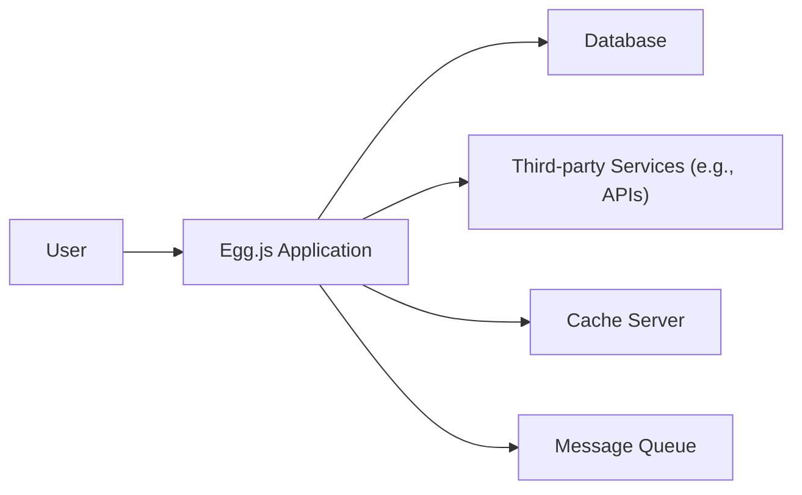
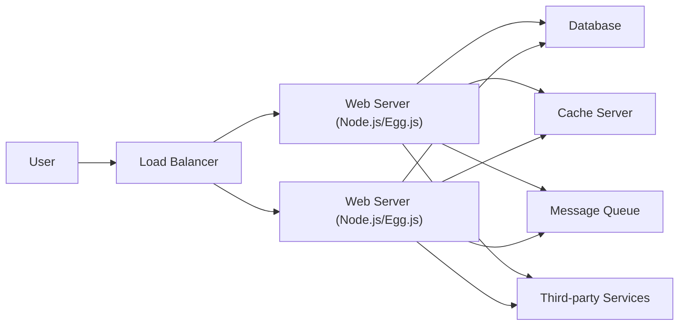
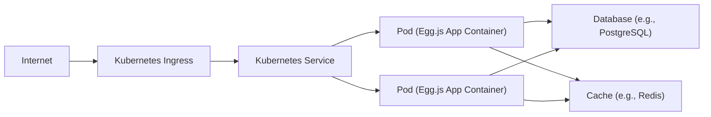
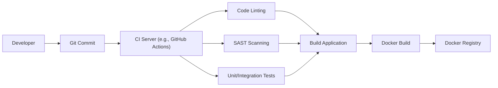

Okay, let's create a design document for the Egg.js framework based on the provided GitHub repository.

# BUSINESS POSTURE

Egg.js is a Node.js framework designed to help developers build enterprise-level web applications and APIs. It emphasizes convention over configuration, extensibility, and stability.  The business priorities appear to be:

*   Provide a stable and reliable framework for building enterprise applications.
*   Reduce development time and effort through conventions and built-in features.
*   Enable easy extension and customization to meet specific project needs.
*   Foster a strong community and ecosystem around the framework.
*   Maintain backward compatibility and minimize breaking changes.

Business Goals:

*   Become a leading choice for Node.js enterprise development.
*   Attract and retain a large and active user base.
*   Maintain a high level of developer satisfaction.
*   Ensure the long-term sustainability of the project.

Most Important Business Risks:

*   Security vulnerabilities in the framework or its dependencies could expose user data or disrupt applications.
*   Lack of adoption or a decline in community engagement could lead to the framework becoming obsolete.
*   Performance bottlenecks or scalability issues could limit the use of the framework for high-traffic applications.
*   Failure to keep up with the evolving Node.js ecosystem could make the framework less attractive to developers.
*   Inadequate documentation or support could hinder developer adoption and satisfaction.

# SECURITY POSTURE

Existing Security Controls:

*   security control: Egg.js has a dedicated security plugin (`egg-security`) that provides protection against common web vulnerabilities like XSS, CSRF, clickjacking, and others. (Described in the documentation and implemented as a plugin).
*   security control: The framework encourages the use of secure coding practices through its conventions and documentation. (Described in documentation).
*   security control: Dependency management is handled through npm, allowing for regular updates to address known vulnerabilities in third-party libraries. (Implicit in the Node.js ecosystem).
*   security control: The framework provides built-in support for common security features like HTTPS and secure cookies. (Described in the documentation).
*   security control: Regular security audits and penetration testing are likely conducted, although this is not explicitly stated in the repository. (Assumption based on best practices).

Accepted Risks:

*   accepted risk: The framework relies on the security of its underlying dependencies, and vulnerabilities in those dependencies could impact the security of applications built with Egg.js.
*   accepted risk: Developers are ultimately responsible for implementing secure coding practices within their applications, and the framework cannot guarantee the absence of all vulnerabilities.
*   accepted risk: The framework's security plugin may not cover all possible attack vectors, and developers may need to implement additional security measures.

Recommended Security Controls:

*   Implement a robust Content Security Policy (CSP) to mitigate the impact of XSS attacks.
*   Integrate static application security testing (SAST) tools into the development workflow to identify potential vulnerabilities early on.
*   Implement dynamic application security testing (DAST) to scan running applications for vulnerabilities.
*   Establish a clear vulnerability disclosure program to encourage responsible reporting of security issues.
*   Provide more detailed security guidance and best practices in the documentation.

Security Requirements:

*   Authentication:
    *   The framework should provide mechanisms for implementing secure user authentication, including support for various authentication methods (e.g., password-based, OAuth, JWT).
    *   Session management should be secure, protecting against session hijacking and fixation attacks.
*   Authorization:
    *   The framework should support role-based access control (RBAC) or other authorization mechanisms to restrict access to sensitive resources.
    *   Authorization checks should be enforced consistently throughout the application.
*   Input Validation:
    *   All user input should be validated rigorously to prevent injection attacks (e.g., SQL injection, NoSQL injection, command injection).
    *   The framework should provide built-in validation mechanisms or integrate with popular validation libraries.
*   Cryptography:
    *   Sensitive data should be encrypted both in transit (using HTTPS) and at rest (using appropriate encryption algorithms).
    *   The framework should provide secure mechanisms for managing cryptographic keys.
    *   Password should be hashed using strong, one-way hashing algorithms (e.g., bcrypt, Argon2).

# DESIGN

## C4 CONTEXT

Element Descriptions:

*   Element:
    *   Name: User
    *   Type: Person
    *   Description: A user interacting with the Egg.js application through a web browser or other client.
    *   Responsibilities: Accessing application features, providing input, receiving output.
    *   Security controls: Browser security features, network security.

*   Element:
    *   Name: Egg.js Application
    *   Type: Software System
    *   Description: The web application built using the Egg.js framework.
    *   Responsibilities: Handling user requests, processing data, interacting with other systems.
    *   Security controls: `egg-security` plugin, secure coding practices, input validation, authentication, authorization.

*   Element:
    *   Name: Database
    *   Type: Software System
    *   Description: The database used by the application to store persistent data.
    *   Responsibilities: Storing and retrieving data, ensuring data integrity.
    *   Security controls: Database access controls, encryption at rest, regular backups.

*   Element:
    *   Name: Third-party Services
    *   Type: Software System
    *   Description: External services used by the application, such as payment gateways, email providers, or social media APIs.
    *   Responsibilities: Providing specific functionalities as required by the application.
    *   Security controls: Secure API communication (HTTPS), API keys, rate limiting.

*   Element:
    *   Name: Cache Server
    *   Type: Software System
    *   Description: A caching system used to improve application performance.
    *   Responsibilities: Storing frequently accessed data in memory for faster retrieval.
    *   Security controls: Access controls, data validation.

*   Element:
    *   Name: Message Queue
    *   Type: Software System
    *   Description: A message queue used for asynchronous communication between different parts of the application or with external systems.
    *   Responsibilities: Handling asynchronous tasks, ensuring reliable message delivery.
    *   Security controls: Access controls, message encryption.

## C4 CONTAINER

Element Descriptions:

*   Element:
    *   Name: User
    *   Type: Person
    *   Description: A user interacting with the application.
    *   Responsibilities: Accessing application features, providing input, receiving output.
    *   Security controls: Browser security features, network security.

*   Element:
    *   Name: Load Balancer
    *   Type: Container
    *   Description: Distributes incoming traffic across multiple web server instances.
    *   Responsibilities: Ensuring high availability and scalability.
    *   Security controls: SSL/TLS termination, DDoS protection.

*   Element:
    *   Name: Web Server (Node.js/Egg.js)
    *   Type: Container
    *   Description: An instance of the Node.js application running the Egg.js framework.
    *   Responsibilities: Handling user requests, processing data, interacting with other systems.
    *   Security controls: `egg-security` plugin, secure coding practices, input validation, authentication, authorization.

*   Element:
    *   Name: Database
    *   Type: Container
    *   Description: The database used by the application.
    *   Responsibilities: Storing and retrieving data, ensuring data integrity.
    *   Security controls: Database access controls, encryption at rest, regular backups.

*   Element:
    *   Name: Cache Server
    *   Type: Container
    *   Description: The caching system.
    *   Responsibilities: Storing frequently accessed data.
    *   Security controls: Access controls, data validation.

*   Element:
    *   Name: Message Queue
    *   Type: Container
    *   Description: The message queue system.
    *   Responsibilities: Handling asynchronous tasks.
    *   Security controls: Access controls, message encryption.

*   Element:
    *   Name: Third-party Services
    *   Type: Container
    *   Description: External services used by the application.
    *   Responsibilities: Providing specific functionalities.
    *   Security controls: Secure API communication (HTTPS), API keys, rate limiting.

## DEPLOYMENT

Possible Deployment Solutions:

1.  Traditional VM-based deployment (e.g., AWS EC2, Google Compute Engine, Azure VMs).
2.  Containerized deployment using Docker and Kubernetes (e.g., AWS EKS, Google Kubernetes Engine, Azure Kubernetes Service).
3.  Platform as a Service (PaaS) deployment (e.g., Heroku, AWS Elastic Beanstalk, Google App Engine).
4.  Serverless deployment using functions (e.g., AWS Lambda, Google Cloud Functions, Azure Functions).

Chosen Solution: Containerized deployment using Docker and Kubernetes.

Element Descriptions:

*   Element:
    *   Name: Internet
    *   Type: Infrastructure Node
    *   Description: The public internet.
    *   Responsibilities: Routing traffic to the application.
    *   Security controls: Network firewalls, DDoS protection.

*   Element:
    *   Name: Kubernetes Ingress
    *   Type: Infrastructure Node
    *   Description: Entry point for external traffic into the Kubernetes cluster.
    *   Responsibilities: Routing traffic to the appropriate Kubernetes Service.
    *   Security controls: SSL/TLS termination, request filtering.

*   Element:
    *   Name: Kubernetes Service
    *   Type: Infrastructure Node
    *   Description: Provides a stable endpoint for accessing the Egg.js application pods.
    *   Responsibilities: Load balancing traffic across multiple pods.
    *   Security controls: Network policies.

*   Element:
    *   Name: Pod (Egg.js App Container)
    *   Type: Container Instance
    *   Description: A Kubernetes pod running the Docker container with the Egg.js application.
    *   Responsibilities: Handling user requests, processing data.
    *   Security controls: Container security context, resource limits.

*   Element:
    *   Name: Database (e.g., PostgreSQL)
    *   Type: Container Instance / Infrastructure Node
    *   Description: The database instance. Could be a managed service or a separate pod.
    *   Responsibilities: Storing and retrieving data.
    *   Security controls: Database access controls, encryption at rest, regular backups.

*   Element:
    *   Name: Cache (e.g., Redis)
    *   Type: Container Instance / Infrastructure Node
    *   Description: The cache instance. Could be a managed service or a separate pod.
    *   Responsibilities: Storing frequently accessed data.
    *   Security controls: Access controls, data validation.

## BUILD

Build Process Description:

1.  Developer commits code to a Git repository (e.g., GitHub, GitLab).
2.  A CI server (e.g., GitHub Actions, Jenkins) is triggered by the commit.
3.  The CI server runs a series of steps:
    *   Code Linting: Checks code style and potential errors using tools like ESLint.
    *   SAST Scanning: Performs static application security testing to identify vulnerabilities in the code.
    *   Unit/Integration Tests: Executes automated tests to ensure code quality and functionality.
    *   Build Application: Compiles the application code (if necessary) and packages it for deployment.
    *   Docker Build: Creates a Docker image containing the application and its dependencies.
    *   Docker Registry: Pushes the Docker image to a container registry (e.g., Docker Hub, AWS ECR, Google Container Registry).

Security Controls:

*   security control: Code linting helps enforce coding standards and prevent common errors.
*   security control: SAST scanning identifies vulnerabilities early in the development lifecycle.
*   security control: Automated tests ensure code quality and prevent regressions.
*   security control: Docker images provide a consistent and isolated environment for the application.
*   security control: Container registries provide a secure way to store and manage Docker images.
*   security control: Using signed commits and verifying them in CI.
*   security control: Using signed docker images.

# RISK ASSESSMENT

Critical Business Processes:

*   User authentication and authorization.
*   Data storage and retrieval.
*   API request handling.
*   Asynchronous task processing.
*   Interaction with third-party services.

Data Sensitivity:

*   User data (e.g., usernames, passwords, email addresses, personal information): High sensitivity.
*   Application data (e.g., business data, financial transactions): Varies depending on the specific application, but potentially high sensitivity.
*   Configuration data (e.g., API keys, database credentials): High sensitivity.
*   Logs and audit trails: Medium sensitivity.

# QUESTIONS & ASSUMPTIONS

Questions:

*   What specific types of applications are typically built with Egg.js (e.g., e-commerce, social media, internal tools)? This will help refine the risk assessment.
*   What are the specific performance and scalability requirements for applications built with Egg.js?
*   Are there any existing security audits or penetration testing reports available for Egg.js?
*   What is the process for reporting and addressing security vulnerabilities in Egg.js?
*   What level of support is provided for developers using Egg.js?

Assumptions:

*   BUSINESS POSTURE: Assumed that Egg.js aims to be a leading framework for enterprise Node.js development.
*   SECURITY POSTURE: Assumed that regular security audits and penetration testing are conducted.
*   DESIGN: Assumed a containerized deployment using Docker and Kubernetes as a common and recommended approach.  Other deployment models are possible.
*   DESIGN: Assumed use of common supporting services like databases, caches, and message queues.
*   BUILD: Assumed use of a CI/CD pipeline with common security checks.