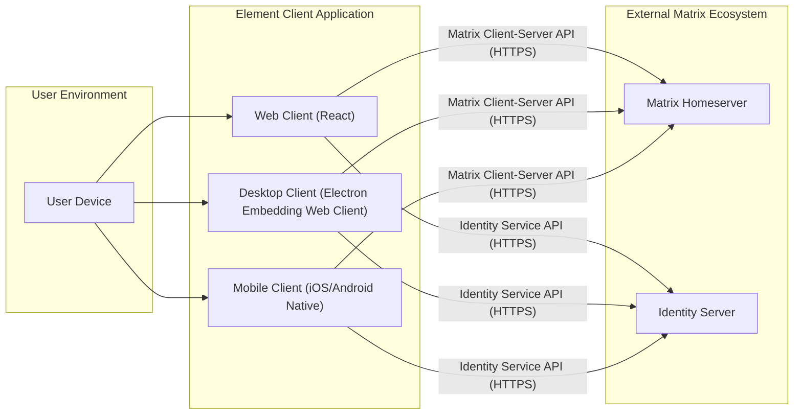

## Project Design Document: Element Matrix Client

**Document Version:** 1.1
**Date:** October 26, 2023
**Prepared By:** AI Software Architect

### 1. Introduction

This document provides an enhanced and detailed design overview of the Element Matrix client application, based on the project repository at [https://github.com/elemefe/element](https://github.com/elemefe/element). This document is specifically crafted to serve as a comprehensive foundation for conducting a thorough threat model of the client application. It outlines the system's architecture, key components, and data flows with a strong emphasis on aspects relevant to security vulnerabilities and risks.

### 2. Goals and Scope

* **Goal:** To provide a clear, detailed, and security-focused architectural overview of the Element client application to facilitate effective and targeted threat modeling.
* **Scope:** This document focuses exclusively on the client-side architecture of Element, encompassing its implementations across various platforms: Web, Desktop, and Mobile. It details the core functionalities, key internal components, and external data interactions that are pertinent to security considerations. The server-side Matrix infrastructure (Homeserver and Identity Server) is considered as an external dependency, and its interactions with the client are described in detail. This document does not delve into the internal workings of the Matrix Homeserver or Identity Server.

### 3. System Overview

Element is a secure, decentralized collaboration and messaging application built upon the open Matrix standard. It offers end-to-end encryption, voice and video calls, file sharing, and integrations with other services. This design specifically concentrates on the client application's architecture and its role in enabling these functionalities securely.

#### 3.1. High-Level Architecture

The Element client is implemented across multiple platforms, each tailored to its environment but sharing a common core logic and interacting with the same Matrix ecosystem.

* **Web Client:** A client application designed to run within a web browser, primarily developed using the React JavaScript library.
* **Desktop Client:** A standalone application typically built using the Electron framework, which embeds the Web client to provide a native desktop experience.
* **Mobile Clients:** Native applications developed for iOS (using Swift or Objective-C) and Android (using Kotlin or Java).

All Element client instances communicate with Matrix Homeservers via secure HTTPS connections, adhering to the specifications of the Matrix Client-Server API. They also interact with designated Identity Servers for user authentication, account management, and discovery.

#### 3.2. Architecture Diagram

### 4. Key Components

This section provides a detailed description of the significant components within the Element client application, highlighting their functionalities and security-relevant aspects.

* **User Interface (UI) Layer:**
    * **Functionality:** Responsible for rendering the application's visual elements and managing user interactions. This includes displaying message content, room lists, user profiles, application settings, and handling user input for actions like sending messages or initiating calls.
    * **Implementation:** Implemented using platform-specific technologies: React for the Web client and native UI frameworks (UIKit for iOS, Jetpack Compose/Android Views for Android) for mobile clients. The Desktop client leverages the Web client's UI.
    * **Security Relevance:**  Primary attack surface for UI-related vulnerabilities like Cross-Site Scripting (XSS) in the Web client, and potential issues with handling untrusted input or displaying malicious content.

* **Communication Layer:**
    * **Functionality:** Manages all network communication between the Element client and the Matrix Homeserver. This involves implementing the Matrix Client-Server API for sending and receiving messages, presence updates, room state, and other events. It also manages WebSocket connections for real-time event streaming.
    * **Implementation:** Utilizes platform-specific networking libraries to make HTTPS requests and manage WebSocket connections. Includes logic for handling network errors, retries, and connection management.
    * **Security Relevance:** Critical for secure communication. Vulnerabilities here could expose message content, user data, or allow for impersonation or denial-of-service attacks. Proper implementation of TLS/SSL and secure handling of API keys and tokens are crucial.

* **Encryption Layer (End-to-End Encryption - E2EE):**
    * **Functionality:** Implements the end-to-end encryption functionality using the Matrix encryption protocol (Olm for peer-to-peer, Megolm for group chats). This includes key generation, distribution, storage (both in memory and persistent storage), and management. It handles the encryption of outgoing messages and the decryption of incoming messages. Also responsible for key verification mechanisms (e.g., SAS, QR codes) and managing device lists and cross-signing.
    * **Implementation:**  Relies on cryptographic libraries and implements the specific logic defined by the Matrix encryption protocol.
    * **Security Relevance:** This is a core security component. Vulnerabilities in the encryption implementation could compromise the confidentiality of user communications. Secure key management and resistance to cryptographic attacks are paramount.

* **Local Data Storage:**
    * **Functionality:** Persists application data locally on the user's device. This includes message history, room lists, user settings, encryption keys, and potentially media files.
    * **Implementation:** Utilizes platform-specific storage mechanisms: IndexedDB or local storage for the Web client, and SQLite or similar databases for mobile clients. The Desktop client inherits the Web client's storage mechanism. Encryption at rest is often employed for sensitive data.
    * **Security Relevance:** Protecting locally stored data is crucial, especially encryption keys and message history. Vulnerabilities could lead to unauthorized access to sensitive information if the device is compromised.

* **Push Notification Service Integration:**
    * **Functionality:** Integrates with platform-specific push notification services (e.g., APNs for iOS, FCM for Android, Web Push for web browsers) to allow the application to receive notifications of new messages and events when it is not in the foreground.
    * **Implementation:** Handles registration with the respective push notification services and manages push notification tokens.
    * **Security Relevance:** Potential for information leakage through the content of push notifications. Secure handling and storage of push notification tokens are necessary to prevent unauthorized sending of notifications.

* **Media Handling:**
    * **Functionality:** Manages the capture, encoding, transmission, and rendering of audio, video, and image media. This includes handling media attachments and real-time media streams for calls.
    * **Implementation:** Utilizes platform-specific media APIs and libraries for encoding, decoding, and rendering media.
    * **Security Relevance:** Potential vulnerabilities related to processing malicious media files, which could lead to exploits. Secure handling of media URLs and preventing unauthorized access to media files are important.

* **Identity Management:**
    * **Functionality:** Handles user authentication and authorization. This involves interacting with the configured Identity Server for user login, registration, and session management. It manages user sessions and securely stores authentication tokens.
    * **Implementation:** Implements authentication flows according to the Identity Server's API specifications.
    * **Security Relevance:** Secure authentication is fundamental. Vulnerabilities in this component could allow unauthorized access to user accounts. Secure storage and handling of authentication tokens are critical.

* **Settings and Configuration:**
    * **Functionality:** Allows users to customize application settings, such as notification preferences, encryption settings, privacy options, and accessibility features. Stores user preferences locally.
    * **Implementation:** Provides UI elements for configuring settings and uses local storage to persist these preferences.
    * **Security Relevance:** Incorrectly configured settings could weaken the application's security posture. Secure storage of sensitive settings is important.

### 5. Data Flow

This section details the typical flow of data within the Element client application for key functionalities, highlighting security-relevant steps.

#### 5.1. Sending an End-to-End Encrypted Message

1. **User Input:** The user composes a message in the UI.
2. **UI to Communication:** The UI Layer passes the plaintext message content to the Communication Layer.
3. **Key Retrieval:** The Communication Layer requests the necessary encryption keys for the target room/user from the Encryption Layer.
4. **Encryption:** The Encryption Layer encrypts the message content using the appropriate Megolm (for rooms) or Olm (for direct chats) session keys.
5. **Transmission:** The Communication Layer sends the encrypted message payload to the Matrix Homeserver via an HTTPS request to the Matrix Client-Server API.
6. **Homeserver Routing:** The Homeserver receives the encrypted message and distributes it to other participants in the room/direct chat.

#### 5.2. Receiving an End-to-End Encrypted Message

1. **Event Reception:** The Communication Layer receives a new message event from the Matrix Homeserver (typically via a persistent WebSocket connection).
2. **Decryption Request:** The Communication Layer passes the encrypted message payload to the Encryption Layer.
3. **Decryption:** The Encryption Layer attempts to decrypt the message using the available Megolm or Olm session keys. If necessary, it may request missing keys from other devices.
4. **Plaintext Delivery:** The decrypted message content is passed back to the Communication Layer.
5. **UI Rendering:** The Communication Layer passes the plaintext message to the UI Layer for display to the user.

#### 5.3. User Login Process

1. **Credential Input:** The user enters their username/email and password in the UI.
2. **Authentication Request:** The UI Layer sends the credentials to the Identity Management component.
3. **Identity Server Interaction:** The Identity Management component makes an HTTPS request to the Identity Server's authentication endpoint, providing the user's credentials.
4. **Authentication and Token Issuance:** The Identity Server verifies the credentials. Upon successful authentication, it issues an access token and potentially a refresh token.
5. **Token Storage:** The Identity Management component securely stores the access token (and refresh token if provided).
6. **Authenticated Session:** The client uses the access token in subsequent requests to the Matrix Homeserver to authenticate the user's actions.

#### 5.4. Secure Key Exchange (Simplified Illustration)

1. **New Device/User in Encrypted Room:** When a new device joins an encrypted room or a new user joins an encrypted direct chat, a key exchange process is initiated.
2. **Olm/Megolm Session Setup:** The client uses the Olm or Megolm protocol to establish secure, shared encryption keys with the other participants. This often involves sending and receiving specially formatted, encrypted messages containing key material.
3. **Key Verification (Optional but Recommended):** Users can verify each other's device keys through methods like comparing SAS strings or scanning QR codes to ensure they are communicating with the intended recipient and not an attacker.
4. **Secure Communication Enabled:** Once the key exchange is complete, the devices can securely send and receive end-to-end encrypted messages.

### 6. Security Considerations

This section provides a more detailed breakdown of security considerations relevant to the Element client application, categorized for clarity.

* **Authentication and Authorization:**
    * **Threats:** Brute-force attacks on login credentials, credential stuffing, session hijacking, unauthorized access due to compromised tokens.
    * **Considerations:** Strength of password policies, implementation of multi-factor authentication (MFA), secure storage and handling of access and refresh tokens, protection against cross-site request forgery (CSRF).

* **End-to-End Encryption (E2EE):**
    * **Threats:** Cryptographic weaknesses in Olm/Megolm implementation, key compromise, malicious key injection, vulnerabilities in device verification processes.
    * **Considerations:** Rigorous testing of the encryption implementation, secure key generation and storage mechanisms, robust device verification flows, protection against man-in-the-middle attacks during key exchange.

* **Local Data Security:**
    * **Threats:** Unauthorized access to local data if the device is compromised, data leakage through insecure storage mechanisms, vulnerabilities in data at rest encryption.
    * **Considerations:** Implementing strong encryption at rest for sensitive data (including message history and encryption keys), using platform-specific secure storage mechanisms, mitigating risks associated with device loss or theft.

* **Network Security:**
    * **Threats:** Man-in-the-middle attacks, eavesdropping on network traffic, compromise of HTTPS connections.
    * **Considerations:** Enforcing HTTPS for all communication, proper TLS/SSL configuration (including certificate pinning), protection against DNS spoofing.

* **User Interface Security:**
    * **Threats:** Cross-Site Scripting (XSS) attacks (especially in the Web client), clickjacking, UI redressing attacks, display of malicious content.
    * **Considerations:** Robust input validation and output encoding, Content Security Policy (CSP) implementation, secure handling of untrusted URLs and media.

* **Push Notification Security:**
    * **Threats:** Information leakage through push notification content, unauthorized sending of push notifications.
    * **Considerations:** Minimizing sensitive information in push notifications, secure storage and handling of push notification tokens, using authenticated push notification services.

* **Dependency Management:**
    * **Threats:** Vulnerabilities in third-party libraries and dependencies.
    * **Considerations:** Regularly updating dependencies, using vulnerability scanning tools, carefully vetting third-party libraries.

* **Mobile Platform Security:**
    * **Threats:** Reverse engineering of the application, tampering with the application binary, insecure inter-process communication.
    * **Considerations:** Adhering to platform-specific security best practices, using code obfuscation techniques, implementing root/jailbreak detection, secure handling of sensitive data within the mobile environment.

### 7. Assumptions and Constraints

* **Assumption:** The underlying Matrix Homeserver and Identity Server infrastructure are assumed to be securely configured, maintained, and operated.
* **Assumption:** Users are expected to practice good security hygiene, including using strong and unique passwords and keeping their devices secure.
* **Constraint:** As an open-source project, the codebase is publicly accessible, which necessitates a strong focus on secure coding practices and thorough security reviews.
* **Constraint:** The client must function across diverse platforms with varying security models and capabilities, requiring platform-specific security considerations.

### 8. Threat Model Scope

The primary focus of the threat model, based on this design document, will encompass the following aspects of the Element client application:

* **Authentication and Session Management:** How users are authenticated and how their sessions are managed.
* **End-to-End Encryption Implementation:** The security of the Olm and Megolm encryption protocols within the client.
* **Local Data Storage:** The security of data stored locally on user devices.
* **Communication with Matrix Servers:** The security of the communication channels between the client and the Matrix Homeserver and Identity Server.
* **User Interface Security:** Potential vulnerabilities within the user interface, particularly in the Web client.
* **Push Notification Handling:** The security implications of push notification integration.
* **Third-Party Dependencies:** The security risks associated with external libraries and dependencies.

### 9. Future Considerations

* Exploration of hardware-backed security measures for enhanced key protection (e.g., using secure enclaves on mobile devices).
* Implementation of advanced security features like verifiable builds to ensure the integrity of the distributed application.
* Continuous security monitoring and proactive vulnerability management processes.

This enhanced design document provides a comprehensive and security-focused overview of the Element client application. It serves as a crucial input for the subsequent threat modeling process, enabling a systematic identification and analysis of potential security risks.