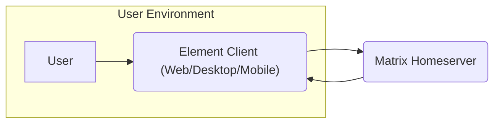
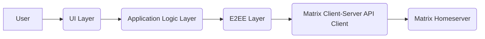
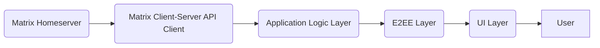
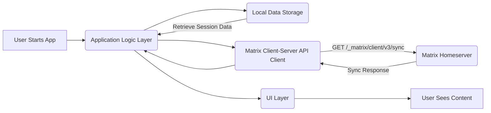

## Project Design Document: Element Matrix Client - Improved

**1. Introduction**

This document provides an enhanced design overview of the Element Matrix client, an open-source messaging application built on the Matrix protocol. This detailed description aims to provide a comprehensive understanding of the system's architecture, components, and data flow, serving as a robust foundation for subsequent threat modeling activities. The design is based on the publicly available codebase at [https://github.com/elemefe/element](https://github.com/elemefe/element).

**2. Goals**

*   Provide a clear, concise, and detailed description of the Element client's architecture.
*   Identify key components, their specific responsibilities, and their interactions.
*   Outline the data flow within the application for various scenarios.
*   Highlight security-relevant aspects of the design with specific examples.
*   Serve as a precise and actionable basis for identifying potential threats and vulnerabilities.

**3. Scope**

This document focuses on the client-side architecture of Element, encompassing the various platforms it supports (Web, Desktop, Mobile). It covers the core functionalities related to messaging (text, media), user management, end-to-end encryption, and basic application lifecycle. The scope does not include the Matrix homeserver infrastructure or other external services unless their interaction is directly relevant to the client's security.

**4. High-Level Architecture**

The Element client functions as a frontend application, communicating with a Matrix homeserver to facilitate messaging and related functionalities. It primarily utilizes the Matrix Client-Server API for this interaction.

**5. Detailed Component Description**

The Element client is structured into several key components, each with specific responsibilities:

*   **User Interface (UI) Layer:**
    *   **Responsibility:** Rendering the application's visual elements, handling user input, and providing feedback.
    *   **Implementation:** Typically implemented using platform-specific frameworks (e.g., React with TypeScript for Web/Desktop, Swift/Kotlin or React Native for Mobile).
    *   **Key Functions:** Displaying message timelines, user lists, room settings, user profiles, notifications, and handling user interactions like typing, clicking, and scrolling.
*   **Application Logic Layer (Business Logic):**
    *   **Responsibility:** Managing the core application workflows and coordinating interactions between other components.
    *   **Key Functions:** User authentication and session management, room creation and management, message sending and receiving orchestration, handling application state, managing user settings, and coordinating with the E2EE layer.
*   **Matrix Client-Server API Client:**
    *   **Responsibility:** Implementing the communication logic for interacting with the Matrix homeserver according to the Matrix Client-Server API specification.
    *   **Key Functions:** Sending and receiving HTTP requests (e.g., for syncing, sending messages, joining rooms), managing authentication tokens (access tokens, refresh tokens), handling API responses and errors, and potentially implementing retry mechanisms.
*   **End-to-End Encryption (E2EE) Layer:**
    *   **Responsibility:** Providing end-to-end encryption and decryption of messages using the Matrix encryption protocols (Olm for direct chats, Megolm for group chats).
    *   **Key Functions:** Generating and managing cryptographic keys (device keys, identity keys, session keys), encrypting outgoing messages, decrypting incoming messages, handling key sharing and device verification, managing cross-signing and secure secret storage.
*   **Local Data Storage:**
    *   **Responsibility:** Persisting application data locally on the user's device for offline access and performance.
    *   **Implementation:** Utilizes platform-specific storage mechanisms (e.g., IndexedDB or local storage for Web, SQLite or Realm for Mobile/Desktop). Secure storage mechanisms (e.g., Keychain on iOS, Keystore on Android) are crucial for sensitive data like encryption keys.
    *   **Key Data Stored:** Message history, user settings, room data, cryptographic keys, device information, and potentially cached media.
*   **Push Notification Handler:**
    *   **Responsibility:** Managing the registration and handling of push notifications for new messages and other events when the application is in the background.
    *   **Interaction:** Interacts with platform-specific push notification services (e.g., Firebase Cloud Messaging (FCM) for Android, Apple Push Notification service (APNs) for iOS).
    *   **Key Functions:** Registering the device for push notifications, receiving and processing push notification payloads, and potentially decrypting notification content.
*   **Media Handling Component:**
    *   **Responsibility:** Managing the uploading, downloading, displaying, and potentially processing of media files (images, videos, audio).
    *   **Key Functions:** Handling file uploads to the homeserver, downloading media from the homeserver, managing temporary storage of media, and potentially performing image resizing or other transformations.
*   **Authentication Handler:**
    *   **Responsibility:** Managing the user login, registration, and logout processes.
    *   **Supported Methods:** Typically supports username/password authentication, Single Sign-On (SSO) via OAuth 2.0 or OpenID Connect, and potentially other authentication mechanisms.
    *   **Key Functions:** Handling user credentials, securely storing and managing authentication tokens, and interacting with the homeserver's authentication API.

**6. Data Flow**

The following outlines the typical data flow for key operations within the Element client:

**6.1. Sending a Text Message:**

*   **User Action:** The user composes and initiates sending a text message through the UI.
*   **UI Layer:** The UI layer captures the message content and triggers the send action.
*   **Application Logic Layer:** The application logic layer processes the message, identifies the target room or user, and prepares the message for encryption.
*   **E2EE Layer:** The E2EE layer encrypts the message content using the appropriate session keys for the target conversation.
*   **Matrix Client-Server API Client:** The API client sends the encrypted message payload to the Matrix homeserver via a `PUT /_matrix/client/v3/rooms/{roomId}/send/m.room.message` API request.
*   **Matrix Homeserver:** The homeserver receives the encrypted message and distributes it to the intended recipients.

**6.2. Receiving a Text Message:**

*   **Matrix Homeserver:** The homeserver sends a new message event to the client as part of the `/sync` API response.
*   **Matrix Client-Server API Client:** The API client receives the sync response containing the encrypted message event.
*   **Application Logic Layer:** The application logic layer processes the event, identifies the message, and determines if it needs decryption.
*   **E2EE Layer:** The E2EE layer decrypts the message content using the appropriate session keys.
*   **UI Layer:** The UI layer renders the decrypted message in the appropriate conversation timeline for the user.

**6.3. Initial Application Startup and Sync:**

*   **User Action:** The user launches the Element application.
*   **Application Logic Layer:** The application logic layer initializes and checks for existing session data.
*   **Local Data Storage:** The application retrieves stored session information (e.g., access token).
*   **Matrix Client-Server API Client:** The API client initiates a `/sync` request to the Matrix homeserver to retrieve the latest messages, room state, and other updates.
*   **Matrix Homeserver:** The homeserver responds with the current state and recent events.
*   **Application Logic Layer:** The application logic layer processes the sync response and updates the local data storage.
*   **UI Layer:** The UI layer renders the updated content for the user.

**7. Security Considerations**

The Element client's security relies on several key aspects, but potential vulnerabilities exist in each area:

*   **End-to-End Encryption (E2EE):**
    *   **Threats:** Compromised device keys leading to message decryption, vulnerabilities in the Olm/Megolm implementations, improper key management leading to key loss or exposure, malicious key sharing or device verification attacks.
    *   **Mitigations:** Secure key storage mechanisms (platform keychains/keystores), robust device verification processes, cross-signing for enhanced trust, and regular security audits of the encryption libraries.
*   **Local Data Storage:**
    *   **Threats:** Unauthorized access to locally stored data if the device is compromised (malware, physical access), data leakage due to insecure storage implementations, insufficient encryption of sensitive data at rest.
    *   **Mitigations:** Utilizing platform-provided secure storage mechanisms with encryption, implementing data protection measures like device lock requirements, and avoiding storing sensitive data in easily accessible locations.
*   **Authentication:**
    *   **Threats:** Credential theft via phishing or malware, brute-force attacks on login credentials, session hijacking if authentication tokens are compromised, vulnerabilities in SSO integration.
    *   **Mitigations:** Enforcing strong password policies, supporting multi-factor authentication, secure storage and handling of authentication tokens (using HTTPS-only cookies, avoiding storage in local storage), and implementing measures to prevent brute-force attacks (rate limiting, account lockout).
*   **Network Communication:**
    *   **Threats:** Man-in-the-middle (MITM) attacks if HTTPS is not properly enforced or if certificate validation is bypassed, eavesdropping on network traffic if encryption is weak or absent.
    *   **Mitigations:** Enforcing HTTPS for all communication with the homeserver, implementing proper certificate pinning or validation, and ensuring the underlying network transport is secure.
*   **Push Notifications:**
    *   **Threats:** Exposure of message content in push notification payloads, unauthorized access to push notification channels, potential for push notification spoofing.
    *   **Mitigations:** Avoiding sending sensitive information in push notification payloads, encrypting notification content where possible, and securing the push notification registration and handling process.
*   **Third-Party Dependencies:**
    *   **Threats:** Vulnerabilities in external libraries and dependencies used by the client, supply chain attacks targeting dependencies.
    *   **Mitigations:** Regularly updating dependencies to the latest secure versions, performing security audits of dependencies, and using dependency management tools to track and manage vulnerabilities.
*   **Client-Side Vulnerabilities:**
    *   **Threats:** Cross-site scripting (XSS) attacks, remote code execution (RCE) vulnerabilities in the client application code, insecure handling of user input.
    *   **Mitigations:** Employing secure coding practices, performing regular security code reviews and penetration testing, and implementing input validation and sanitization.

**8. Future Considerations**

*   Detailed design of specific features like file sharing and voice/video calls, including their data flow and security considerations.
*   Analysis of the security implications of different platform implementations (Web, Desktop, Mobile).
*   Examination of the integration with external services and identity providers in more detail.
*   Development of specific threat models for individual components and data flows.

This improved design document provides a more detailed and comprehensive understanding of the Element client's architecture and security considerations. This enhanced information will be invaluable for conducting a thorough and effective threat modeling exercise to identify and mitigate potential security risks.