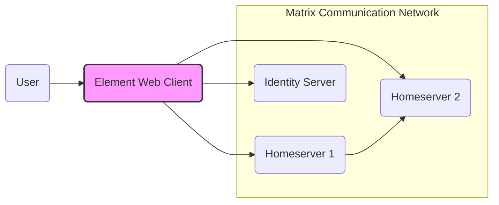
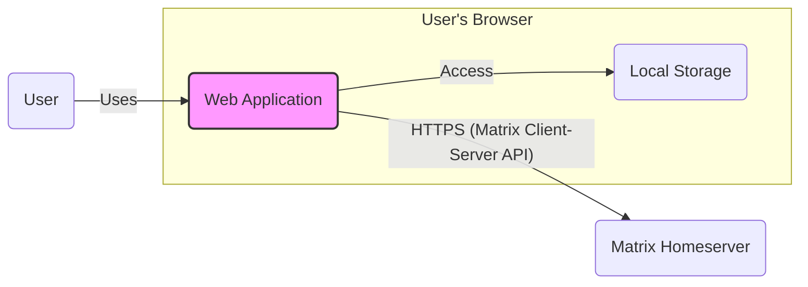
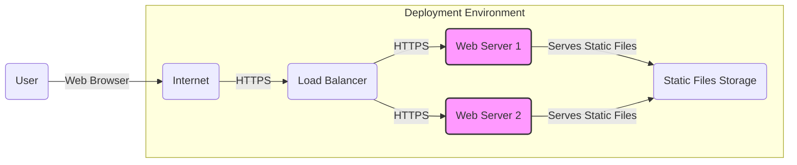
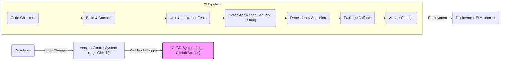

# BUSINESS POSTURE

This project, based on the provided GitHub repository for "element," appears to be a web-based Matrix client. Matrix is an open protocol for decentralized communication, focusing on secure and private messaging.

## Business Priorities and Goals

- Provide a user-friendly web interface for accessing the Matrix communication network.
- Enable secure and private communication for users through the Matrix protocol.
- Offer a reliable and performant Matrix client experience in a web browser.
- Potentially cater to users who prefer web-based access over desktop or mobile applications.
- Support the Matrix ecosystem and promote the adoption of decentralized communication.

## Business Risks

- Data breaches and unauthorized access to user messages and personal information.
- Privacy violations due to insecure handling of user data or metadata.
- Service disruptions or unavailability of the client, impacting user communication.
- Reputational damage if security vulnerabilities are exploited or user privacy is compromised.
- Compliance risks related to data privacy regulations (e.g., GDPR, CCPA) if applicable.
- Supply chain risks associated with dependencies and third-party libraries used in the project.

# SECURITY POSTURE

## Existing Security Controls

- security control: HTTPS is enforced for web access to protect data in transit between the user's browser and the web server hosting the client. (Assumed based on standard web application practices).
- security control: Secure Software Development Lifecycle (SSDLC) practices are likely followed, including code reviews and testing, although specific details are not provided in the input. (Assumed as a general good practice).
- security control: Input validation is likely implemented on the client-side to prevent basic client-side attacks. (Assumed based on standard web application practices).
- security control: Cryptography is used for end-to-end encryption of messages as part of the Matrix protocol itself. (Inherited from the Matrix protocol).

## Accepted Risks

- accepted risk: Client-side vulnerabilities are inherent in web applications. Risks associated with browser vulnerabilities and browser extensions are generally accepted.
- accepted risk: Reliance on the security of the Matrix homeserver infrastructure. The client depends on the security of the homeservers it connects to, which are outside of the client's direct control.
- accepted risk: Potential for vulnerabilities in third-party libraries and dependencies used by the project.

## Recommended Security Controls

- recommended security control: Implement automated Static Application Security Testing (SAST) in the CI/CD pipeline to identify potential security vulnerabilities in the codebase early in the development lifecycle.
- recommended security control: Implement automated Dependency Scanning to identify and manage vulnerabilities in third-party libraries and dependencies.
- recommended security control: Conduct regular security code reviews, focusing on identifying and mitigating potential security flaws.
- recommended security control: Implement Content Security Policy (CSP) to mitigate the risk of Cross-Site Scripting (XSS) attacks.
- recommended security control: Implement Subresource Integrity (SRI) to ensure that resources fetched from CDNs or external sources have not been tampered with.
- recommended security control: Perform regular penetration testing and vulnerability assessments to identify and address security weaknesses in the application.

## Security Requirements

- Authentication:
    - requirement: The client must securely authenticate users to their Matrix accounts.
    - requirement: Support for standard Matrix authentication mechanisms should be implemented.
    - requirement: Consider multi-factor authentication (MFA) options if supported by the Matrix homeserver.
- Authorization:
    - requirement: The client must correctly implement Matrix authorization rules to ensure users can only access rooms and data they are authorized to access.
    - requirement: Authorization decisions are primarily enforced by the Matrix homeserver, the client must correctly interpret and enforce these decisions.
- Input Validation:
    - requirement: All user inputs, both from the UI and from the Matrix protocol, must be properly validated to prevent injection attacks (e.g., XSS, command injection).
    - requirement: Input validation should be performed both on the client-side and, ideally, reinforced on the server-side if any server-side components are involved.
- Cryptography:
    - requirement: Utilize strong cryptography for all sensitive operations, including message encryption and decryption as per the Matrix protocol.
    - requirement: Ensure proper key management and secure storage of cryptographic keys within the browser's secure storage mechanisms.
    - requirement: Leverage the cryptographic capabilities provided by the Matrix protocol and avoid implementing custom cryptography unless absolutely necessary and after expert review.

# DESIGN

## C4 CONTEXT

### Context Diagram Elements

- Name: User
  - Type: Person
  - Description: An individual who uses the Element Web Client to communicate via the Matrix network.
  - Responsibilities: Sends and receives messages, manages contacts, participates in rooms, and configures client settings.
  - Security controls: Strong passwords, browser security settings, awareness of phishing and social engineering attacks.

- Name: Element Web Client
  - Type: Software System
  - Description: A web-based application that provides a user interface for interacting with the Matrix communication network. It allows users to send and receive messages, manage rooms, and interact with other Matrix users.
  - Responsibilities: User interface, message composition and display, communication with Matrix homeservers, client-side message encryption/decryption, user authentication.
  - Security controls: HTTPS, Content Security Policy (CSP), Subresource Integrity (SRI), input validation, secure storage of user data in the browser, security code reviews, SAST, dependency scanning.

- Name: Homeserver 1, Homeserver 2 (and other Homeservers)
  - Type: Software System
  - Description: Matrix homeservers are servers that store user accounts, room data, and message history. They handle message routing and federation with other homeservers in the Matrix network.
  - Responsibilities: User account management, room management, message storage and routing, federation with other homeservers, access control, message encryption key management.
  - Security controls: Server-side access controls, encryption of data at rest and in transit, intrusion detection systems, regular security updates, secure server configuration.

- Name: Identity Server
  - Type: Software System
  - Description: A Matrix Identity Server is used for discovering users by their email addresses or phone numbers and for managing third-party identifiers.
  - Responsibilities: Mapping third-party identifiers (email, phone numbers) to Matrix user IDs, user discovery, identity verification.
  - Security controls: Secure storage of identifier mappings, access controls, protection against enumeration attacks, secure communication with homeservers.

## C4 CONTAINER

### Container Diagram Elements

- Name: Web Application
  - Type: Container - Web Application (JavaScript/HTML/CSS)
  - Description: The client-side web application, written in JavaScript, HTML, and CSS, that runs in the user's web browser. It provides the user interface and handles client-side logic for the Matrix client.
  - Responsibilities: Rendering the user interface, handling user interactions, composing and displaying messages, encrypting and decrypting messages, communicating with the Matrix Homeserver via the Matrix Client-Server API, managing user sessions, storing temporary data in browser memory.
  - Security controls: Client-side input validation, Content Security Policy (CSP), Subresource Integrity (SRI), secure coding practices, security code reviews, SAST, dependency scanning.

- Name: Local Storage
  - Type: Container - Browser Local Storage
  - Description: Browser local storage is used to persist user settings, session data, and potentially cached data within the user's browser.
  - Responsibilities: Persistent storage of user preferences, session tokens, cached data to improve performance and user experience.
  - Security controls: Encryption of sensitive data stored in local storage (if applicable and necessary), limiting the amount of sensitive data stored, browser security features to protect local storage data.

- Name: Matrix Homeserver
  - Type: External System
  - Description: An external Matrix homeserver that the web application connects to for Matrix network functionality.
  - Responsibilities: User authentication, room management, message storage and routing, access control, message encryption key management, federation.
  - Security controls: Server-side access controls, encryption of data at rest and in transit, intrusion detection systems, regular security updates, secure server configuration (as described in Context Diagram).

## DEPLOYMENT

For a web-based application like Element Web Client, a typical deployment architecture involves serving static files (HTML, CSS, JavaScript) from a web server.

### Deployment Diagram Elements

- Name: User
  - Type: Person
  - Description: End-user accessing the Element Web Client.
  - Responsibilities: Accessing the application through a web browser.
  - Security controls: Browser security settings, user awareness.

- Name: Internet
  - Type: Network
  - Description: The public internet network.
  - Responsibilities: Providing connectivity between users and the deployment environment.
  - Security controls: General internet security protocols.

- Name: Load Balancer
  - Type: Infrastructure - Load Balancer
  - Description: Distributes incoming HTTPS traffic across multiple web servers for scalability and availability.
  - Responsibilities: Traffic distribution, SSL termination, health checks.
  - Security controls: HTTPS termination, DDoS protection, access control lists.

- Name: Web Server 1, Web Server 2 (and more)
  - Type: Infrastructure - Web Server (e.g., Nginx, Apache)
  - Description: Web servers that host and serve the static files (HTML, CSS, JavaScript) of the Element Web Client application.
  - Responsibilities: Serving static files, handling HTTPS requests, potentially caching static content.
  - Security controls: HTTPS configuration, access controls, regular security updates, secure server configuration, web application firewall (WAF) if needed.

- Name: Static Files Storage
  - Type: Infrastructure - File Storage
  - Description: Storage for the static files of the Element Web Client application. This could be local storage on the web servers or a dedicated storage service (e.g., cloud storage).
  - Responsibilities: Storing and providing access to static files.
  - Security controls: Access controls, secure storage configuration.

## BUILD

The build process for a web application like Element Web Client typically involves compiling code, running tests, and packaging static assets. Security should be integrated into each stage of the build process.

### Build Diagram Elements

- Name: Developer
  - Type: Person
  - Description: Software developer working on the Element Web Client project.
  - Responsibilities: Writing code, committing changes to the version control system.
  - Security controls: Secure development practices, code reviews, local development environment security.

- Name: Version Control System (VCS)
  - Type: Tool - Software Repository (e.g., GitHub)
  - Description: A system for managing and tracking changes to the source code.
  - Responsibilities: Storing source code, managing versions, tracking changes, facilitating collaboration.
  - Security controls: Access controls, branch protection, audit logs, secure repository configuration.

- Name: CI/CD System
  - Type: Tool - Continuous Integration/Continuous Delivery System (e.g., GitHub Actions)
  - Description: An automated system for building, testing, and deploying the application.
  - Responsibilities: Automating the build process, running tests, performing security scans, packaging artifacts, deploying the application.
  - Security controls: Secure pipeline configuration, access controls, secret management, audit logs, secure build environment.

- Name: Code Checkout
  - Type: Build Step
  - Description: Step in the CI/CD pipeline that retrieves the latest code from the VCS.
  - Responsibilities: Obtaining the source code for the build process.
  - Security controls: Access control to the VCS, secure communication with VCS.

- Name: Build & Compile
  - Type: Build Step
  - Description: Step in the CI/CD pipeline that compiles the source code and builds the application artifacts.
  - Responsibilities: Compiling code, generating build artifacts.
  - Security controls: Secure build environment, use of trusted build tools and dependencies.

- Name: Test
  - Type: Build Step
  - Description: Step in the CI/CD pipeline that runs automated unit and integration tests.
  - Responsibilities: Verifying the functionality and stability of the code.
  - Security controls: Secure test environment, comprehensive test coverage.

- Name: SAST (Static Application Security Testing)
  - Type: Build Step - Security Check
  - Description: Step in the CI/CD pipeline that performs static analysis of the source code to identify potential security vulnerabilities.
  - Responsibilities: Identifying potential security flaws in the code.
  - Security controls: Regularly updated SAST tools, configuration to detect relevant vulnerability types.

- Name: Dependency Scan
  - Type: Build Step - Security Check
  - Description: Step in the CI/CD pipeline that scans project dependencies for known vulnerabilities.
  - Responsibilities: Identifying vulnerable dependencies.
  - Security controls: Regularly updated dependency scanning tools, vulnerability database updates.

- Name: Package
  - Type: Build Step
  - Description: Step in the CI/CD pipeline that packages the build artifacts for deployment.
  - Responsibilities: Creating deployable packages.
  - Security controls: Secure packaging process, integrity checks of packages.

- Name: Artifact Storage
  - Type: Tool - Artifact Repository
  - Description: Storage for the build artifacts produced by the CI/CD pipeline.
  - Responsibilities: Storing and managing build artifacts.
  - Security controls: Access controls, secure storage configuration, versioning of artifacts.

- Name: Deployment Environment
  - Type: Environment
  - Description: The target environment where the application is deployed (as described in the Deployment section).
  - Responsibilities: Running the deployed application.
  - Security controls: Environment-specific security controls (as described in the Deployment section).

# RISK ASSESSMENT

## Critical Business Processes

- Secure and private messaging between users.
- User authentication and authorization to access the Matrix network.
- Reliable and continuous availability of the communication service.
- Protection of user privacy and data confidentiality.

## Data Sensitivity

- User Messages: Highly sensitive. Contain personal and potentially confidential communications. Require strong confidentiality and integrity protection.
- User Credentials (passwords, access tokens): Highly sensitive. Must be protected to prevent unauthorized access to user accounts. Require strong confidentiality and integrity protection.
- User Profile Information (display name, etc.): Moderately sensitive. Should be protected to maintain user privacy.
- Metadata (room names, user IDs, timestamps): Moderately sensitive. Can reveal communication patterns and user activity. Should be protected to maintain user privacy.
- Session Data: Moderately sensitive. Used for maintaining user sessions and should be protected to prevent session hijacking.

# QUESTIONS & ASSUMPTIONS

## Questions

- What is the intended deployment environment for the Element Web Client (e.g., public internet, private network)?
- Are there any specific compliance requirements (e.g., GDPR, HIPAA) that the project needs to adhere to?
- What is the process for managing and updating third-party dependencies?
- Are there any specific security tools or technologies already in use within the organization that should be integrated with this project?
- What is the expected user base and their risk tolerance?

## Assumptions

- BUSINESS POSTURE: The primary business goal is to provide a secure and private web-based Matrix client for general users. Security and privacy are high priorities.
- SECURITY POSTURE: Standard web application security practices are expected to be in place. The project aims to achieve a reasonable level of security appropriate for a messaging application.
- DESIGN: The application is primarily a client-side web application interacting directly with Matrix homeservers. Deployment will be on standard web server infrastructure. The build process will utilize a CI/CD pipeline with basic security checks.