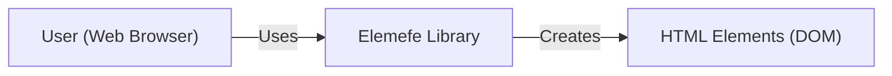
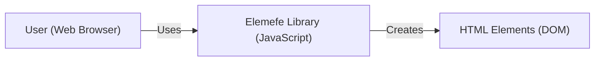
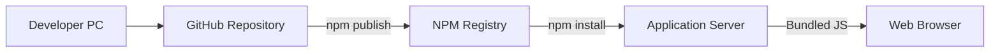
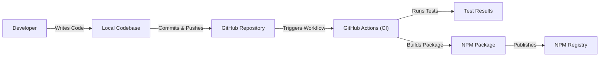

Okay, let's create a design document for the Elemefe project, focusing on aspects relevant to threat modeling.

# BUSINESS POSTURE

Business Priorities and Goals:

*   Provide a simple, user-friendly JavaScript library for creating HTML elements.
*   Offer a lightweight alternative to larger frameworks, potentially improving performance in some use cases.
*   Enable developers to build web interfaces with a concise, readable syntax.
*   Maintain a small codebase that is easy to understand and contribute to.
*   Gain adoption within the developer community.

Most Important Business Risks:

*   Malicious Code Injection: If the library has vulnerabilities, attackers could inject malicious JavaScript code, leading to XSS attacks or other security breaches on websites using the library.
*   Supply Chain Attacks: Compromise of the development environment, build process, or distribution channels (e.g., npm) could lead to the distribution of a compromised version of the library.
*   Lack of Adoption: If the library fails to gain traction, the project may become unsustainable.
*   Reputational Damage: Security vulnerabilities or poor code quality could damage the reputation of the project and its maintainers.
*   Intellectual Property Theft: Although unlikely given the MIT license, unauthorized use or modification of the code could be a concern.

# SECURITY POSTURE

Existing Security Controls:

*   security control: MIT License: The project uses the permissive MIT license, allowing for broad use and modification, but also implying no warranty or liability. (Described in the LICENSE file).
*   security control: Code Reviews: While not explicitly stated, it's assumed that some form of code review is performed before merging changes. (Implied by the GitHub contribution model).
*   security control: Simple Codebase: The library's small size and simple design inherently reduce the attack surface. (Evident from the source code).
*   security control: No external dependencies: The library has no external dependencies. (Evident from the source code and package.json).

Accepted Risks:

*   accepted risk: Limited Security Auditing: The project likely lacks formal, professional security audits due to its size and open-source nature.
*   accepted risk: Reliance on Developer Diligence: The security of applications using the library heavily relies on the developers of those applications to implement proper input sanitization and output encoding.
*   accepted risk: Potential for Unknown Vulnerabilities: As with any software, there's a risk of undiscovered vulnerabilities.

Recommended Security Controls:

*   security control: Implement a Security.md file: This file should outline security reporting procedures, known vulnerabilities, and security best practices for users of the library.
*   security control: Static Code Analysis: Integrate static analysis tools (e.g., ESLint with security plugins, SonarQube) into the development workflow to automatically detect potential security issues.
*   security control: Regular Security Reviews: Conduct periodic security-focused code reviews, even if informal.
*   security control: Consider Content Security Policy (CSP) Guidance: Provide recommendations in the documentation for using the library in conjunction with CSP to mitigate XSS risks.

Security Requirements:

*   Authentication: Not directly applicable to this library, as it's a client-side component focused on element creation. Authentication is the responsibility of the application using the library.
*   Authorization: Not directly applicable. Authorization logic should be handled by the application using the library.
*   Input Validation: The library itself does *not* perform input validation.  This is a *critical* responsibility of the application using the library. The library should, however, document this clearly and emphasize the importance of sanitizing any user-provided data used to create elements.  The library *could* potentially offer helper functions for escaping/encoding, but this would need careful consideration to avoid introducing new vulnerabilities.
*   Cryptography: Not directly applicable, as the library doesn't handle sensitive data or cryptographic operations.

# DESIGN

## C4 CONTEXT

Element Descriptions:

*   Element:
    *   Name: User (Web Browser)
    *   Type: Person
    *   Description: A person interacting with a web application that uses the Elemefe library.
    *   Responsibilities: Initiates requests, views web pages, interacts with UI elements.
    *   Security controls: Browser security features (e.g., same-origin policy, CSP), user-provided security software (e.g., antivirus).

*   Element:
    *   Name: Elemefe Library
    *   Type: Software System
    *   Description: The JavaScript library for creating HTML elements.
    *   Responsibilities: Provides functions for creating and manipulating HTML elements.
    *   Security controls: Simple codebase, no external dependencies, MIT License.

*   Element:
    *   Name: HTML Elements (DOM)
    *   Type: Software System
    *   Description: The Document Object Model (DOM) representation of the web page.
    *   Responsibilities: Represents the structure and content of the web page.
    *   Security controls: Browser's DOM implementation security features.

## C4 CONTAINER

Since Elemefe is a single, small JavaScript library, the Container diagram is essentially the same as the Context diagram. It doesn't have separate deployable units.

Element Descriptions:

*   Element:
    *   Name: User (Web Browser)
    *   Type: Person
    *   Description: A person interacting with a web application that uses the Elemefe library.
    *   Responsibilities: Initiates requests, views web pages, interacts with UI elements.
    *   Security controls: Browser security features (e.g., same-origin policy, CSP), user-provided security software (e.g., antivirus).

*   Element:
    *   Name: Elemefe Library (JavaScript)
    *   Type: Container: JavaScript Library
    *   Description: The JavaScript library for creating HTML elements. This is the single deployable unit.
    *   Responsibilities: Provides functions for creating and manipulating HTML elements.
    *   Security controls: Simple codebase, no external dependencies, MIT License.

*   Element:
    *   Name: HTML Elements (DOM)
    *   Type: Software System
    *   Description: The Document Object Model (DOM) representation of the web page.
    *   Responsibilities: Represents the structure and content of the web page.
    *   Security controls: Browser's DOM implementation security features.

## DEPLOYMENT

Possible Deployment Solutions:

1.  Direct Inclusion via `<script>` tag: The library can be downloaded and included directly in an HTML file using a `<script>` tag.
2.  NPM Package: The library can be installed as an NPM package and bundled into a larger application using a build tool like Webpack or Parcel.
3.  CDN: The library could be hosted on a Content Delivery Network (CDN) and included via a `<script>` tag.

Chosen Solution (NPM Package): This is the most common and recommended approach for modern JavaScript development.

Element Descriptions:

*   Element:
    *   Name: Developer PC
    *   Type: Person
    *   Description: The developer's workstation.
    *   Responsibilities: Writing code, running tests, committing changes.
    *   Security controls: OS security features, developer best practices.

*   Element:
    *   Name: GitHub Repository
    *   Type: Software System
    *   Description: The source code repository hosted on GitHub.
    *   Responsibilities: Version control, code review, collaboration.
    *   Security controls: GitHub's security features, access controls, branch protection rules.

*   Element:
    *   Name: NPM Registry
    *   Type: Software System
    *   Description: The public registry for Node.js packages.
    *   Responsibilities: Hosting and distributing the Elemefe library as an NPM package.
    *   Security controls: NPM's security features, two-factor authentication (recommended for publishers).

*   Element:
    *   Name: Application Server
    *   Type: Software System
    *   Description: The server hosting the application that uses the Elemefe library.
    *   Responsibilities: Serving the application to users.
    *   Security controls: Server-side security measures (e.g., firewalls, intrusion detection systems).

*   Element:
    *   Name: Web Browser
    *   Type: Software System
    *   Description: The user's web browser.
    *   Responsibilities: Rendering the web page and executing the JavaScript code.
    *   Security controls: Browser security features (e.g., same-origin policy, CSP).

## BUILD

Build Process Description:

1.  Developer: The developer writes code and commits it to the local repository.
2.  Local Codebase: The local copy of the source code.
3.  Commits & Pushes: The developer commits changes and pushes them to the GitHub repository.
4.  GitHub Repository: The central repository for the project's code.
5.  Triggers Workflow: A push to the main branch (or a pull request) triggers a GitHub Actions workflow.
6.  GitHub Actions (CI): The CI environment runs automated tasks.
7.  Runs Tests: The workflow runs unit tests (if any) and linters (e.g., ESLint).
    *   security control: ESLint with security plugins can be used to detect potential security vulnerabilities.
8.  Builds Package: If tests pass, the workflow builds the NPM package.
    *   security control: The build process should be reproducible and deterministic.
9.  NPMPackage: The resulting NPM package.
10. Publishes: The workflow publishes the package to the NPM registry.
    *   security control: Two-factor authentication should be enabled for the NPM account used to publish the package.
    *   security control: Provenance information can be included in the package metadata to verify its origin.

# RISK ASSESSMENT

Critical Business Processes:

*   Providing a functional and reliable library for web development.
*   Maintaining the trust of users and the developer community.

Data to Protect and Sensitivity:

*   Source Code: The source code itself is not highly sensitive (due to the MIT license), but its integrity is crucial.  Tampering with the source code could lead to the distribution of malicious versions.
*   NPM Credentials: The credentials used to publish the package to NPM are highly sensitive.  Compromise of these credentials would allow an attacker to publish malicious versions of the library.
*   User Data (Indirectly): The library itself doesn't directly handle user data. However, vulnerabilities in the library could be exploited to steal or manipulate user data within applications that *use* the library. This makes the *security* of the library critical, even though it doesn't directly process sensitive data.

# QUESTIONS & ASSUMPTIONS

Questions:

*   Are there any specific security requirements or compliance standards that the library needs to adhere to (e.g., specific industry regulations)?
*   What level of testing (unit, integration, etc.) is currently in place?
*   Is there a plan for handling security vulnerabilities reported by external researchers?
*   Is there any intention to add features that might handle user input directly (e.g., helper functions for escaping/encoding)?

Assumptions:

*   BUSINESS POSTURE: The project prioritizes simplicity and ease of use over extensive security features. The target audience is developers who are assumed to have some understanding of web security best practices.
*   SECURITY POSTURE: Basic security practices (like code review) are followed, but there are no formal security audits or certifications.
*   DESIGN: The library remains a single, client-side JavaScript file with no server-side components or external dependencies. The primary deployment method is via NPM. The build process is automated using GitHub Actions.