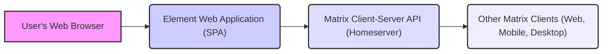
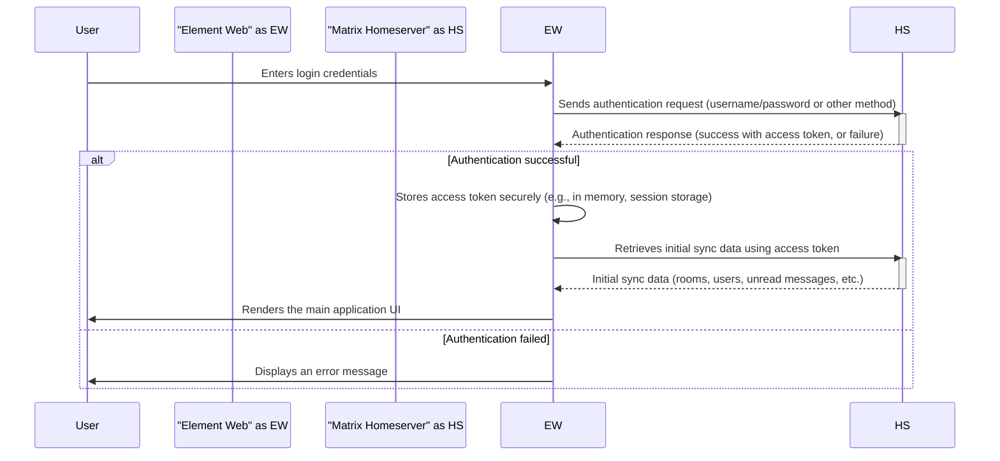
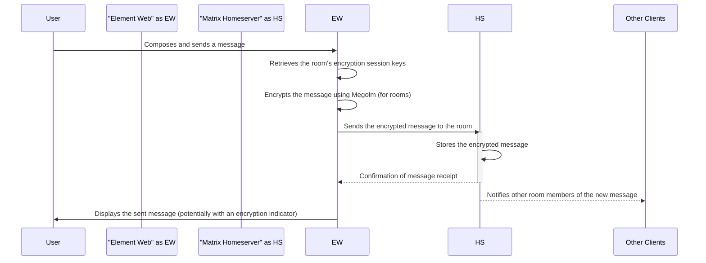
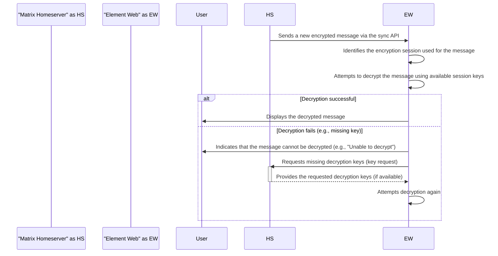
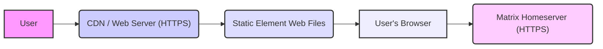

# Project Design Document: Element Web

**Version:** 1.1
**Date:** October 26, 2023
**Prepared By:** AI Software Architect

## 1. Project Overview

This document details the design of Element Web, a sophisticated web-based client for the decentralized and secure Matrix communication protocol. Element Web empowers users to engage in private and encrypted communication through text, voice, and video, and to participate in collaborative group conversations (rooms). This document serves as a foundational reference for understanding the system's architecture, component interactions, and data flows, specifically tailored for subsequent threat modeling activities.

## 2. Goals and Objectives

*   Deliver a feature-rich and intuitive web interface for seamless interaction with the Matrix network.
*   Ensure secure and private communication through robust end-to-end encryption (E2EE) by default.
*   Fully support core Matrix protocol functionalities, encompassing direct messaging, group chats (rooms), file sharing, and presence indicators.
*   Provide a responsive, performant, and accessible user experience across a wide range of modern web browsers and devices.
*   Maintain strict adherence to the Matrix specification, ensuring interoperability and compatibility with evolving protocol features and other Matrix clients.
*   Offer extensibility and customization options through integrations and theming.

## 3. Target Audience

This document is primarily intended for:

*   Security engineers and architects tasked with performing threat modeling, security assessments, and penetration testing.
*   Software developers contributing to the Element Web codebase or integrating with its functionalities.
*   Operations and infrastructure engineers responsible for the deployment, maintenance, and monitoring of Element Web instances.
*   Product managers, stakeholders, and technical leadership seeking a comprehensive technical understanding of the system's architecture and security considerations.

## 4. Scope

This design document specifically focuses on the client-side architecture of the Element Web application as it operates within a user's web browser. The scope includes:

*   Detailed descriptions of client-side components and their interdependencies.
*   Comprehensive analysis of data flow within the application, including sensitive data handling.
*   Explanation of the interaction mechanisms between Element Web and the Matrix homeserver.
*   In-depth overview of key security mechanisms implemented within the client application to protect user data and privacy.

This document explicitly excludes:

*   The architecture and security of the Matrix homeserver infrastructure.
*   The security characteristics of the underlying operating system or the user's web browser environment.
*   Fine-grained details of the Matrix protocol specification itself.
*   Design details of native mobile applications (Element iOS and Android), which have separate architectures.

## 5. High-Level Architecture

Element Web is architected as a modern single-page application (SPA), predominantly built using the React JavaScript library. It communicates with a designated Matrix homeserver to facilitate all communication activities, including sending and receiving messages, managing room memberships, and handling user authentication and authorization.

*   **User's Web Browser:** The runtime environment where the Element Web application is executed, providing the necessary APIs and resources.
*   **Element Web Application (SPA):** The client-side application logic, encompassing UI rendering, user interaction handling, application state management, and communication with the Matrix homeserver via API calls.
*   **Matrix Client-Server API (Homeserver):** The backend server responsible for managing user accounts, room states, message persistence, and federation with other Matrix servers. Element Web interacts with the homeserver using standard HTTP/HTTPS protocols.
*   **Other Matrix Clients (Web, Mobile, Desktop):**  Other applications implementing the Matrix protocol, allowing users on different platforms to participate in the same conversations and access the same data.

## 6. Component Design

The Element Web application is composed of several distinct but interconnected components:

*   **User Interface (UI) Components (React):**
    *   Responsible for rendering the visual elements and interactive controls of the application.
    *   Built using reusable React components, promoting modularity and maintainability.
    *   Handles user input events (e.g., clicks, keystrokes) and updates the UI accordingly.
    *   Examples include: chat message views, room list panels, user profile settings, login and registration forms, media viewers.
*   **Matrix Client SDK (matrix-js-sdk):**
    *   A core JavaScript library that implements the Matrix Client-Server API specification.
    *   Manages all communication with the Matrix homeserver, abstracting away low-level HTTP details.
    *   Handles user authentication, session management, sending and receiving events (messages, state changes), room management operations, and data synchronization.
    *   Provides higher-level abstractions for interacting with the Matrix protocol, simplifying development.
*   **Application State Management (e.g., Redux, Zustand):**
    *   Manages the application's global state, including user information, room data, message history, and application settings.
    *   Ensures data consistency and predictability across different UI components.
    *   Facilitates efficient data updates and propagation throughout the application.
*   **End-to-End Encryption (E2EE) Module (Olm/Megolm via matrix-js-sdk):**
    *   Implements the cryptographic protocols (Olm for direct messages, Megolm for group chats) that provide end-to-end encryption.
    *   Handles cryptographic key generation, secure key exchange, key management, message encryption before sending, and message decryption upon receipt.
    *   Manages secure sessions and ensures that only intended recipients can decrypt messages.
*   **Media Handling Module:**
    *   Manages the uploading, downloading, display, and potential processing of media files (images, videos, audio).
    *   May involve client-side image resizing, video encoding/decoding, and audio playback.
    *   Interacts with the Matrix homeserver's media repository for storage and retrieval of media content.
*   **Push Notifications Module:**
    *   Handles the registration and management of push notifications for new messages and events when the application is not in the foreground.
    *   Integrates with browser push notification APIs or third-party push notification services.
*   **Authentication and Authorization Module:**
    *   Manages the user login and registration processes, potentially supporting various authentication methods (e.g., password, Single Sign-On).
    *   Handles session management, including storing and refreshing access tokens securely.
    *   Ensures that users are properly authenticated and authorized to access specific resources and perform actions within the Matrix network.
*   **Settings and Preferences Module:**
    *   Allows users to configure application-specific settings, such as theme preferences, notification settings, language options, and privacy controls.
    *   Persists user preferences locally (e.g., using browser local storage) or potentially on the homeserver.
*   **WebRTC Module (for Voice and Video Calls):**
    *   Implements the WebRTC protocol to enable real-time audio and video communication.
    *   Handles session negotiation, media stream management, and potentially integration with signaling servers.

## 7. Data Flow Diagrams

### 7.1 User Authentication

### 7.2 Sending an Encrypted Message in a Room

### 7.3 Receiving and Decrypting an Encrypted Message

## 8. Security Considerations

This section outlines critical security considerations relevant to Element Web, forming the basis for subsequent threat modeling activities.

*   **Cross-Site Scripting (XSS):**
    *   **Threat:** Malicious scripts injected into the application can be executed in other users' browsers, potentially stealing credentials or performing unauthorized actions.
    *   **Mitigation:** Strict input sanitization and validation, context-aware output encoding, implementation of a strong Content Security Policy (CSP), and leveraging React's built-in XSS protection mechanisms.
*   **Cross-Site Request Forgery (CSRF):**
    *   **Threat:** Attackers can trick authenticated users into making unintended requests to the Matrix homeserver.
    *   **Mitigation:** Implementation of anti-CSRF tokens synchronized with the server, utilizing `SameSite` cookies with appropriate policies (e.g., `Strict` or `Lax`).
*   **Man-in-the-Middle (MITM) Attacks:**
    *   **Threat:** Attackers can intercept communication between Element Web and the Matrix homeserver, potentially eavesdropping on or manipulating data.
    *   **Mitigation:** Enforce HTTPS for all communication with the Matrix homeserver, implement HTTP Strict Transport Security (HSTS) to prevent downgrade attacks.
*   **End-to-End Encryption (E2EE) Vulnerabilities:**
    *   **Threat:** Weaknesses in the implementation or usage of the Olm and Megolm encryption protocols could compromise message confidentiality.
    *   **Mitigation:** Rely on the well-vetted `matrix-js-sdk` for encryption implementation, conduct regular security audits of the encryption-related code, adhere to best practices for key management and session handling.
*   **Local Storage Security:**
    *   **Threat:** Sensitive data, such as access tokens or encryption keys, stored locally could be compromised if the user's device is compromised.
    *   **Mitigation:** Minimize the storage of sensitive data locally, encrypt locally stored data where necessary, utilize secure browser storage mechanisms (e.g., `IndexedDB` with encryption at rest), consider the use of Hardware Security Modules (HSMs) for key management in specific deployment scenarios (though less common for web clients).
*   **Dependency Vulnerabilities:**
    *   **Threat:** Vulnerabilities in third-party libraries used by Element Web could be exploited by attackers.
    *   **Mitigation:** Maintain a comprehensive Software Bill of Materials (SBOM), regularly update dependencies to their latest secure versions, utilize automated dependency scanning tools to identify and address known vulnerabilities.
*   **Authentication and Authorization Flaws:**
    *   **Threat:** Weaknesses in the login process or access control mechanisms could allow unauthorized access to user accounts or data.
    *   **Mitigation:** Enforce strong password policies (if applicable), support multi-factor authentication (if offered by the homeserver), implement robust session management with appropriate timeouts and invalidation mechanisms, adhere to the principle of least privilege.
*   **Data Privacy:**
    *   **Threat:** Potential for unintentional data leakage or unauthorized access to user data.
    *   **Mitigation:** Minimize data collection, provide users with control over their data, adhere to relevant privacy regulations (e.g., GDPR), implement appropriate data retention policies.
*   **Code Injection (Beyond XSS):**
    *   **Threat:** Although less common in client-side SPAs, vulnerabilities could arise from improper handling of server-side data or dynamic code evaluation.
    *   **Mitigation:** Avoid dynamic code evaluation where possible, carefully validate and sanitize any data received from the server before using it in potentially sensitive contexts.
*   **WebRTC Security:**
    *   **Threat:** Vulnerabilities in the WebRTC implementation or signaling process could lead to unauthorized access to audio/video streams or denial-of-service attacks.
    *   **Mitigation:** Utilize secure signaling protocols, ensure proper ICE candidate handling, consider implementing end-to-end encryption for WebRTC media streams where appropriate.

## 9. Deployment Architecture

Element Web is typically deployed as a static website, served via standard web servers or Content Delivery Networks (CDNs).

*   **Static Hosting:** The compiled application files (HTML, CSS, JavaScript, images, and other assets) are hosted on a web server such as Nginx or Apache.
*   **Content Delivery Network (CDN):** A CDN can be used to distribute the static files geographically, improving performance, reducing latency for users, and enhancing availability.
*   **No Server-Side Rendering (SSR):** Element Web is primarily a client-side rendered application, meaning the initial HTML is minimal, and the application logic and UI are rendered in the user's browser. Server-side rendering is generally not a requirement for core functionality.
*   **HTTPS Enforcement:** It is crucial to enforce HTTPS for serving Element Web to protect user data in transit.
*   **Subresource Integrity (SRI):** Implementing SRI can help ensure that files fetched from CDNs or other external sources have not been tampered with.

## 10. Technologies Used

*   **Primary Programming Language:** JavaScript
*   **UI Framework/Library:** React
*   **Application State Management:**  Likely Redux or Zustand
*   **Matrix Client SDK:** matrix-js-sdk
*   **End-to-End Encryption Libraries:** Olm, Megolm (integrated within matrix-js-sdk)
*   **Build Tools:** Webpack, Babel, npm/yarn
*   **Testing Frameworks:** Jest, React Testing Library, Cypress (or similar end-to-end testing frameworks)
*   **Styling:** CSS, potentially with preprocessors like Sass or Less, or CSS-in-JS solutions.
*   **Real-time Communication:** WebRTC

## 11. Assumptions and Constraints

*   It is assumed that the Matrix homeserver infrastructure is properly configured, secured, and maintained according to best practices.
*   The security posture of the user's web browser environment is outside the direct control and scope of this document.
*   Users are expected to utilize modern web browsers that fully support the necessary web technologies and security features required by Element Web.
*   The application's security relies on the robustness and integrity of the Matrix protocol and its underlying cryptographic implementations.
*   This design document focuses primarily on the core Element Web application and may not cover specific integrations or customizations.

This improved document provides a more detailed and comprehensive overview of the Element Web application's design, with a strong emphasis on security considerations. It is intended to be a valuable and informative resource for security professionals and developers involved in the project.