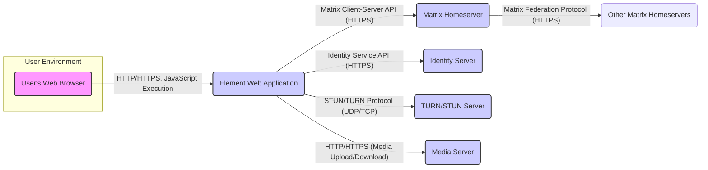

# Project Design Document: Element Web

**Version:** 1.1
**Date:** October 26, 2023
**Prepared By:** AI Software Architect

## 1. Introduction

This document provides a detailed design overview of the Element Web application, an open-source web client for the Matrix protocol. This document serves as a foundation for subsequent threat modeling activities, providing a clear understanding of the system's architecture, components, and data flows. The information presented here is based on the publicly available codebase of Element Web found at [https://github.com/element-hq/element-web](https://github.com/element-hq/element-web). This revision includes more detail on security aspects and potential threat vectors.

## 2. Goals and Objectives

The primary goals of Element Web are:

*   Provide a user-friendly interface for interacting with the Matrix network.
*   Enable secure and private communication through robust end-to-end encryption.
*   Offer a feature-rich messaging experience, including text, voice, and video communication.
*   Be accessible across various modern web browsers while adhering to accessibility standards.
*   Maintain interoperability with other Matrix clients and the broader Matrix ecosystem.
*   Provide a secure platform for sensitive communications.

## 3. Architecture Overview

Element Web is a client-side application that interacts with various backend services to provide its functionality. The core components involved are:

*   **User's Web Browser:** The environment where the Element Web application executes, providing the rendering engine and JavaScript runtime.
*   **Element Web Application:** The JavaScript application (primarily React) running within the browser, responsible for the user interface and client-side logic.
*   **Matrix Homeserver:** A server implementing the Matrix protocol, responsible for storing messages, managing rooms, handling user authentication, and facilitating federation.
*   **Identity Server (Synapse or similar):** Manages user identities, providing services like password resets, third-party identifier association (email, phone number), and account management.
*   **TURN/STUN Server:** Facilitates peer-to-peer connections for voice and video calls, especially when clients are behind Network Address Translation (NAT), by providing mechanisms for NAT traversal.
*   **Media Server (optional, but common):** Stores media files (images, videos, audio) shared within rooms, offloading this responsibility from the Homeserver.

## 4. Component Details

This section provides a more detailed look at the key components of the Element Web application, with a focus on security-relevant aspects.

*   **User's Web Browser:**
    *   **Description:** The user's interface to the Element Web application. It provides the execution environment for the JavaScript code and renders the user interface.
    *   **Technology:** Standard web browsers (Chrome, Firefox, Safari, Edge, etc.) supporting modern web standards.
    *   **Key Functionalities:** Rendering HTML, executing JavaScript, managing cookies and local storage (potential storage for session tokens), handling network requests (including TLS termination).
    *   **Security Considerations:** Vulnerable to browser-specific exploits, susceptible to malicious JavaScript if the application has XSS vulnerabilities, relies on browser security features like Content Security Policy (CSP).

*   **Element Web Application:**
    *   **Description:** The client-side application built using JavaScript (primarily React). It handles the user interface, manages the application state, implements client-side encryption, and communicates with backend services.
    *   **Technology:** JavaScript, React, Redux (or similar state management), WebSockets (for real-time communication with the Homeserver), IndexedDB (for local data caching, including potentially encrypted message history and keys), Matrix SDK (for Matrix protocol handling and end-to-end encryption).
    *   **Key Functionalities:**
        *   User authentication and session management (handling access tokens).
        *   Displaying rooms and messages, rendering user-generated content.
        *   Composing and sending messages (text, media), including client-side encryption.
        *   Handling voice and video calls, including establishing secure peer-to-peer connections.
        *   Managing user settings and preferences.
        *   Implementing end-to-end encryption (using the Matrix SDK, including key management and verification).
    *   **Security Considerations:** Potential for Cross-Site Scripting (XSS) vulnerabilities, risks associated with third-party JavaScript dependencies, secure storage of access tokens and encryption keys in the browser's storage mechanisms, proper implementation of cryptographic functions, handling of sensitive user data in memory.

*   **Matrix Homeserver:**
    *   **Description:** The core backend component of the Matrix ecosystem. It stores all persistent data, including messages, room metadata, and user profiles. It handles user authentication, authorization, and federation with other homeservers.
    *   **Technology:** Typically Synapse (the reference implementation in Python) or Dendrite (a Go implementation).
    *   **Key Functionalities:**
        *   User registration and authentication (issuing access tokens).
        *   Room creation and management, including access control.
        *   Message persistence and delivery, enforcing room-level permissions.
        *   Presence tracking and management.
        *   Federation with other Matrix homeservers, handling cross-server communication securely.
        *   Access control and permissions enforcement.
        *   Auditing and logging of events.
    *   **Security Considerations:** Vulnerable to server-side attacks, requires secure configuration and patching, proper handling of user credentials and access tokens, secure inter-server communication during federation, protection against denial-of-service attacks.

*   **Identity Server:**
    *   **Description:** A separate service responsible for managing user identities, especially for features like password resets and linking third-party identifiers (email, phone number) to Matrix accounts.
    *   **Technology:** Synapse includes an integrated identity server, but standalone implementations exist.
    *   **Key Functionalities:**
        *   Password management (reset, change), secure storage of password hashes.
        *   Email and phone number verification, preventing account takeover.
        *   Third-party identifier lookup, potentially exposing user information.
        *   Account recovery mechanisms.
    *   **Security Considerations:** Critical for account security, requires protection against brute-force attacks on login and password reset endpoints, secure handling of Personally Identifiable Information (PII), secure communication with the Homeserver.

*   **TURN/STUN Server:**
    *   **Description:** Servers that assist in establishing peer-to-peer connections for real-time communication (voice and video calls), particularly when clients are behind NAT. STUN helps clients discover their public IP address and port mappings, while TURN acts as a relay when direct peer-to-peer connections are not possible.
    *   **Technology:** Coturn is a popular open-source implementation.
    *   **Key Functionalities:**
        *   STUN: Discovering public IP addresses and port mappings, potentially revealing client network information.
        *   TURN: Relaying media streams between clients, requiring authentication and authorization to prevent abuse.
    *   **Security Considerations:** Vulnerable to abuse as open relays, requiring proper authentication and authorization mechanisms, potential for eavesdropping if not properly secured.

*   **Media Server:**
    *   **Description:** A server dedicated to storing and serving media files (images, videos, audio) shared within Matrix rooms. This offloads media storage from the Homeserver and can provide optimized media handling.
    *   **Technology:** Typically part of the Homeserver implementation (like Synapse) or a separate service like a dedicated object storage.
    *   **Key Functionalities:**
        *   Storing uploaded media files securely.
        *   Serving media files to authorized clients, enforcing access control based on room membership.
        *   Generating thumbnails and potentially performing media transformations.
    *   **Security Considerations:** Requires access control to prevent unauthorized access to media, secure storage to protect against data breaches, protection against malicious file uploads and content injection.

## 5. Data Flow

This section outlines the typical data flows within the Element Web application, highlighting security considerations at each stage.

*   **User Login:**
    1. User enters credentials in the Element Web application.
    2. Element Web sends an authentication request (HTTPS) to the Matrix Homeserver. **Security:** TLS ensures confidentiality and integrity of credentials in transit.
    3. The Homeserver verifies the credentials (potentially interacting with the Identity Server over a secure channel). **Security:** Homeserver performs authentication, potentially using multi-factor authentication.
    4. The Homeserver returns an access token (HTTPS) to the Element Web application. **Security:** Token should be securely generated and transmitted.
    5. Element Web stores the access token (typically in local storage or session storage). **Security:**  Risk of XSS attacks stealing the token; consider using HttpOnly and Secure flags for cookies if applicable.

*   **Sending a Message:**
    1. User composes a message in the Element Web application.
    2. Element Web encrypts the message content (if the room is end-to-end encrypted) using keys managed by the Matrix SDK. **Security:** Client-side encryption ensures only intended recipients can decrypt the message.
    3. Element Web sends the encrypted message (HTTPS) to the Matrix Homeserver via the Matrix Client-Server API. **Security:** TLS protects the message in transit.
    4. The Homeserver persists the encrypted message and distributes it to other members of the room. **Security:** Homeserver only stores the ciphertext.

*   **Receiving a Message:**
    1. The Matrix Homeserver pushes new messages (HTTPS) to the Element Web application via a persistent connection (e.g., WebSockets). **Security:** TLS/WSS ensures secure delivery.
    2. Element Web receives the encrypted message.
    3. Element Web decrypts the message content using keys managed by the Matrix SDK. **Security:** Decryption happens client-side, ensuring privacy. Key management and secure storage are critical.
    4. Element Web renders the decrypted message in the user interface. **Security:**  Potential for XSS if message content is not properly sanitized before rendering.

*   **Initiating a Voice/Video Call:**
    1. User initiates a call in the Element Web application.
    2. Element Web negotiates a peer-to-peer connection with the other participant(s), potentially using a TURN/STUN server to facilitate the connection. **Security:** Signaling for call setup should be authenticated and encrypted.
    3. Once the connection is established, audio and video streams are transmitted directly between the clients, often encrypted using SRTP. **Security:** SRTP provides encryption and authentication for media streams.

*   **Uploading Media:**
    1. User selects a media file to upload.
    2. Element Web uploads the file (HTTPS) to the Media Server (or the Homeserver if a separate media server is not configured). **Security:** TLS protects the media during upload.
    3. The Media Server stores the file and returns a content URI (MXC URI). **Security:** Media server should implement access controls.
    4. Element Web sends a message containing the MXC URI (HTTPS) to the Matrix Homeserver. **Security:** TLS protects the message containing the URI.

## 6. Security Considerations

This section expands on the initial security considerations, providing more specific examples of potential threats and vulnerabilities.

*   **Client-Side Security:**
    *   **Cross-Site Scripting (XSS):** Malicious scripts injected into the application can steal user data (access tokens, encryption keys), manipulate the UI, or perform actions on behalf of the user.
    *   **Dependency Vulnerabilities:** Security flaws in third-party JavaScript libraries used by Element Web can be exploited to compromise the application. Regular updates and security audits are crucial.
    *   **Local Storage Security:** If access tokens or encryption keys are stored insecurely in local storage, they can be vulnerable to theft by malicious scripts or other applications.
    *   **Code Injection:** Although less common in client-side applications, vulnerabilities in how the application processes and executes code could lead to code injection.
    *   **Clickjacking:** Attackers might trick users into clicking on malicious links or buttons embedded within the Element Web interface.
    *   **Man-in-the-Browser Attacks:** Malware running on the user's machine could intercept or modify communication with the Element Web application.

*   **Communication Security:**
    *   **End-to-End Encryption (E2EE) Weaknesses:**  Implementation flaws in the Matrix SDK or Element Web's usage of it could weaken the encryption, potentially allowing eavesdropping. Key management vulnerabilities are a major concern.
    *   **Transport Layer Security (TLS) Issues:** Misconfigured TLS, use of outdated protocols, or vulnerabilities in the TLS implementation can expose communication to interception.
    *   **WebSockets Security:**  Lack of proper authentication or encryption on the WebSocket connection could allow unauthorized access to messages in transit.

*   **Backend Security (Matrix Homeserver and Identity Server):**
    *   **Authentication and Authorization Flaws:** Weak password policies, vulnerabilities in the authentication process, or improper authorization checks can lead to unauthorized access.
    *   **Data Security Breaches:**  Vulnerabilities in the database or file storage mechanisms could lead to the exposure of messages, user data, and encryption keys.
    *   **API Security Issues:**  Lack of proper input validation, rate limiting, or authentication on the Matrix Client-Server API and Identity Service APIs can be exploited.
    *   **Federation Security Risks:**  Compromised or malicious federated homeservers could potentially inject malicious content or compromise user data.
    *   **Denial-of-Service (DoS) Attacks:**  The Homeserver and Identity Server are potential targets for DoS attacks, disrupting service availability.

*   **TURN/STUN Server Security:**
    *   **Open Relay Abuse:**  If not properly configured, the TURN server can be abused as an open relay for malicious traffic.
    *   **Eavesdropping on Relayed Media:** While TURN relays encrypted media, vulnerabilities in the server itself could potentially expose media streams.

*   **Media Server Security:**
    *   **Unauthorized Access to Media:**  Weak access controls could allow unauthorized users to view or download media files.
    *   **Storage Security Issues:**  Compromised storage could lead to the exposure of media files.
    *   **Malicious File Uploads:**  Lack of proper validation and sanitization of uploaded media files could lead to the storage of malware or other harmful content.

## 7. Assumptions and Dependencies

The following assumptions and dependencies are relevant to this design document and are crucial for understanding the security posture of Element Web:

*   **Assumption:** The Matrix Homeserver and Identity Server are deployed and configured according to security best practices, including regular security updates and patching.
*   **Assumption:** The TURN/STUN server is correctly configured with appropriate authentication mechanisms to prevent abuse.
*   **Dependency:** Element Web critically relies on the security of the Matrix Client-Server API provided by the Homeserver.
*   **Dependency:** Element Web depends on the Matrix SDK for the correct implementation of end-to-end encryption and other security-sensitive functionalities. Any vulnerabilities in the SDK directly impact Element Web's security.
*   **Dependency:** The user's web browser adheres to modern web security standards and implements security features like Content Security Policy (CSP).
*   **Assumption:** Users exercise caution and good security practices, such as using strong passwords and verifying device security.

## 8. Deployment Considerations

The security of an Element Web deployment is also influenced by how it is deployed:

*   **Hosting Environment:** The security of the server hosting the static files for Element Web is important to prevent tampering.
*   **Content Delivery Network (CDN):** If a CDN is used, its security posture also becomes relevant.
*   **HTTPS Configuration:** Proper configuration of HTTPS with strong ciphers and up-to-date certificates is essential for secure communication.
*   **Reverse Proxy:** If a reverse proxy is used, its security configuration plays a crucial role in protecting the backend services.

This revised document provides a more detailed and security-focused overview of the Element Web application's design, making it a more effective foundation for subsequent threat modeling activities.
