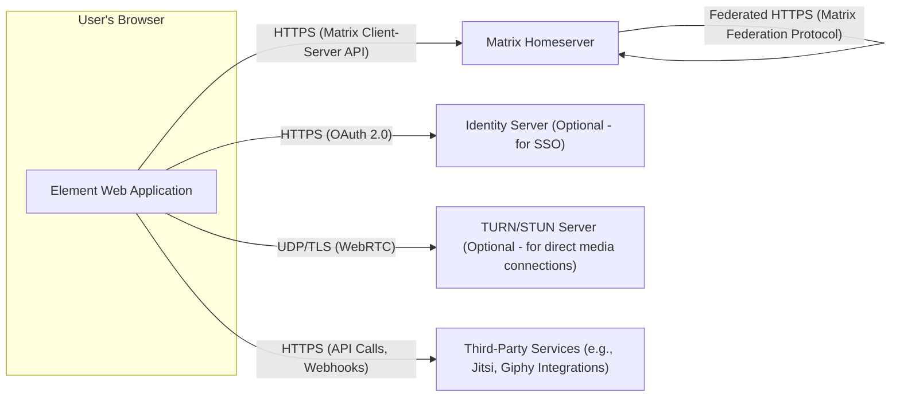

## Project Design Document: Element Web (Improved)

**1. Introduction**

This document provides an enhanced and more detailed design overview of Element Web, a web-based client for the Matrix communication protocol. This document is intended to serve as a robust foundation for subsequent threat modeling activities. It outlines the key components, data flows, and technologies involved in the operation of Element Web with greater specificity.

**2. Goals**

* Provide a comprehensive and granular architectural overview of Element Web.
* Clearly identify key components and their specific interactions and responsibilities.
* Describe the data flow within the application and with external systems in detail, including specific data types.
* Highlight security-relevant aspects of the design with more specific examples and considerations.
* Serve as a precise and actionable basis for identifying potential security threats and vulnerabilities.

**3. Scope**

This document comprehensively covers the client-side architecture of Element Web, focusing on the components executing within a user's web browser. It includes detailed interactions with the Matrix homeserver and other pertinent external services. The document's focus remains on the client-side implementation and does not delve into the internal workings of the Matrix homeserver itself, except where interactions are relevant.

**4. High-Level Architecture**

Element Web is a sophisticated single-page application (SPA) primarily constructed using JavaScript and the React framework. It communicates with a Matrix homeserver via the standardized Matrix Client-Server API. Core interactions encompass user authentication, room and space management, message transmission and reception (including various message types), media handling, and real-time presence updates.



**5. Component Breakdown**

This section provides a more granular breakdown of the major components within the Element Web application, detailing their specific functions.

* **User Interface (UI) Layer:**
    * **Core React Components:**  Responsible for the fundamental structure and rendering of the UI. Examples include:
        * "RoomList": Displays the list of joined rooms and spaces.
        * "MessageView": Renders the message history for a selected room.
        * "Composer":  Provides the input field and controls for writing and sending messages.
        * "UserSettings":  Manages user preferences and application settings.
        * "UserProfile": Displays user information and allows profile editing.
    * **State Management (React Context API with Hooks or Redux):** Manages the application's global state, ensuring data consistency across components. This includes:
        * "Session State":  User authentication status, access tokens.
        * "Room State":  Room metadata, member lists, read receipts.
        * "Message State":  Local cache of messages, message status (sending, sent, failed).
        * "UI State":  Current view, modal visibility, notification status.
    * **Styling (CSS Modules, Tailwind CSS, or similar):** Defines the visual appearance and responsiveness of the application.

* **Matrix Client Logic Layer:**
    * **Matrix SDK (`matrix-js-sdk`):** The central library for interacting with the Matrix homeserver. Key functionalities include:
        * **API Request Abstraction:**  Provides methods for making authenticated HTTP requests to the Matrix Client-Server API endpoints (e.g., `/sync`, `/send`, `/rooms`).
        * **Real-time Event Stream Handling:**  Manages the persistent connection to the homeserver and processes incoming events via the `/sync` endpoint.
        * **Data Model and Caching:**  Maintains a local representation of Matrix data (rooms, users, messages) for offline access and performance.
        * **End-to-End Encryption (E2EE) Implementation:**
            * **Olm:**  Handles pairwise encryption for direct chats.
            * **Megolm:** Manages group encryption for rooms, including key distribution and rotation.
            * **Device Management:**  Handles device verification and cross-signing.
        * **Background Sync:** Periodically synchronizes with the homeserver to fetch new events when the application is in the background or has been offline.
    * **Session Management Module:** Handles user login, logout procedures, token storage (e.g., in `localStorage` or `sessionStorage`), and session refresh mechanisms.
    * **Room Management Module:** Provides logic for joining rooms, leaving rooms, creating new rooms and spaces, and managing room settings.
    * **Message Handling Module:**
        * **Sending:**  Handles formatting messages (text, markdown), attaching media, and sending them to the homeserver.
        * **Receiving:** Parses incoming message events, decrypts them if necessary, and updates the UI.
        * **Message Editing and Redaction:** Implements functionality for editing and redacting sent messages.
    * **User and Presence Management Module:** Manages user profiles, updates presence status, and displays the online status of other users.
    * **Notifications Module:** Handles displaying desktop notifications (using the browser's Notifications API) and in-app notifications for new messages, mentions, and other events.
    * **Call Management (WebRTC) Module:**
        * **Signaling via Matrix:** Uses Matrix messages to exchange Session Description Protocol (SDP) offers and answers for establishing peer-to-peer connections.
        * **ICE Candidate Handling:**  Collects and exchanges ICE candidates to find suitable network paths.
        * **Media Stream Acquisition and Management:**  Accesses the user's microphone and camera and manages the audio and video streams.

* **Media Handling Layer:**
    * **File Upload Manager:** Handles uploading files to the Matrix homeserver's media repository.
    * **File Download Manager:** Manages downloading media files from the homeserver.
    * **Media Viewer:** Renders images, videos, and other media types within the message view.
    * **Media Encryption/Decryption Handlers:**  Integrates with the E2EE module to encrypt media before upload and decrypt it after download.

* **Integration Layer:**
    * **Widgets Framework:** Allows embedding iframes to display external web applications or services within Element Web rooms. Security considerations are paramount here, often involving sandboxing and permission management.
    * **Link Preview Service Integration:**  Fetches link metadata (title, description, image) for URLs shared in messages, often using a server-side component for scraping.

* **Local Storage/Caching Layer:**
    * **IndexedDB:**  Primarily used for storing larger amounts of structured data, such as:
        * Encrypted message history for offline access.
        * Encryption keys and session data.
    * **LocalStorage:** Used for storing smaller pieces of data, such as:
        * User preferences and settings.
        * Recently used emojis.
    * **SessionStorage:**  Used for temporary data that is cleared when the browser tab is closed, such as temporary authentication tokens.

**6. Data Flow**

This section provides more detailed data flow diagrams for key operations within Element Web, including specific data types.

* **User Login:**
    ```mermaid
    graph LR
        A["User"] --> B{"Element Web Application (Login Form)"};
        B -- "Username, Password / SSO Token" --> C["Matrix SDK (Authentication Module)"];
        C -- "POST /login (Credentials)" --> D["Matrix Homeserver"];
        D -- "Access Token, Device ID" --> C;
        C -- "Store Access Token, Device ID" --> E["Local Storage"];
        C -- "Update Session State" --> B;
        B --> A;
    ```

* **Sending a Text Message:**
    ```mermaid
    graph LR
        A["User"] --> B{"Element Web Application (Composer)"};
        B -- "Message Text" --> C["Matrix SDK (Message Handling)"];
        C -- "Check E2EE Status" --> D["E2EE Module"];
        D -- "Encryption Keys (if E2EE)" --> C;
        C -- "Encrypt Message (if E2EE)" --> E["Encryption Function"];
        E -- "Encrypted Payload / Plaintext" --> C;
        C -- "POST /rooms/{roomId}/send/m.room.message (Message Content)" --> F["Matrix Homeserver"];
        F -- "Event ID" --> C;
        C -- "Update Message State (Sent)" --> B;
        B --> A;
    ```

* **Receiving an Encrypted Message:**
    ```mermaid
    graph LR
        A["Matrix Homeserver"] -- "m.room.encrypted Event" --> B["Element Web Application (Event Listener)"];
        B -- "Encrypted Event Data" --> C["Matrix SDK (Event Handling)"];
        C -- "Identify Sender Device" --> D["E2EE Module (Device Tracking)"];
        D -- "Session Keys" --> C;
        C -- "Decrypt Message" --> E["Decryption Function"];
        E -- "Plaintext Message Content" --> C;
        C -- "Update Message State (Decrypted)" --> F["UI Components (Message View)"];
        F --> G["User"];
    ```

* **Initiating a Voice Call:**
    ```mermaid
    graph LR
        A["User A"] --> B{"Element Web App A (Call Button)"};
        B -- "Initiate Call Request" --> C["Matrix SDK A (Call Management)"];
        C -- "Create SDP Offer" --> D["WebRTC Engine A"];
        D -- "SDP Offer" --> C;
        C -- "Send m.call.invite (SDP Offer)" --> E["Matrix Homeserver"];
        E -- "m.call.invite (SDP Offer)" --> F["Matrix SDK B (Event Listener)"];
        F -- "Display Incoming Call" --> G["Element Web App B"];
        G -- "Accept Call" --> F;
        F -- "Create SDP Answer" --> H["WebRTC Engine B"];
        H -- "SDP Answer" --> F;
        F -- "Send m.call.answer (SDP Answer)" --> E;
        E -- "m.call.answer (SDP Answer)" --> C;
        C -- "Begin ICE Negotiation" --> I["ICE Agent A"];
        F -- "Begin ICE Negotiation" --> J["ICE Agent B"];
        I -- "ICE Candidates" --> E;
        J -- "ICE Candidates" --> E;
        E -- "Exchange ICE Candidates" --> C & F;
        C -- "Establish Media Connection" --> D & H;
        D -- "Audio Stream" --> H;
        H -- "Audio Stream" --> D;
        B --> A;
        G --> A;
    ```

**7. Security Considerations**

This section provides a more detailed overview of security considerations for Element Web.

* **Authentication and Authorization:**
    * **Secure Credential Handling:**  Emphasis on secure storage and transmission of user credentials. Avoid storing passwords directly; rely on secure hashing and salting on the homeserver.
    * **OAuth 2.0 for SSO:**  Leveraging OAuth 2.0 for Single Sign-On (SSO) with external identity providers enhances security and user experience.
    * **Device Verification and Management:**  Users should be able to verify their devices and revoke access for compromised devices.

* **End-to-End Encryption (E2EE):**
    * **Robust Key Management:** Secure generation, storage, and distribution of Olm and Megolm keys.
    * **Cross-Signing:**  Implementation of cross-signing to establish trust between user devices and prevent key compromise.
    * **Session Backup and Recovery:** Secure mechanisms for backing up and restoring encryption keys to prevent data loss.

* **Transport Layer Security (TLS):**
    * **Enforce HTTPS:**  Strict enforcement of HTTPS for all communication with the Matrix homeserver and other external services.
    * **HSTS (HTTP Strict Transport Security):**  Implementation of HSTS to instruct browsers to only access the application over HTTPS.

* **Content Security Policy (CSP):**
    * **Strict CSP Directives:**  Implementation of a restrictive CSP to mitigate XSS attacks by controlling the sources from which the application can load resources.
    * **Regular CSP Review and Updates:**  Maintaining and updating the CSP to address new threats and ensure it remains effective.

* **Input Validation and Output Encoding:**
    * **Server-Side Validation:**  While client-side validation improves user experience, server-side validation is crucial for security.
    * **Context-Aware Output Encoding:**  Encoding output data based on the context in which it is being used to prevent XSS.

* **Cross-Site Request Forgery (CSRF) Protection:**
    * **Synchronizer Tokens:**  Utilizing synchronizer tokens (CSRF tokens) in state-changing requests to prevent CSRF attacks.

* **Clickjacking Protection:**
    * **`X-Frame-Options` Header:**  Setting the `X-Frame-Options` header to `DENY` or `SAMEORIGIN` to prevent the application from being embedded in iframes on other domains.
    * **Content Security Policy `frame-ancestors` Directive:**  Using the `frame-ancestors` directive in the CSP as an alternative or additional measure.

* **Dependency Management:**
    * **Regular Dependency Audits:**  Performing regular audits of third-party dependencies for known vulnerabilities using tools like `npm audit` or `yarn audit`.
    * **Automated Dependency Updates:**  Implementing automated processes for updating dependencies to the latest secure versions.
    * **Software Bill of Materials (SBOM):**  Generating and maintaining an SBOM to track the components used in the application.

* **Local Storage Security:**
    * **Encryption of Sensitive Data:**  Encrypting sensitive data stored in `localStorage` or `IndexedDB`, such as encryption keys or access tokens.
    * **Minimize Data Storage:**  Avoiding storing sensitive information locally if possible.

* **WebRTC Security:**
    * **Secure Signaling:**  Ensuring the signaling channel (Matrix messages) is secure and authenticated.
    * **DTLS Encryption:**  WebRTC uses DTLS to encrypt media streams.
    * **TURN/STUN Server Security:**  Properly configuring and securing TURN/STUN servers to prevent unauthorized access.

* **Widget Security:**
    * **Iframe Sandboxing:**  Utilizing iframe sandboxing attributes to restrict the capabilities of embedded widgets.
    * **Content Security Policy for Widgets:**  Applying CSP to widget iframes to limit their access to resources.
    * **Careful Permission Management:**  Clearly defining and controlling the permissions granted to widgets.

**8. Technologies Used**

* **Primary Programming Language:** JavaScript (ES6+)
* **Core UI Framework:** React
* **State Management Library:** React Context API with Hooks (common) or Redux (for more complex state management)
* **Matrix Client SDK:** `matrix-js-sdk`
* **Module Bundler:** Webpack, Parcel, or Rollup
* **Styling Solutions:** CSS Modules, Tailwind CSS, Styled Components, or Emotion
* **Testing Frameworks:** Jest, React Testing Library, Cypress, Playwright
* **WebRTC Implementation:** Browser's native WebRTC API
* **Local Storage Abstraction:**  Libraries like `localforage` can provide a consistent API across different storage mechanisms.
* **Internationalization (i18n) Libraries:** `react-intl` or `i18next`

**9. Deployment Model**

Element Web is typically deployed as a static website consisting of HTML, CSS, and JavaScript files. These files are served from a web server (e.g., Nginx, Apache) or a Content Delivery Network (CDN). The application interacts with a separately hosted Matrix homeserver over HTTPS.

**10. Assumptions and Constraints**

* **Assumption:** The security of the Matrix homeserver infrastructure is maintained by the server administrator.
* **Assumption:** Users are using modern, up-to-date web browsers that support the necessary web technologies and security features.
* **Constraint:** The security of end-to-end encryption relies on the correct implementation and usage of the Matrix E2EE protocol.
* **Constraint:** Performance can be influenced by the user's network connection, device capabilities, and the responsiveness of the Matrix homeserver.

**11. Threat Landscape (Brief Overview)**

Element Web, as a communication application, faces various potential threats, including:

* **Cross-Site Scripting (XSS):**  Attackers injecting malicious scripts into the application to steal user data or perform actions on their behalf.
* **Cross-Site Request Forgery (CSRF):**  Attackers tricking users into performing unintended actions on the application.
* **Man-in-the-Middle (MITM) Attacks:**  Attackers intercepting communication between the client and the server to eavesdrop or manipulate data.
* **Data Breaches:**  Unauthorized access to stored data, including messages and encryption keys.
* **Account Takeover:**  Attackers gaining unauthorized access to user accounts.
* **Denial of Service (DoS):**  Attackers overwhelming the application or its dependencies to make it unavailable.
* **WebRTC-Specific Vulnerabilities:**  Exploiting weaknesses in the WebRTC implementation or signaling process.
* **Supply Chain Attacks:**  Compromising third-party dependencies to inject malicious code.

This improved design document provides a more comprehensive and detailed understanding of Element Web's architecture, which is crucial for effective threat modeling and security analysis.