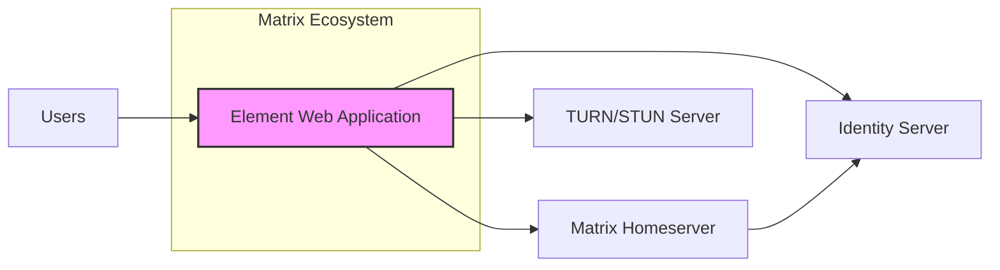
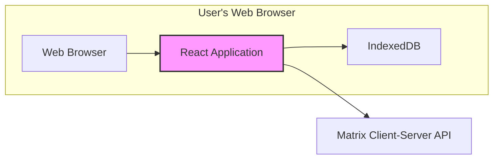
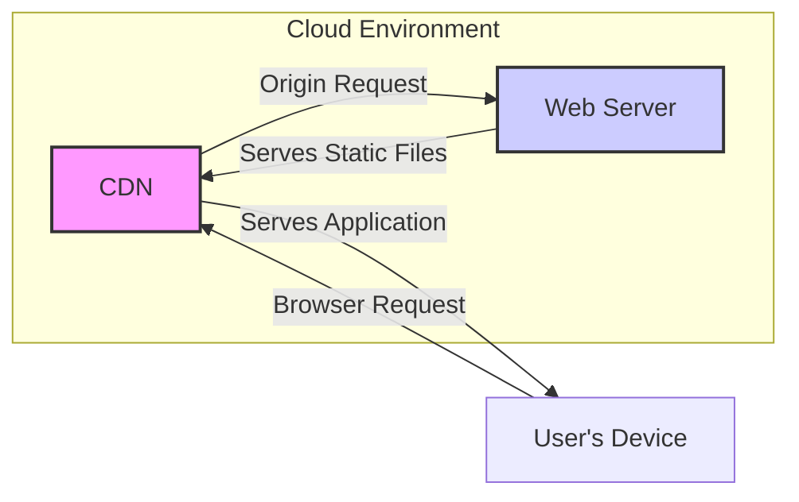
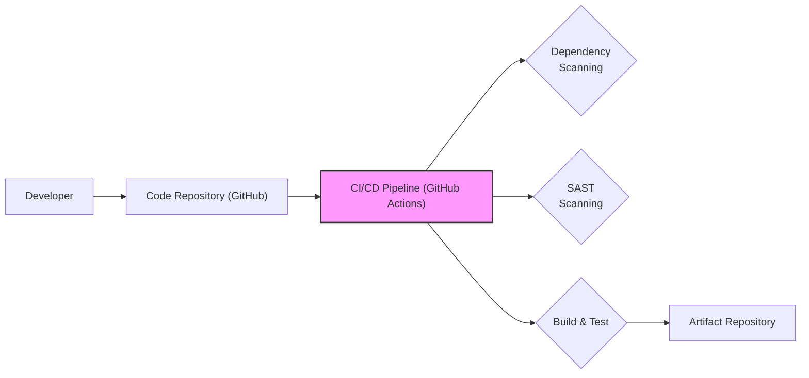

# BUSINESS POSTURE

The Element Web project aims to provide a feature-rich web client for the Matrix protocol, enabling users to communicate securely and privately. As a communication platform, its primary business priorities revolve around user trust, data confidentiality, and service availability.

*   Business Priorities:
    *   User Privacy and Data Security: Ensuring user communications are confidential and protected from unauthorized access.
    *   Reliable Communication Service: Maintaining a stable and accessible platform for real-time communication.
    *   Feature Richness and User Experience: Providing a competitive and user-friendly messaging experience.
*   Business Goals:
    *   Increase user adoption of Element Web as a primary communication tool.
    *   Maintain a strong reputation for security and privacy within the Matrix ecosystem.
    *   Support the growth and adoption of the Matrix protocol.
*   Business Risks:
    *   Data Breaches: Unauthorized access or disclosure of user messages and personal information.
    *   Service Disruption: Downtime or unavailability of the Element Web client, hindering communication.
    *   Privacy Violations: Failure to adequately protect user privacy, leading to legal and reputational damage.
    *   Reputational Damage: Negative publicity due to security incidents or privacy failures, eroding user trust.

# SECURITY POSTURE

Element Web, being a client-side application interacting with a Matrix homeserver, inherits and implements various security controls.

*   Existing Security Controls:
    *   security control HTTPS for communication encryption between the web browser and the web server hosting Element Web. Implemented at the web server and browser level.
    *   security control Content Security Policy (CSP) to mitigate cross-site scripting (XSS) attacks. Implemented in the application's HTTP headers.
    *   security control Subresource Integrity (SRI) to ensure integrity of fetched resources. Implemented in the application's HTML.
    *   security control Regular security updates of dependencies to address known vulnerabilities. Implemented as part of the development lifecycle and dependency management.
    *   security control End-to-end encryption (E2EE) using Matrix's cryptographic protocols to protect message content confidentiality. Implemented within the Matrix protocol and Element Web application.
    *   security control Access control at the Matrix homeserver level to manage user authentication and authorization to rooms and resources. Implemented by the Matrix homeserver.
*   Accepted Risks:
    *   accepted risk Client-side vulnerabilities inherent in web applications, requiring continuous monitoring and patching.
    *   accepted risk Reliance on the security of the Matrix homeserver infrastructure, which is outside of Element Web's direct control.
    *   accepted risk User device security, as compromised user devices can lead to account compromise.
*   Recommended Security Controls:
    *   security control Implement automated Static Application Security Testing (SAST) in the CI/CD pipeline to identify potential security vulnerabilities in the codebase.
    *   security control Implement automated Dependency Scanning in the CI/CD pipeline to detect vulnerable dependencies.
    *   security control Conduct regular Dynamic Application Security Testing (DAST) to identify runtime vulnerabilities.
    *   security control Perform penetration testing and security audits by external security experts to identify and remediate security weaknesses.
    *   security control Implement rate limiting on API requests to mitigate denial-of-service attacks and brute-force attempts.
    *   security control Consider deploying a Web Application Firewall (WAF) to protect against common web attacks.
    *   security control Implement robust logging and monitoring of security-relevant events for incident detection and response.
*   Security Requirements:
    *   Authentication:
        *   Requirement: Securely authenticate users to the Matrix homeserver using the Matrix authentication protocols (e.g., password, SSO, OAuth).
        *   Requirement: Implement multi-factor authentication (MFA) to enhance account security.
    *   Authorization:
        *   Requirement: Enforce Matrix room access control lists (ACLs) to ensure users can only access authorized rooms and resources.
        *   Requirement: Implement proper authorization checks before performing actions on the Matrix homeserver.
    *   Input Validation:
        *   Requirement: Validate all user inputs to prevent injection attacks (e.g., XSS, command injection).
        *   Requirement: Sanitize user-generated content to mitigate stored XSS vulnerabilities.
    *   Cryptography:
        *   Requirement: Utilize strong cryptographic algorithms and libraries for end-to-end encryption and secure communication.
        *   Requirement: Securely manage cryptographic keys used for encryption and decryption.
        *   Requirement: Adhere to best practices for cryptographic implementation to avoid common pitfalls.

# DESIGN

The design of Element Web is centered around a client-side web application that interacts with a Matrix homeserver to provide messaging and collaboration features.

## C4 CONTEXT

*   Context Diagram Elements:
    *   Element Web Application
        *   Name: Element Web Application
        *   Type: Software System
        *   Description: The Element Web application provides a web-based interface for users to interact with the Matrix protocol for communication and collaboration. It is the central focus of this design document.
        *   Responsibilities:
            *   Provide a user interface for Matrix communication.
            *   Handle user authentication and authorization with the Matrix homeserver.
            *   Send and receive messages via the Matrix Client-Server API.
            *   Implement end-to-end encryption and decryption of messages.
            *   Manage user presence and room state.
        *   Security controls:
            *   security control HTTPS for communication with backend services.
            *   security control Content Security Policy (CSP).
            *   security control Subresource Integrity (SRI).
            *   security control Input validation on user inputs.
            *   security control Client-side implementation of end-to-end encryption.
    *   Users
        *   Name: Users
        *   Type: Person
        *   Description: Individuals who use the Element Web application to communicate with others via the Matrix protocol.
        *   Responsibilities:
            *   Use Element Web to send and receive messages.
            *   Manage their Matrix account and profile.
            *   Participate in Matrix rooms and communities.
        *   Security controls:
            *   security control Strong passwords or passphrases for account security.
            *   security control Enabling multi-factor authentication (MFA) if available.
            *   security control Secure handling of their devices and credentials.
    *   Matrix Homeserver
        *   Name: Matrix Homeserver
        *   Type: Software System
        *   Description: The backend server that implements the Matrix protocol. It stores user accounts, messages, room state, and handles federation with other homeservers. Element Web interacts with a specific homeserver instance.
        *   Responsibilities:
            *   Store user accounts and profiles.
            *   Store messages and room history.
            *   Manage room state and membership.
            *   Handle user authentication and authorization.
            *   Federate with other Matrix homeservers.
        *   Security controls:
            *   security control Server-side access control and authentication mechanisms.
            *   security control Database encryption for stored data.
            *   security control Audit logging of server events.
            *   security control Protection against denial-of-service attacks.
    *   Identity Server
        *   Name: Identity Server
        *   Type: Software System
        *   Description: A component within the Matrix ecosystem responsible for managing user identities, including third-party identifiers (e.g., email, phone number) and identity verification.
        *   Responsibilities:
            *   Manage user identities and third-party identifiers.
            *   Provide identity verification services.
            *   Facilitate account recovery.
        *   Security controls:
            *   security control Secure storage of identity information.
            *   security control Secure identity verification processes.
            *   security control Protection against account takeover attempts.
    *   TURN/STUN Server
        *   Name: TURN/STUN Server
        *   Type: Software System
        *   Description: Servers that facilitate WebRTC-based voice and video calls in Matrix by assisting with NAT traversal and relaying media streams when direct peer-to-peer connections are not possible.
        *   Responsibilities:
            *   Assist with NAT traversal for WebRTC connections.
            *   Relay media streams between clients when necessary.
        *   Security controls:
            *   security control Secure configuration to prevent unauthorized relaying.
            *   security control Rate limiting to mitigate abuse.

## C4 CONTAINER

*   Container Diagram Elements:
    *   Web Browser
        *   Name: Web Browser
        *   Type: Container
        *   Description: The user's web browser environment where the Element Web React application runs. It provides the runtime environment for the application.
        *   Responsibilities:
            *   Execute the JavaScript code of the React application.
            *   Render the user interface.
            *   Provide access to browser APIs (e.g., Web Storage, WebSockets).
        *   Security controls:
            *   security control Browser security features (e.g., sandboxing, same-origin policy).
            *   security control Browser extensions and security settings controlled by the user.
    *   React Application
        *   Name: React Application
        *   Type: Container
        *   Description: The client-side application built using React framework. It is the core logic of Element Web, handling UI, application state, and communication with the Matrix homeserver.
        *   Responsibilities:
            *   Implement the user interface and user experience.
            *   Manage application state and data.
            *   Handle user interactions and events.
            *   Communicate with the Matrix Homeserver via the Client-Server API.
            *   Implement end-to-end encryption logic.
            *   Store local data in IndexedDB.
        *   Security controls:
            *   security control Client-side input validation.
            *   security control Implementation of end-to-end encryption.
            *   security control Secure handling of user credentials in memory (within browser context).
            *   security control Content Security Policy enforcement.
    *   IndexedDB
        *   Name: IndexedDB
        *   Type: Container
        *   Description: A browser-based NoSQL database used for local storage of application data, such as user settings, message cache, and encryption keys.
        *   Responsibilities:
            *   Persist application data locally in the browser.
            *   Provide offline access to cached data.
        *   Security controls:
            *   security control Browser-managed storage isolation per origin.
            *   security control Encryption of data at rest by the browser (depending on browser implementation and OS).
    *   Matrix Client-Server API
        *   Name: Matrix Client-Server API
        *   Type: Interface
        *   Description: The RESTful API provided by the Matrix homeserver for clients to interact with the Matrix protocol. Element Web uses this API to send and receive messages, manage rooms, and perform other Matrix operations.
        *   Responsibilities:
            *   Provide endpoints for user authentication and registration.
            *   Provide endpoints for sending and receiving messages.
            *   Provide endpoints for managing rooms and room state.
            *   Enforce access control and authorization.
        *   Security controls:
            *   security control HTTPS for API communication.
            *   security control Server-side authentication and authorization.
            *   security control API rate limiting.
            *   security control Input validation on API requests.

## DEPLOYMENT

Element Web is typically deployed as a static web application, served from a web server or a Content Delivery Network (CDN).

*   Deployment Diagram Elements:
    *   CDN
        *   Name: CDN
        *   Type: Infrastructure
        *   Description: A Content Delivery Network is used to distribute the static files of Element Web (HTML, CSS, JavaScript, images) globally for faster loading times and improved availability.
        *   Responsibilities:
            *   Cache and serve static files to users from geographically distributed edge locations.
            *   Improve application loading speed and reduce latency.
            *   Enhance application availability and resilience.
        *   Security controls:
            *   security control HTTPS for content delivery.
            *   security control DDoS protection.
            *   security control Access control to CDN configuration and management.
    *   Web Server
        *   Name: Web Server
        *   Type: Infrastructure
        *   Description: The origin web server that hosts the static files of Element Web. It serves the application to the CDN and potentially directly to users.
        *   Responsibilities:
            *   Store and serve the static files of Element Web.
            *   Handle origin requests from the CDN.
            *   Potentially serve the application directly to users in some deployment scenarios.
        *   Security controls:
            *   security control HTTPS configuration.
            *   security control Web server hardening and security configuration.
            *   security control Access control to the web server and its configuration.
    *   User's Device
        *   Name: User's Device
        *   Type: Infrastructure
        *   Description: The user's computer, laptop, tablet, or smartphone where the web browser runs and accesses Element Web.
        *   Responsibilities:
            *   Run the web browser and Element Web application.
            *   Provide user input and display the application UI.
        *   Security controls:
            *   security control User-managed device security (antivirus, firewall, OS updates).
            *   security control Browser security settings.

## BUILD

The build process for Element Web involves compiling the React application, bundling assets, and creating deployable artifacts. A typical secure build process incorporates automated checks and supply chain security measures.

*   Build Process Elements:
    *   Developer
        *   Name: Developer
        *   Type: Person
        *   Description: Software developers who write and maintain the Element Web codebase.
        *   Responsibilities:
            *   Write and commit code changes.
            *   Perform code reviews.
            *   Address security vulnerabilities identified during development and testing.
        *   Security controls:
            *   security control Secure coding practices training.
            *   security control Code review process.
            *   security control Access control to code repositories.
    *   Code Repository (GitHub)
        *   Name: Code Repository (GitHub)
        *   Type: Tool/Service
        *   Description: A version control system (GitHub) used to store and manage the Element Web source code.
        *   Responsibilities:
            *   Store and version control the codebase.
            *   Manage branches and pull requests.
            *   Trigger CI/CD pipelines on code changes.
        *   Security controls:
            *   security control Access control and authentication for repository access.
            *   security control Branch protection rules.
            *   security control Audit logging of repository events.
    *   CI/CD Pipeline (GitHub Actions)
        *   Name: CI/CD Pipeline (GitHub Actions)
        *   Type: Tool/Service
        *   Description: An automated CI/CD pipeline (using GitHub Actions) that builds, tests, and potentially deploys Element Web.
        *   Responsibilities:
            *   Automate the build process.
            *   Run automated tests (unit, integration, etc.).
            *   Perform security scans (SAST, dependency scanning).
            *   Build and package deployable artifacts.
        *   Security controls:
            *   security control Secure configuration of CI/CD pipelines.
            *   security control Secrets management for credentials used in the pipeline.
            *   security control Isolation of build environments.
    *   Dependency Scanning
        *   Name: Dependency Scanning
        *   Type: Security Check
        *   Description: Automated scanning of project dependencies to identify known vulnerabilities in third-party libraries and components.
        *   Responsibilities:
            *   Identify vulnerable dependencies.
            *   Generate reports of identified vulnerabilities.
        *   Security controls:
            *   security control Regularly updated vulnerability databases.
            *   security control Automated alerts for new vulnerabilities.
    *   SAST Scanning
        *   Name: SAST Scanning
        *   Type: Security Check
        *   Description: Static Application Security Testing (SAST) tools analyze the source code to identify potential security vulnerabilities (e.g., XSS, SQL injection) without executing the code.
        *   Responsibilities:
            *   Identify potential security vulnerabilities in the codebase.
            *   Generate reports of identified vulnerabilities with code locations.
        *   Security controls:
            *   security control Regularly updated vulnerability rulesets.
            *   security control Configuration to minimize false positives.
    *   Build & Test
        *   Name: Build & Test
        *   Type: Process
        *   Description: The steps in the CI/CD pipeline that compile the code, bundle assets, and run automated tests to ensure code quality and functionality.
        *   Responsibilities:
            *   Compile the React application.
            *   Bundle JavaScript, CSS, and other assets.
            *   Run unit tests, integration tests, and other automated tests.
        *   Security controls:
            *   security control Secure build environment.
            *   security control Verification of build artifacts integrity.
    *   Artifact Repository
        *   Name: Artifact Repository
        *   Type: Tool/Service
        *   Description: A repository (e.g., cloud storage, package registry) where build artifacts (e.g., bundled JavaScript, HTML, CSS files) are stored for deployment.
        *   Responsibilities:
            *   Store build artifacts securely.
            *   Provide access to artifacts for deployment processes.
        *   Security controls:
            *   security control Access control to the artifact repository.
            *   security control Integrity checks for stored artifacts.

# RISK ASSESSMENT

*   Critical Business Processes:
    *   Secure and private communication between users.
    *   User account management and authentication.
    *   Reliable service availability for communication.
*   Data Sensitivity:
    *   User Messages: Highly sensitive. Contain personal and potentially confidential information. Require strong confidentiality and integrity protection.
    *   User Credentials (hashed passwords, etc.): Highly sensitive. Require strong confidentiality and integrity protection.
    *   User Profile Information (email, phone number, etc.): Sensitive. Require confidentiality and integrity protection.
    *   Room Membership and Metadata: Sensitive. Can reveal social connections and communication patterns. Require confidentiality and integrity protection.
    *   Encryption Keys: Highly sensitive. Critical for maintaining message confidentiality. Require strong confidentiality and integrity protection and secure key management.

# QUESTIONS & ASSUMPTIONS

*   Questions:
    *   What is the intended scale and user base for Element Web? This will influence scalability and performance requirements, as well as the criticality of certain security controls (e.g., DDoS protection).
    *   Are there specific regulatory compliance requirements (e.g., GDPR, HIPAA) that Element Web needs to adhere to? This will dictate specific security and privacy controls.
    *   What is the organization's risk tolerance? A higher risk tolerance might lead to accepting more risks or delaying implementation of certain security controls.
    *   What is the budget allocated for security measures? Budget constraints can impact the feasibility of implementing certain security controls.
    *   What is the process for incident response and security monitoring? Understanding the incident response plan is crucial for threat modeling.
*   Assumptions:
    *   End-to-end encryption is a core security feature and is considered essential for Element Web.
    *   User privacy and data confidentiality are high priorities.
    *   Standard web application security best practices are expected and should be implemented.
    *   The Matrix homeserver infrastructure is assumed to be reasonably secure, but Element Web should still implement client-side security controls to mitigate risks.
    *   The target deployment environment is a standard cloud-based infrastructure using CDN and web servers.