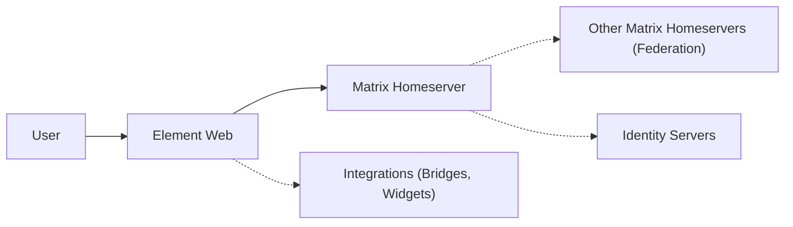
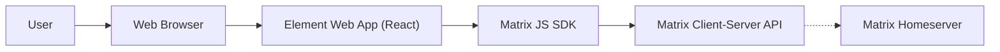
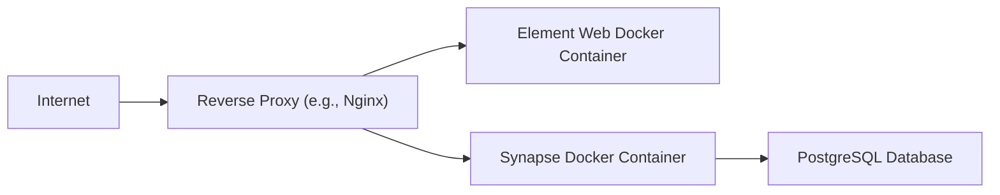
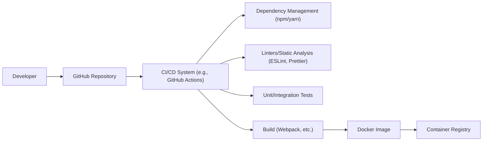

Okay, let's create a design document for the Element Web project, focusing on aspects relevant for threat modeling.

# BUSINESS POSTURE

Element Web is a web client for the Matrix communication protocol, aiming to provide a secure and decentralized alternative to traditional messaging platforms.  The business priorities appear to be:

*   User Adoption and Growth: Attracting and retaining users by offering a user-friendly and feature-rich experience.
*   Interoperability: Seamless communication with other Matrix clients and potentially bridging to other communication networks.
*   Security and Privacy: Protecting user data and communications from unauthorized access and surveillance. This is a core differentiator.
*   Reputation and Trust: Maintaining a positive reputation as a secure and reliable communication platform.
*   Open Source Community: Fostering a vibrant open-source community for contributions, development, and transparency.

Based on these priorities, the most important business risks are:

*   Compromise of User Data:  A major data breach or security vulnerability could severely damage user trust and lead to significant user attrition.
*   Service Disruption:  Outages or performance issues could hinder user adoption and damage the platform's reputation.
*   Malicious Use: The platform could be used for illegal activities, leading to legal and reputational risks.
*   Failure to Maintain Interoperability:  Inability to keep up with changes in the Matrix protocol or integrate with other platforms could limit growth.
*   Supply Chain Attacks: Vulnerabilities introduced through third-party dependencies or compromised build processes could undermine the security of the entire application.

# SECURITY POSTURE

Existing security controls (based on the GitHub repository and general knowledge of web application security):

*   security control: End-to-End Encryption (E2EE): Matrix protocol and Element Web support E2EE for conversations, protecting message content from the server and other intermediaries. Implemented within the Matrix protocol libraries and Element Web's integration with them.
*   security control: HTTPS:  Communication between the client and the homeserver is encrypted using HTTPS. Implemented by web server configuration and browser enforcement.
*   security control: Cross-Site Scripting (XSS) Prevention:  React framework and secure coding practices are used to mitigate XSS vulnerabilities. Implemented in the application code.
*   security control: Content Security Policy (CSP):  CSP headers are likely used to restrict the sources from which the browser can load resources, further mitigating XSS and other injection attacks. Implemented in web server configuration and application code.
*   security control: Regular Security Audits: While not explicitly stated, it's assumed that Element undergoes periodic security audits and penetration testing.
*   security control: Open Source Code: The code is publicly available, allowing for community scrutiny and vulnerability identification.
*   security control: Dependency Management: The project uses package managers (like npm or yarn) to manage dependencies, allowing for updates and security patches. Implemented in the build process.

Accepted risks:

*   accepted risk: Reliance on User Device Security: The security of E2EE ultimately depends on the security of the user's device. A compromised device can expose decrypted messages.
*   accepted risk: Metadata Leakage: While message content is encrypted, metadata (e.g., sender, recipient, timestamp) may be visible to the homeserver.
*   accepted risk: Federation Risks:  Federation with other Matrix homeservers introduces potential risks if those servers are compromised or malicious.
*   accepted risk: Complexity of E2EE Implementation:  E2EE is complex to implement correctly, and subtle bugs can lead to vulnerabilities.

Recommended security controls:

*   security control: Implement Subresource Integrity (SRI) for JavaScript and CSS files to ensure that fetched resources haven't been tampered with.
*   security control: Implement a robust vulnerability disclosure program to encourage responsible reporting of security issues.
*   security control: Conduct regular threat modeling exercises to proactively identify and address potential security threats.
*   security control: Implement automated security testing (SAST, DAST) in the CI/CD pipeline.

Security Requirements:

*   Authentication:
    *   Users must be authenticated securely with the homeserver using strong passwords or other authentication factors.
    *   Support for multi-factor authentication (MFA) should be considered.
    *   Session management must be secure, preventing session hijacking and fixation.

*   Authorization:
    *   Access control mechanisms must ensure that users can only access data and functionality they are authorized to use.
    *   Granular permissions should be implemented for different room types and user roles.

*   Input Validation:
    *   All user inputs (messages, usernames, etc.) must be validated to prevent injection attacks (XSS, etc.).
    *   Input validation should be performed on both the client-side and server-side.

*   Cryptography:
    *   E2EE must be implemented correctly using strong cryptographic algorithms and protocols.
    *   Key management must be secure, protecting private keys from unauthorized access.
    *   Cryptographic operations should be performed using well-vetted libraries.

# DESIGN

## C4 CONTEXT

Element Description:

*   Element:
    *   Name: User
    *   Type: Person
    *   Description: A person using Element Web to communicate.
    *   Responsibilities: Sending and receiving messages, managing their account, participating in rooms.
    *   Security controls: Strong passwords, device security, awareness of phishing attacks.

*   Element:
    *   Name: Element Web
    *   Type: Web Application
    *   Description: The web client for the Matrix protocol.
    *   Responsibilities: Providing a user interface for interacting with the Matrix network, handling E2EE, managing user sessions.
    *   Security controls: XSS prevention, CSP, HTTPS, input validation, secure coding practices.

*   Element:
    *   Name: Matrix Homeserver
    *   Type: Server Application
    *   Description: The server that hosts user accounts and facilitates communication.
    *   Responsibilities: Storing user data, routing messages, managing room state, handling federation.
    *   Security controls: Access controls, input validation, regular security updates, intrusion detection systems.

*   Element:
    *   Name: Other Matrix Homeservers (Federation)
    *   Type: Server Application
    *   Description: Other Matrix servers that communicate with the user's homeserver.
    *   Responsibilities: Relaying messages between different homeservers.
    *   Security controls: Dependent on the security practices of the other homeserver operators.

*   Element:
    *   Name: Identity Servers
    *   Type: Server Application
    *   Description: Optional servers used for discovering Matrix user IDs based on email addresses or phone numbers.
    *   Responsibilities: Mapping email addresses and phone numbers to Matrix user IDs.
    *   Security controls: Data privacy measures, access controls.

*   Element:
    *   Name: Integrations (Bridges, Widgets)
    *   Type: External Systems
    *   Description: Third-party services that can be integrated with Element Web.
    *   Responsibilities: Extending the functionality of Element Web, bridging to other communication platforms.
    *   Security controls: Dependent on the security of the third-party services.

## C4 CONTAINER

Container Description:

*   Element:
    *   Name: User
    *   Type: Person
    *   Description: A person using Element Web to communicate.
    *   Responsibilities: Sending and receiving messages, managing their account, participating in rooms.
    *   Security controls: Strong passwords, device security, awareness of phishing attacks.

*   Element:
    *   Name: Web Browser
    *   Type: Software System
    *   Description: The user's web browser (e.g., Chrome, Firefox).
    *   Responsibilities: Rendering the Element Web application, handling user input, managing network connections.
    *   Security controls: Browser security settings, sandboxing, regular updates.

*   Element:
    *   Name: Element Web App (React)
    *   Type: Web Application
    *   Description: The main application code, built using the React framework.
    *   Responsibilities: Providing the user interface, handling user interactions, managing application state.
    *   Security controls: XSS prevention, CSP, input validation, secure coding practices.

*   Element:
    *   Name: Matrix JS SDK
    *   Type: Library
    *   Description: A JavaScript library that provides an interface to the Matrix Client-Server API.
    *   Responsibilities: Handling communication with the homeserver, managing E2EE, providing a higher-level API for the Element Web App.
    *   Security controls: Secure coding practices, regular updates, cryptographic best practices.

*   Element:
    *   Name: Matrix Client-Server API
    *   Type: API
    *   Description: The API used for communication between the client and the homeserver.
    *   Responsibilities: Defining the methods and data formats for client-server communication.
    *   Security controls: HTTPS, access controls, input validation.

*   Element:
    *   Name: Homeserver
    *   Type: Server Application
    *   Description: The server that hosts user accounts and facilitates communication.
    *   Responsibilities: Storing user data, routing messages, managing room state, handling federation.
    *   Security controls: Access controls, input validation, regular security updates, intrusion detection systems.

## DEPLOYMENT

Possible deployment solutions:

1.  Self-hosting: Users or organizations can deploy their own instance of Element Web and a Matrix homeserver (e.g., Synapse).
2.  Managed hosting:  Using a hosting provider that offers managed Matrix homeservers and Element Web deployments.
3.  Using a public instance:  Using a publicly available instance of Element Web, such as the one hosted by Element themselves (element.io).

Chosen solution for detailed description: Self-hosting using Docker.

Deployment Description:

*   Element:
    *   Name: Internet
    *   Type: Network
    *   Description: The public internet.
    *   Responsibilities: Providing connectivity between the user and the server.
    *   Security controls: Standard internet security protocols.

*   Element:
    *   Name: Reverse Proxy (e.g., Nginx)
    *   Type: Server Application
    *   Description: A reverse proxy server that handles incoming requests and forwards them to the appropriate container.
    *   Responsibilities: Terminating SSL/TLS connections, providing load balancing, caching static assets.
    *   Security controls: HTTPS configuration, firewall rules, regular security updates.

*   Element:
    *   Name: Element Web Docker Container
    *   Type: Container
    *   Description: A Docker container running the Element Web application.
    *   Responsibilities: Serving the Element Web application to users.
    *   Security controls: Container security best practices, regular image updates.

*   Element:
    *   Name: Synapse Docker Container
    *   Type: Container
    *   Description: A Docker container running the Synapse Matrix homeserver.
    *   Responsibilities: Hosting user accounts, managing rooms, handling communication.
    *   Security controls: Container security best practices, regular image updates, secure configuration.

*   Element:
    *   Name: PostgreSQL Database
    *   Type: Database
    *   Description: A PostgreSQL database used by Synapse to store user data and room state.
    *   Responsibilities: Storing data persistently and securely.
    *   Security controls: Database access controls, encryption at rest, regular backups.

## BUILD

The Element Web build process likely involves the following steps:

1.  Developer writes code and commits it to the GitHub repository.
2.  A CI/CD system (e.g., GitHub Actions) is triggered by the commit.
3.  The CI/CD system checks out the code.
4.  Dependencies are installed using a package manager (e.g., npm or yarn).
5.  Linters and static analysis tools (e.g., ESLint, Prettier) are run to check code quality and identify potential security issues.
6.  Unit and integration tests are run.
7.  The application is built, producing static assets (HTML, CSS, JavaScript).
8.  The static assets are packaged into a Docker image.
9.  The Docker image is pushed to a container registry.
10. The Docker image can be deployed to a server.

Security controls in the build process:

*   security control: Dependency Management: Using a package manager allows for tracking dependencies and applying security updates.
*   security control: Linters and Static Analysis:  These tools can identify potential security vulnerabilities in the code.
*   security control: Automated Tests:  Unit and integration tests can help ensure that security-related code functions correctly.
*   security control: Containerization:  Using Docker containers provides isolation and helps ensure that the application runs in a consistent environment.
*   security control: Container Registry:  Storing Docker images in a secure container registry helps prevent unauthorized access to the application code.
*   security control: Software Composition Analysis (SCA): Tools like Dependabot (integrated with GitHub) can automatically identify and alert on known vulnerabilities in dependencies.

# RISK ASSESSMENT

*   Critical Business Processes:
    *   Secure communication between users.
    *   User account management.
    *   Federation with other Matrix homeservers.
    *   Integration with third-party services.

*   Data to Protect:
    *   Message content (highest sensitivity, protected by E2EE).
    *   User account information (high sensitivity, includes usernames, passwords, email addresses).
    *   Room metadata (medium sensitivity, includes room names, participants, timestamps).
    *   User presence information (medium sensitivity).
    *   Contact lists (medium sensitivity).

# QUESTIONS & ASSUMPTIONS

*   Questions:
    *   What specific threat actors are considered most relevant (e.g., nation-state actors, cybercriminals, script kiddies)?
    *   What is the acceptable level of downtime for the service?
    *   What are the specific compliance requirements (e.g., GDPR, HIPAA)?
    *   Are there any specific regulatory requirements related to data retention or law enforcement access?
    *   What is the process for handling security incidents and vulnerabilities?
    *   What level of detail is required for logging and auditing?
    *   What are the specific procedures for key management in the E2EE implementation?
    *   What are plans for supporting hardware security modules?

*   Assumptions:
    *   BUSINESS POSTURE: The primary business goal is to provide a secure and private communication platform.
    *   SECURITY POSTURE: The development team follows secure coding practices. Regular security audits and penetration testing are conducted.
    *   DESIGN: The deployment environment will be properly configured and secured. Users will follow basic security hygiene practices. The Matrix protocol and its implementations are secure.