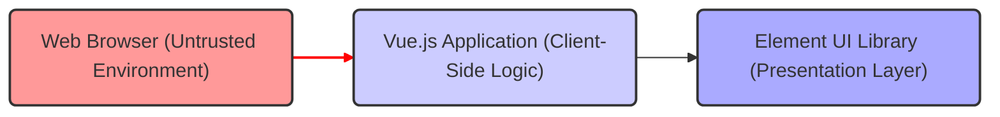
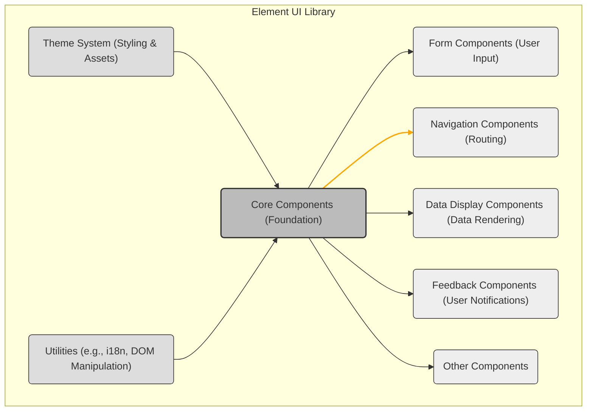

# Project Design Document: Element UI Library (Improved for Threat Modeling)

**Version:** 2.0
**Date:** October 26, 2023
**Author:** AI Software Architect

## 1. Introduction

This document provides an enhanced design overview of the Element UI library (https://github.com/ElemeFE/element), specifically tailored for threat modeling. It builds upon the previous version by explicitly focusing on potential security implications within the library's architecture, data flow, and interactions within a web application context. The goal is to provide a clear understanding of the system's components and their relationships to facilitate the identification of potential vulnerabilities.

## 2. Goals and Objectives

*   Provide a comprehensive architectural overview of the Element UI library with a security-centric lens.
*   Identify key components and their interactions, highlighting potential attack surfaces.
*   Describe the data flow within the library and between the library and the consuming application, emphasizing data handling and potential security risks.
*   Pinpoint potential areas of interest for security analysis and threat modeling, offering concrete examples.
*   Serve as a detailed reference point for understanding the library's structure and behavior from a security perspective.

## 3. System Architecture

### 3.1. High-Level Architecture (Security Focused)

Element UI operates within the client-side web browser, making it susceptible to client-side attacks. Its security is heavily dependent on how the consuming Vue.js application utilizes and integrates its components.

*   **Web Browser (Untrusted Environment):** The execution environment where malicious scripts or user manipulation can occur. This is a primary concern for client-side security.
*   **Vue.js Application (Client-Side Logic):**  Responsible for data fetching, business logic, and handling user interactions. Security vulnerabilities here can directly impact Element UI's behavior.
*   **Element UI Library (Presentation Layer):**  Renders UI components based on data provided by the Vue.js application. It relies on the application to provide safe and sanitized data. The red arrow highlights the untrusted nature of the browser environment.

### 3.2. Component Architecture (Security Considerations)

The modular nature of Element UI means vulnerabilities might be isolated to specific components. Understanding component categories helps focus threat modeling efforts.

*   **Core Components (Foundation):**  Potential vulnerabilities here could have a widespread impact.
*   **Form Components (User Input):**  A primary target for attacks like XSS if input is not properly sanitized by the application *before* being passed to these components. The orange arrow highlights the risk associated with user input.
*   **Navigation Components (Routing):**  Improper handling of navigation parameters could lead to vulnerabilities.
*   **Data Display Components (Data Rendering):**  Rendering unsanitized data from external sources can lead to XSS.
*   **Feedback Components (User Notifications):**  While seemingly benign, improper use could be exploited.
*   **Other Components:**  Each component needs individual security scrutiny.
*   **Theme System (Styling & Assets):**  Loading external stylesheets or assets could introduce risks.
*   **Utilities (e.g., i18n, DOM Manipulation):**  Improper use of DOM manipulation utilities could create vulnerabilities.

## 4. Data Flow (Security Perspective)

Understanding how data flows through Element UI components is crucial for identifying where security measures are needed.

```mermaid
flowchart LR
    A("Untrusted Data Source (e.g., User Input, API)") --> B("Vue.js Application Data (Potential Vulnerabilities)");
    B --> C("Element UI Component Properties (Rendering)");
    C --> D("Component Rendering (HTML, CSS, JS in Browser)");
    D --> E("User Interaction (Events - Potential Manipulation)");
    E --> F("Vue.js Application Event Handlers (Security Checks Required)");
    F --> G("Update Vue.js Application Data (Sanitization Needed)");
    G --> C;
    style A fill:#f99,stroke:#333,stroke-width:2px
    style B fill:#fbb,stroke:#333,stroke-width:2px
    style C fill:#aaf,stroke:#333,stroke-width:2px
    style D fill:#bbf,stroke:#333,stroke-width:2px
    style E fill:#eea,stroke:#333,stroke-width:2px
    style F fill:#ccf,stroke:#333,stroke-width:2px
    style G fill:#fbb,stroke:#333,stroke-width:2px
    linkStyle 0 stroke:red,stroke-width:2px;
    linkStyle 4 stroke:orange,stroke-width:2px;
    linkStyle 6 stroke:orange,stroke-width:2px;
```

*   **Untrusted Data Source (e.g., User Input, API):** Data originating from outside the application's control. The red arrow highlights the inherent risk.
*   **Vue.js Application Data (Potential Vulnerabilities):** Data within the application's state. If not handled carefully, it can become a source of vulnerabilities.
*   **Element UI Component Properties (Rendering):** Data passed to Element UI components. If this data is unsanitized, it can lead to XSS.
*   **Component Rendering (HTML, CSS, JS in Browser):** The actual rendering of the UI. Vulnerabilities here often stem from insecure data being rendered.
*   **User Interaction (Events - Potential Manipulation):** User interactions can be manipulated. Applications should not blindly trust event data. The orange arrow indicates potential manipulation.
*   **Vue.js Application Event Handlers (Security Checks Required):**  Where the application processes user interactions. Crucial point for implementing security checks.
*   **Update Vue.js Application Data (Sanitization Needed):**  Before updating the application state, data should be sanitized to prevent future vulnerabilities. The orange arrow emphasizes the need for sanitization.

## 5. Key Components and Security Interactions

This section details specific component categories and their potential security implications.

*   **Form Components (`el-input`, `el-select`, `el-form`):**
    *   **Security Interaction:** Directly handle user input, making them prime targets for XSS.
    *   **Threats:**  Malicious scripts injected through input fields can be executed in the user's browser.
    *   **Mitigation:** The consuming application *must* sanitize user input before passing it to these components and when processing data submitted through forms.
*   **Navigation Components (`el-menu`, `el-tabs`):**
    *   **Security Interaction:**  Often linked to application routing and state management.
    *   **Threats:**  Manipulation of route parameters or state can lead to unauthorized access or unintended behavior.
    *   **Mitigation:**  Validate route parameters and implement proper authorization checks within the application's routing logic.
*   **Data Display Components (`el-table`, `el-card`):**
    *   **Security Interaction:** Render data received from the application.
    *   **Threats:**  If the application provides unsanitized data (e.g., from an API), these components can render malicious scripts, leading to XSS.
    *   **Mitigation:**  Sanitize data on the server-side or within the application before passing it to these components. Be especially cautious with components that render HTML.
*   **Feedback Components (`el-alert`, `el-message`, `el-dialog`):**
    *   **Security Interaction:** Display messages to the user.
    *   **Threats:**  While less direct, if the application constructs messages using unsanitized user input, these components could be used to display malicious content.
    *   **Mitigation:**  Ensure that messages displayed through these components are constructed using safe and sanitized data.

## 6. Security Considerations (Detailed)

This section expands on potential security vulnerabilities and best practices.

*   **Cross-Site Scripting (XSS):**
    *   **Risk:**  A primary concern when dealing with user-provided data or data from untrusted sources.
    *   **Element UI's Role:**  Components that render dynamic content based on props are potential XSS sinks if the application doesn't sanitize the data.
    *   **Mitigation:**  Strict input validation and output encoding/escaping within the consuming application are crucial.
*   **Dependency Vulnerabilities:**
    *   **Risk:**  Element UI relies on other libraries. Vulnerabilities in these dependencies can indirectly affect applications using Element UI.
    *   **Mitigation:**  Regularly update Element UI and its dependencies. Use tools to scan for known vulnerabilities.
*   **Client-Side Logic and Data Handling:**
    *   **Risk:**  Sensitive data should not be handled or stored solely on the client-side.
    *   **Element UI's Role:**  While Element UI doesn't handle data persistence, its components display data. Ensure the application doesn't expose sensitive information unnecessarily.
    *   **Mitigation:**  Implement proper authentication and authorization mechanisms on the server-side.
*   **Component-Specific Vulnerabilities:**
    *   **Risk:**  Individual components might have undiscovered vulnerabilities.
    *   **Mitigation:**  Stay updated with Element UI releases and security advisories. Follow best practices for using each component.
*   **Theme and Styling:**
    *   **Risk:**  Custom themes or styles could potentially introduce vulnerabilities if they involve loading external resources from untrusted sources.
    *   **Mitigation:**  Carefully review and control any custom themes or styles. Avoid loading external resources without proper verification.
*   **State Management Security:**
    *   **Risk:** If using state management libraries like Vuex, ensure that sensitive data is not inadvertently exposed or manipulated through insecure state updates.
    *   **Element UI's Role:** Element UI components often reflect the application's state. Secure state management practices are essential.
    *   **Mitigation:** Follow secure coding practices for state management, including proper access control and data validation.

## 7. Deployment Considerations (Security Implications)

The deployment method can have security implications.

*   **Installation via Package Managers (npm, yarn):**
    *   **Security Implication:**  Ensure the integrity of the packages downloaded from the registry. Use checksum verification if possible.
*   **Bundling with Application:**
    *   **Security Implication:**  The final bundle size and included code should be reviewed to ensure no unintended or malicious code is included.
*   **CDN Usage:**
    *   **Security Implication:**  Relying on external CDNs introduces a dependency on their security. Use Subresource Integrity (SRI) hashes to ensure the integrity of the loaded files.

## 8. Future Considerations (Security Evolution)

*   **Component Updates and Security Patches:**  Stay informed about Element UI updates and security patches. Regularly update the library to address known vulnerabilities.
*   **Community Security Audits:**  Follow any community efforts to audit Element UI for security vulnerabilities.
*   **Custom Component Security:**  If developing custom components that interact with or extend Element UI, apply the same security considerations.

This enhanced design document provides a more security-focused perspective on the Element UI library. It highlights potential threat vectors and emphasizes the importance of secure coding practices within the consuming Vue.js application to mitigate these risks. This information is crucial for effective threat modeling and building secure web applications.