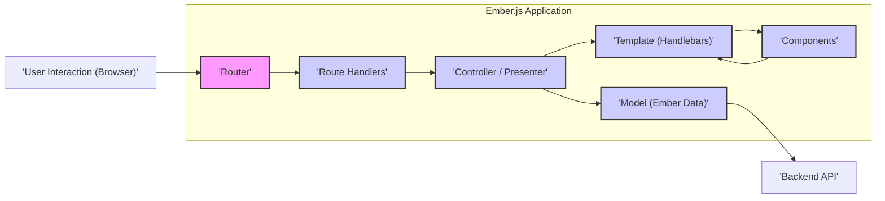
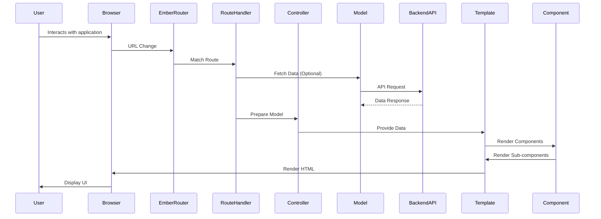

# Project Design Document: Ember.js Framework (Improved)

**Version:** 1.1
**Date:** October 26, 2023
**Author:** AI Software Architect

## 1. Introduction

This document provides an enhanced architectural overview of the Ember.js framework, focusing on aspects relevant to threat modeling. It details key components, their interactions, and potential security considerations. This document serves as a foundation for identifying and mitigating potential security vulnerabilities within Ember.js applications.

## 2. Project Overview

Ember.js is a mature, component-based JavaScript framework for building complex, client-side web applications. Its opinionated nature and established conventions aim to improve developer productivity and application maintainability. The framework's structure and features are designed to handle the demands of ambitious single-page applications.

## 3. Architectural Overview

Ember.js follows a Model-View-Controller (MVC) or, more accurately, a Model-View-Presenter (MVP) pattern, emphasizing a clear separation of concerns. The framework's architecture is centered around reusable components that form the building blocks of the user interface.

### 3.1. Key Architectural Components:

*   **Router:**  The central dispatcher for managing application state and URL transitions. It maps URLs to specific routes, orchestrating the rendering of templates and the loading of necessary data.
*   **Route Handlers:**  JavaScript modules associated with specific routes. They are responsible for fetching and preparing data required for the route's view.
*   **Controllers/Presenters:**  Act as intermediaries between route handlers and templates. They hold application-specific logic, format data for display, and handle user interactions. Modern Ember favors "routable components," often reducing the explicit need for controllers.
*   **Models (Ember Data):**  An optional but commonly used data persistence library. It provides a structured way to interact with backend APIs, handling data fetching, caching, and relationships.
*   **Templates (Handlebars):**  Define the structure and presentation of the user interface using the Handlebars templating language. They dynamically render data provided by controllers or components.
*   **Components:**  Reusable UI elements encapsulating HTML markup, JavaScript logic, and CSS styling. They promote modularity and can communicate with each other through properties and actions.
*   **Services:**  Singleton objects providing application-wide functionality, such as authentication, logging, or shared data management. They can be injected into components, routes, and other services.
*   **Ember CLI (Command-Line Interface):**  A crucial tool for development, providing commands for scaffolding, building, testing, and managing dependencies.
*   **Ember Addons:**  Packages that extend Ember.js functionality, offering reusable components, services, and integrations.
*   **Application Instance:**  The core object managing the lifecycle of the Ember.js application.
*   **Environment Configuration:** Settings that vary based on the deployment environment (e.g., development, testing, production).

### 3.2. High-Level Architecture Diagram:

## 4. Detailed Component Description

### 4.1. Router

*   **Functionality:**  Parses the current URL, matches it against defined routes, and orchestrates the transition to the corresponding application state.
*   **Key Responsibilities:** URL parsing, route matching, managing transitions between routes, handling query parameters and dynamic segments.
*   **Potential Security Considerations:**
    *   **Insecure Route Definitions:**  Overly permissive or poorly defined routes could expose unintended application states or data.
    *   **Route Injection:**  Vulnerabilities in route matching logic could potentially allow attackers to navigate to unauthorized parts of the application.
    *   **Parameter Tampering:**  Improper handling of URL parameters could lead to manipulation of application behavior.

### 4.2. Route Handlers

*   **Functionality:**  JavaScript classes associated with specific routes, responsible for fetching data required for the route and preparing it for the view.
*   **Key Responsibilities:**  Fetching data from backend APIs or other data sources, preparing the model for the template, setting up the controller or presenter.
*   **Potential Security Considerations:**
    *   **Insecure Data Fetching:**  Vulnerabilities in data fetching logic could lead to injection attacks (e.g., SQL injection if directly querying a database, though less common in frontend).
    *   **Exposure of Sensitive Data:**  Improper handling or logging of fetched data could expose sensitive information.
    *   **Authorization Bypass:**  Lack of proper authorization checks before fetching data could allow unauthorized access.

### 4.3. Controller/Presenter

*   **Functionality:**  Acts as an intermediary between the route handler and the template, holding application-specific logic and properties used by the template. Modern Ember often uses routable components, reducing the need for explicit controllers.
*   **Key Responsibilities:**  Handling user interactions from the template, formatting data for display, managing component state, implementing business logic specific to the view.
*   **Potential Security Considerations:**
    *   **Logic Flaws:**  Vulnerabilities in controller logic could lead to unintended application behavior or security breaches.
    *   **Data Manipulation:**  Improper handling of user input within controllers could allow manipulation of data.
    *   **State Management Issues:**  Insecure state management could lead to inconsistent or vulnerable application states.

### 4.4. Model (Ember Data)

*   **Functionality:**  Provides an abstraction layer for interacting with backend data sources, handling data fetching, caching, and relationships between data models.
*   **Key Responsibilities:**  Defining data schemas, making API requests, managing local data state, handling data transformations and relationships.
*   **Potential Security Considerations:**
    *   **Backend API Vulnerabilities:**  Ember Data's security is heavily reliant on the security of the backend APIs it interacts with.
    *   **Data Exposure:**  Improperly configured models or serializers could expose more data than intended.
    *   **Mass Assignment Vulnerabilities:**  Careless handling of data updates could lead to unintended modification of model attributes.

### 4.5. Template (Handlebars)

*   **Functionality:**  Defines the HTML structure of the user interface and uses Handlebars syntax to dynamically render data provided by controllers or components.
*   **Key Responsibilities:**  Displaying data, handling user events through actions, rendering components and dynamic content.
*   **Potential Security Considerations:**
    *   **Cross-Site Scripting (XSS):**  The primary security concern. If user-provided data is not properly escaped before being rendered, it can lead to XSS vulnerabilities.
    *   **HTML Injection:**  Improper handling of user input could allow attackers to inject arbitrary HTML.

### 4.6. Components

*   **Functionality:**  Reusable UI elements encapsulating markup, logic, and styling. They promote modularity and code reuse.
*   **Key Responsibilities:**  Rendering UI elements, handling user interactions within the component, managing internal component state, communicating with parent components through actions and properties.
*   **Potential Security Considerations:**
    *   **XSS within Components:**  Similar to templates, components need to properly escape user-provided data to prevent XSS.
    *   **Insecure Component Logic:**  Vulnerabilities in component logic could lead to security issues.
    *   **Third-Party Component Risks:**  Using unvetted or outdated third-party components can introduce security vulnerabilities.
    *   **Property and Action Handling:**  Improperly handling data passed through properties or actions could lead to vulnerabilities.

### 4.7. Services

*   **Functionality:**  Singleton objects providing application-wide functionality, such as authentication, logging, or shared data management.
*   **Key Responsibilities:**  Encapsulating reusable logic, managing shared state, interacting with external services, providing utility functions.
*   **Potential Security Considerations:**
    *   **Exposure of Sensitive Information:**  Services handling sensitive data (e.g., authentication tokens) need to be implemented securely.
    *   **Authorization Flaws:**  Improperly implemented authorization logic within services could lead to unauthorized access.
    *   **Cross-Service Communication:**  Security considerations when services communicate with each other.

### 4.8. Ember CLI

*   **Functionality:**  Provides commands for generating code, running tests, building the application, and managing dependencies.
*   **Key Responsibilities:**  Development workflow automation, project scaffolding, dependency management, building and deploying the application.
*   **Potential Security Considerations:**
    *   **Dependency Vulnerabilities:**  Outdated or vulnerable dependencies managed by Ember CLI can introduce security risks.
    *   **Build Process Security:**  Compromised build processes could lead to the injection of malicious code into the application.
    *   **Secrets Management:**  Securely managing API keys and other secrets during the build and deployment process.

### 4.9. Ember Addons

*   **Functionality:**  Extend the core functionality of Ember.js by providing reusable components, services, and other features.
*   **Key Responsibilities:**  Adding new features, providing integrations with other libraries and services, enhancing developer productivity.
*   **Potential Security Considerations:**
    *   **Vulnerable Addons:**  Addons can introduce security vulnerabilities if they are not well-maintained or contain malicious code.
    *   **Supply Chain Attacks:**  Compromised addons could be used to inject malicious code into applications.
    *   **Compatibility Issues:**  Using incompatible addons could lead to unexpected behavior and potential security risks.

## 5. Data Flow

The typical data flow in an Ember.js application involves the following steps, highlighting potential security considerations at each stage:

1. **User Interaction:** The user interacts with the application through the browser (e.g., clicking a link, submitting a form).
    *   **Potential Threat:**  Malicious input from the user.
2. **Router Activation:** The browser's URL changes, triggering the Ember.js Router.
    *   **Potential Threat:**  Manipulation of the URL to access unauthorized routes.
3. **Route Matching:** The Router matches the URL to a defined route.
    *   **Potential Threat:**  Exploiting vulnerabilities in route matching logic.
4. **Route Handler Invocation:** The corresponding route handler is invoked.
    *   **Potential Threat:**  Unauthorized access to route handlers.
5. **Data Fetching (Optional):** The route handler may fetch data from a backend API using Ember Data or other mechanisms.
    *   **Potential Threat:**  Man-in-the-middle attacks, insecure API endpoints, injection vulnerabilities in data fetching logic.
6. **Model Preparation:** The route handler prepares the data (model) for the template.
    *   **Potential Threat:**  Exposure of sensitive data during preparation.
7. **Controller/Presenter Setup:** The route handler sets up the controller/presenter with the prepared model.
    *   **Potential Threat:**  Manipulation of the model before it reaches the template.
8. **Template Rendering:** The appropriate template is rendered using the data from the controller/presenter.
    *   **Potential Threat:**  XSS vulnerabilities if data is not properly escaped.
9. **Component Rendering:** Components within the template are rendered, potentially fetching their own data or receiving data from parent components.
    *   **Potential Threat:**  XSS vulnerabilities within components, insecure component logic.
10. **User Interface Update:** The browser updates the user interface based on the rendered HTML.

## 6. User Interaction Points

Users interact with Ember.js applications primarily through the browser. Key interaction points that represent potential attack vectors include:

*   **Navigation:**  Manipulating URLs to access different parts of the application.
*   **Form Submission:**  Injecting malicious scripts or data through form fields.
*   **Button Clicks:**  Triggering actions that might have unintended consequences if not properly secured.
*   **Data Input:**  Providing input that could exploit vulnerabilities in data validation or sanitization.
*   **Component Interactions:**  Interacting with custom components in ways that might expose vulnerabilities in their logic.

## 7. Deployment Model

The deployment model can influence the security posture of an Ember.js application. Common deployment strategies and their security implications include:

*   **Static Site Hosting (e.g., Netlify, Vercel, AWS S3):**  Generally secure for serving static assets, but security relies on the platform's infrastructure and proper configuration.
*   **Backend Integration:**  Security depends on the security of both the Ember.js frontend and the backend API. Secure communication (HTTPS) and proper authentication/authorization are crucial.
*   **Containerization (Docker):**  Provides isolation but requires secure container image management and configuration.

## 8. Security Considerations

Building secure Ember.js applications requires attention to various security principles and best practices:

*   **Cross-Site Scripting (XSS) Prevention:**
    *   Utilize Ember's built-in HTML escaping mechanisms in templates.
    *   Be cautious when rendering user-provided content directly.
    *   Implement Content Security Policy (CSP) headers.
*   **Cross-Site Request Forgery (CSRF) Protection:**
    *   Implement CSRF tokens on the backend and ensure the frontend includes them in requests that modify data.
*   **Authentication and Authorization:**
    *   Use secure authentication mechanisms (e.g., OAuth 2.0, OpenID Connect).
    *   Implement proper authorization checks on both the frontend and backend.
    *   Securely store authentication tokens (e.g., using HttpOnly and Secure cookies).
*   **Data Validation and Sanitization:**
    *   Validate user input on both the frontend and backend.
    *   Sanitize user input to prevent injection attacks.
*   **Dependency Management:**
    *   Keep dependencies up-to-date to patch known security vulnerabilities.
    *   Regularly audit dependencies for security risks.
*   **Secure API Communication:**
    *   Use HTTPS for all communication with backend APIs.
    *   Implement proper API authentication and authorization.
*   **Third-Party Addon Security:**
    *   Carefully vet and select third-party addons.
    *   Keep addons updated.
*   **Input Sanitization:**
    *   Sanitize user input to prevent injection attacks.
*   **Regular Security Audits and Penetration Testing:**
    *   Conduct regular security assessments to identify potential vulnerabilities.

## 9. Conclusion

This enhanced design document provides a more detailed architectural overview of Ember.js, specifically tailored for threat modeling. By understanding the framework's components, data flow, and potential security considerations, developers and security professionals can effectively identify and mitigate potential vulnerabilities in Ember.js applications. The next step involves a detailed threat modeling exercise, leveraging this document to systematically analyze potential threats and design appropriate security controls.
