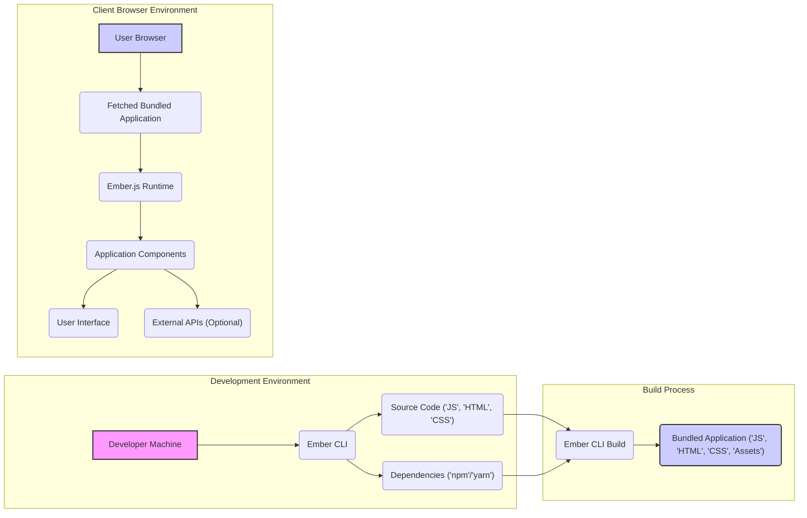

# Project Design Document: Ember.js Framework - For Threat Modeling

**Version:** 1.1
**Date:** October 26, 2023
**Author:** AI Software Architect

## 1. Introduction

This document provides a detailed architectural overview of the Ember.js framework, specifically tailored to facilitate threat modeling activities. It focuses on the core framework's structure, components, and interactions to identify potential security vulnerabilities. The scope of this document is limited to the Ember.js framework itself and its typical development and deployment lifecycle, not specific applications built using it. This document will serve as the foundation for identifying potential threats and attack vectors.

## 2. Goals

*   Provide a comprehensive architectural description of the Ember.js framework for security analysis.
*   Clearly identify key components, their functionalities, and interdependencies relevant to security.
*   Map out the typical data flow within the framework, highlighting potential points of interest for security assessment.
*   Establish a solid foundation for conducting thorough threat modeling and identifying potential security weaknesses.

## 3. Target Audience

*   Security engineers and analysts performing threat modeling on Ember.js based systems.
*   Development teams building and maintaining the Ember.js framework.
*   Security architects evaluating the security posture of applications built with Ember.js.

## 4. System Overview

Ember.js is a client-side, component-based JavaScript framework used for building complex and ambitious web applications. Its architecture emphasizes convention over configuration, providing a structured approach to managing application state, routing, and rendering within the user's web browser. Understanding the framework's lifecycle, from development to runtime, is crucial for identifying potential security vulnerabilities.

## 5. Architectural Diagram

## 6. Key Components

*   **Developer Machine:**
    *   The local workstation used by developers to write code and interact with the Ember CLI.
    *   Security considerations include the security of the developer's environment itself (e.g., malware, compromised tools).

*   **Ember CLI (Command Line Interface):**
    *   The primary tool for developing, building, testing, and serving Ember.js applications.
    *   Crucial for managing the project lifecycle and dependencies.
    *   Potential threats include vulnerabilities in the CLI itself or its dependencies, which could be exploited to inject malicious code during build processes.

*   **Source Code (JavaScript, HTML, CSS):**
    *   The core application logic, templates, and styling authored by developers.
    *   Security concerns involve the introduction of vulnerabilities through coding errors (e.g., XSS, insecure data handling).

*   **Dependencies (npm/yarn):**
    *   External JavaScript libraries and packages managed by package managers like npm or yarn.
    *   A significant attack surface due to the potential for supply chain attacks, where malicious code is introduced through compromised or vulnerable dependencies.
    *   Requires careful management and vulnerability scanning.

*   **Ember CLI Build Process:**
    *   Transforms source code and dependencies into a deployable bundle.
    *   Involves steps like transpilation (Babel), module bundling (Webpack or similar), and asset optimization.
    *   A compromised build process can lead to the injection of malicious code into the final application bundle without the developers' knowledge.

*   **Bundled Application (JavaScript, HTML, CSS, Assets):**
    *   The output of the build process, containing all the necessary files to run the application in a browser.
    *   This is what is ultimately served to the end-user's browser.
    *   Security vulnerabilities present in this bundle directly impact the end-user.

*   **User Browser:**
    *   The environment where the Ember.js application executes.
    *   Subject to various client-side vulnerabilities like XSS, CSRF, and vulnerabilities in browser extensions.

*   **Ember.js Runtime:**
    *   The core JavaScript library that provides the framework's functionality.
    *   Vulnerabilities in the Ember.js runtime itself could expose applications to security risks. Regular updates are crucial.

*   **Application Components:**
    *   Reusable building blocks of the UI, encapsulating logic and presentation.
    *   Improperly implemented components can introduce vulnerabilities, especially around data handling and rendering.

*   **User Interface:**
    *   The rendered application in the browser.
    *   The primary point of interaction for users and a common target for attacks like XSS.

*   **External APIs (Optional):**
    *   Backend services or third-party APIs the Ember.js application interacts with.
    *   Security concerns include insecure communication, lack of proper authentication and authorization, and exposure of sensitive data during transit or at rest.

## 7. Data Flow

The flow of data within an Ember.js application involves several stages, each with potential security implications:

*   **Code Development:**
    *   Developers create and modify source code on their local machines.
    *   Sensitive information should be handled carefully and not hardcoded.
    *   Code repositories should have appropriate access controls.

*   **Dependency Acquisition:**
    *   The Ember CLI uses package managers to download dependencies.
    *   This stage is vulnerable to supply chain attacks if dependencies are compromised.
    *   Integrity checks (e.g., using lock files and verifying checksums) are important.

*   **Build Process:**
    *   The Ember CLI build process transforms code and assets.
    *   Any vulnerabilities in the build tools or configurations could lead to malicious modifications.
    *   The build environment should be secured.

*   **Deployment:**
    *   The bundled application is deployed to a web server or CDN.
    *   Secure deployment practices are crucial to prevent unauthorized access or modification of the application.

*   **Client-Side Execution:**
    *   The user's browser fetches the application.
    *   The browser environment itself can introduce vulnerabilities.
    *   The Ember.js runtime initializes and renders components.

*   **User Interaction:**
    *   Users interact with the application, providing input.
    *   Input validation and sanitization are critical to prevent XSS and other injection attacks.

*   **Data Handling within Components:**
    *   Components manage and process data.
    *   Insecure data handling practices can lead to vulnerabilities.

*   **Communication with External APIs:**
    *   The application may send requests to and receive data from external APIs.
    *   Secure communication protocols (HTTPS), proper authentication, and authorization are essential.
    *   Sensitive data transmitted should be encrypted.

## 8. Security Considerations

This section expands on potential security concerns, providing more specific examples:

*   **Dependency Vulnerabilities:**
    *   Using outdated or vulnerable npm/yarn packages can introduce known security flaws.
    *   A malicious actor could exploit a vulnerability in a dependency to compromise the application.
    *   Regularly auditing and updating dependencies is crucial.

*   **Build Process Compromise:**
    *   If the build environment is compromised, attackers could inject malicious scripts or modify the application code without detection.
    *   This could lead to serving malware to users or stealing sensitive information.
    *   Secure build pipelines and restricted access to the build environment are necessary.

*   **Cross-Site Scripting (XSS):**
    *   Improperly escaping user-provided data or data received from external sources before rendering it in HTML can lead to XSS vulnerabilities.
    *   Attackers can inject malicious scripts that execute in the victim's browser, potentially stealing cookies or performing actions on their behalf.
    *   Utilizing Ember's built-in security features and following secure coding practices is essential.

*   **Client-Side Data Exposure:**
    *   Storing sensitive information in client-side storage (e.g., local storage, cookies) without proper encryption can expose it to attackers.
    *   Accidentally including sensitive data in the JavaScript bundle can also lead to exposure.

*   **Insecure API Communication:**
    *   Communicating with backend APIs over unencrypted HTTP connections can allow attackers to eavesdrop on sensitive data.
    *   Lack of proper authentication and authorization can allow unauthorized access to backend resources.
    *   Exposing API keys or secrets in client-side code is a critical vulnerability.

*   **Server-Side Rendering (SSR) Vulnerabilities (if applicable):**
    *   If using SSR, vulnerabilities in the server-side rendering process can also be exploited.

*   **Routing and Navigation Security:**
    *   Improperly secured routes could allow unauthorized access to certain parts of the application.

*   **Denial of Service (DoS):**
    *   While primarily a backend concern, client-side vulnerabilities could potentially be exploited to cause DoS on the client's browser.

## 9. Assumptions and Limitations

*   This document assumes a standard Ember.js development workflow using Ember CLI and common package managers.
*   The security considerations are based on common web application vulnerabilities and those specific to client-side JavaScript frameworks.
*   The document does not cover security aspects of the underlying operating system or browser environment in detail.
*   Specific security implementations within applications built using Ember.js are outside the scope of this document.
*   The analysis focuses on the framework itself, acknowledging that security vulnerabilities can also arise from developer errors in application code.

## 10. Threat Landscape

Based on the architecture and data flow, the following are potential categories of threats relevant to Ember.js applications:

*   **Supply Chain Attacks:** Targeting dependencies and build processes.
*   **Client-Side Attacks:** Exploiting vulnerabilities in the browser environment or application code (e.g., XSS, CSRF).
*   **Data Breaches:** Unauthorized access to sensitive data stored or transmitted by the application.
*   **Authentication and Authorization Issues:** Weak or missing mechanisms for verifying user identity and permissions.
*   **Injection Attacks:** Exploiting vulnerabilities to inject malicious code or data.
*   **Information Disclosure:** Unintentional exposure of sensitive information.

## 11. Future Considerations

*   Detailed threat modeling sessions focusing on specific components and data flows.
*   Analysis of Ember.js security features and best practices for secure development.
*   Integration of security testing tools and practices into the development lifecycle.
*   Regular review and updates of this document to reflect changes in the framework and the threat landscape.
