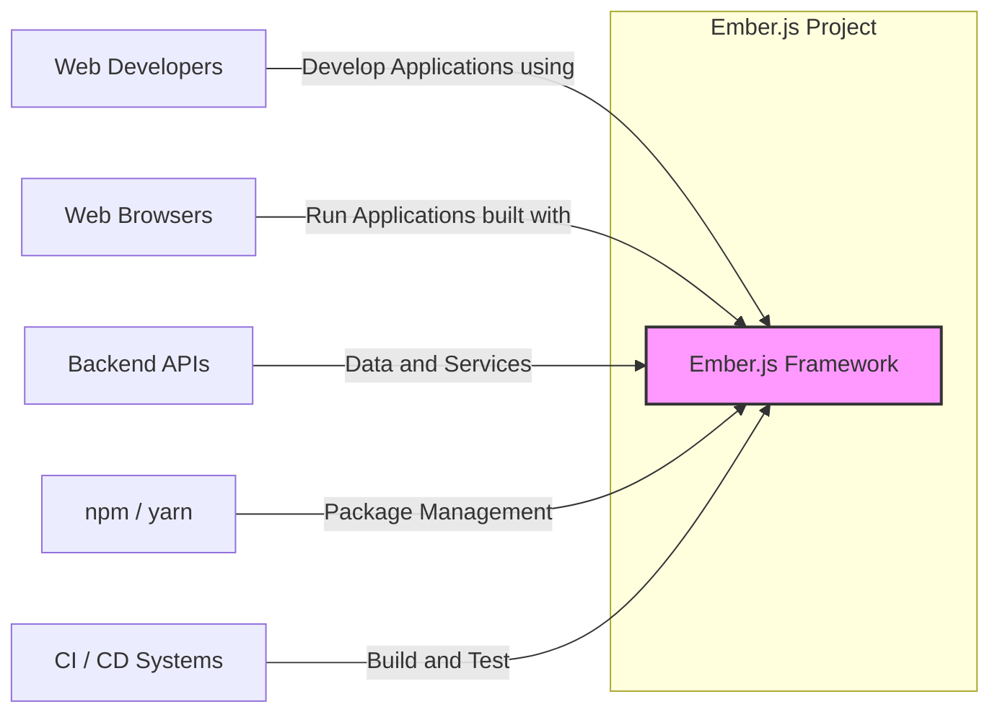
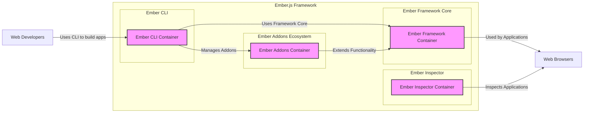
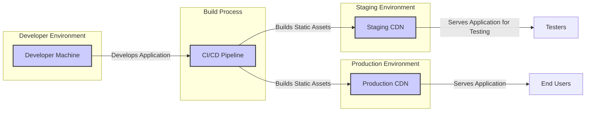

# BUSINESS POSTURE

- Business Priorities and Goals:
  - Provide a stable, productive, and performant JavaScript framework for building ambitious web applications.
  - Foster a vibrant and supportive community of developers around the framework.
  - Ensure the long-term maintainability and evolution of the framework.
  - Promote best practices in web application development.
- Business Risks:
  - Security vulnerabilities in the framework could negatively impact applications built with Ember.js and damage the framework's reputation.
  - Lack of community support or contributions could hinder the framework's growth and maintenance.
  - Breaking changes or instability could discourage adoption and developer satisfaction.
  - Competition from other JavaScript frameworks could reduce Ember.js's market share.

# SECURITY POSTURE

- Existing Security Controls:
  - security control: Code reviews by core team members and community contributors (described in project contribution guidelines).
  - security control: Public issue tracker for reporting bugs and vulnerabilities (GitHub issues).
  - security control: Reliance on community security researchers for vulnerability discovery.
  - security control: Regular updates and releases to address reported issues (release cycle documentation).
- Accepted Risks:
  - accepted risk: Potential for undiscovered vulnerabilities due to the complexity of the framework and reliance on community contributions.
  - accepted risk:  Dependency on third-party libraries (npm packages) which may introduce vulnerabilities.
  - accepted risk:  Security of applications built with Ember.js is ultimately the responsibility of the application developers.
- Recommended Security Controls:
  - security control: Implement automated security scanning (SAST/DAST) in the CI/CD pipeline for the framework itself.
  - security control: Establish a formal vulnerability disclosure and response process with a dedicated security team or point of contact.
  - security control:  Conduct periodic security audits by external security experts.
  - security control:  Improve dependency management practices, including vulnerability scanning of dependencies and dependency pinning.
  - security control:  Provide security guidelines and best practices for developers building applications with Ember.js in the official documentation.
- Security Requirements:
  - Authentication:
    - Ember.js itself does not handle backend authentication. Applications built with Ember.js will need to implement authentication mechanisms, typically interacting with backend APIs. Security requirements for authentication should be considered in the context of applications built with Ember.js, not the framework itself.
  - Authorization:
    - Ember.js provides mechanisms for client-side routing and component rendering, which can be used to implement client-side authorization within applications.  Applications should enforce authorization logic both on the client-side (for user interface control) and server-side (for API access control).
  - Input Validation:
    - Ember.js applications need to perform input validation to prevent vulnerabilities like Cross-Site Scripting (XSS) and injection attacks. Input validation should be implemented in application code, especially when handling user input and data from external sources.
  - Cryptography:
    - Ember.js itself does not provide built-in cryptographic functions. If applications require cryptography, they should use standard JavaScript cryptography libraries. Secure key management and proper implementation of cryptographic algorithms are crucial security requirements for applications using cryptography.

# DESIGN

## C4 CONTEXT

- Context Diagram Elements:
  - - Name: Ember.js Framework
    - Type: Software System
    - Description: The Ember.js JavaScript framework itself, including the core library, CLI tools, and associated documentation.
    - Responsibilities: Provides a framework for building client-side web applications, including routing, component management, data handling, and build tooling.
    - Security controls: Code reviews, community contributions, public issue tracker, release process.
  - - Name: Web Developers
    - Type: Person
    - Description: Developers who use Ember.js to build web applications.
    - Responsibilities: Develop, test, and deploy web applications using Ember.js. Report bugs and contribute to the framework.
    - Security controls: Secure development practices, input validation in applications, secure authentication and authorization in applications.
  - - Name: Web Browsers
    - Type: Software System
    - Description: Web browsers (Chrome, Firefox, Safari, Edge, etc.) used by end-users to access applications built with Ember.js.
    - Responsibilities: Execute JavaScript code, render web pages, and interact with web applications.
    - Security controls: Browser security features (Content Security Policy, Same-Origin Policy, etc.), browser updates and patches.
  - - Name: Backend APIs
    - Type: Software System
    - Description: Backend servers and APIs that provide data and services to Ember.js applications.
    - Responsibilities: Store and manage data, provide business logic, handle authentication and authorization for application data.
    - Security controls: API security (authentication, authorization, input validation, rate limiting), server security, database security.
  - - Name: npm / yarn
    - Type: Software System
    - Description: Package managers used to install and manage JavaScript dependencies for Ember.js projects and applications.
    - Responsibilities: Provide access to JavaScript libraries and tools, manage project dependencies.
    - Security controls: Dependency vulnerability scanning, using trusted package registries, verifying package integrity.
  - - Name: CI / CD Systems
    - Type: Software System
    - Description: Continuous Integration and Continuous Delivery systems used to build, test, and deploy Ember.js applications and potentially the framework itself.
    - Responsibilities: Automate build, test, and deployment processes, perform automated security checks.
    - Security controls: Secure CI/CD pipeline configuration, access control to CI/CD systems, security scanning in CI/CD.

## C4 CONTAINER

- Container Diagram Elements:
  - - Name: Ember CLI Container
    - Type: Application
    - Description: Command-line interface tool for creating, building, testing, and serving Ember.js applications and managing addons.
    - Responsibilities: Project scaffolding, build process orchestration, development server, addon management.
    - Security controls: Input validation for CLI commands, secure handling of project configuration, dependency management.
  - - Name: Ember Framework Container
    - Type: Library
    - Description: Core JavaScript library providing the fundamental building blocks of the Ember.js framework, including routing, components, data management, and rendering engine.
    - Responsibilities: Provides the core framework functionality used by Ember.js applications.
    - Security controls: Code reviews, automated testing, vulnerability scanning, secure coding practices.
  - - Name: Ember Addons Container
    - Type: Ecosystem
    - Description: Collection of community-developed packages (addons) that extend the functionality of Ember.js applications.
    - Responsibilities: Provides reusable components, libraries, and tools for Ember.js developers.
    - Security controls: Community review of addons, dependency scanning of addons, developer responsibility for addon security.
  - - Name: Ember Inspector Container
    - Type: Browser Extension
    - Description: Browser extension for debugging and inspecting Ember.js applications in development.
    - Responsibilities: Provides developer tools for inspecting application state, components, routes, and performance.
    - Security controls: Browser extension security model, minimizing extension permissions, secure communication with inspected applications (development environment only).

## DEPLOYMENT

- Deployment Options:
  - Static Website Hosting (e.g., Netlify, Vercel, AWS S3, GitHub Pages): Ember.js applications are typically built into static assets (HTML, CSS, JavaScript) and can be deployed to static website hosting platforms or CDNs.
  - Web Servers (e.g., Nginx, Apache): Static assets can be served from traditional web servers.
  - Server-Side Rendering (SSR) (with Node.js): For improved SEO and performance, Ember.js applications can be rendered on the server-side using Node.js before being sent to the browser. This adds a Node.js server component to the deployment.

- Detailed Deployment (Static Website Hosting):

- Deployment Diagram Elements (Static Website Hosting):
  - - Name: Developer Machine
    - Type: Infrastructure
    - Description: Developer's local computer used for writing code, running development server, and building the application.
    - Responsibilities: Code development, local testing, building application artifacts.
    - Security controls: Developer machine security (OS hardening, antivirus, firewall), code repository access control.
  - - Name: CI/CD Pipeline
    - Type: Infrastructure
    - Description: Automated CI/CD system (e.g., GitHub Actions, Jenkins) that builds, tests, and deploys the Ember.js application.
    - Responsibilities: Automated build process, running tests, deploying to staging and production CDNs.
    - Security controls: Secure CI/CD pipeline configuration, access control to CI/CD system, secrets management, security scanning in CI/CD.
  - - Name: Staging CDN
    - Type: Infrastructure
    - Description: Content Delivery Network (CDN) used to host static assets for the staging environment.
    - Responsibilities: Serve static application assets for testing and pre-production validation.
    - Security controls: CDN security features (DDoS protection, access control, HTTPS), secure CDN configuration.
  - - Name: Production CDN
    - Type: Infrastructure
    - Description: Content Delivery Network (CDN) used to host static assets for the production environment.
    - Responsibilities: Serve static application assets to end-users with high availability and performance.
    - Security controls: CDN security features (DDoS protection, access control, HTTPS), secure CDN configuration.
  - - Name: End Users
    - Type: Person
    - Description: Users accessing the Ember.js application through web browsers.
    - Responsibilities: Use the application to interact with its features and data.
    - Security controls: Browser security features, user awareness of phishing and social engineering attacks.
  - - Name: Testers
    - Type: Person
    - Description: Quality assurance and testing personnel who validate the application in the staging environment.
    - Responsibilities: Test application functionality, performance, and security in the staging environment.
    - Security controls: Access control to staging environment, secure testing practices.

## BUILD

```mermaid
flowchart LR
    A["Developer"] --> B["Code Repository (GitHub)"]
    B --> C["CI/CD System (GitHub Actions)"]
    C --> D["Dependency Management (npm/yarn)"]
    D --> E["Build Tools (Ember CLI)"]
    E --> F["Linters & SAST"]
    F --> G["Unit & Integration Tests"]
    G --> H["Build Artifacts (Static Assets)"]
    H --> I["Package Registry / CDN"]
    style A fill:#ccf,stroke:#333,stroke-width:2px
    style B fill:#ccf,stroke:#333,stroke-width:2px
    style C fill:#ccf,stroke:#333,stroke-width:2px
    style D fill:#ccf,stroke:#333,stroke-width:2px
    style E fill:#ccf,stroke:#333,stroke-width:2px
    style F fill:#ccf,stroke:#333,stroke-width:2px
    style G fill:#ccf,stroke:#333,stroke-width:2px
    style H fill:#ccf,stroke:#333,stroke-width:2px
    style I fill:#ccf,stroke:#333,stroke-width:2px
```

- Build Process Description:
  - Developer writes code and commits changes to a code repository (e.g., GitHub).
  - CI/CD system (e.g., GitHub Actions) is triggered by code changes.
  - CI/CD system fetches dependencies using a package manager (npm or yarn).
  - Build tools (Ember CLI) are used to compile and build the Ember.js application.
  - Linters and SAST (Static Application Security Testing) tools are run to identify code quality issues and potential security vulnerabilities.
  - Unit and integration tests are executed to ensure code functionality and stability.
  - Build artifacts (static assets like HTML, CSS, JavaScript files) are generated.
  - Build artifacts are published to a package registry or CDN for deployment.

- Build Process Security Controls:
  - security control: Secure code repository (access control, branch protection).
  - security control: Secure CI/CD pipeline configuration (least privilege, secrets management).
  - security control: Dependency vulnerability scanning during build process.
  - security control: Use of linters and SAST tools to identify and remediate code quality and security issues.
  - security control: Automated unit and integration testing to ensure code reliability and catch regressions.
  - security control: Code signing or artifact signing to ensure integrity of build artifacts.
  - security control: Access control to package registry/CDN to prevent unauthorized modifications.

# RISK ASSESSMENT

- Critical Business Processes:
  - Maintaining the stability, security, and usability of the Ember.js framework.
  - Ensuring the continued adoption and growth of the Ember.js ecosystem.
  - Providing a reliable platform for developers to build and deploy web applications.
- Data to Protect:
  - Ember.js source code (intellectual property, integrity).
  - Ember.js releases and build artifacts (integrity, availability).
  - Community contributions and issue reports (integrity, availability).
- Data Sensitivity:
  - Ember.js source code: High sensitivity (publicly available but integrity is critical).
  - Ember.js releases and build artifacts: High sensitivity (integrity and availability are critical for users).
  - Community contributions and issue reports: Medium sensitivity (publicly accessible, but integrity and availability are important for community engagement).

# QUESTIONS & ASSUMPTIONS

- Questions:
  - What is the formal vulnerability disclosure process for the Ember.js project?
  - Are there regular security audits conducted on the Ember.js framework?
  - What SAST/DAST tools are currently used (if any) in the Ember.js CI/CD pipeline?
  - Are there specific security guidelines provided to developers building applications with Ember.js?
- Assumptions:
  - Ember.js project follows standard open-source development practices, including code reviews and community contributions.
  - Ember.js applications are typically deployed as static assets to CDNs or web servers.
  - Security of applications built with Ember.js is primarily the responsibility of the application developers.
  - The Ember.js project values security and actively works to address reported vulnerabilities.