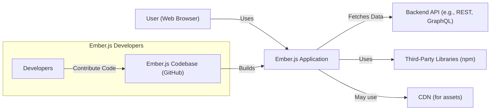
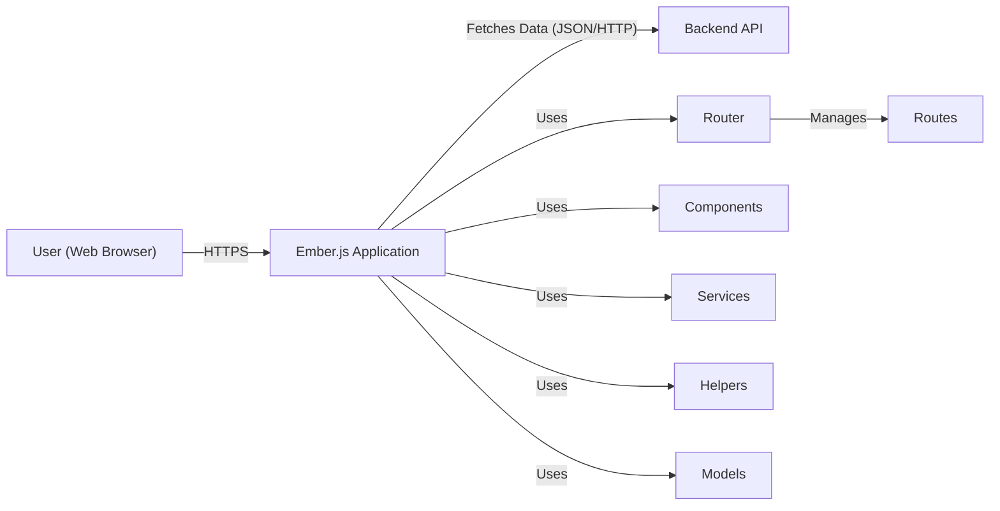
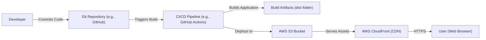
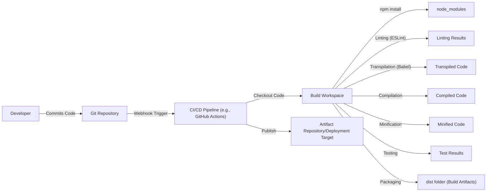

Okay, let's create a design document for the Ember.js project, focusing on aspects relevant for threat modeling.

# BUSINESS POSTURE

Ember.js is a mature, open-source JavaScript framework for building ambitious web applications.  Its primary business goals revolve around:

*   Developer Productivity:  Ember.js aims to increase developer productivity by providing a comprehensive set of tools and conventions, allowing developers to focus on building features rather than making architectural decisions.
*   Application Stability and Maintainability:  Ember.js emphasizes convention-over-configuration and a strong commitment to backwards compatibility, leading to applications that are easier to maintain and upgrade over time.
*   Community Growth and Adoption:  The project's success depends on a vibrant and active community.  Attracting new users and retaining existing ones is crucial.
*   Performance: Ember applications should be performant, providing a good user experience.

Based on these priorities, the most important business risks are:

*   Security Vulnerabilities:  Vulnerabilities in the framework itself could be exploited to compromise applications built with Ember.js, leading to data breaches, reputational damage, and loss of user trust. This is the highest priority risk.
*   Supply Chain Attacks: Compromise of dependencies used by Ember.js or its build process could introduce malicious code into the framework.
*   Loss of Community Trust:  Poor handling of security issues, breaking changes, or a decline in community engagement could lead to developers abandoning the framework.
*   Performance Degradation: Significant performance regressions could make Ember.js less attractive compared to competing frameworks.
*   Inability to Adapt: Failure to keep up with evolving web standards and browser capabilities could render the framework obsolete.

# SECURITY POSTURE

Ember.js has a well-defined security policy and a history of addressing vulnerabilities responsibly.

Existing security controls:

*   security control: Security Policy:  Ember.js has a documented security policy (likely in the SECURITY.md file in the repository or on their website) that outlines how to report vulnerabilities and how the team handles them.
*   security control: Regular Releases:  The project follows a regular release cycle, including security releases when necessary. This is evident from the release history on GitHub.
*   security control: Dependency Management:  Ember.js uses package managers (like npm or yarn) to manage dependencies, allowing for updates to address vulnerabilities in third-party libraries.
*   security control: Testing:  The project has an extensive test suite, which helps to identify and prevent regressions, including potential security issues.
*   security control: Code Reviews:  All changes to the codebase undergo code review, providing an opportunity to catch security flaws before they are merged.
*   security control: Community Scrutiny:  As an open-source project, Ember.js benefits from scrutiny by a large community of developers, who can identify and report potential issues.
*   security control: Content Security Policy (CSP) Guidance: Ember.js provides guidance and tools to help developers implement CSP, mitigating XSS risks.
*   security control: Route-based Security: Ember's router provides mechanisms for controlling access to different parts of an application.

Accepted risks:

*   accepted risk: Third-Party Dependency Vulnerabilities: While Ember.js manages dependencies, there's always a risk that a vulnerability in a third-party library could affect Ember.js applications. This is a common risk in all software development.
*   accepted risk: User-Implemented Vulnerabilities:  Ember.js can't prevent developers from introducing security vulnerabilities in their own application code. This is mitigated by providing secure defaults and guidance.
*   accepted risk: Emerging Web Platform Vulnerabilities: New browser vulnerabilities or web platform issues could arise that affect Ember.js applications, requiring updates to the framework or application code.

Recommended security controls:

*   security control: Static Application Security Testing (SAST): Integrate SAST tools into the build process to automatically scan for potential vulnerabilities in the Ember.js codebase.
*   security control: Software Composition Analysis (SCA): Use SCA tools to track dependencies and identify known vulnerabilities in third-party libraries.
*   security control: Dynamic Application Security Testing (DAST): While more applicable to applications built *with* Ember, consider DAST for the Ember.js website and any demo applications.
*   security control: Fuzz Testing: Implement fuzz testing to identify unexpected input handling issues that could lead to vulnerabilities.

Security Requirements:

*   Authentication: Ember.js itself doesn't handle authentication directly. It's the responsibility of the application developer to implement authentication mechanisms. However, Ember.js should provide clear guidance and best practices for integrating with authentication systems.
*   Authorization: Ember.js provides route-based authorization mechanisms.  These should be clearly documented and easy to use securely.  The framework should encourage secure-by-default patterns.
*   Input Validation: Ember.js should provide mechanisms for validating user input, both on the client-side (for immediate feedback) and the server-side (for security).  This includes escaping output to prevent XSS vulnerabilities.
*   Cryptography: Ember.js should provide guidance on using appropriate cryptographic libraries and techniques for tasks such as password hashing, data encryption, and secure communication. It should not attempt to implement its own cryptographic primitives.

# DESIGN

## C4 CONTEXT

C4 CONTEXT Element Descriptions:

*   Element:
    *   Name: User (Web Browser)
    *   Type: Person
    *   Description: A person interacting with the Ember.js application through a web browser.
    *   Responsibilities: Initiates requests, views data, interacts with the application's UI.
    *   Security controls: Browser security features (e.g., same-origin policy, CSP), user-implemented security controls (e.g., strong passwords).

*   Element:
    *   Name: Ember.js Application
    *   Type: Software System
    *   Description: A web application built using the Ember.js framework.
    *   Responsibilities: Handles user interactions, manages application state, renders the UI, communicates with backend APIs.
    *   Security controls: Ember.js security features (e.g., route-based authorization, XSS protection), application-specific security controls.

*   Element:
    *   Name: Backend API (e.g., REST, GraphQL)
    *   Type: Software System
    *   Description: A backend system that provides data and services to the Ember.js application.
    *   Responsibilities: Provides data to the Ember.js application, handles business logic, interacts with databases.
    *   Security controls: Authentication, authorization, input validation, data encryption, API security best practices.

*   Element:
    *   Name: Third-Party Libraries (npm)
    *   Type: Software System
    *   Description: External libraries and packages used by the Ember.js application.
    *   Responsibilities: Provide specific functionalities not built into Ember.js or the application itself.
    *   Security controls: Dependency management, vulnerability scanning (SCA), regular updates.

*   Element:
    *   Name: CDN (for assets)
    *   Type: Software System
    *   Description: A Content Delivery Network used to serve static assets (e.g., JavaScript, CSS, images).
    *   Responsibilities: Delivers static assets quickly and efficiently to users.
    *   Security controls: HTTPS, integrity checks (Subresource Integrity - SRI).

*   Element:
    *   Name: Developers
    *   Type: Person
    *   Description: Developers contributing to the Ember.js framework.
    *   Responsibilities: Write code, review changes, fix bugs, manage releases.
    *   Security controls: Code reviews, secure coding practices, access controls to the codebase.

*   Element:
    *   Name: Ember.js Codebase (GitHub)
    *   Type: Software System
    *   Description: The source code repository for Ember.js, hosted on GitHub.
    *   Responsibilities: Stores the source code, manages versions, facilitates collaboration.
    *   Security controls: GitHub's security features, branch protection rules, access controls.

## C4 CONTAINER

C4 CONTAINER Element Descriptions:

*   Element:
    *   Name: User (Web Browser)
    *   Type: Person
    *   Description: A person interacting with the Ember.js application.
    *   Responsibilities: Initiates requests, views data, interacts with the UI.
    *   Security controls: Browser security features, user-implemented security controls.

*   Element:
    *   Name: Ember.js Application
    *   Type: Web Application
    *   Description: The running instance of the Ember.js application in the user's browser.
    *   Responsibilities: Handles user interactions, manages application state, renders the UI.
    *   Security controls: Ember.js security features, application-specific security controls.

*   Element:
    *   Name: Backend API
    *   Type: API
    *   Description: The backend system providing data and services.
    *   Responsibilities: Provides data, handles business logic.
    *   Security controls: Authentication, authorization, input validation, data encryption.

*   Element:
    *   Name: Router
    *   Type: Container
    *   Description: Manages navigation and URL routing within the application.
    *   Responsibilities: Maps URLs to routes, handles transitions between routes.
    *   Security controls: Route-based authorization.

*   Element:
    *   Name: Routes
    *   Type: Container
    *   Description: Represent different states or views within the application.
    *   Responsibilities: Load data, render templates, handle user actions.
    *   Security controls: Route-specific authorization checks.

*   Element:
    *   Name: Components
    *   Type: Container
    *   Description: Reusable UI elements.
    *   Responsibilities: Render parts of the UI, handle user interactions within their scope.
    *   Security controls: Input validation, output escaping.

*   Element:
    *   Name: Services
    *   Type: Container
    *   Description: Long-lived objects that provide shared functionality across the application.
    *   Responsibilities: Manage application state, interact with external services.
    *   Security controls: Access control, secure communication with external services.

*   Element:
    *   Name: Helpers
    *   Type: Container
    *   Description: Functions that perform simple transformations or calculations.
    *   Responsibilities: Format data, perform calculations.
    *   Security controls: Input validation, output escaping.

*   Element:
    *   Name: Models
    *   Type: Container
    *   Description: Represent data entities within the application.
    *   Responsibilities: Define data structures, interact with the backend API.
    *   Security controls: Data validation.

## DEPLOYMENT

Ember.js applications are typically deployed as static assets (HTML, CSS, JavaScript) to a web server or CDN.  There are several deployment options:

1.  Traditional Web Server (e.g., Apache, Nginx): The built application files are copied to the server's document root.
2.  Cloud Storage (e.g., AWS S3, Google Cloud Storage, Azure Blob Storage): The files are uploaded to a cloud storage bucket, which can be configured to serve as a static website.
3.  CDN (e.g., Cloudflare, Fastly, AWS CloudFront): The files are deployed to a CDN, which distributes them across multiple servers globally for faster delivery.
4.  Platform-as-a-Service (PaaS) (e.g., Netlify, Vercel, Heroku): These platforms provide specialized hosting for front-end applications, often with built-in CI/CD pipelines.

We'll describe deployment to AWS S3 with CloudFront:

DEPLOYMENT Element Descriptions:

*   Element:
    *   Name: Developer
    *   Type: Person
    *   Description: A developer working on the Ember.js application.
    *   Responsibilities: Writes code, commits changes, triggers deployments.
    *   Security controls: Secure coding practices, access controls to the Git repository.

*   Element:
    *   Name: Git Repository (e.g., GitHub)
    *   Type: Version Control System
    *   Description: Stores the application's source code.
    *   Responsibilities: Tracks changes, manages versions, facilitates collaboration.
    *   Security controls: Access controls, branch protection rules.

*   Element:
    *   Name: CI/CD Pipeline (e.g., GitHub Actions)
    *   Type: Automation Server
    *   Description: Automates the build, test, and deployment process.
    *   Responsibilities: Runs tests, builds the application, deploys to the target environment.
    *   Security controls: Secure configuration, access controls, secrets management.

*   Element:
    *   Name: Build Artifacts (dist folder)
    *   Type: File System
    *   Description: The output of the build process, containing the static assets for the application.
    *   Responsibilities: Contains the deployable files.
    *   Security controls: Integrity checks.

*   Element:
    *   Name: AWS S3 Bucket
    *   Type: Cloud Storage
    *   Description: Stores the application's static assets.
    *   Responsibilities: Provides storage for the files.
    *   Security controls: Access controls (bucket policies), encryption at rest, versioning.

*   Element:
    *   Name: AWS CloudFront (CDN)
    *   Type: Content Delivery Network
    *   Description: Distributes the application's assets globally for faster delivery.
    *   Responsibilities: Caches assets, serves content to users.
    *   Security controls: HTTPS, access controls, WAF (Web Application Firewall).

*   Element:
    *   Name: User (Web Browser)
    *   Type: Person
    *   Description: A person accessing the Ember.js application.
    *   Responsibilities: Initiates requests, views data, interacts with the UI.
    *   Security controls: Browser security features.

## BUILD

The Ember.js build process typically involves the following steps:

1.  Code Checkout: The CI/CD pipeline checks out the source code from the Git repository.
2.  Dependency Installation:  Dependencies are installed using a package manager (npm or yarn).
3.  Linting:  Code is checked for style and potential errors using linters (e.g., ESLint).
4.  Transpilation:  Modern JavaScript code is transpiled to older versions for compatibility with older browsers (using Babel).
5.  Compilation:  Templates are compiled into JavaScript code.
6.  Minification:  JavaScript and CSS files are minified to reduce their size.
7.  Asset Optimization:  Images and other assets are optimized for performance.
8.  Testing:  Unit tests, integration tests, and acceptance tests are run.
9.  Packaging:  The built files are packaged into a deployable format (usually a "dist" folder).
10. Artifact Storage/Publishing: The build artifacts are stored or published to a repository or deployment target.

Security Controls in the Build Process:

*   security control: Dependency Management: Use of npm or yarn with lockfiles to ensure consistent and reproducible builds.
*   security control: Software Composition Analysis (SCA): Integration of SCA tools (e.g., Snyk, npm audit) to identify known vulnerabilities in dependencies.
*   security control: Static Application Security Testing (SAST): Integration of SAST tools (e.g., SonarQube, ESLint with security plugins) to scan for vulnerabilities in the Ember.js codebase.
*   security control: Linting: Use of linters to enforce coding standards and identify potential errors.
*   security control: Secure Build Environment: Running the build process in a secure and isolated environment (e.g., using containers).
*   security control: Secrets Management: Securely storing and managing API keys, credentials, and other secrets used during the build process.
*   security control: Code Signing: (Less common for web apps, but applicable to Electron apps built with Ember) Signing the build artifacts to ensure their integrity.

# RISK ASSESSMENT

*   Critical Business Processes:
    *   Serving web application to users.
    *   Maintaining developer productivity and application maintainability.
    *   Protecting user data handled by applications built with Ember.js.
    *   Maintaining the reputation and trust of the Ember.js project.

*   Data to Protect and Sensitivity:
    *   Ember.js Framework Code:  Sensitivity - High (compromise could affect many applications).
    *   Application Code (built *with* Ember.js): Sensitivity - Varies depending on the application (could range from low to very high).  Ember.js itself doesn't handle application data directly, but vulnerabilities in the framework could be exploited to access this data.
    *   User Data (handled by applications built *with* Ember.js): Sensitivity - Varies depending on the application (could range from low to very high).
    *   Ember.js Project Metadata (e.g., issue tracker, discussions): Sensitivity - Medium (compromise could disrupt the project and damage reputation).

# QUESTIONS & ASSUMPTIONS

*   Questions:
    *   What specific SAST and SCA tools are currently used in the Ember.js build process?
    *   Are there any existing security audits or penetration testing reports for Ember.js?
    *   What is the process for handling security vulnerabilities reported by external researchers?
    *   What are the specific performance targets for Ember.js applications?
    *   What is the long-term roadmap for Ember.js and its compatibility with evolving web standards?
    *   Does Ember.js have any plans to integrate with WebAssembly?
    *   What level of support is provided for server-side rendering (SSR) with Ember.js?

*   Assumptions:
    *   BUSINESS POSTURE: The Ember.js project prioritizes security and has a responsive security team.
    *   SECURITY POSTURE: The project follows secure coding practices and regularly updates dependencies.
    *   DESIGN: The deployment process uses a CI/CD pipeline and deploys to a secure environment (e.g., AWS S3 with CloudFront). The build process includes linting and testing.
    *   DESIGN: Ember.js applications typically interact with a backend API for data persistence and business logic.
    *   DESIGN: Developers using Ember.js are responsible for implementing their own authentication and authorization mechanisms within their applications.
    *   DESIGN: Ember.js provides mechanisms for preventing common web vulnerabilities like XSS and CSRF, but developers must use them correctly.
    *   DESIGN: The Ember.js community is active and engaged in identifying and addressing security concerns.