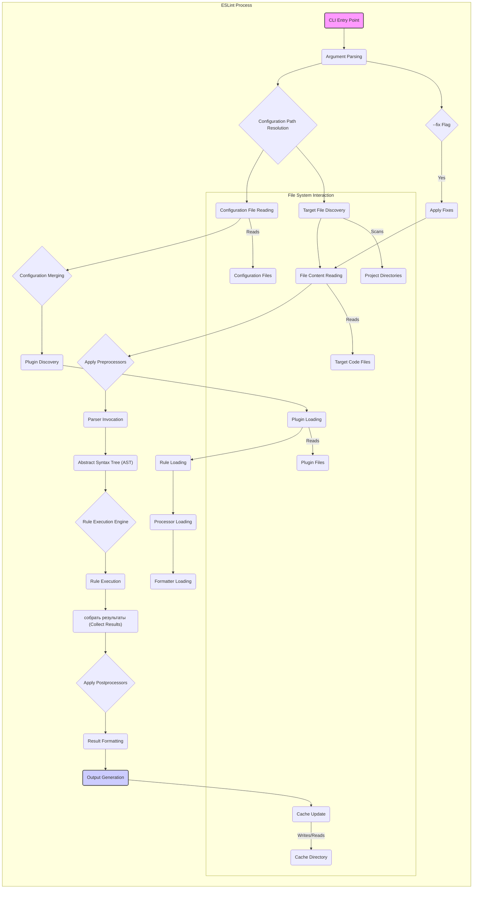

# Project Design Document: ESLint

**Document Version:** 1.1
**Date:** October 26, 2023
**Author:** AI Software Architect

## 1. Introduction

This document provides a detailed architectural design of ESLint, a widely used static code analysis tool for identifying problematic patterns found in JavaScript/ECMAScript code. This document aims to provide a comprehensive understanding of ESLint's components, their interactions, and the overall system architecture. This information will be crucial for subsequent threat modeling activities to identify potential security vulnerabilities and design appropriate mitigations.

### 1.1. Purpose

The primary purpose of this document is to:

*   Clearly outline the architecture and key components of ESLint.
*   Describe the data flow within the system with greater detail.
*   Serve as a robust foundation for threat modeling exercises.
*   Provide a reference for understanding the system's internal workings for developers and security analysts.

### 1.2. Scope

This document covers the core architecture and functionality of ESLint as a command-line interface (CLI) tool. It includes a detailed breakdown of the major components involved in the linting process, configuration loading, plugin execution, and the underlying mechanisms. It focuses on the local execution of ESLint and touches upon integration points with external tools without deep diving into their specific architectures.

### 1.3. Target Audience

This document is intended for:

*   Security engineers performing threat modeling and security audits.
*   Developers contributing to the ESLint project, including core and plugin developers.
*   Software architects designing systems that integrate with or utilize ESLint.
*   Technical stakeholders requiring a thorough understanding of ESLint's internal structure and potential security implications.

## 2. System Overview

ESLint is a Node.js-based tool that analyzes JavaScript and JSX code to identify and report on patterns found in ECMAScript/JavaScript code. Its primary function is to enforce coding standards, identify potential errors, and highlight stylistic inconsistencies. ESLint's strength lies in its highly configurable and extensible nature, allowing users to tailor the analysis to their specific needs through rules and plugins.

### 2.1. Key Features

*   **Pluggable Linting Rules:** The core of ESLint's functionality, allowing for granular control over code analysis. Rules are independent units that check for specific patterns.
*   **Hierarchical and Customizable Configuration:**  ESLint supports a flexible configuration system, allowing configurations to be defined at various levels (project, directory, file) and merged.
*   **Extensible Architecture via Plugins:**  Plugins enable the extension of ESLint's capabilities with custom rules, processors for handling non-JavaScript files, and formatters for outputting results.
*   **Automatic Fixing of Issues:** ESLint can automatically fix certain linting violations, improving developer efficiency.
*   **Integration with Development Ecosystem:** Seamless integration with popular IDEs, text editors, build tools, and CI/CD pipelines.
*   **Support for Different JavaScript Parsers:** ESLint uses a pluggable parser interface, allowing it to work with different JavaScript parsers like Espree (default) and Babel Parser.

## 3. Architectural Design

The following diagram illustrates the detailed architecture of ESLint:

### 3.1. Components

The major components of ESLint are:

*   **CLI Entry Point:** The `eslint` command-line interface, the initial point of execution, responsible for receiving user commands and options.
*   **Argument Parsing:**  Parses the command-line arguments provided by the user, such as target files, configuration paths, and flags (e.g., `--fix`).
*   **Configuration Path Resolution:** Determines the relevant configuration files to load based on the target files and specified configuration paths.
*   **Configuration File Reading:** Reads the content of the identified configuration files (`.eslintrc.*`, `package.json`).
*   **Configuration Merging:** Merges configurations from different sources (command-line, project-level, user-level) based on ESLint's configuration cascading rules.
*   **Plugin Discovery:** Identifies ESLint plugins specified in the loaded configuration.
*   **Plugin Loading:** Loads the JavaScript modules of the discovered plugins.
*   **Rule Loading:** Loads the linting rules provided by the core ESLint and any loaded plugins.
*   **Processor Loading:** Loads any processors defined in the configuration or plugins, which are used to handle non-JavaScript files or preprocess code.
*   **Formatter Loading:** Loads the specified formatter module responsible for presenting the linting results.
*   **Target File Discovery:** Identifies the JavaScript/JSX files to be linted based on the provided paths or glob patterns.
*   **File Content Reading:** Reads the content of the target code files.
*   **Apply Preprocessors:** If configured, applies preprocessors to the file content before parsing.
*   **Parser Invocation:** Invokes the configured JavaScript parser (e.g., Espree) to parse the code into an Abstract Syntax Tree (AST).
*   **Abstract Syntax Tree (AST):** A tree-like representation of the code's structure, used by the rules for analysis.
*   **Rule Execution Engine:** The core logic that iterates through the AST and applies the loaded linting rules.
*   **Rule Execution:** The process of individual rules examining the AST for specific patterns and reporting violations.
*   **Collect Results:** Aggregates the linting errors and warnings reported by the executed rules.
*   **Apply Postprocessors:** If configured, applies postprocessors to the collected linting results.
*   **Result Formatting:** Uses the loaded formatter to transform the linting results into a user-friendly output format.
*   **Output Generation:** Outputs the formatted linting results to the console or a specified file.
*   **Cache Update:** Updates the cache with the linting results, if caching is enabled.
*   **`--fix` Flag:** A command-line flag that triggers the automatic fixing functionality.
*   **Apply Fixes:**  If the `--fix` flag is present, ESLint attempts to automatically fix the reported linting issues based on the fixers provided by the rules.

### 3.2. Data Flow

The detailed data flow within ESLint is as follows:

1. The user executes the `eslint` command with target files or directories.
2. The **CLI Entry Point** receives the command and passes it to **Argument Parsing**.
3. **Argument Parsing** interprets the command-line options and determines the configuration paths through **Configuration Path Resolution**.
4. **Configuration File Reading** accesses the file system to read the content of configuration files.
5. **Configuration Merging** combines the loaded configurations into a single, effective configuration object.
6. **Plugin Discovery** identifies plugins specified in the configuration.
7. **Plugin Loading** reads the plugin files from the file system.
8. **Rule Loading**, **Processor Loading**, and **Formatter Loading** load the respective modules from the core ESLint and loaded plugins.
9. **Target File Discovery** identifies the files to be linted by scanning project directories.
10. **File Content Reading** reads the content of each target file.
11. **Apply Preprocessors** modifies the file content if processors are configured.
12. The processed content is passed to the **Parser Invocation**, which generates the **Abstract Syntax Tree (AST)**.
13. The **Rule Execution Engine** takes the AST and the loaded rules.
14. **Rule Execution** occurs, with each rule analyzing the AST and potentially reporting violations.
15. **Collect Results** gathers all the reported linting errors and warnings.
16. **Apply Postprocessors** modifies the results if postprocessors are configured.
17. **Result Formatting** uses the loaded formatter to create the output.
18. **Output Generation** displays the formatted results to the user.
19. If the `--fix` flag is used, **Apply Fixes** modifies the source code based on the fixers provided by the rules, and the process may loop back to **File Content Reading**.
20. **Cache Update** stores the linting results in the cache for future use.

## 4. Security Considerations (Detailed for Threat Modeling)

This section provides a more detailed breakdown of potential security considerations for threat modeling:

*   **Malicious Configuration Files:**
    *   **Threat:** An attacker could inject malicious rules or plugin configurations into `.eslintrc.*` files.
    *   **Impact:** This could lead to the execution of arbitrary code during the linting process, potentially compromising the developer's machine or CI/CD environment. It could also cause denial of service by configuring computationally expensive rules.
    *   **Example:**  A rule that attempts to read sensitive environment variables or make outbound network requests.
*   **Vulnerable Dependencies:**
    *   **Threat:** ESLint relies on numerous Node.js dependencies, which may contain known vulnerabilities.
    *   **Impact:** Exploiting these vulnerabilities could allow attackers to gain unauthorized access or execute arbitrary code.
    *   **Example:** A vulnerability in a parser dependency could be exploited by crafting malicious code that triggers the vulnerability during parsing.
*   **Malicious Plugins:**
    *   **Threat:** Third-party ESLint plugins have broad access to the file system and the code being linted.
    *   **Impact:** A malicious plugin could steal source code, inject malicious code, exfiltrate secrets, or perform other harmful actions.
    *   **Example:** A plugin that silently uploads code to an external server or modifies files in unexpected ways.
*   **Code Injection through Custom Rules:**
    *   **Threat:**  Improperly written custom rules that process user-provided data or external resources could be vulnerable to code injection.
    *   **Impact:** Attackers could inject malicious code that gets executed within the ESLint process.
    *   **Example:** A rule that uses `eval()` on data extracted from comments or external files without proper sanitization.
*   **Denial of Service through Complex Rules or Code:**
    *   **Threat:**  Crafting extremely complex rules or providing malformed code could cause ESLint to consume excessive CPU or memory.
    *   **Impact:** This could lead to a denial of service, especially in automated environments like CI/CD pipelines.
    *   **Example:**  A highly complex regular expression in a custom rule that causes catastrophic backtracking.
*   **Output Manipulation:**
    *   **Threat:** A compromised or malicious formatter could alter the linting output.
    *   **Impact:** This could hide real errors, inject misleading information, or create confusion for developers. While less critical than code execution, it can undermine the integrity of the linting process.
    *   **Example:** A formatter that always reports "no errors" regardless of the actual findings.
*   **Cache Poisoning:**
    *   **Threat:** If the cache mechanism is not properly secured, an attacker could inject malicious or incorrect linting results into the cache.
    *   **Impact:** This could lead to the suppression of real errors, potentially allowing vulnerable code to pass through checks.
    *   **Example:**  Modifying the cache files directly to mark code with vulnerabilities as clean.
*   **Prototype Pollution:**
    *   **Threat:**  Vulnerabilities in ESLint or its dependencies could potentially lead to prototype pollution.
    *   **Impact:** This could allow attackers to inject properties into built-in JavaScript object prototypes, potentially leading to unexpected behavior or security vulnerabilities in other parts of the application or environment where ESLint is running.

## 5. Integration Points

ESLint's integration points introduce additional security considerations:

*   **IDEs and Text Editors:**  Plugins running within IDEs have access to the editor's environment and user credentials. A compromised ESLint plugin could potentially exploit these privileges.
*   **Build Systems (Webpack, Rollup, etc.):**  ESLint integrations in build systems execute within the build process, which often has access to sensitive information and deployment credentials.
*   **CI/CD Pipelines:**  ESLint running in CI/CD pipelines has access to source code, environment variables, and deployment infrastructure. Security vulnerabilities in ESLint or its plugins could be exploited to compromise the pipeline.
*   **Git Hooks:** While providing early feedback, running ESLint in Git hooks requires careful consideration of the execution environment and potential for bypass.

## 6. Future Considerations

Potential future developments or changes to ESLint that could impact the architecture and security include:

*   **Improved Plugin Sandboxing:** Implementing stricter sandboxing for plugins to limit their access to resources and mitigate the risk of malicious plugins.
*   **WebAssembly (Wasm) for Performance:**  While potentially improving performance, using Wasm could introduce new security challenges related to Wasm module verification and isolation.
*   **Standardized Plugin Security Audits:**  Establishing a process for security audits of popular ESLint plugins.
*   **Enhanced Configuration Security:**  Features to improve the security of configuration files, such as signing or validation mechanisms.

## 7. Conclusion

This document provides a comprehensive and detailed architectural overview of ESLint, emphasizing aspects relevant to security. Understanding the intricate workings of ESLint, its components, and data flow is crucial for effective threat modeling and the development of robust security mitigations. The detailed security considerations outlined here serve as a starting point for identifying and addressing potential vulnerabilities in ESLint and its integration points. Continuous monitoring and proactive security measures are essential to maintain the integrity and security of systems utilizing ESLint.
