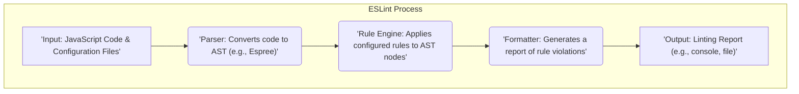

# Project Design Document: ESLint

**Version:** 1.1
**Date:** October 26, 2023
**Author:** AI Software Architect

## 1. Introduction

This document provides an enhanced design overview of the ESLint project, a widely adopted static code analysis tool designed to identify problematic patterns in JavaScript and ECMAScript code. This improved document aims to offer a more granular understanding of ESLint's architecture, individual components, and the intricate flow of data within the system. This detailed perspective is crucial for performing comprehensive threat modeling and identifying potential security vulnerabilities.

## 2. Goals

The primary goals of ESLint are to:

*   Establish a pluggable and extensible linting framework specifically for JavaScript.
*   Facilitate the enforcement of consistent coding standards and style guidelines across projects.
*   Proactively identify potential runtime errors, logical bugs, and anti-patterns in code.
*   Significantly improve the overall quality, readability, and maintainability of JavaScript codebases.
*   Offer a high degree of configurability and customization to seamlessly integrate with diverse project requirements and coding styles.
*   Provide seamless integrations with widely used code editors (e.g., VS Code, Sublime Text, Atom) and build automation tools (e.g., Webpack, Parcel, Rollup).

## 3. High-Level Architecture

ESLint operates primarily as a command-line interface (CLI) tool, providing developers with a direct way to analyze their code. It also offers integration capabilities with various development environments and build processes. The fundamental process involves taking JavaScript code and configuration as input, parsing the code into an abstract syntax tree, applying a defined set of rules to this tree, and finally, generating a report detailing any identified violations.



## 4. Key Components

*   **CLI (Command Line Interface):**
    *   Serves as the primary interface for users to interact with ESLint.
    *   Parses and processes command-line arguments provided by the user.
    *   Manages the loading and interpretation of ESLint configuration files.
    *   Orchestrates the entire linting process, coordinating the activities of other components.
    *   Handles the display of the final linting report to the user.
*   **Parser (e.g., Espree, Esprima, Babel Parser, @typescript-eslint/parser):**
    *   Responsible for the crucial task of transforming raw JavaScript code into an Abstract Syntax Tree (AST).
    *   The AST represents the hierarchical structure of the code, making it easier for rules to analyze specific code constructs.
    *   ESLint's architecture is designed to be parser-agnostic, allowing users to configure and utilize different parsers to accommodate various JavaScript dialects, including JSX, TypeScript, and experimental features.
*   **Rule Engine:**
    *   The central processing unit of ESLint, responsible for the application of configured linting rules to the generated AST.
    *   Traverses the AST, visiting each node and executing the logic defined within the active rules.
    *   Maintains the necessary state and context throughout the rule application process, enabling rules to access relevant information about the code being analyzed.
*   **Rules (e.g., `no-unused-vars`, `indent`, `semi`):**
    *   Represent individual, self-contained modules that define specific checks and guidelines for code quality, stylistic conventions, and potential error detection.
    *   Typically implemented as JavaScript functions that operate on specific nodes within the AST.
    *   Highly customizable and extensible, allowing users to modify existing rules or create new ones tailored to their project's specific needs.
    *   Examples include rules for enforcing consistent indentation, preventing the use of undeclared variables, and ensuring the presence or absence of semicolons.
*   **Configuration Files (e.g., `.eslintrc.json`, `.eslintrc.yaml`, `.eslintrc.js`, `package.json`):**
    *   Define the set of rules to be applied during the linting process, along with their respective severity levels (e.g., error, warning, off).
    *   Support various file formats for configuration, providing flexibility in how users manage their ESLint settings.
    *   Offer features like configuration inheritance (`extends`) and overrides (`overrides`) to manage configurations across different parts of a project.
*   **Formatters (e.g., `stylish`, `compact`, `json`, `checkstyle`):**
    *   Responsible for taking the raw results of the rule engine's analysis (i.e., the list of detected violations) and transforming them into a human-readable report.
    *   Offer a variety of output formats to suit different needs, such as plain text for console output, JSON for programmatic processing, or Checkstyle XML for integration with CI/CD systems.
*   **Plugins (e.g., `eslint-plugin-react`, `eslint-plugin-vue`):**
    *   Provide a mechanism to extend ESLint's core functionality by bundling custom rules, configurations, and processors.
    *   Enable ESLint to lint code that goes beyond standard JavaScript, such as JSX syntax in React components or template syntax in Vue.js components.
*   **Processors:**
    *   Allow ESLint to analyze code embedded within other file types, such as extracting and linting JavaScript code blocks within HTML or Markdown files.
    *   Perform preprocessing steps on the file content before passing it to the parser and handle post-processing of the linting results.
*   **Cache:**
    *   An optional feature that allows ESLint to store the results of previous linting runs.
    *   When enabled, ESLint can skip analyzing files that haven't changed since the last run, significantly improving performance, especially in large projects.

## 5. Data Flow

The typical flow of data within ESLint during a linting operation can be broken down as follows:

1. **Initialization:** The user invokes the ESLint CLI, providing the paths to the JavaScript files or directories to be linted, along with any relevant command-line options. Simultaneously, ESLint begins loading and merging configuration files found in the project and its parent directories.
2. **File Discovery:** ESLint identifies all the JavaScript files that need to be analyzed based on the provided paths and configuration settings (e.g., `.eslintignore`).
3. **Code Parsing:** For each identified JavaScript file, the configured parser (e.g., Espree) reads the file's content and transforms it into an Abstract Syntax Tree (AST). This AST represents the code's structure in a way that ESLint can understand and analyze.
4. **Rule Processing:** The Rule Engine takes the generated AST and iterates through its nodes. For each node, the engine determines which configured rules are relevant and executes their associated logic.
5. **Violation Detection and Reporting:** As each rule executes, it checks the current AST node for patterns that violate its defined guidelines. If a violation is found, the rule generates a report containing details about the violation, including its location in the code and a descriptive message.
6. **Result Aggregation:** The Rule Engine collects all the violation reports generated by the active rules during the analysis of the current file.
7. **Report Formatting:** Once all files have been processed, the configured formatter takes the aggregated list of violations and transforms it into the desired output format (e.g., plain text, JSON, XML).
8. **Output Delivery:** Finally, ESLint outputs the formatted linting report to the user, typically displayed on the console or written to a specified file.

```mermaid
graph TD
    subgraph "Detailed Data Flow"
        direction TB
        A["'User Invokes ESLint CLI with file paths'"] --> B("'Load and Merge Configuration Files'");
        B --> C("'Identify Target Files for Linting'");
        loop "For Each File"
            C --> D("'Read File Content'");
            D --> E("'Parse Code into Abstract Syntax Tree (AST)'");
            E --> F("'Rule Engine Processes AST Nodes'");
            subgraph "Rule Execution"
                direction LR
                F --> G("'Execute Rule 1'");
                G --> H("'Violation Found by Rule 1?'");
                H -- Yes --> I("'Report Violation'");
                H -- No --> J("'Execute Rule 2...N'");
                J --> K("'Violation Found by Rule N?'");
                K -- Yes --> I;
            end
            I --> L("'Store Violation Details'");
        end
        L --> M("'Aggregate All Detected Violations'");
        M --> N("'Format Linting Report (e.g., stylish, json)'");
        N --> O["'Output Linting Report to Console or File'"];
    end
```

## 6. User Interactions

Developers interact with ESLint through various methods throughout their workflow:

*   **Direct Command Line Execution:** Users directly execute ESLint commands in their terminal, specifying target files or directories, and potentially providing flags to modify ESLint's behavior (e.g., `--fix` to automatically fix some issues).
*   **Integration with Code Editors (e.g., VS Code, Sublime Text, Atom):**  ESLint plugins or extensions within code editors provide real-time feedback as developers write code, highlighting linting errors and warnings directly in the editor interface. These integrations often allow for quick fixes and display detailed error messages.
*   **Integration into Build Pipelines (CI/CD):** ESLint is commonly integrated into Continuous Integration and Continuous Deployment (CI/CD) pipelines. This ensures that code is automatically linted whenever changes are pushed, preventing code with linting errors from being merged or deployed. Tools like npm scripts, Webpack, or GitHub Actions are used for this integration.
*   **Configuration Management:** Developers interact with ESLint by creating and modifying configuration files (`.eslintrc.*`) to define the specific rules, environments, and parser options that should be applied to their project. This involves understanding the available rules and how to configure them appropriately.
*   **Customization through Plugins and Rule Development:** Advanced users can extend ESLint's capabilities by developing custom plugins and rules tailored to their specific project requirements or organizational coding standards. This involves writing JavaScript code that interacts with ESLint's API.

## 7. Deployment Model

ESLint is primarily deployed as a development dependency within a project's ecosystem. It is typically executed within the development environment and as part of the CI/CD pipeline.

*   **Local Development Environment:** Developers install ESLint as a `devDependency` using package managers like npm or yarn. This makes ESLint available for local execution and integration with code editors.
*   **Continuous Integration/Continuous Deployment (CI/CD) Pipelines:** ESLint is integrated into CI/CD workflows to automatically lint code on every commit, pull request, or build. This ensures code quality is maintained throughout the development lifecycle and before deployment to production environments.

## 8. Security Considerations (For Threat Modeling)

This section expands on the initial security considerations, providing more detail for threat modeling activities.

*   **Dependency Vulnerabilities:** ESLint relies on a significant number of third-party dependencies, including the parser, core utilities, and plugin dependencies. Vulnerabilities in these dependencies could introduce security risks into projects using ESLint.
    *   **Threat:** A compromised dependency could allow for arbitrary code execution during the linting process or expose sensitive information.
    *   **Mitigation:** Employing dependency scanning tools (e.g., Snyk, npm audit), keeping dependencies updated, and using dependency pinning can mitigate this risk.
*   **Malicious Custom Rules and Plugins:** Users have the ability to create and utilize custom rules and plugins. If a malicious actor introduces a crafted rule or plugin, it could potentially execute arbitrary code within the context of the ESLint process.
    *   **Threat:**  A malicious rule could read sensitive files, modify code, or exfiltrate data during the linting process.
    *   **Mitigation:**  Encouraging the use of reputable and well-vetted plugins, implementing code review processes for custom rules, and potentially exploring sandboxing techniques for rule execution are important considerations.
*   **Configuration Injection Vulnerabilities:** If ESLint configuration files are dynamically generated or modified based on external, untrusted input, it could lead to configuration injection attacks.
    *   **Threat:** An attacker could inject malicious configurations that disable security-related rules or introduce new, harmful rules.
    *   **Mitigation:**  Treating configuration files as code, avoiding dynamic generation based on untrusted input, and implementing proper input validation are crucial.
*   **Parser Exploits:** Vulnerabilities within the JavaScript parser used by ESLint (e.g., Espree) could be exploited by providing specially crafted malicious code.
    *   **Threat:** A successful parser exploit could lead to denial of service, arbitrary code execution, or information disclosure.
    *   **Mitigation:** Staying up-to-date with parser releases and security patches is essential. Considering the security history and reputation of the chosen parser is also important.
*   **Denial of Service (DoS) through Malicious Code:**  Attackers could craft JavaScript code specifically designed to cause the parser or rule engine to consume excessive computational resources, leading to a denial of service.
    *   **Threat:**  A carefully crafted file could hang the linting process, impacting development workflows or CI/CD pipelines.
    *   **Mitigation:** Implementing timeouts for parsing and rule execution, and potentially adding safeguards against excessively complex code structures could help mitigate this.
*   **Supply Chain Attacks Targeting Plugins:**  Malicious actors could target the supply chain of ESLint plugins by compromising plugin maintainers' accounts or injecting malicious code into popular plugins.
    *   **Threat:**  Compromised plugins could introduce vulnerabilities into projects without the developers' knowledge.
    *   **Mitigation:**  Using dependency pinning, verifying the integrity of downloaded packages using checksums, and regularly auditing project dependencies are crucial preventative measures.
*   **Information Disclosure through Error Messages:**  Verbose error messages or detailed reports generated by ESLint could inadvertently expose sensitive information about the codebase, file paths, or the development environment.
    *   **Threat:** Attackers could leverage this information to gain insights into the application's structure and potential vulnerabilities.
    *   **Mitigation:** Reviewing and sanitizing error handling and reporting mechanisms to avoid exposing sensitive details is important.

## 9. Dependencies

ESLint relies on a range of dependencies to function correctly. Key examples include:

*   **Core Parsers:**
    *   `espree`: The default parser for ESLint.
    *   `@babel/eslint-parser`:  A parser that allows ESLint to lint code using the latest ECMAScript features and JSX.
    *   `@typescript-eslint/parser`: Enables ESLint to lint TypeScript code.
*   **Utility Libraries:**
    *   `globals`: Provides a standardized list of global variables available in different JavaScript environments.
    *   `js-yaml`: Used for parsing YAML-formatted configuration files.
    *   `ajv`: A fast JSON schema validator used for validating ESLint configuration files.
    *   `chalk`: Used for adding color and styling to console output.
*   **Plugin Dependencies:**  Numerous dependencies are introduced through the use of ESLint plugins (e.g., dependencies of `eslint-plugin-react`).

## 10. Future Considerations

*   **Performance Optimization:** Continuously improving the performance of the parsing and rule execution processes to reduce linting time, especially for large projects.
*   **Enhanced Extensibility and API Improvements:** Providing more robust and well-documented APIs for plugin and custom rule development, making it easier for developers to extend ESLint's functionality.
*   **Improved Support for Modern JavaScript Features:** Ensuring seamless compatibility and providing relevant and up-to-date rules for the latest ECMAScript standards and language features.
*   **Strengthening Security Measures:** Exploring and implementing additional security features, such as more robust mechanisms for validating and sandboxing custom rules, and potentially incorporating better dependency management practices directly into ESLint.
*   **Improved User Experience:**  Continuously refining the user interface and command-line experience to make ESLint more intuitive and user-friendly.

This enhanced design document provides a more in-depth understanding of the ESLint project's architecture and inner workings. This detailed information is crucial for conducting a thorough threat model and identifying potential security vulnerabilities within the system and its ecosystem.
