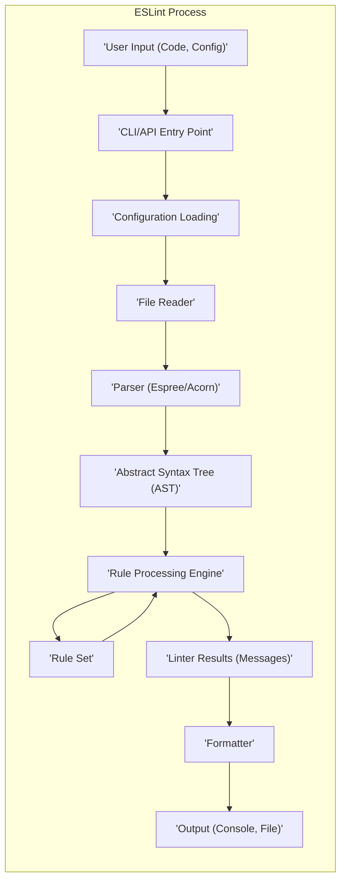
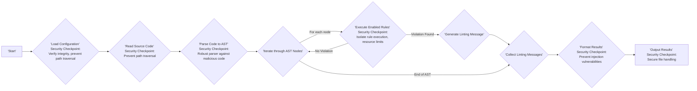

# Project Design Document: ESLint

**Version:** 1.1
**Date:** October 26, 2023
**Author:** AI Software Architect

## 1. Introduction

This document provides an enhanced architectural design of ESLint, a widely used static code analysis tool (linter) for JavaScript and JSX. This revision builds upon the previous version, offering greater detail and a stronger focus on aspects relevant to threat modeling. The aim is to provide a comprehensive understanding of ESLint's components, their interactions, and data flow, specifically highlighting potential security considerations.

## 2. Goals and Objectives

The primary goals of ESLint are:

*   Identify and report on problematic patterns found in JavaScript/JSX code, enhancing code quality and reducing potential runtime errors.
*   Enforce coding standards and consistency across projects, improving maintainability and collaboration.
*   Provide a highly configurable and extensible platform for custom linting rules, allowing adaptation to specific project needs and security policies.
*   Integrate seamlessly with various development environments and build processes, ensuring consistent code quality checks throughout the development lifecycle.

This design document aims to:

*   Clearly define the major components of ESLint with a focus on their security implications.
*   Describe the interactions and data flow between these components, highlighting potential attack vectors.
*   Outline the configuration mechanisms and extensibility points, emphasizing the security risks associated with each.
*   Provide a robust foundation for identifying potential security vulnerabilities during subsequent threat modeling activities.

## 3. High-Level Architecture

ESLint operates as a command-line interface (CLI) tool and can also be integrated into code editors and build systems. The core architecture revolves around securely processing JavaScript/JSX code against a configurable set of rules.

## 4. Detailed Component Descriptions

*   **User Input (Code, Config):** This represents the potentially untrusted source code files to be linted and the ESLint configuration files (`.eslintrc.*`, `package.json`, etc.). The configuration dictates which rules are enabled, their severity, and other settings, making it a critical component from a security perspective.
    *   Configuration files can be in various formats (JavaScript, YAML, JSON), each with its own parsing vulnerabilities.
    *   Configuration can extend other configurations, potentially introducing unintended or malicious rules.
    *   Plugins and shareable configurations, loaded from external sources (like npm), introduce supply chain risks.
*   **CLI/API Entry Point:** This is the initial point of interaction with ESLint. It handles command-line arguments, API calls from integrations, and initiates the linting process. Input validation and sanitization at this stage are crucial to prevent command injection or other input-based attacks.
*   **Configuration Loading:** This component is responsible for securely locating, reading, and merging ESLint configuration files. It must handle potentially malicious configuration files that could attempt to execute arbitrary code or access sensitive information.
    *   Securely handling different configuration file formats is essential to prevent parsing vulnerabilities.
    *   Mechanisms to verify the integrity and authenticity of extended configurations, plugins, and shareable configurations are important.
    *   Protection against path traversal vulnerabilities when locating configuration files is necessary.
*   **File Reader:** This component reads the source code files specified for linting. It must be protected against path traversal vulnerabilities that could allow access to sensitive files outside the intended project scope. Secure handling of file encodings is also important to prevent unexpected behavior.
*   **Parser (Espree/Acorn):** ESLint uses a JavaScript parser (by default, Espree, which is a fork of Acorn) to convert the source code into an Abstract Syntax Tree (AST). The parser is a critical component, as vulnerabilities in the parser could allow malicious code to bypass linting or even lead to remote code execution if the parser itself is compromised.
    *   The parser must be robust against maliciously crafted JavaScript code designed to exploit parsing weaknesses.
    *   Custom parsers, if allowed, introduce additional risk if they contain vulnerabilities.
*   **Abstract Syntax Tree (AST):** This is a tree-like representation of the code's structure. While not directly executable, vulnerabilities in how the AST is generated or processed could be exploited by carefully crafted rules.
*   **Rule Processing Engine:** This is the core of ESLint, responsible for securely traversing the AST and applying the configured linting rules. It must isolate the execution of individual rules to prevent a malicious rule from affecting other parts of the system.
    *   The engine provides context and utilities to the rules for analyzing the AST. These utilities must be carefully designed to prevent misuse.
    *   Resource limits and timeouts for rule execution might be necessary to prevent denial-of-service attacks.
*   **Rule Set:** This is a collection of individual linting rules, which are essentially small programs that analyze the AST. Malicious or poorly written rules pose a significant security risk, as they can execute arbitrary code on the machine running ESLint.
    *   ESLint comes with a set of built-in rules, which should be regularly reviewed for potential vulnerabilities.
    *   Users can define custom rules or use rules provided by plugins, increasing the attack surface if these sources are not trusted.
    *   Mechanisms for sandboxing or isolating rule execution could mitigate the risk of malicious rules.
*   **Linter Results (Messages):** When a rule identifies a violation, it generates a linting message. While seemingly benign, the content of these messages should be carefully handled to prevent injection vulnerabilities if the output is used in other systems.
*   **Formatter:** This component takes the linter results and formats them into a human-readable output. Vulnerabilities in the formatter could lead to cross-site scripting (XSS) if the output is displayed in a web browser or other injection attacks if the output is processed by another system.
    *   Different formatters are available (e.g., stylish, compact, JSON), each with its own potential vulnerabilities.
    *   Custom formatters introduce additional risk if they are not securely implemented.
*   **Output (Console, File):** The formatted linting results are then outputted, typically to the console or a specified file. Secure file handling practices are necessary to prevent overwriting critical files or writing sensitive information to insecure locations.

## 5. Data Flow

The typical data flow within ESLint, with a focus on security considerations, is as follows:

1. The user invokes ESLint, providing potentially malicious target files and configuration. **Security Checkpoint:** Input validation at the CLI/API level is crucial.
2. The CLI/API entry point receives the command and initiates the process. **Security Checkpoint:**  Sanitize and validate input to prevent command injection.
3. The Configuration Loading component attempts to securely load and merge the relevant configuration settings. **Security Checkpoint:** Verify the integrity and source of configuration files, plugins, and shareable configurations. Protect against path traversal.
4. The File Reader securely reads the specified source code files. **Security Checkpoint:** Prevent path traversal to access unauthorized files.
5. The Parser parses the code into an Abstract Syntax Tree (AST). **Security Checkpoint:** The parser must be robust against malicious code designed to exploit parsing vulnerabilities.
6. The Rule Processing Engine securely traverses the AST. **Security Checkpoint:** Isolate rule execution to prevent malicious rules from affecting the system.
7. For each node in the AST, the engine executes the enabled rules. **Security Checkpoint:**  Implement resource limits and timeouts for rule execution.
8. Rules analyze the AST node and generate linting messages if violations are found. **Security Checkpoint:** Ensure rules themselves do not introduce vulnerabilities.
9. The Linter Results component collects all the generated messages.
10. The Formatter securely formats the linting messages according to the configured formatter. **Security Checkpoint:** Prevent injection vulnerabilities in the formatted output.
11. The formatted output is presented to the user (e.g., on the console or written to a file). **Security Checkpoint:** Secure file handling practices to prevent unauthorized access or modification.

## 6. Configuration and Extensibility (Security Implications)

ESLint's configurability and extensibility are powerful features but introduce significant security considerations:

*   **Configuration Files:**  Malicious actors could attempt to inject harmful configurations.
    *   Ensure proper parsing and validation of configuration files to prevent code execution or access to sensitive information.
    *   Implement mechanisms to restrict the loading of remote configurations or plugins from untrusted sources.
*   **Plugins:** Plugins, being external code, represent a significant attack surface.
    *   Implement a mechanism for verifying the authenticity and integrity of plugins.
    *   Consider sandboxing plugin execution to limit their access to system resources.
    *   Clearly document the security risks associated with using third-party plugins.
*   **Custom Rules:**  Writing custom rules requires careful attention to security.
    *   Provide secure coding guidelines for rule development to prevent vulnerabilities.
    *   Consider static analysis tools to scan custom rules for potential security flaws.
*   **Custom Formatters:**  Custom formatters could introduce injection vulnerabilities if not properly implemented.
    *   Provide guidelines for secure formatter development, emphasizing output sanitization.
*   **Custom Parsers:** Using custom parsers increases the risk of introducing parsing vulnerabilities.
    *   Thoroughly vet any custom parsers before using them in a production environment.
*   **Processors:** Processors handle the parsing of code within other file types, potentially introducing vulnerabilities if not implemented securely.

## 7. Deployment Model (Security Considerations)

The deployment model impacts the security posture of ESLint:

*   **Command-Line Interface (CLI):** Running ESLint with elevated privileges increases the potential impact of vulnerabilities. Ensure ESLint is run with the least necessary privileges.
*   **Editor Integrations:**  Editor plugins can introduce vulnerabilities if they are not securely developed or if they interact with ESLint in an insecure manner. Keep editor plugins updated.
*   **Build Processes (CI/CD):** Integrating ESLint into CI/CD pipelines exposes it to potential attacks if the pipeline itself is compromised. Secure the CI/CD environment and the credentials used to run ESLint.
*   **Git Hooks:** While convenient, ensure that the ESLint execution within Git hooks does not introduce security risks, such as exposing sensitive information or allowing malicious code to be executed during the commit process.

## 8. Security Considerations (Detailed)

This section provides a more detailed breakdown of potential security concerns:

*   **Malicious Code in Input:**
    *   **Threat:**  Attackers could provide specially crafted JavaScript/JSX code designed to exploit vulnerabilities in the parser, rule engine, or even the JavaScript runtime.
    *   **Mitigation:** Employ robust parsing libraries, implement input sanitization where applicable (though limited for code), and potentially sandbox the execution of rules.
*   **Configuration Vulnerabilities:**
    *   **Threat:**  A compromised or maliciously crafted configuration file could lead to arbitrary code execution by loading malicious plugins or shareable configurations.
    *   **Mitigation:** Implement strict validation of configuration files, enforce integrity checks for plugins and shareable configurations (e.g., using checksums or signatures), and potentially restrict the sources from which configurations can be loaded.
*   **Dependency Vulnerabilities:**
    *   **Threat:**  Vulnerabilities in ESLint's dependencies (parser, plugins, etc.) could be exploited.
    *   **Mitigation:** Regularly update dependencies, use dependency scanning tools to identify known vulnerabilities, and consider using tools that provide insights into the security of dependencies.
*   **Arbitrary Code Execution in Rules/Plugins:**
    *   **Threat:**  Malicious or poorly written custom rules and plugins can execute arbitrary code on the system running ESLint.
    *   **Mitigation:** Implement a secure coding review process for custom rules, consider sandboxing rule execution, and provide clear guidelines and warnings about the risks of using untrusted plugins.
*   **Path Traversal:**
    *   **Threat:**  Vulnerabilities in configuration loading or file reading could allow attackers to access or modify files outside the intended project scope.
    *   **Mitigation:** Implement strict path validation and sanitization to prevent access to unauthorized files.
*   **Denial of Service (DoS):**
    *   **Threat:**  Extremely complex or large code files or malicious configurations could cause performance issues or crashes, leading to a denial of service.
    *   **Mitigation:** Implement resource limits and timeouts for parsing and rule execution.
*   **Injection Vulnerabilities (Output):**
    *   **Threat:**  Vulnerabilities in formatters could lead to injection attacks (e.g., XSS) if the output is displayed in a web browser or processed by other systems.
    *   **Mitigation:**  Sanitize output in formatters, especially when dealing with user-provided data or error messages.

## 9. Future Considerations (Security Focused)

*   **Enhanced Security Audits:**  Regular security audits of the ESLint core and popular plugins.
*   **Formal Security Policy:**  Establish a clear security policy for reporting and handling vulnerabilities.
*   **Plugin Sandboxing:**  Implement robust sandboxing mechanisms for plugin execution to limit their potential impact.
*   **Integrity Checks for Plugins:**  Mandatory integrity checks (e.g., using signatures) for plugins loaded from external sources.
*   **Content Security Policy (CSP) for Formatters:**  If formatters generate HTML output, consider using CSP to mitigate XSS risks.

This enhanced design document provides a more detailed and security-focused view of ESLint's architecture, serving as a stronger foundation for subsequent threat modeling activities. The identified components, data flow, and extensibility points are analyzed with a focus on potential security vulnerabilities and mitigation strategies.