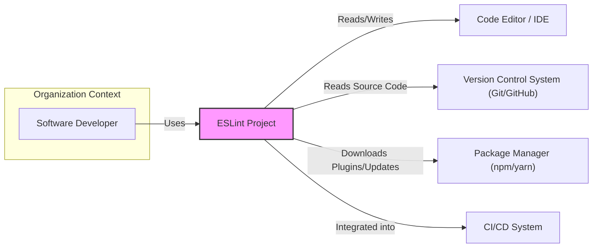

# BUSINESS POSTURE

- Business Priorities and Goals:
  - Improve JavaScript and TypeScript code quality and consistency across projects.
  - Reduce software defects and bugs by enforcing coding standards and best practices.
  - Enhance developer productivity by automating code analysis and providing immediate feedback.
  - Facilitate code maintainability and readability for long-term project health.
  - Support a wide range of JavaScript and TypeScript projects and frameworks.
- Business Risks:
  - Adoption Risk: Developers may resist adopting ESLint if it is perceived as too strict or slows down development.
  - False Positive/Negative Risk: Inaccurate linting results can lead to wasted developer time investigating false positives or missed defects due to false negatives.
  - Performance Risk: ESLint's performance could impact development workflow if it is slow or resource-intensive, especially on large projects.
  - Security Risk: Vulnerabilities in ESLint itself could be exploited to compromise developer environments or introduce malicious code into projects.
  - Compatibility Risk: Changes in JavaScript/TypeScript standards or frameworks could break ESLint rules and require ongoing maintenance and updates.

# SECURITY POSTURE

- Existing Security Controls:
  - security control: Code Review - Implemented through GitHub Pull Requests, ensuring multiple developers review code changes before merging. Described in GitHub repository contribution guidelines.
  - security control: Unit Testing - Implemented through comprehensive test suites to verify the correctness of ESLint rules and core functionality. Described in project's testing documentation.
  - security control: Static Analysis - ESLint uses its own rules to lint its codebase, ensuring code quality and consistency. Implemented as part of the development workflow.
  - security control: Dependency Management - Using npm to manage dependencies, with regular updates and vulnerability checks. Managed through `package.json` and `package-lock.json`.
  - security control: GitHub Security Features - Utilizing GitHub's Dependabot for automated dependency vulnerability scanning and updates. Configured within the GitHub repository settings.
  - security control: Community Security Reporting - Open channels for reporting security vulnerabilities through GitHub issues or security-specific communication channels. Described in security policy (if available) or contribution guidelines.
- Accepted Risks:
  - accepted risk: Open Source Vulnerability Disclosure - As an open-source project, vulnerabilities may be publicly disclosed before a patch is available, potentially increasing the window of exploitation.
  - accepted risk: Third-Party Plugin Vulnerabilities - ESLint's extensibility through plugins introduces a risk of vulnerabilities in community-contributed plugins.
  - accepted risk: Complexity of JavaScript/TypeScript Ecosystem - The rapidly evolving nature of JavaScript and TypeScript and their ecosystems can introduce unforeseen security challenges and require continuous adaptation of ESLint.
- Recommended Security Controls:
  - security control: Security Audits - Conduct periodic security audits, both internal and external, to identify potential vulnerabilities in ESLint's core and plugins.
  - security control: Fuzzing - Implement fuzzing techniques to test ESLint's parsers and rule engines for robustness against malformed or malicious code inputs.
  - security control: Security Focused Code Reviews - Emphasize security considerations during code reviews, specifically looking for potential vulnerabilities and insecure coding practices.
  - security control: Dependency Vulnerability Scanning Automation - Integrate automated dependency vulnerability scanning into the CI/CD pipeline to proactively identify and address vulnerable dependencies.
  - security control: Security Training for Core Developers - Provide security training to core developers to enhance their awareness of secure coding practices and common vulnerability types.
- Security Requirements:
  - Authentication: Not directly applicable to ESLint itself as it is a command-line tool. Authentication is relevant for the infrastructure used for development and distribution (GitHub, npm).
  - Authorization: Access control to the ESLint GitHub repository and npm package publishing process should be strictly managed using role-based access control (RBAC) on GitHub and npm.
  - Input Validation: ESLint must robustly validate and sanitize code inputs to prevent code injection, denial-of-service, or other attacks stemming from maliciously crafted code. This is critical for the parser and rule execution engine.
  - Cryptography: Cryptography is not a core requirement for ESLint's primary functionality. However, if ESLint were to implement features like secure plugin updates or configuration encryption in the future, cryptographic measures would become relevant. For now, secure communication channels (HTTPS) should be used for distribution and updates.

# DESIGN

## C4 CONTEXT



- Context Diagram Elements:
  - - Name: Software Developer
    - Type: Person
    - Description: Developers who write JavaScript and TypeScript code and use ESLint to improve code quality.
    - Responsibilities: Writes code, configures ESLint, runs ESLint to analyze code, fixes linting errors.
    - Security controls: Local development environment security, access control to code repositories.
  - - Name: ESLint Project
    - Type: Software System
    - Description: Static code analysis tool for JavaScript and TypeScript. Analyzes code based on configured rules and reports potential errors, style issues, and best practice violations.
    - Responsibilities: Parse JavaScript/TypeScript code, apply configured linting rules, generate reports of linting issues, provide fix suggestions.
    - Security controls: Input validation, secure coding practices, vulnerability scanning, secure build and release process.
  - - Name: Code Editor / IDE
    - Type: Software System
    - Description: Integrated Development Environments or code editors used by developers to write and edit code. ESLint integrates with many IDEs to provide real-time linting feedback.
    - Responsibilities: Provide code editing environment, integrate with ESLint for real-time linting, display linting errors and warnings to developers.
    - Security controls: IDE security features, plugin security management.
  - - Name: Version Control System (Git/GitHub)
    - Type: Software System
    - Description: System for managing and tracking changes in source code. GitHub hosts the ESLint project repository and is used for collaboration and version control.
    - Responsibilities: Store source code, manage code versions, track changes, facilitate collaboration, host ESLint project repository.
    - Security controls: Access control, authentication, authorization, audit logging, secure code storage.
  - - Name: Package Manager (npm/yarn)
    - Type: Software System
    - Description: Package managers used to distribute and install JavaScript packages. ESLint is distributed via npm.
    - Responsibilities: Host and distribute JavaScript packages, manage package dependencies, facilitate package installation and updates.
    - Security controls: Package integrity checks, vulnerability scanning of packages, secure package distribution.
  - - Name: CI/CD System
    - Type: Software System
    - Description: Continuous Integration and Continuous Delivery systems used to automate the build, test, and deployment processes. ESLint is often integrated into CI/CD pipelines to enforce code quality checks.
    - Responsibilities: Automate build, test, and deployment processes, integrate with ESLint for code quality checks, provide feedback on build status and linting results.
    - Security controls: Secure build environment, access control, secrets management, secure deployment pipelines.

## C4 CONTAINER

```mermaid
flowchart LR
    subgraph "ESLint Project"
    A["ESLint CLI"
    "Container"]
    B["ESLint Core"
    "Container"]
    C["Plugin Ecosystem"
    "Container"]
    D["Configuration Files"
    "Container"]
    end
    E["Code Editor / IDE"
    "External System"]
    F["File System"
    "External System"]
    A -- Uses --> B
    A -- Reads --> D
    B -- Uses --> C
    A -- Interacts with --> E
    A -- Reads/Writes --> F
    style A fill:#fcc,stroke:#333,stroke-width:2px
    style B fill:#fcc,stroke:#333,stroke-width:2px
    style C fill:#fcc,stroke:#333,stroke-width:2px
    style D fill:#fcc,stroke:#333,stroke-width:2px
```

- Container Diagram Elements:
  - - Name: ESLint CLI
    - Type: Container - Command-Line Interface
    - Description: The command-line interface for ESLint, used by developers to run ESLint from the terminal or integrated into scripts.
    - Responsibilities: Parse command-line arguments, load configuration files, invoke ESLint Core, format output, interact with the file system and IDEs.
    - Security controls: Input validation of command-line arguments, secure file system access, output sanitization.
  - - Name: ESLint Core
    - Type: Container - Application Logic
    - Description: The core engine of ESLint, responsible for parsing JavaScript/TypeScript code, applying linting rules, and generating linting results.
    - Responsibilities: Code parsing, rule execution, error reporting, fix suggestion generation, plugin management.
    - Security controls: Robust parser implementation, input validation of code, secure rule execution environment, vulnerability scanning of core code.
  - - Name: Plugin Ecosystem
    - Type: Container - Plugin System
    - Description: The ecosystem of plugins that extend ESLint's functionality with custom rules, parsers, and formatters. Plugins are distributed via npm.
    - Responsibilities: Provide extensible rule sets, parsers, and formatters, allow community contributions, enhance ESLint's capabilities.
    - Security controls: Plugin validation and review process (community-driven), dependency scanning of plugins, secure plugin loading and execution.
  - - Name: Configuration Files
    - Type: Container - Configuration Data
    - Description: Configuration files (.eslintrc.*) that define ESLint's behavior, including enabled rules, environments, and plugin configurations.
    - Responsibilities: Store ESLint configuration, allow customization of linting rules, define project-specific linting settings.
    - Security controls: Secure storage of configuration files, access control to configuration files, validation of configuration file content.

## DEPLOYMENT

- Deployment Architecture Options:
  - Local Installation: Developers install ESLint globally or locally within project directories using npm or yarn.
  - CI/CD Integration: ESLint is integrated into CI/CD pipelines, running as part of the automated build and test process.
  - Docker Container: ESLint can be packaged as a Docker container for consistent execution across different environments.

- Detailed Deployment Architecture (Local Installation and CI/CD Integration):

```mermaid
flowchart LR
    subgraph "Developer Environment"
    A["Developer Machine"]
    B["Operating System"]
    C["Node.js Runtime"]
    D["ESLint CLI"
    "Installed via npm"]
    E["Project Code Files"]
    B -- Runs --> C
    C -- Runs --> D
    D -- Analyzes --> E
    end
    subgraph "CI/CD Environment"
    F["CI/CD Server"]
    G["Build Agent"]
    H["Node.js Runtime"]
    I["ESLint CLI"
    "Installed via npm"]
    J["Project Code Files"
    "Checked out from VCS"]
    G -- Runs on --> F
    H -- Runs on --> G
    I -- Runs on --> H
    I -- Analyzes --> J
    end
    style D fill:#ccf,stroke:#333,stroke-width:2px
    style I fill:#ccf,stroke:#333,stroke-width:2px
```

- Deployment Diagram Elements:
  - - Name: Developer Machine
    - Type: Infrastructure - Physical Machine
    - Description: Developer's local computer used for writing and testing code.
    - Responsibilities: Running code editors, executing ESLint locally, providing development environment.
    - Security controls: Operating system security, endpoint security software, physical security.
  - - Name: Operating System
    - Type: Infrastructure - Operating System
    - Description: Operating system (e.g., Windows, macOS, Linux) running on the developer machine and CI/CD server.
    - Responsibilities: Provide runtime environment, manage system resources, enforce security policies.
    - Security controls: OS hardening, security patching, access control.
  - - Name: Node.js Runtime
    - Type: Infrastructure - Runtime Environment
    - Description: JavaScript runtime environment required to execute ESLint, both locally and in CI/CD environments.
    - Responsibilities: Execute JavaScript code, manage dependencies, provide APIs for JavaScript applications.
    - Security controls: Node.js security updates, secure runtime configuration.
  - - Name: ESLint CLI (Installed via npm)
    - Type: Software - Application
    - Description: ESLint command-line interface installed using npm, deployed in both developer environments and CI/CD environments.
    - Responsibilities: Execute ESLint, analyze code, generate reports.
    - Security controls: Package integrity checks during installation, secure updates from npm registry.
  - - Name: Project Code Files
    - Type: Data - Source Code
    - Description: JavaScript/TypeScript source code files being analyzed by ESLint.
    - Responsibilities: Contain application logic, be subject to linting rules.
    - Security controls: Access control, version control, secure storage.
  - - Name: CI/CD Server
    - Type: Infrastructure - Server
    - Description: Server hosting the CI/CD system (e.g., Jenkins, GitHub Actions).
    - Responsibilities: Orchestrate build and deployment pipelines, execute automated tests and linters.
    - Security controls: Server hardening, access control, network security, audit logging.
  - - Name: Build Agent
    - Type: Infrastructure - Virtual Machine/Container
    - Description: Agent within the CI/CD environment that executes build and test jobs, including running ESLint.
    - Responsibilities: Execute build steps, run linters and tests, report results to CI/CD server.
    - Security controls: Secure build environment, isolated execution, access control.
  - - Name: Project Code Files (Checked out from VCS)
    - Type: Data - Source Code
    - Description: Project source code files checked out from the Version Control System (VCS) in the CI/CD environment for analysis.
    - Responsibilities: Provide source code for linting in CI/CD pipeline.
    - Security controls: Secure access to VCS, integrity checks during checkout.

## BUILD

```mermaid
flowchart LR
    A["Developer"] --> B{Code Changes};
    B -- Push --> C["GitHub Repository"];
    C --> D["GitHub Actions"
    "CI/CD Pipeline"];
    D --> E["Checkout Code"];
    E --> F["Install Node.js"];
    F --> G["Install Dependencies"
    "(npm install)"];
    G --> H["Run ESLint"];
    H -- Fail --> I["Report Linting Errors"];
    H -- Pass --> J["Run Tests"];
    J -- Pass --> K["Build Artifacts"];
    K --> L["Publish to npm"
    "(on release)"];
    D --> I;
    D --> J;
    D --> K;
    style D fill:#cff,stroke:#333,stroke-width:2px
```

- Build Process:
  - - Name: Developer
    - Type: Person
    - Description: Software developer contributing code changes to the ESLint project.
    - Responsibilities: Writes code, runs local linters and tests, commits and pushes code changes.
    - Security controls: Secure development environment, code review participation.
  - - Name: Code Changes
    - Type: Data - Source Code
    - Description: Modifications to the ESLint codebase made by developers.
    - Responsibilities: Implement new features, fix bugs, improve code quality.
    - Security controls: Code review, version control.
  - - Name: GitHub Repository
    - Type: Software System - Version Control
    - Description: GitHub repository hosting the ESLint project source code.
    - Responsibilities: Store source code, manage versions, track changes, trigger CI/CD pipelines.
    - Security controls: Access control, branch protection, audit logging.
  - - Name: GitHub Actions (CI/CD Pipeline)
    - Type: Software System - CI/CD
    - Description: GitHub Actions workflows configured for ESLint project's CI/CD pipeline, automating build, test, and release processes.
    - Responsibilities: Automate build, test, and release workflows, integrate security checks, manage build environment.
    - Security controls: Secure workflow definitions, secrets management, access control to workflows, audit logging.
  - - Name: Checkout Code
    - Type: Build Step
    - Description: Step in the CI/CD pipeline to checkout the latest code changes from the GitHub repository.
    - Responsibilities: Retrieve source code for building and testing.
    - Security controls: Secure connection to GitHub, integrity checks during checkout.
  - - Name: Install Node.js
    - Type: Build Step
    - Description: Step to install the required Node.js runtime environment in the CI/CD pipeline.
    - Responsibilities: Set up runtime environment for building and running ESLint.
    - Security controls: Use trusted Node.js versions, verify installation integrity.
  - - Name: Install Dependencies (npm install)
    - Type: Build Step
    - Description: Step to install project dependencies using npm.
    - Responsibilities: Download and install required npm packages.
    - Security controls: Dependency vulnerability scanning, use `npm audit`, verify package integrity (using `package-lock.json`).
  - - Name: Run ESLint
    - Type: Build Step
    - Description: Step to execute ESLint on the codebase as part of the CI/CD pipeline.
    - Responsibilities: Perform static code analysis, identify linting errors.
    - Security controls: Use up-to-date ESLint version, configure secure linting rules.
  - - Name: Report Linting Errors
    - Type: Build Step
    - Description: Step to report any linting errors found by ESLint, failing the build if necessary.
    - Responsibilities: Provide feedback on code quality, enforce coding standards.
    - Security controls: Secure reporting mechanisms, access control to build results.
  - - Name: Run Tests
    - Type: Build Step
    - Description: Step to execute unit and integration tests for the ESLint project.
    - Responsibilities: Verify code functionality, ensure code quality.
    - Security controls: Secure test environment, test isolation, code coverage analysis.
  - - Name: Build Artifacts
    - Type: Build Step
    - Description: Step to generate build artifacts, such as packaged npm package.
    - Responsibilities: Prepare distributable packages.
    - Security controls: Secure artifact generation process, artifact integrity checks.
  - - Name: Publish to npm (on release)
    - Type: Build Step
    - Description: Step to publish the built ESLint package to the npm registry, typically triggered on release tags.
    - Responsibilities: Distribute ESLint package to users.
    - Security controls: Secure npm credentials management, package signing, npm 2FA enabled, provenance checks.

# RISK ASSESSMENT

- Critical Business Processes:
  - Software Development Process: ESLint directly supports the software development process by improving code quality and reducing defects.
  - Distribution of ESLint: Ensuring secure and reliable distribution of ESLint to developers via npm is critical for its adoption and usability.
- Data to Protect and Sensitivity:
  - ESLint Source Code: High sensitivity. Confidentiality, integrity, and availability of the source code are crucial to prevent unauthorized modifications, intellectual property theft, and supply chain attacks.
  - ESLint Build Pipeline: Medium to High sensitivity. Integrity of the build pipeline is essential to ensure that released versions of ESLint are not compromised.
  - Developer Environments (using ESLint): Low to Medium sensitivity (from ESLint project perspective). While ESLint aims to improve the security of projects using it, the data within those projects is outside of ESLint's direct control. However, vulnerabilities in ESLint could indirectly impact these environments.

# QUESTIONS & ASSUMPTIONS

- Questions:
  - What is the current process for handling security vulnerability reports for ESLint?
  - Are there any specific security testing practices (e.g., fuzzing, SAST/DAST) currently employed for ESLint development?
  - What is the policy regarding third-party plugin security audits or reviews?
  - Are there any plans to implement more formal security training for core ESLint developers?
  - What are the current access control policies for the ESLint GitHub repository and npm publishing?
- Assumptions:
  - BUSINESS POSTURE:
    - The primary business goal of ESLint is to improve JavaScript and TypeScript code quality and developer productivity.
    - Security is a significant non-functional requirement for ESLint, as vulnerabilities could impact a large number of projects.
    - The ESLint project relies on community contributions and open-source principles.
  - SECURITY POSTURE:
    - Code review and testing are existing security controls.
    - Open-source nature and reliance on community plugins are accepted risks.
    - Security audits and enhanced dependency scanning are valuable recommended security controls.
    - Input validation is a critical security requirement for ESLint.
  - DESIGN:
    - ESLint is primarily used as a command-line tool and integrated into IDEs and CI/CD systems.
    - The core architecture consists of CLI, Core engine, Plugin ecosystem, and Configuration files.
    - Deployment is primarily via npm package distribution and local installation by developers.
    - Build process is automated using GitHub Actions and includes linting, testing, and publishing steps.