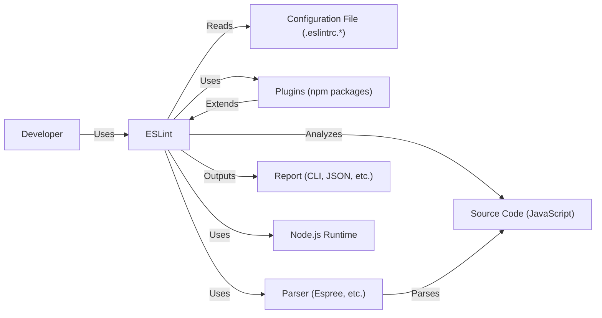
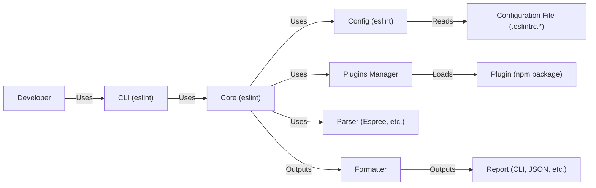
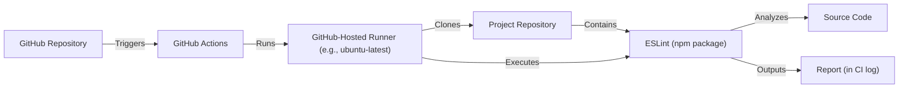
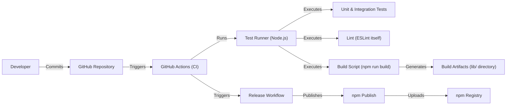

Okay, let's create a design document for the ESLint project, focusing on aspects relevant for threat modeling.

# BUSINESS POSTURE

ESLint is a widely-used, open-source, static code analysis tool for identifying and reporting on patterns found in ECMAScript/JavaScript code. Its primary goal is to help developers write better, more consistent, and less error-prone code.

Priorities and Goals:

*   Maintainability: Ensure the ESLint codebase is easy to maintain and extend.
*   Extensibility: Allow users to easily customize and extend ESLint with their own rules and configurations.
*   Accuracy: Minimize false positives and false negatives in code analysis.
*   Performance: Provide fast and efficient code analysis.
*   Community Trust: Maintain the trust of the large JavaScript community that relies on ESLint.
*   Adoption: Encourage widespread adoption and use of ESLint in JavaScript projects.

Business Risks:

*   Compromised Codebase: Malicious code introduced into the ESLint codebase could lead to widespread vulnerabilities in projects using ESLint. This is the most significant risk.
*   Supply Chain Attacks: Compromised dependencies or plugins could introduce vulnerabilities.
*   Reputation Damage: Security vulnerabilities or significant bugs could damage ESLint's reputation and lead to decreased adoption.
*   Incorrect Analysis: Inaccurate linting rules could lead to developers introducing bugs or security vulnerabilities into their code.
*   Performance Degradation: Slow linting performance could hinder developer productivity.
*   Plugin Ecosystem Risks: The large and open plugin ecosystem presents a significant attack surface.

# SECURITY POSTURE

Existing Security Controls:

*   security control: Code Reviews: All code changes go through a code review process. (Described in CONTRIBUTING.md)
*   security control: Automated Testing: ESLint has an extensive suite of unit and integration tests. (Described in CONTRIBUTING.md)
*   security control: Static Analysis: ESLint uses itself to lint its own codebase.
*   security control: Dependency Management: Dependencies are managed using npm and package-lock.json.
*   security control: Security Policy: ESLint has a security policy outlining how to report vulnerabilities. (Described in SECURITY.md)
*   security control: Two-Factor Authentication (2FA): Enforced for maintainers publishing to npm.
*   security control: Contributor License Agreement (CLA): Requires contributors to sign a CLA. (Described in CONTRIBUTING.md)

Accepted Risks:

*   accepted risk: Reliance on Community Plugins: ESLint's extensibility relies on community-maintained plugins, which may have varying levels of security.
*   accepted risk: Limited Resources for Security Audits: As an open-source project, ESLint may have limited resources for comprehensive security audits.

Recommended Security Controls:

*   security control: Implement a Software Bill of Materials (SBOM) for each release.
*   security control: Regularly perform dependency vulnerability scanning using tools like npm audit or Snyk.
*   security control: Consider implementing a bug bounty program to incentivize security researchers to find and report vulnerabilities.
*   security control: Provide security guidelines and best practices for plugin developers.
*   security control: Implement automated security checks in the CI/CD pipeline (e.g., SAST, DAST, SCA).

Security Requirements:

*   Authentication: Not directly applicable to ESLint itself, as it's a command-line tool. However, authentication is relevant for maintainers publishing to npm (2FA is already in place).
*   Authorization: Not directly applicable to ESLint itself. Authorization is relevant for maintainers accessing the repository and publishing to npm.
*   Input Validation: ESLint parses JavaScript code, which is inherently complex. Input validation is crucial to prevent vulnerabilities like code injection or denial-of-service. The parser (Espree, or a custom parser) must be robust against malformed input.
*   Cryptography: Not directly used by ESLint for its core functionality. However, ESLint may interact with cryptographic libraries if used to analyze code that uses cryptography.  ESLint should have rules to detect common cryptographic misuses.

# DESIGN

## C4 CONTEXT

Element Descriptions:

*   Element:
    *   Name: Developer
    *   Type: Person
    *   Description: A software developer who uses ESLint to analyze their code.
    *   Responsibilities: Writes code, configures ESLint, runs ESLint, and interprets the results.
    *   Security controls: N/A (External to ESLint)

*   Element:
    *   Name: ESLint
    *   Type: Software System
    *   Description: The core ESLint application.
    *   Responsibilities: Parses configuration, loads plugins, analyzes code, and generates reports.
    *   Security controls: Code Reviews, Automated Testing, Static Analysis, Dependency Management, Security Policy, 2FA for npm publishing.

*   Element:
    *   Name: Configuration File (.eslintrc.*)
    *   Type: File
    *   Description: A file containing ESLint configuration settings (rules, environments, etc.).
    *   Responsibilities: Defines how ESLint should analyze code.
    *   Security controls: Input validation of configuration file.

*   Element:
    *   Name: Source Code (JavaScript)
    *   Type: File
    *   Description: The JavaScript code being analyzed by ESLint.
    *   Responsibilities: N/A (Input to ESLint)
    *   Security controls: N/A (External to ESLint)

*   Element:
    *   Name: Plugins (npm packages)
    *   Type: Software System
    *   Description: External npm packages that extend ESLint's functionality (e.g., with custom rules).
    *   Responsibilities: Provide additional linting rules and functionality.
    *   Security controls: Dependency Management, (Ideally) Security Guidelines for Plugin Developers.

*   Element:
    *   Name: Parser (Espree, etc.)
    *   Type: Software System
    *   Description: The parser used by ESLint to convert JavaScript code into an Abstract Syntax Tree (AST).
    *   Responsibilities: Parse JavaScript code and generate an AST.
    *   Security controls: Robust input validation, fuzz testing of the parser.

*   Element:
    *   Name: Report (CLI, JSON, etc.)
    *   Type: Output
    *   Description: The output generated by ESLint, reporting any detected issues.
    *   Responsibilities: Presents linting results to the developer.
    *   Security controls: N/A

*   Element:
    *   Name: Node.js Runtime
    *   Type: Platform
    *   Description: The Node.js runtime environment required to run ESLint.
    *   Responsibilities: Executes ESLint code.
    *   Security controls: Keep Node.js updated to the latest LTS version.

## C4 CONTAINER

Element Descriptions:

*   Element:
    *   Name: CLI (eslint)
    *   Type: Command-Line Interface
    *   Description: The command-line interface for interacting with ESLint.
    *   Responsibilities: Parses command-line arguments, invokes the core ESLint functionality.
    *   Security controls: Input validation of command-line arguments.

*   Element:
    *   Name: Core (eslint)
    *   Type: Application
    *   Description: The core ESLint application logic.
    *   Responsibilities: Manages the linting process, loads configuration, loads plugins, invokes the parser, and generates reports.
    *   Security controls: Code Reviews, Automated Testing, Static Analysis.

*   Element:
    *   Name: Config (eslint)
    *   Type: Component
    *   Description: Handles loading and processing ESLint configuration.
    *   Responsibilities: Reads configuration files, resolves configuration inheritance, and provides configuration data to the core.
    *   Security controls: Input validation of configuration data.

*   Element:
    *   Name: Plugins Manager
    *   Type: Component
    *   Description: Manages loading and using ESLint plugins.
    *   Responsibilities: Resolves plugin dependencies, loads plugin modules, and provides access to plugin functionality.
    *   Security controls: Dependency Management.

*   Element:
    *   Name: Parser (Espree, etc.)
    *   Type: Library
    *   Description: The parser used by ESLint to convert JavaScript code into an Abstract Syntax Tree (AST).
    *   Responsibilities: Parse JavaScript code and generate an AST.
    *   Security controls: Robust input validation, fuzz testing of the parser.

*   Element:
    *   Name: Formatter
    *   Type: Component
    *   Description: Formats the linting results into a user-readable format.
    *   Responsibilities: Takes the raw linting results and formats them for output (e.g., to the console or a file).
    *   Security controls: N/A

*   Element:
      * Name: Report (CLI, JSON, etc.)
      * Type: Output
      * Description: The output generated by ESLint, reporting any detected issues.
      * Responsibilities: Presents linting results to the developer.
      * Security controls: N/A

*   Element:
    *   Name: Plugin (npm package)
    *   Type: Library
    *   Description: An individual ESLint plugin (e.g., eslint-plugin-react).
    *   Responsibilities: Provides specific linting rules and functionality.
    *   Security controls: (Ideally) Security Guidelines for Plugin Developers.

*  Element:
    *   Name: Configuration File (.eslintrc.*)
    *   Type: File
    *   Description: A file containing ESLint configuration settings (rules, environments, etc.).
    *   Responsibilities: Defines how ESLint should analyze code.
    *   Security controls: Input validation of configuration file.

## DEPLOYMENT

Possible Deployment Solutions:

1.  Local Installation: Users install ESLint locally within their project using npm or yarn.
2.  Global Installation: Users install ESLint globally on their system using npm or yarn.
3.  CI/CD Integration: ESLint is integrated into a CI/CD pipeline (e.g., GitHub Actions, Jenkins, CircleCI) to automatically run on code changes.
4.  Online IDE Integration: Some online IDEs (e.g. repl.it) have built-in support for ESLint.

Chosen Deployment Solution (CI/CD Integration - GitHub Actions):

Element Descriptions:

*   Element:
    *   Name: GitHub Repository
    *   Type: Source Code Repository
    *   Description: The repository containing the project's code and the GitHub Actions workflow.
    *   Responsibilities: Stores the code and triggers the CI/CD pipeline.
    *   Security controls: Access controls, branch protection rules.

*   Element:
    *   Name: GitHub Actions
    *   Type: CI/CD Platform
    *   Description: The GitHub Actions service that orchestrates the CI/CD pipeline.
    *   Responsibilities: Manages the workflow execution, provisions runners, and reports results.
    *   Security controls: GitHub Actions security features (e.g., secrets management, environment protection rules).

*   Element:
    *   Name: GitHub-Hosted Runner (e.g., ubuntu-latest)
    *   Type: Virtual Machine
    *   Description: A virtual machine provided by GitHub Actions to run the workflow.
    *   Responsibilities: Executes the steps defined in the workflow.
    *   Security controls: Regularly updated with security patches, isolated execution environment.

*   Element:
    *   Name: Project Repository
    *   Type: Source Code Repository
    *   Description: A clone of the project's repository on the runner.
    *   Responsibilities: Provides the code to be analyzed.
    *   Security controls: N/A (Content is determined by the project)

*   Element:
    *   Name: ESLint (npm package)
    *   Type: Software System
    *   Description: The ESLint package installed as a development dependency.
    *   Responsibilities: Performs the code analysis.
    *   Security controls: All ESLint security controls apply.

*   Element:
    *   Name: Source Code
    *   Type: File
    *   Description: The source code being analyzed.
    *   Responsibilities: N/A
    *   Security controls: N/A

*   Element:
    *   Name: Report (in CI log)
    *   Type: Output
    *   Description: The ESLint report, displayed in the GitHub Actions logs.
    *   Responsibilities: Shows the results of the analysis.
    *   Security controls: N/A

## BUILD

Build Process Description:

1.  Developers commit code changes to the GitHub repository.
2.  GitHub Actions is triggered by commits to specific branches (e.g., main, release branches).
3.  The CI workflow runs on a GitHub-hosted runner (e.g., ubuntu-latest).
4.  The workflow checks out the code, installs dependencies (using npm and package-lock.json), and runs tests (unit and integration tests).
5.  ESLint itself is used to lint the ESLint codebase (self-linting).
6.  A build script (npm run build) is executed, which typically transpiles the code (if necessary) and prepares it for distribution.
7.  Build artifacts are generated (usually in the lib/ directory).
8.  A separate release workflow is triggered (e.g., by creating a tag).
9.  The release workflow publishes the package to the npm registry using npm publish.  This requires 2FA authentication for authorized maintainers.

Security Controls in Build Process:

*   security control: Dependency Management: npm and package-lock.json ensure consistent and reproducible builds.
*   security control: Automated Testing: Unit and integration tests help prevent regressions and ensure code quality.
*   security control: Static Analysis: ESLint itself is used to lint the codebase, catching potential issues early.
*   security control: 2FA for npm Publishing: Protects against unauthorized package releases.
*   security control: CI/CD Pipeline: Automates the build and release process, reducing the risk of manual errors.
*   security control: Code Reviews: All code changes are reviewed before merging.

# RISK ASSESSMENT

Critical Business Processes:

*   Code Analysis: The core process of analyzing JavaScript code for potential issues.
*   Plugin Ecosystem: The ability for users to extend ESLint with custom rules and plugins.
*   Release Management: The process of building, testing, and releasing new versions of ESLint.

Data to Protect:

*   Source Code (Indirectly): ESLint analyzes source code, but it doesn't store it directly. However, vulnerabilities in ESLint could be exploited to gain access to or modify source code. Sensitivity: Varies greatly depending on the project being analyzed.
*   Configuration Files: ESLint configuration files can contain sensitive information (e.g., custom rules that reveal internal coding practices). Sensitivity: Low to Medium.
*   npm Credentials: The credentials used to publish ESLint to the npm registry. Sensitivity: High.
*   ESLint codebase: Source code of ESLint project. Sensitivity: High.

# QUESTIONS & ASSUMPTIONS

Questions:

*   Are there any specific compliance requirements (e.g., industry standards or regulations) that ESLint needs to adhere to?
*   What is the process for handling security vulnerabilities reported by external researchers?
*   What is the level of security expertise within the ESLint maintainer team?
*   What is the frequency of security audits or penetration testing?
*   Are there any plans to implement more advanced security features, such as code signing or supply chain security measures?

Assumptions:

*   BUSINESS POSTURE: The ESLint project prioritizes security and is willing to invest resources in improving its security posture.
*   BUSINESS POSTURE: The ESLint maintainer team is responsive to security concerns and acts promptly to address vulnerabilities.
*   SECURITY POSTURE: The existing security controls (code reviews, automated testing, etc.) are effectively implemented and maintained.
*   SECURITY POSTURE: The npm registry is a trusted platform for distributing ESLint.
*   DESIGN: The provided GitHub repository is the official and primary repository for ESLint.
*   DESIGN: The build and release process described above is accurate and up-to-date.
*   DESIGN: Node.js and npm are correctly configured and secured on developer machines and CI/CD runners.