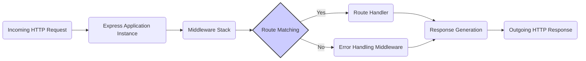

# Project Design Document: Express.js Framework

**Version:** 1.1
**Date:** October 26, 2023
**Author:** AI Software Architect

## 1. Introduction

This document provides a detailed architectural design of the Express.js framework, focusing on aspects relevant to security analysis and threat modeling. It outlines the core components, their interactions, and the flow of data within the framework. This document is intended to serve as a foundation for threat modeling activities, enabling security professionals to identify potential vulnerabilities and attack vectors within the framework and applications built upon it.

## 2. Goals and Objectives

The primary goals of Express.js are to provide:

*   A minimal and flexible Node.js web application framework, offering essential features without being overly prescriptive.
*   A robust and performant foundation for building various types of web applications, including single-page applications (SPAs), multi-page applications (MPAs), and APIs.
*   A thin abstraction layer over Node.js's built-in HTTP modules, simplifying common web development tasks.
*   An unopinionated architecture, empowering developers to choose their preferred libraries and tools for specific functionalities.
*   A highly extensible framework through a rich ecosystem of middleware and plugins.

## 3. Architectural Overview

Express.js employs a middleware-centric architecture where incoming HTTP requests are processed through a pipeline of middleware functions. This modular design allows for a clear separation of concerns and facilitates the implementation of cross-cutting functionalities.

## 4. Core Components

*   **Application Instance (`express()`):** The central object representing the web application. It manages routing, middleware registration, application settings, and inherits from Node.js's `http.Server`.
*   **Router:**  A component responsible for defining and managing application routes. It maps incoming request URLs and HTTP methods to specific handler functions. Routers can be modular and mounted at different paths within the application.
*   **Middleware:** Functions that intercept and process incoming HTTP requests before they reach the route handlers (or during error handling). Middleware functions have access to the request object (`req`), the response object (`res`), and the `next` function to pass control to the subsequent middleware. Examples include:
    *   **Request Preprocessing:** Body parsing, cookie handling, request validation.
    *   **Authentication and Authorization:** Verifying user identity and permissions.
    *   **Logging and Monitoring:** Recording request details and application behavior.
    *   **Static File Serving:** Serving static assets like images, CSS, and JavaScript files.
    *   **Security Middleware:** Implementing security measures like CORS, HSTS, and rate limiting.
    *   **Error Handling:** Catching and processing errors that occur during request processing.
*   **Request Object (`req`):** An object containing information about the incoming HTTP request, including:
    *   Headers (`req.headers`)
    *   URL parameters (`req.params`)
    *   Query string parameters (`req.query`)
    *   Request body (`req.body`)
    *   Cookies (`req.cookies`)
    *   Session data (if session middleware is used) (`req.session`)
*   **Response Object (`res`):** An object used to construct and send the HTTP response back to the client. It provides methods for:
    *   Setting headers (`res.set()`, `res.header()`)
    *   Setting the HTTP status code (`res.status()`)
    *   Sending data (`res.send()`, `res.json()`, `res.render()`, `res.sendFile()`)
    *   Redirecting the client (`res.redirect()`)

## 5. Detailed Design

### 5.1. Application Initialization

*   An Express.js application is created by calling the `express()` function.
*   Application-level settings can be configured on the application instance (e.g., `app.set('view engine', 'pug')`).
*   Middleware is registered using methods like `app.use()`.

### 5.2. Routing Mechanism

*   Routes are defined using HTTP method-specific functions on the application or router instance (e.g., `app.get('/users', handler)`).
*   Route paths can include parameters (e.g., `/users/:id`).
*   The `Router` component matches incoming requests to defined routes based on the HTTP method and URL path.
*   Route handlers are functions that execute when a matching route is found. They receive the `req` and `res` objects as arguments.
*   Multiple handlers can be associated with a single route, forming a middleware chain specific to that route.

### 5.3. Middleware Processing Flow

1. An incoming HTTP request arrives at the Express.js application.
2. The request is passed to the first middleware function in the stack.
3. Each middleware function can:
    *   Process the request and modify the `req` or `res` objects.
    *   Send a response, terminating the request-response cycle.
    *   Pass control to the next middleware in the stack by calling `next()`.
4. Middleware functions are executed in the order they are registered.
5. If a matching route is found, the route handler(s) are executed.
6. If no matching route is found, a "Not Found" handler (often a default middleware) may be invoked.
7. Error-handling middleware, defined with four arguments (`err`, `req`, `res`, `next`), is invoked when an error is passed to the `next()` function. Error-handling middleware should be defined after all other middleware and routes.

### 5.4. Data Flow

*   **Incoming Request:** HTTP request data (headers, body, parameters, cookies) is encapsulated in the `req` object.
*   **Middleware Processing:** Middleware functions can access and modify the `req` and `res` objects. For example, body-parsing middleware extracts data from the request body and populates `req.body`. Authentication middleware might add user information to `req`.
*   **Route Handling:** Route handlers receive the processed `req` object and use its data to perform business logic.
*   **Response Generation:** Route handlers use the `res` object to construct the HTTP response, setting headers, status codes, and the response body.
*   **Outgoing Response:** The `res` object is used to send the formatted HTTP response back to the client.

### 5.5. Key Data Structures

*   **Middleware Stack:** An ordered list (typically an array) of middleware functions associated with the application or a specific router.
*   **Route Table:** A data structure (often a tree or a hash map) that stores the defined routes and their corresponding handlers, organized by HTTP method and path.
*   **Request Object (`req`):** Contains properties holding request-specific data (see Core Components).
*   **Response Object (`res`):** Contains methods and properties for building and sending the HTTP response (see Core Components).

## 6. Security Considerations (Threat Modeling Focus)

This section highlights potential security vulnerabilities and attack vectors relevant for threat modeling Express.js applications:

*   **Middleware Vulnerabilities:**
    *   **Third-party middleware:** Vulnerabilities in commonly used middleware (e.g., body-parsers, authentication libraries) can directly impact the application's security. *Threat Scenario: Exploiting a known vulnerability in a body-parser middleware to cause a denial-of-service or remote code execution.*
    *   **Custom middleware:**  Poorly written custom middleware can introduce vulnerabilities like improper input validation or insecure session handling. *Threat Scenario: A custom authentication middleware with a flaw allowing bypass of authentication checks.*
*   **Input Validation Failures:**
    *   **Injection Attacks (SQL, NoSQL, Command Injection, XSS):** Lack of proper validation and sanitization of user inputs can allow attackers to inject malicious code or commands. *Threat Scenario: Injecting malicious JavaScript code into a form field that is later displayed on another user's page (XSS).*
    *   **Path Traversal:** Insufficient validation of file paths can allow attackers to access arbitrary files on the server. *Threat Scenario: Manipulating a file upload path to overwrite system files.*
*   **Output Encoding Issues:**
    *   **Cross-Site Scripting (XSS):** Failure to properly encode data before rendering it in HTML can allow attackers to inject malicious scripts that execute in the victim's browser. *Threat Scenario: Displaying user-provided data without escaping HTML characters, allowing an attacker to inject JavaScript to steal cookies.*
*   **Session Management Weaknesses:**
    *   **Session Fixation:** Allowing attackers to set a user's session ID. *Threat Scenario: An attacker provides a session ID to a victim, and then uses that same ID to access the victim's account after they log in.*
    *   **Session Hijacking:** Stealing a valid session ID, often through XSS or network interception. *Threat Scenario: An attacker intercepts a user's session cookie and uses it to impersonate the user.*
    *   **Insecure Session Storage:** Storing session data in a way that is easily accessible or not properly encrypted. *Threat Scenario: Session data stored in local storage being accessed by malicious scripts.*
*   **Cookie Security Misconfigurations:**
    *   **Missing `HttpOnly` flag:** Allows client-side scripts to access cookies, increasing the risk of XSS attacks stealing session cookies.
    *   **Missing `Secure` flag:** Cookies are transmitted over insecure HTTP connections, making them vulnerable to interception.
    *   **Insecure `SameSite` attribute:** Can make the application vulnerable to CSRF attacks.
*   **Cross-Site Request Forgery (CSRF):** Lack of CSRF protection allows attackers to trick authenticated users into performing unintended actions. *Threat Scenario: An attacker embeds a malicious link in an email that, when clicked by an authenticated user, transfers funds from their account.*
*   **Denial of Service (DoS) Vulnerabilities:**
    *   **Resource Exhaustion:**  Lack of rate limiting or proper handling of large requests can allow attackers to overwhelm the server. *Threat Scenario: Sending a large number of requests to exhaust server resources and make the application unavailable.*
    *   **Regular Expression Denial of Service (ReDoS):** Using inefficient regular expressions that can cause excessive CPU usage. *Threat Scenario: Providing a specially crafted input string that causes a regular expression to take an extremely long time to process.*
*   **Dependency Vulnerabilities:** Using outdated or vulnerable dependencies can expose the application to known security flaws. *Threat Scenario: A known vulnerability in a logging library allows an attacker to gain remote code execution.*
*   **Error Handling and Information Disclosure:**  Displaying detailed error messages in production can reveal sensitive information about the application's internal workings. *Threat Scenario: Error messages revealing database connection strings or file paths.*
*   **Rate Limiting Absence:** Lack of rate limiting on authentication endpoints can facilitate brute-force attacks. *Threat Scenario: An attacker repeatedly trying different passwords to gain access to an account.*
*   **HTTP Header Security Issues:** Missing or misconfigured security headers (e.g., `Strict-Transport-Security`, `Content-Security-Policy`, `X-Frame-Options`) can leave the application vulnerable to various attacks. *Threat Scenario: Lack of `X-Frame-Options` allowing clickjacking attacks.*

## 7. Assumptions and Constraints

*   This document describes the general architecture of Express.js. Specific implementations and configurations in individual applications may vary.
*   It is assumed that developers using Express.js have a foundational understanding of web security principles.
*   The security considerations listed are not exhaustive and should be used as a starting point for a more in-depth threat modeling exercise.

## 8. Future Considerations

*   Potential enhancements to the core framework to provide more built-in security features.
*   Evolving best practices for securing Express.js applications.
*   Integration with modern security standards and technologies.

This improved design document provides a more detailed and security-focused overview of the Express.js framework, making it a more effective resource for threat modeling activities. By understanding the architecture, data flow, and potential vulnerabilities, security professionals can better assess and mitigate risks associated with Express.js applications.
