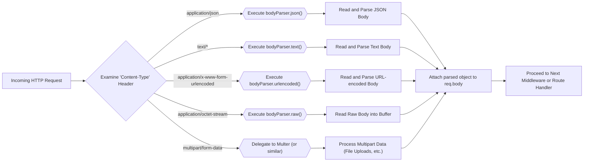
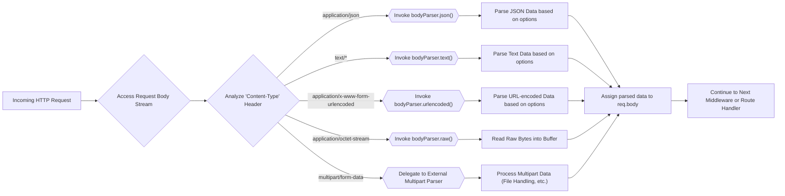

# Project Design Document: body-parser

**Version:** 1.1
**Date:** October 26, 2023
**Author:** AI Software Architect

## 1. Introduction

This document provides an enhanced and more detailed design overview of the `body-parser` middleware for Express.js. Building upon the previous version, it aims to provide an even clearer articulation of the component's architecture, functionality, and data flow to facilitate a more effective and comprehensive threat modeling process. This document serves as a robust foundation for identifying potential security vulnerabilities and designing appropriate mitigation strategies.

### 1.1. Purpose

The primary purpose of this document is to furnish a highly detailed technical description of the `body-parser` library. This enhanced description will serve as a refined and more informative input for a subsequent threat modeling exercise, enabling a deeper analysis of potential security risks.

### 1.2. Scope

This document comprehensively covers the core functionality of the `body-parser` library, including a detailed breakdown of its different parsing strategies, internal mechanisms, and configuration options. The focus remains on the processing of incoming HTTP request bodies and the nuances of each supported content type.

### 1.3. Target Audience

This document is intended for a technical audience, including:

* Security engineers responsible for in-depth threat modeling and security assessments.
* Developers actively working with, maintaining, or extending the `body-parser` library.
* Software architects designing systems that integrate and rely upon `body-parser`.

## 2. Overview

`body-parser` is a crucial middleware for Express.js applications, acting as a gatekeeper for incoming request data. It intercepts requests before they reach route handlers, parsing the request body based on the `Content-Type` header and making the processed data readily accessible via the `req.body` property. This middleware supports a variety of common content types, including JSON, raw text, URL-encoded data, and the handling of multipart/form-data (often delegated to other libraries). Understanding its intricacies is vital for securing web applications.

### 2.1. Key Functionalities

* **Intelligent Request Body Parsing:** The fundamental function is to interpret the raw request body and transform it into a structured and easily usable format, such as a JavaScript object for JSON or key-value pairs for URL-encoded data.
* **Content Type Discrimination and Handling:**  It dynamically selects the appropriate parsing logic based on the `Content-Type` header of the incoming request, ensuring correct interpretation of the data.
* **Seamless Middleware Integration:**  Operating as a standard Express.js middleware, it seamlessly integrates into the request/response pipeline, intercepting requests at the appropriate stage.
* **Extensive Configuration Options for Granular Control:**  It offers a rich set of options to fine-tune parsing behavior, including setting strict size limits, managing encoding, and implementing custom verification logic.

## 3. Architecture

`body-parser` is architected as a suite of specialized middleware functions, each dedicated to handling a specific content type. When an incoming request arrives at an Express.js application, these middleware functions are evaluated and executed based on the request's `Content-Type` header.

### 3.1. Core Components and Their Responsibilities

* **`bodyParser.json(options)`:** This middleware is responsible for parsing request bodies with the `application/json` content type. It deserializes the JSON string into a JavaScript object.
* **`bodyParser.raw(options)`:** This middleware handles request bodies with content types like `application/octet-stream`. It reads the raw body and makes it available as a `Buffer` object.
* **`bodyParser.text(options)`:** This middleware parses request bodies with text-based content types (e.g., `text/plain`, `text/html`). It decodes the body into a string.
* **`bodyParser.urlencoded(options)`:** This middleware is designed to parse request bodies with the `application/x-www-form-urlencoded` content type. It decodes the URL-encoded data into a JavaScript object or uses the `qs` library for more complex structures depending on the `extended` option.
* **`bodyParser.multipart(options)` (Indirectly via other libraries):** While `body-parser` itself doesn't directly implement multipart parsing, it's crucial to acknowledge its role in the ecosystem. Libraries like `multer` are commonly used alongside `body-parser` to handle `multipart/form-data`, and their interaction is a relevant architectural consideration.

### 3.2. Detailed Middleware Execution Flow

The execution flow of `body-parser` middleware within an Express.js application is as follows:

### 3.3. Configuration Options - A Deeper Dive

Each of the core `body-parser` middleware functions accepts an `options` object, allowing for fine-grained control over parsing behavior:

* **`limit`:**  This option sets the maximum allowed size of the request body in bytes. It's crucial for preventing denial-of-service attacks by limiting resource consumption.
* **`inflate`:**  A boolean value indicating whether to attempt to decompress compressed request bodies (using `gzip` or `deflate`).
* **`reviver` (for JSON):**  A function that can be used to transform the results of JSON parsing. It's applied to each key and value pair during deserialization.
* **`strict` (for JSON):**  When set to `true`, only accepts arrays and objects at the top level of the JSON body. This can help prevent certain types of attacks.
* **`type`:**  Allows specifying the media type or an array of media types that the middleware will handle. This provides more precise control over which requests are processed.
* **`verify`:**  A function that takes the request, response, and buffer as arguments and allows for custom verification of the request body before parsing.
* **`extended` (for urlencoded):**  Determines the parsing algorithm for URL-encoded data. When `false`, it uses the `querystring` library, which is simpler. When `true`, it uses the more powerful `qs` library, allowing for parsing of nested objects and arrays.
* **`parameterLimit` (for urlencoded):**  Specifies the maximum number of parameters that are allowed in the URL-encoded request body. This helps prevent potential hash flooding attacks.

## 4. Data Flow - A Detailed Walkthrough

The data flow within `body-parser` can be broken down into the following detailed stages:

1. **HTTP Request Arrival:** The Express.js server receives an incoming HTTP request containing a body.
2. **Content-Type Header Examination:** The `body-parser` middleware chain begins processing the request, and the relevant middleware function inspects the `Content-Type` header to determine the body's format.
3. **Middleware Selection and Invocation:** Based on the `Content-Type`, the appropriate `body-parser` middleware function (e.g., `bodyParser.json()`, `bodyParser.urlencoded()`) is selected and executed.
4. **Request Body Stream Reading:** The selected middleware reads the raw bytes of the request body from the incoming request stream.
5. **Parsing and Transformation:** The middleware applies the specific parsing logic for the identified content type, transforming the raw bytes into a structured data format (e.g., a JavaScript object, a string, or a Buffer). Configuration options (like `limit`, `inflate`, `extended`) influence this stage.
6. **Data Attachment to `req.body`:** The successfully parsed data is then attached as a property named `body` to the `req` (request) object. This makes the parsed data accessible to subsequent middleware and route handlers.
7. **Progression to the Next Stage:** The request is passed on to the next middleware in the Express.js middleware chain or, if it's the final middleware, to the designated route handler.

## 5. Dependencies and Their Security Implications

`body-parser` strives to maintain a minimal set of direct dependencies. However, its functionality inherently relies on core Node.js modules and may optionally utilize other libraries depending on the configured parsing middleware. Understanding these dependencies is crucial for assessing the overall security posture.

* **Core Node.js Modules (Implicit Dependencies):**
    * `http` or `https`:  Fundamental for handling HTTP requests and responses. Vulnerabilities in these core modules could indirectly affect `body-parser`.
    * `zlib`: Used for decompressing request bodies when the `inflate` option is enabled. Security issues in `zlib` could be relevant.
    * `Buffer`: Essential for handling raw binary data. Improper handling of Buffers can lead to vulnerabilities.
    * `stream`: Used for efficiently processing request body streams.
* **Optional Dependencies (Potential Attack Surface):**
    * `iconv-lite`:  Used for character encoding conversion. Vulnerabilities in this library related to encoding handling could be exploited.
    * `raw-body`:  A utility for efficiently reading request bodies into a buffer.
    * `type-is`:  Used for determining the content type of a request. Incorrect content type detection could lead to bypasses.
    * `qs`:  Used for parsing complex URL-encoded data when `extended` is `true`. Vulnerabilities in `qs` (like prototype pollution) are well-documented and a significant concern.
    * External Multipart Parsing Libraries (e.g., `multer`, `formidable`): When handling `multipart/form-data`, `body-parser` often works in conjunction with these libraries. Their security vulnerabilities directly impact the application.

## 6. Security Considerations for Threat Modeling

This section highlights potential security vulnerabilities and attack vectors that should be thoroughly investigated during the threat modeling process.

* **Denial of Service (DoS) Attacks:**
    * **Unbounded Request Body Size:**  If the `limit` option is not set or is set too high, attackers can send extremely large request bodies, overwhelming server resources (memory, CPU).
    * **Complex Data Structures (JSON/URL-encoded):**  Sending deeply nested or excessively large JSON or URL-encoded payloads can consume significant CPU time during parsing, leading to DoS.
* **Prototype Pollution:**  Particularly relevant when using the `qs` library for URL-encoded parsing or when handling JSON, malicious input can manipulate the prototype chain of JavaScript objects, potentially leading to arbitrary code execution or other unexpected behavior.
* **Cross-Site Scripting (XSS):** If the parsed data from `req.body` is directly rendered in a web page without proper sanitization or encoding, attackers can inject malicious scripts.
* **Indirect SQL Injection:** While `body-parser` doesn't directly interact with databases, vulnerabilities or lack of proper sanitization in downstream code that uses the parsed data can lead to SQL injection vulnerabilities.
* **Information Disclosure:**  Error messages generated during parsing or handling of invalid data might inadvertently reveal sensitive information about the server or application's internal workings.
* **Security Bypass:**  Incorrectly configured or vulnerable parsing logic could potentially bypass other security measures or validation checks implemented in the application.
* **Dependency Vulnerabilities:**  As highlighted in the Dependencies section, vulnerabilities in the underlying libraries used by `body-parser` (especially `qs` and multipart parsing libraries) can be exploited.
* **Multipart Handling Vulnerabilities (File Uploads):**  Improper handling of file uploads (if using `multer` or similar) can lead to various critical vulnerabilities, including:
    * **Path Traversal:** Attackers could manipulate file paths to write files to arbitrary locations on the server.
    * **Arbitrary File Upload:**  Uploading malicious files (e.g., executable code) that can then be accessed and executed on the server.
    * **Denial of Storage:** Filling up server storage with excessively large uploaded files.

## 7. Threat Modeling Scope - Key Questions and Areas of Focus

The subsequent threat modeling exercise should specifically address the following questions and areas of focus to identify potential vulnerabilities:

* **Input Validation and Sanitization:**
    * How rigorously does `body-parser` validate the incoming request body against the declared `Content-Type`?
    * Are there any built-in sanitization mechanisms, or is this the responsibility of downstream middleware/application logic?
    * How does it handle malformed or unexpected input?
* **Error Handling and Information Exposure:**
    * What types of errors can occur during parsing?
    * How are these errors handled and reported?
    * Could error messages reveal sensitive information?
* **Resource Management and Limits:**
    * Are the `limit` options sufficient to prevent DoS attacks?
    * How does `body-parser` handle resource consumption during parsing of complex data structures?
* **Dependency Security:**
    * What are the known vulnerabilities in the dependencies used by `body-parser`?
    * How are these dependencies managed and updated?
* **Configuration Security:**
    * What are the security implications of different configuration options (e.g., `extended`, `strict`, `inflate`)?
    * Are there any default configurations that could be considered insecure?
* **Multipart Handling Security (if applicable):**
    * If `multer` or a similar library is used, what are the potential vulnerabilities related to file uploads (path traversal, arbitrary file upload, etc.)?
    * How is file size, type, and content validated?
* **Attack Vectors to Consider:**
    * Sending excessively large request bodies.
    * Sending deeply nested JSON or URL-encoded data.
    * Sending malformed or invalid data.
    * Exploiting known vulnerabilities in dependencies (e.g., prototype pollution in `qs`).
    * Attempting to bypass content type checks.
    * Exploiting vulnerabilities in multipart handling (if enabled).

This enhanced document provides a more in-depth understanding of the architecture, functionality, and potential security considerations of `body-parser`, enabling a more thorough and effective threat modeling process.