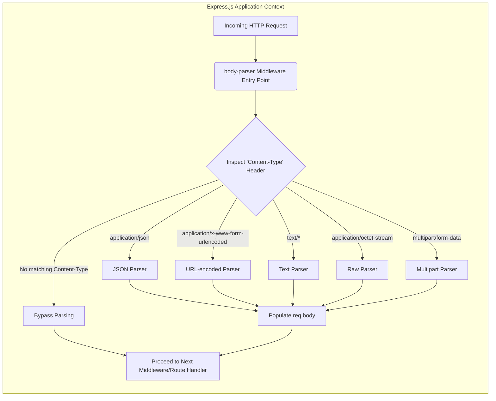
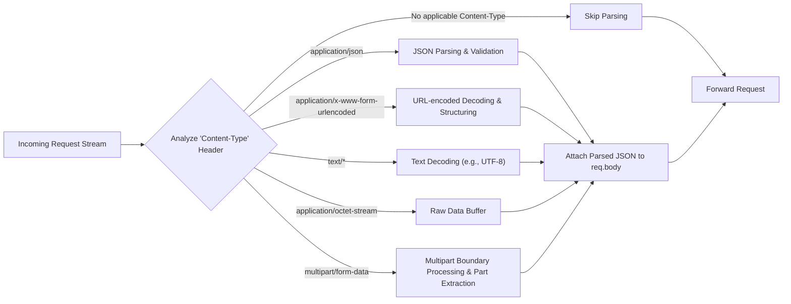

# Project Design Document: expressjs/body-parser

**Version:** 1.1
**Date:** October 26, 2023
**Author:** AI Software Architect

## 1. Introduction

This document provides an enhanced design overview of the `body-parser` middleware for Express.js, as found in the GitHub repository [https://github.com/expressjs/body-parser](https://github.com/expressjs/body-parser). This revised document aims to provide a more granular and precise articulation of the architecture, components, and data flow within `body-parser`, further strengthening the foundation for subsequent threat modeling activities.

`body-parser` is a fundamental middleware within the Express.js ecosystem. Its core function is to process the incoming request bodies before they reach your route handlers, populating the `req.body` property with parsed data. It supports a range of common content types, including JSON, raw text, URL-encoded data from forms, and multipart form data for file uploads. A deep understanding of its internal mechanisms is crucial for proactively identifying and mitigating potential security risks.

## 2. Goals and Non-Goals

**Goals:**

*   Present a clear, comprehensive, and more detailed overview of the `body-parser` architecture and its constituent components.
*   Provide a refined description of the data flow within the middleware, from the initial request reception to the availability of parsed data.
*   Identify key functionalities, decision points, and potential points of interaction within the parsing process with greater specificity.
*   Establish an even more robust and detailed foundation for conducting thorough and effective threat modeling.

**Non-Goals:**

*   Serve as a detailed, line-by-line code-level implementation guide.
*   Execute an actual threat analysis, penetration test, or vulnerability assessment.
*   Propose specific security mitigations, code fixes, or patches.
*   Exhaustively document every single edge case, obscure configuration option, or historical implementation detail.

## 3. Architectural Overview

`body-parser` functions as a series of middleware handlers within the Express.js request processing pipeline. Upon receiving an incoming HTTP request, it intercepts the request stream, critically examines the `Content-Type` header, and dynamically selects and applies the appropriate parsing logic from its suite of parsers. The resulting parsed data is then meticulously attached to the `req.body` object, ensuring its accessibility to subsequent middleware functions and the designated route handler.

## 4. Component Description

`body-parser` is architected as a collection of specialized parser components, each meticulously designed to handle a specific content type. The primary components include:

*   **Main Middleware Dispatcher:** This serves as the initial entry point for the `body-parser` middleware. Its core responsibility is to analyze the `Content-Type` header of the incoming request and intelligently delegate the parsing task to the most appropriate specialized parser.
*   **JSON Parser (`application/json`):** This component is dedicated to processing requests with the `application/json` content type. It internally utilizes `JSON.parse()` (or similar secure JSON parsing mechanisms) to meticulously transform the JSON string present in the request body into a native JavaScript object. Error handling during parsing is a critical aspect of this component.
*   **URL-encoded Parser (`application/x-www-form-urlencoded`):** This parser is responsible for handling requests bearing the `application/x-www-form-urlencoded` content type. This format is commonly employed for standard HTML form submissions. It meticulously decodes the URL-encoded data, converting it into a structured collection of key-value pairs. Considerations around handling duplicate keys and the depth of the parsed object are important.
*   **Text Parser (`text/*`):** This component manages requests where the `Content-Type` header indicates a textual format (e.g., `text/plain`, `text/html`). It reads the raw request body stream and interprets it as plain text. Encoding considerations (like UTF-8) are relevant here.
*   **Raw Parser (`application/octet-stream`):** This parser is designed for requests with the `application/octet-stream` content type. It directly provides the raw buffer representing the request body without any specific interpretation or decoding. This is often used for binary data.
*   **Multipart Parser (`multipart/form-data`):** This is the most complex parser, responsible for handling requests with the `multipart/form-data` content type. This format is essential for submitting forms that include file uploads and can contain various data parts. This parser often relies on external libraries like `busboy` or `multer` to handle the intricate parsing of individual parts, including file handling, field extraction, and boundary detection. Configuration options for file size limits, storage destinations, and file type restrictions are crucial.

## 5. Data Flow

The journey of data through the `body-parser` middleware can be broken down into the following sequential steps:

1. **Request Reception:** An incoming HTTP request arrives at the Express.js application server.
2. **Middleware Engagement:** The `body-parser` middleware is invoked as a stage within the established request processing pipeline.
3. **Content-Type Examination:** `body-parser` meticulously inspects the `Content-Type` header present in the incoming request.
4. **Parser Selection & Invocation:** Based on the identified `Content-Type`, the appropriate specialized parser (JSON, URL-encoded, text, raw, or multipart) is dynamically selected and invoked to handle the request body. If no matching parser is found, parsing might be skipped.
5. **Body Stream Consumption & Parsing:** The chosen parser consumes the request body stream. It then applies the necessary decoding, interpretation, and parsing logic specific to its designated content type. This might involve JSON parsing, URL decoding, text encoding handling, or multipart boundary processing.
6. **Parsed Data Structuring:** The parser structures the processed data. For JSON and URL-encoded data, this typically results in a JavaScript object. For text, it's a string. For raw, it's a Buffer. For multipart, it's often an object containing fields and file information.
7. **Data Attachment to Request Object:** The meticulously parsed data is then attached as a property to the `req.body` object of the request. This makes the parsed data readily accessible to subsequent middleware functions and the final route handler.
8. **Request Forwarding:** The request, now augmented with the parsed body data, is passed along to the next middleware in the chain or ultimately to the designated route handler for further processing.

## 6. Security Considerations (Pre-Threat Modeling - Enhanced)

Building upon the initial security considerations, here are more specific potential areas of concern that will be rigorously investigated during the subsequent threat modeling process:

*   **JSON Parser Vulnerabilities:**
    *   **Large Payloads & DoS:**  Extremely large JSON payloads can lead to excessive memory consumption and CPU usage, causing denial-of-service.
    *   **Recursive Structures:**  Deeply nested or recursive JSON structures could potentially lead to stack overflow errors during parsing.
    *   **Arbitrary Code Execution (Prototype Pollution):** While less likely with `JSON.parse`, vulnerabilities in custom JSON parsing implementations or related libraries could lead to prototype pollution.
*   **URL-encoded Parser Vulnerabilities:**
    *   **Parameter Pollution:**  Repeated parameters with the same name can be handled inconsistently, potentially leading to unexpected behavior or security bypasses.
    *   **Large Parameter Counts/Sizes & DoS:**  Submitting a large number of parameters or extremely long parameter values can consume excessive resources.
    *   **Prototype Pollution:**  Careless handling of parsed key-value pairs can lead to prototype pollution vulnerabilities, allowing attackers to inject properties into the `Object.prototype`.
*   **Text Parser Vulnerabilities:**
    *   **Large Payloads & DoS:**  Very large text bodies can consume significant memory.
    *   **Encoding Issues:**  Mismatched or incorrect encoding handling could lead to unexpected data interpretation or vulnerabilities.
*   **Raw Parser Vulnerabilities:**
    *   **Large Payloads & DoS:**  Receiving extremely large raw data streams can exhaust server resources.
    *   **Lack of Validation:**  The raw parser provides the data as-is, so subsequent handling must be careful to validate and sanitize the input.
*   **Multipart Parser Vulnerabilities:**
    *   **File Upload Restrictions Bypass:**  Exploiting weaknesses in boundary detection or parsing logic to bypass file size or type restrictions.
    *   **Path Traversal:**  Manipulating uploaded file names to write files to arbitrary locations on the server.
    *   **Denial of Service:**  Submitting a large number of files or very large files can overwhelm the server.
    *   **Insecure Temporary File Handling:**  Improper handling of temporary files created during the upload process.
    *   **Dependency Vulnerabilities:**  Security flaws in the underlying multipart parsing libraries (e.g., `busboy`, `multer`).
*   **General Middleware Considerations:**
    *   **Incorrect Configuration:**  Misconfigured limits (e.g., `limit`) can lead to vulnerabilities.
    *   **Middleware Ordering:**  The order in which `body-parser` is placed in the middleware stack can have security implications.

## 7. Deployment and Environment

The operational characteristics and security posture of `body-parser` are influenced by its deployment context within a Node.js environment running an Express.js application. Key environmental factors include:

*   **Node.js Version:** The specific version of the Node.js runtime environment can affect parsing performance, the availability of security patches, and the behavior of underlying JavaScript engines.
*   **Express.js Version:** The version of the Express.js framework can influence how middleware is handled, the request lifecycle, and potential interactions with other middleware.
*   **Operating System:** The underlying operating system can impose limitations on resource consumption (memory, file handles), which are relevant for DoS considerations.
*   **`body-parser` Configuration Options:** The various configuration options provided by `body-parser` (e.g., `limit`, `inflate`, `strict`, `type`) directly determine its behavior and significantly impact its security profile. For instance, setting appropriate `limit` values is crucial for mitigating DoS attacks.
*   **Reverse Proxies and Load Balancers:** The presence of reverse proxies or load balancers in front of the application can affect how request headers (like `Content-Length`) are handled and should be considered during threat modeling.

## 8. Dependencies

`body-parser` has a relatively lean set of direct dependencies. However, the crucial multipart parsing functionality often relies on external libraries, making their security posture equally important.

*   **Internal Node.js Modules:** Leverages core Node.js modules such as `http`, `stream`, `zlib`, and `util`.
*   **Potentially `busboy`:** A popular and efficient library for parsing incoming HTTP requests with `multipart/form-data`.
*   **Potentially `multer`:** Another widely used middleware for handling `multipart/form-data`, often providing more high-level features like file storage management.

## 9. Future Considerations

Anticipated future developments and potential modifications to `body-parser` that could have implications for its design and security include:

*   **Adoption of new data serialization formats:**  Introducing support for emerging data interchange formats beyond the currently supported types.
*   **Performance enhancements:**  Optimizing the efficiency and resource utilization of the parsing process, potentially through algorithmic improvements or leveraging more efficient libraries.
*   **Strengthened security features:**  Implementing more proactive and robust safeguards against known and emerging vulnerabilities, such as built-in validation or sanitization options.
*   **Architectural refactoring and modularization:**  Breaking down the middleware into smaller, more independent, and maintainable components to improve code organization and potentially isolate security concerns.
*   **Improved error handling and logging:** Providing more detailed and informative error messages and logging capabilities to aid in debugging and security monitoring.

This enhanced design document offers a more detailed and nuanced understanding of the `body-parser` middleware, providing a stronger foundation for conducting a comprehensive and effective threat modeling exercise. By thoroughly examining its architecture, components, and data flow, security professionals can proactively identify and mitigate a wider range of potential vulnerabilities.
