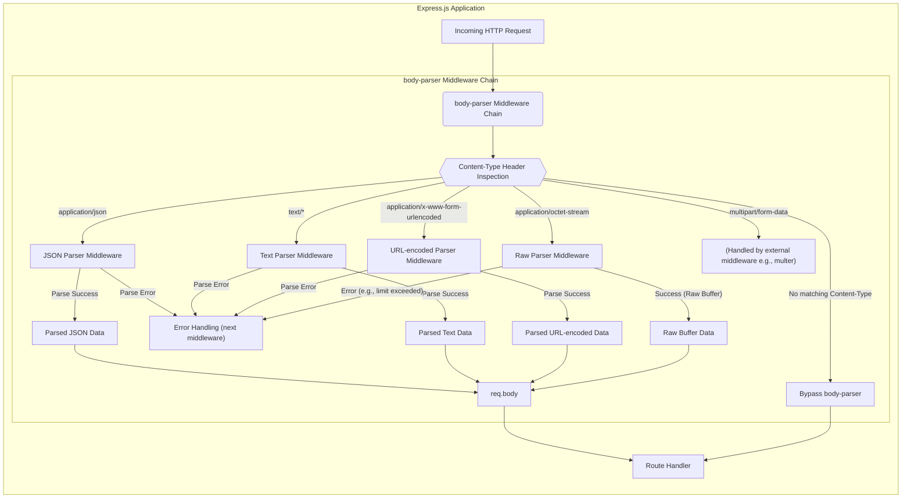

## Project Design Document: expressjs/body-parser (Improved)

**1. Introduction**

This document provides an enhanced and detailed design overview of the `body-parser` middleware for Express.js. It aims to provide a clear and comprehensive understanding of the library's architecture, components, and data flow, specifically tailored to facilitate a robust threat modeling exercise. This document is intended for software, cloud, and cybersecurity architects responsible for assessing and mitigating security risks in applications utilizing `body-parser`.

**2. Project Overview**

The `body-parser` middleware is a fundamental component in many Express.js applications. Its core responsibility is to intercept incoming HTTP request bodies and parse them into a more readily usable format before they reach application route handlers. This middleware examines the `Content-Type` header to determine the appropriate parsing strategy, making the extracted data accessible via the `req.body` property. Understanding its operation is critical for identifying potential security vulnerabilities related to data handling.

**3. Goals**

* Deliver a precise and thorough architectural description of `body-parser`.
* Detail the individual components within the middleware and their specific interactions.
* Clearly illustrate the flow of data as it is processed by the middleware.
* Highlight key areas that are susceptible to potential security vulnerabilities and attack vectors.
* Serve as a definitive resource for subsequent threat modeling activities and security assessments.

**4. Non-Goals**

* This document does not delve into the intricate code-level implementation details of the `body-parser` library.
* It does not provide a tutorial on how to integrate and configure `body-parser` within an Express application.
* It does not aim to be an exhaustive catalog of all conceivable security vulnerabilities but rather focuses on those directly related to the middleware's functionality.

**5. Architectural Overview**

`body-parser` functions as a chain of middleware within the Express.js request processing pipeline. Each middleware in this chain is specialized to handle a specific content type. Upon receiving an incoming request, Express.js executes these middleware functions sequentially. `body-parser` leverages the `Content-Type` header of the request to dynamically select and invoke the appropriate parser for the incoming data.

**6. Components**

The `body-parser` library can be logically divided into the following distinct components:

* **Main Module (Index):** This serves as the entry point to the library, exporting factory functions that create instances of the individual parser middleware. It orchestrates the availability of different parsing capabilities.
* **JSON Parser Middleware:** This component is responsible for processing request bodies with the `application/json` content type. It typically employs the native `JSON.parse()` method or a similar JSON parsing library. Key considerations include handling invalid JSON syntax and potential for resource exhaustion with large payloads.
* **Raw Parser Middleware:** This middleware handles request bodies with content types such as `application/octet-stream`. It provides direct access to the raw buffer of the request body. Security considerations involve managing the size of the buffer to prevent memory exhaustion.
* **Text Parser Middleware:** This component parses request bodies with content types like `text/plain`. It decodes the body into a string, typically using UTF-8 encoding by default, but allowing for other encodings to be specified. Potential vulnerabilities include handling unexpected character encodings or excessively large text payloads.
* **URL-encoded Parser Middleware:** This middleware is designed to parse request bodies with the `application/x-www-form-urlencoded` content type. It utilizes libraries like `qs` or Node.js's built-in `querystring` module to convert the URL-encoded string into key-value pairs. It offers two parsing modes:
    * **Extended Mode:** Enables parsing of complex data structures like arrays and nested objects within the URL-encoded data. This mode introduces a higher risk of prototype pollution vulnerabilities if the underlying parsing library is not secure.
    * **Non-Extended Mode:**  Parses only simple key-value pairs, offering a slightly reduced attack surface compared to the extended mode.
* **Multipart Handling (External Middleware):** While `body-parser` itself does not directly parse `multipart/form-data`, its role in the ecosystem is important. Middleware like `multer` is commonly used alongside `body-parser` to handle file uploads and other multipart data. Understanding how these middlewares interact is crucial for security analysis.
* **Content-Type Sniffing and Matching:** Each parser middleware incorporates logic to accurately determine if the incoming request's `Content-Type` header matches the content types it is designed to handle. This involves string comparisons and potentially more complex matching logic.
* **Error Handling Mechanisms:** Each parser includes error handling to manage situations like invalid data formats or exceeding configured limits. These errors are typically propagated to the next error-handling middleware in the Express.js pipeline. The nature and verbosity of these error messages are important from a security perspective.
* **Configuration Options and Limits:** Each parser accepts various configuration options (e.g., `limit`, `inflate`, `parameterLimit`, `extended`, `type`, `verify`). These options directly impact the middleware's behavior and are critical for mitigating certain types of attacks, such as DoS.

**7. Data Flow**

The following diagram illustrates the detailed data flow through the `body-parser` middleware chain:

**Detailed Data Flow Steps:**

1. **Incoming HTTP Request:** An HTTP request arrives at the Express.js application.
2. **`body-parser` Middleware Chain:** The request is passed through the sequence of `body-parser` middleware functions configured for the application.
3. **Content-Type Header Inspection:** The first middleware in the chain inspects the `Content-Type` header of the incoming request to determine the data format.
4. **Parser Selection:** Based on the `Content-Type`, the request is routed to the appropriate parser middleware (JSON, Text, URL-encoded, or Raw). If no matching parser is found, the request bypasses the `body-parser` middleware.
5. **Data Parsing:** The selected parser reads the raw request body from the underlying stream.
6. **Parsing Logic:** The parser applies its specific logic to transform the raw data into a JavaScript object, string, or buffer. This involves operations like JSON decoding, URL decoding, or simply buffering the raw data.
7. **Success or Error:** The parsing process either succeeds, resulting in parsed data, or encounters an error (e.g., invalid format, size limit exceeded).
8. **Error Handling:** If an error occurs, it is typically passed to the next error-handling middleware in the Express.js pipeline. The specific error information and how it's handled are important security considerations.
9. **`req.body` Population:** Upon successful parsing, the parsed data is attached to the `req.body` property of the request object.
10. **Route Handler:** The request, now with the parsed body, is passed to the appropriate route handler for further processing.

**8. Data Handling**

* **Data Origin:** The primary source of data is the raw HTTP request body transmitted by the client.
* **Supported Data Types:** `body-parser` is designed to handle a variety of data types, including:
    * JSON (JavaScript Object Notation)
    * Plain Text (various encodings)
    * URL-encoded data (`application/x-www-form-urlencoded`)
    * Raw binary data (`application/octet-stream`)
* **Data Transformation Process:** The core function of `body-parser` is to transform the raw, unstructured request body into structured JavaScript data that can be easily accessed and manipulated by the application's logic.
* **Data Storage (Transient):** `body-parser` itself does not persist data. The parsed data resides in memory within the `req.body` object for the duration of the request-response cycle.

**9. Security Considerations (Detailed)**

This section expands on potential security vulnerabilities and attack vectors related to `body-parser`:

* **Denial of Service (DoS) Attacks:**
    * **Unbounded Payload Sizes:**  Insufficiently configured `limit` options can allow attackers to send extremely large request bodies, leading to excessive memory consumption and application crashes.
    * **Complex Payload Parsing:**  Sending deeply nested JSON or URL-encoded data can consume significant CPU resources during parsing, potentially causing a denial of service. Configure appropriate `parameterLimit` and consider using non-extended URL parsing when complexity is not required.
    * **Inflation Attacks:**  For compressed request bodies, failing to set appropriate limits or disabling inflation entirely can lead to memory exhaustion when attackers send highly compressible data.
* **Cross-Site Scripting (XSS) via `req.body`:** If data parsed by `body-parser` and stored in `req.body` is directly rendered in the application's responses without proper encoding or sanitization, it creates a significant XSS vulnerability.
* **Server-Side Request Forgery (SSRF) (Indirect):** While `body-parser` doesn't directly initiate requests, vulnerabilities in custom parsing logic or dependencies used by `body-parser` (especially in custom type parsers) could potentially be exploited to trigger SSRF.
* **Parameter Pollution:**  In URL-encoded parsing, particularly in extended mode, attackers can inject unexpected parameters or overwrite existing ones, potentially altering application logic or bypassing security checks.
* **Prototype Pollution:**  Vulnerabilities in the underlying parsing libraries (e.g., versions of `qs` with known prototype pollution issues) can allow attackers to manipulate JavaScript object prototypes, potentially leading to arbitrary code execution or other malicious behavior. Ensure dependencies are regularly updated.
* **Security Bypass:** Incorrect configuration or vulnerabilities in `body-parser` could allow attackers to bypass other security middleware or validation logic that relies on inspecting the request body. For example, if `body-parser` fails to parse a malicious payload, it might not be inspected by subsequent security middleware.
* **Information Disclosure via Error Messages:**  Verbose error messages generated during parsing (e.g., revealing internal file paths or specific error details from parsing libraries) can provide valuable information to attackers. Configure error handling to avoid exposing sensitive information.
* **Dependency Vulnerabilities:**  Vulnerabilities in the dependencies used by `body-parser` (e.g., `raw-body`, `iconv-lite`, `type-is`, `http-errors`) can introduce security risks. Regularly audit and update dependencies.
* **Content-Type Confusion:**  Exploiting discrepancies or vulnerabilities in the content-type sniffing logic could potentially lead to a parser being invoked on data it's not designed to handle, potentially leading to unexpected behavior or vulnerabilities.

**10. Dependencies**

`body-parser` relies on the following key Node.js modules for its functionality:

* `bytes`:  A utility for parsing and formatting byte values, used for handling size limits.
* `content-type`:  A module for parsing HTTP `Content-Type` header fields.
* `debug`:  A small debugging utility used for logging within the library.
* `depd`:  A module for marking APIs as deprecated.
* `http-errors`:  A simple module for creating standardized HTTP error objects.
* `iconv-lite`:  A pure JavaScript character encoding conversion library, used for text parsing.
* `on-finished`:  Executes a callback when an HTTP request finishes, closes, or errors.
* `raw-body`:  A module for efficiently getting the raw body of a stream.
* `type-is`:  A module for inferring the media type of a request based on the `Content-Type` header.

The security of these dependencies is crucial, and any vulnerabilities within them could potentially impact `body-parser`.

**11. Deployment Considerations**

`body-parser` is deployed as middleware within an Express.js application. Key deployment considerations for security include:

* **Middleware Ordering:** Ensure `body-parser` is placed before route handlers that rely on `req.body` and before security middleware that inspects the request body. Incorrect ordering can lead to vulnerabilities.
* **Configuration per Route/Application:**  Consider configuring `body-parser` options (like `limit`) on a per-route or application basis to apply more granular restrictions based on expected payload sizes and types.
* **Resource Limits:**  Ensure that the server environment has appropriate resource limits configured to prevent DoS attacks even with `body-parser`'s limits in place.

**12. Future Considerations**

* Ongoing monitoring of dependencies for security vulnerabilities and timely updates.
* Potential adoption of more secure parsing libraries or stricter parsing defaults.
* Exploration of more advanced content-type validation and sanitization techniques.
* Consideration of built-in mechanisms to prevent prototype pollution.

**13. Conclusion**

This improved design document provides a comprehensive and detailed understanding of the `expressjs/body-parser` middleware, emphasizing its architecture, components, and data flow with a strong focus on security considerations. This document serves as a vital resource for conducting thorough threat modeling exercises, enabling developers and security professionals to identify, assess, and mitigate potential vulnerabilities associated with the use of `body-parser` in Express.js applications. By understanding the intricacies of this middleware, teams can make informed decisions regarding its configuration and usage to build more resilient and secure web applications.