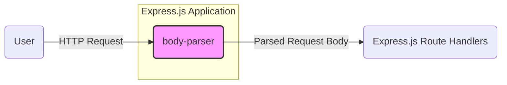
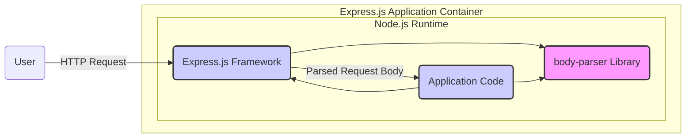
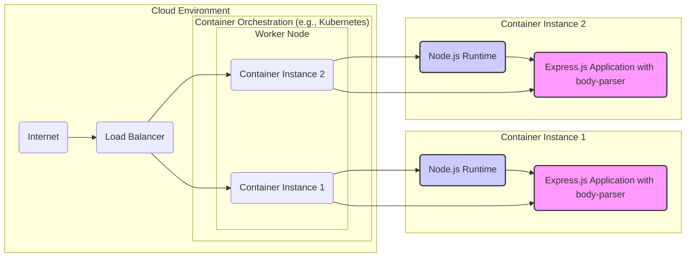

# BUSINESS POSTURE

This project, body-parser, is a middleware for Node.js Express applications. Its primary purpose is to parse incoming request bodies in a variety of formats (JSON, URL-encoded, text, raw) and make the parsed data available under `req.body` for easy access within route handlers. This simplifies the process of handling user input in web applications built with Express.js.

Business priorities and goals:
- Simplify development of web applications using Express.js by abstracting away the complexities of request body parsing.
- Provide a robust and flexible solution for handling different content types in HTTP requests.
- Ensure compatibility and seamless integration with the Express.js framework.
- Maintain performance and efficiency in request processing.

Most important business risks:
- Vulnerabilities in body-parser could lead to security breaches in applications that depend on it. For example, denial-of-service attacks through maliciously crafted payloads, or data injection vulnerabilities if parsing is not handled correctly.
- Incompatibility issues with newer versions of Node.js or Express.js could break existing applications relying on body-parser.
- Performance bottlenecks in body parsing could degrade the overall performance of applications.
- Lack of maintenance or security updates could leave applications vulnerable to known exploits.

# SECURITY POSTURE

Existing security controls:
- security control: Input validation is implicitly performed by the parsing logic within body-parser to handle different content types and formats. This is described in the code and documentation of body-parser, specifically in the various parser implementations (e.g., `json()`, `urlencoded()`, `text()`, `raw()`).
- security control: Dependency management using `npm` helps in tracking and updating dependencies, potentially mitigating risks from known vulnerabilities in dependencies. This is managed through `package.json` and `package-lock.json` in the repository.
- accepted risk: Reliance on the security of underlying Node.js and Express.js platforms. Body-parser operates within the security context provided by these platforms.
- accepted risk: Security vulnerabilities in dependencies of body-parser are accepted until updates are available and applied.

Recommended security controls:
- security control: Implement automated Static Application Security Testing (SAST) during the build process to identify potential code-level vulnerabilities in body-parser.
- security control: Implement automated Dependency Vulnerability Scanning to detect known vulnerabilities in body-parser's dependencies.
- security control: Consider adding rate limiting or request size limits within body-parser or in the applications using it to mitigate potential denial-of-service attacks via large or numerous requests. While not directly in body-parser's core, it's a relevant consideration for its usage.
- security control: Regularly audit the codebase for potential security vulnerabilities and follow secure coding practices.

Security requirements:
- Authentication: Authentication is not directly handled by body-parser. Authentication of requests is the responsibility of the application using body-parser, typically implemented in Express.js middleware that runs before or after body-parser.
- Authorization: Authorization is not directly handled by body-parser. Authorization logic is implemented within the application using body-parser, based on the parsed request body and other request attributes.
- Input validation: Input validation is critical for body-parser. It must correctly parse and validate incoming request bodies according to the specified content type and options, preventing malformed or malicious input from causing issues. This is implemented within the parsing logic of each parser type (JSON, URL-encoded, etc.).
- Cryptography: Cryptography is not a core requirement for body-parser itself. However, applications using body-parser might handle sensitive data in request bodies that require encryption in transit (HTTPS) or at rest, but this is outside the scope of body-parser. Body-parser should not introduce vulnerabilities that could compromise cryptographic operations performed by the application.

# DESIGN

## C4 CONTEXT



Context Diagram elements:

- Name: User
  - Type: Person
  - Description: End-user interacting with the Express.js application through a web browser or other HTTP client.
  - Responsibilities: Initiates HTTP requests to the Express.js application.
  - Security controls: User authentication and authorization are handled by the Express.js application, not directly by the user. User's browser or HTTP client is responsible for TLS/HTTPS communication.

- Name: body-parser
  - Type: Software System
  - Description: Node.js middleware library responsible for parsing HTTP request bodies in various formats (JSON, URL-encoded, text, raw).
  - Responsibilities: Parses incoming HTTP request bodies. Makes parsed data available to Express.js route handlers. Handles different content types and parsing options.
  - Security controls: Input validation during parsing.  Relies on the security of the Node.js and Express.js environment.

- Name: Express.js Route Handlers
  - Type: Software System
  - Description: Application logic within the Express.js application that processes the parsed request body and handles user requests.
  - Responsibilities: Processes user requests. Implements application logic. Handles authentication and authorization. Interacts with other systems or data stores.
  - Security controls: Application-level authentication and authorization. Input validation on data received from body-parser (although body-parser should already perform initial validation). Output encoding and sanitization.

## C4 CONTAINER



Container Diagram elements:

- Name: body-parser Library
  - Type: Library
  - Description: Node.js library providing middleware functions for parsing request bodies. Implemented in JavaScript.
  - Responsibilities: Provides parsing functions for JSON, URL-encoded, text, and raw request bodies. Exposes middleware functions for Express.js.
  - Security controls: Input validation within parsing functions. Code review and security testing of the library.

- Name: Express.js Framework
  - Type: Framework
  - Description: Node.js web application framework that provides routing, middleware support, and other features for building web applications. Implemented in JavaScript.
  - Responsibilities: Handles HTTP requests and responses. Manages middleware pipeline. Provides routing and application structure.
  - Security controls: Framework-level security features (e.g., handling of HTTP headers, request lifecycle). Relies on Node.js security.

- Name: Application Code
  - Type: Application
  - Description: Custom application logic built using Express.js and body-parser. Implemented in JavaScript.
  - Responsibilities: Implements specific application features and business logic. Handles user authentication and authorization. Processes parsed request data.
  - Security controls: Application-level security controls (authentication, authorization, input validation, output encoding). Secure coding practices in application development.

- Name: Node.js Runtime
  - Type: Runtime Environment
  - Description: JavaScript runtime environment that executes the Express.js application and body-parser.
  - Responsibilities: Executes JavaScript code. Provides core JavaScript functionalities and APIs. Manages memory and resources.
  - Security controls: Runtime environment security features provided by Node.js (e.g., sandboxing, security updates).

- Name: User
  - Type: Person
  - Description: End-user interacting with the Express.js application.
  - Responsibilities: Sends HTTP requests.
  - Security controls: TLS/HTTPS for secure communication. User's browser security controls.

## DEPLOYMENT

Deployment architecture can vary widely depending on the application using body-parser. A common deployment scenario is using cloud platforms like AWS, Google Cloud, or Azure. Let's consider a simplified deployment on a cloud platform using containers.



Deployment Diagram elements:

- Name: Internet
  - Type: Environment
  - Description: Public internet network.
  - Responsibilities: Provides network connectivity for users to access the application.
  - Security controls: General internet security measures. DDoS protection at the network level.

- Name: Load Balancer
  - Type: Infrastructure
  - Description: Distributes incoming traffic across multiple container instances of the Express.js application.
  - Responsibilities: Load balancing, traffic routing, SSL termination (optional).
  - Security controls: SSL/TLS encryption. Web Application Firewall (WAF) integration (optional). Rate limiting.

- Name: Container Orchestration (e.g., Kubernetes)
  - Type: Infrastructure
  - Description: Platform for managing and orchestrating containerized applications.
  - Responsibilities: Container deployment, scaling, health monitoring, service discovery.
  - Security controls: Container security policies, network policies, role-based access control (RBAC) for cluster management.

- Name: Worker Node
  - Type: Infrastructure
  - Description: Physical or virtual machine that runs container instances.
  - Responsibilities: Provides compute resources for containers.
  - Security controls: Operating system security hardening, security patching, access control.

- Name: Container Instance 1 & 2
  - Type: Container
  - Description: Isolated runtime environment containing the Node.js runtime and the Express.js application with body-parser.
  - Responsibilities: Runs the application code. Processes requests.
  - Security controls: Container image security scanning. Resource limits. Network isolation.

- Name: Node.js Runtime (within Container Instance)
  - Type: Software
  - Description: Node.js runtime environment running inside the container.
  - Responsibilities: Executes JavaScript code for the Express.js application.
  - Security controls: Security updates for Node.js. Container isolation.

- Name: Express.js Application with body-parser (within Container Instance)
  - Type: Software
  - Description: Deployed Express.js application that uses body-parser middleware.
  - Responsibilities: Handles application logic, processes requests, uses body-parser for request body parsing.
  - Security controls: Application-level security controls. Security configurations for Express.js and body-parser.

## BUILD

```mermaid
flowchart LR
    A("Developer") -->|Code Changes, Commit, Push| B("Version Control (e.g., GitHub)")
    B -->|Webhook, Code Change Notification| C("CI/CD System (e.g., GitHub Actions)")
    C -->|Checkout Code, Install Dependencies, Run Build Scripts, Security Checks (SAST, Dependency Scan), Unit Tests| D("Build Environment")
    D -->|Build Artifacts (e.g., npm package)| E("Artifact Repository (e.g., npm registry)")
    style A fill:#ccf,stroke:#333,stroke-width:2px
    style B fill:#ccf,stroke:#333,stroke-width:2px
    style C fill:#ccf,stroke:#333,stroke-width:2px
    style D fill:#ccf,stroke:#333,stroke-width:2px
    style E fill:#ccf,stroke:#333,stroke-width:2px
```

Build Process Description:

1. Developer: Developers write code, commit changes, and push them to a version control system like GitHub.
2. Version Control (e.g., GitHub): Stores the source code and tracks changes.
3. CI/CD System (e.g., GitHub Actions): Automated system triggered by code changes in the version control system.
4. Build Environment: A controlled environment where the build process takes place.
    - Checkout Code: CI/CD system retrieves the latest code from the version control.
    - Install Dependencies: Dependencies defined in `package.json` are installed using `npm install`.
    - Run Build Scripts: Build scripts defined in `package.json` (e.g., linting, testing, compilation if needed) are executed.
    - Security Checks: Automated security checks are performed:
        - Static Application Security Testing (SAST): Scans the source code for potential vulnerabilities.
        - Dependency Vulnerability Scanning: Checks for known vulnerabilities in dependencies.
        - Unit Tests: Execute unit tests to ensure code functionality and prevent regressions.
5. Artifact Repository (e.g., npm registry): Stores the build artifacts, such as the npm package for body-parser, after successful build and security checks.

Build Process Security Controls:

- security control: Version Control: Using a version control system like Git to track code changes and provide auditability. Access control to the repository.
- security control: CI/CD System: Using a CI/CD system like GitHub Actions to automate the build process and enforce security checks. Access control to CI/CD configurations.
- security control: Automated Security Checks: Integrating SAST and Dependency Vulnerability Scanning into the build pipeline to identify and address security issues early in the development lifecycle.
- security control: Unit Tests: Automated unit tests to ensure code quality and prevent regressions.
- security control: Build Environment Isolation: Using isolated build environments to prevent contamination and ensure build reproducibility.
- security control: Artifact Signing: Signing build artifacts (e.g., npm package) to ensure integrity and authenticity.
- security control: Access Control to Artifact Repository: Restricting access to the artifact repository to authorized users and systems.

# RISK ASSESSMENT

Critical business process: Processing HTTP requests in web applications. Body-parser is a fundamental component in this process for Express.js applications. If body-parser fails or is compromised, it can disrupt the entire request processing flow, leading to application unavailability or security vulnerabilities.

Data we are trying to protect: Request body data. The sensitivity of this data depends entirely on the application using body-parser. It can range from non-sensitive data in public websites to highly sensitive data like Personally Identifiable Information (PII), financial data, or authentication credentials in more critical applications.

Data sensitivity: Variable, depends on the application context. Could be low, medium, or high sensitivity depending on the type of data handled by the applications using body-parser. For applications handling user data, especially PII or financial information, the request body data is considered highly sensitive.

# QUESTIONS & ASSUMPTIONS

Questions:
- What are the most common use cases and deployment environments for body-parser? Understanding the typical usage scenarios will help in tailoring security recommendations.
- What are the performance requirements and constraints for body-parser? Performance considerations might influence the choice of security controls.
- Are there specific compliance requirements (e.g., GDPR, HIPAA, PCI DSS) that applications using body-parser need to adhere to? Compliance requirements will dictate specific security controls and considerations.
- What is the expected lifespan and maintenance plan for body-parser? Long-term maintenance and security updates are crucial for the continued security of applications relying on body-parser.

Assumptions:
- BUSINESS POSTURE:
    - Body-parser is primarily used in web applications built with Express.js for handling user input from HTTP requests.
    - The primary business goal is to simplify web application development and ensure robust request body parsing.
    - Security and reliability are important business considerations for body-parser.
- SECURITY POSTURE:
    - Security is a shared responsibility between the body-parser library and the applications that use it.
    - Input validation is a key security control within body-parser.
    - Applications using body-parser are responsible for authentication, authorization, and handling sensitive data securely.
    - The development and build process for body-parser follows standard open-source practices, including dependency management and testing.
- DESIGN:
    - Body-parser is designed as a middleware component within the Express.js framework.
    - Deployment environments for applications using body-parser are diverse, ranging from cloud platforms to on-premise servers.
    - The build process for body-parser involves standard JavaScript development tools and practices, including npm for dependency management and potentially CI/CD for automation.