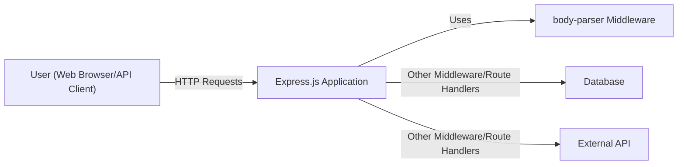
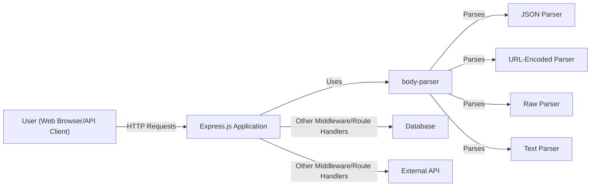
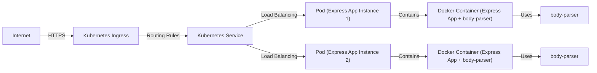
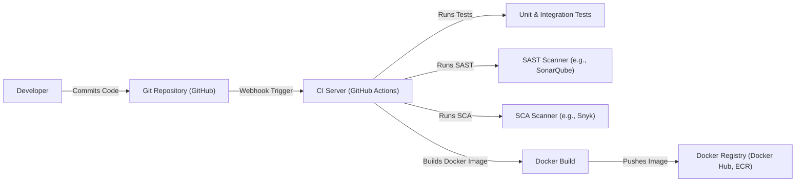

# BUSINESS POSTURE

Business Priorities and Goals:

The `body-parser` project is a crucial middleware component for Express.js, one of the most popular Node.js web application frameworks. Its primary goal is to simplify the handling of incoming request bodies (e.g., JSON, URL-encoded data, raw data, text data) by parsing them and making them easily accessible to route handlers.  This simplifies application development and reduces boilerplate code for developers using Express.js. The project aims for:

*   Ease of use:  Provide a simple and intuitive API for parsing request bodies.
*   Performance:  Efficiently parse request bodies without introducing significant overhead.
*   Flexibility:  Support various content types and parsing options.
*   Maintainability:  Keep the codebase clean, well-documented, and easy to maintain.
*   Compatibility: Maintain compatibility with different versions of Node.js and Express.js.
*   Security: Minimize security vulnerabilities related to request body parsing.

Business Risks:

*   Security Vulnerabilities:  Vulnerabilities in `body-parser` could expose applications built with Express.js to various attacks, such as denial-of-service (DoS), remote code execution (RCE), and data breaches. This is the most critical risk, given the widespread use of Express.js.
*   Performance Bottlenecks: Inefficient parsing could lead to performance issues in applications, especially under heavy load.
*   Compatibility Issues:  Changes in `body-parser` could break existing applications that rely on it.
*   Maintenance Overhead:  Lack of maintenance or slow response to issues could lead to security risks and compatibility problems.
*   Reputation Damage:  Security vulnerabilities or other major issues could damage the reputation of `body-parser` and, by extension, Express.js.

# SECURITY POSTURE

Existing Security Controls:

*   security control: Input Validation: The library performs input validation to ensure that the incoming data conforms to the expected content type and structure. (Implemented within the parsing logic of each middleware function, e.g., `json()`, `urlencoded()`).
*   security control: Limit request body size: The library allows setting limits on the size of request bodies to prevent denial-of-service attacks. (Implemented via the `limit` option, configurable for each middleware function).
*   security control: Regular Expression Usage: Uses regular expressions for content type matching and parsing. (Used throughout the codebase for parsing and validation).
*   security control: Type checking: The library checks the type of incoming data. (Implemented within the parsing logic).
*   security control: Error handling: The library provides error handling for parsing failures. (Implemented using try-catch blocks and error callbacks).
*   security control: Regular updates and dependency management: The project appears to be actively maintained, with regular updates and dependency management to address security vulnerabilities and bug fixes. (Visible in the GitHub repository's commit history and package.json).
*   security control: Community Scrutiny: Being a widely used open-source project, `body-parser` benefits from community scrutiny, which helps identify and address security issues. (Evident from the GitHub issues and pull requests).

Accepted Risks:

*   accepted risk: Regular Expression Denial of Service (ReDoS): While regular expressions are used, the project might be vulnerable to ReDoS attacks if crafted inputs are provided. This risk is partially mitigated by the widespread use and testing of the library, but complex or nested structures could still potentially trigger issues.
*   accepted risk: Dependencies vulnerabilities: The project depends on external libraries, which could introduce their own security vulnerabilities. This is a common risk for all Node.js projects.

Recommended Security Controls:

*   High Priority: Implement more robust defenses against ReDoS attacks. This could involve using safer regular expression alternatives or implementing stricter input validation to prevent complex or deeply nested structures from being processed.
*   High Priority: Conduct regular security audits and penetration testing to identify potential vulnerabilities.
*   High Priority: Implement a Content Security Policy (CSP) to mitigate the impact of cross-site scripting (XSS) attacks, although this is primarily the responsibility of applications using `body-parser`.
*   High Priority: Implement Subresource Integrity (SRI) for any external dependencies loaded via CDN, although this is more relevant to front-end applications.

Security Requirements:

*   Authentication: Not directly applicable to `body-parser` itself, as it's a middleware component. Authentication should be handled by separate middleware or application logic.
*   Authorization: Not directly applicable to `body-parser`. Authorization should be handled by separate middleware or application logic.
*   Input Validation:
    *   Strictly validate incoming data against expected schemas and data types.
    *   Enforce maximum length limits for all input fields.
    *   Reject unexpected or malformed input.
    *   Sanitize input to prevent cross-site scripting (XSS) attacks (primarily relevant for text and HTML parsing).
*   Cryptography: Not directly applicable to `body-parser`, as it primarily deals with parsing data, not encryption. However, if `body-parser` were to handle sensitive data (which it shouldn't directly), it should ensure that this data is transmitted over secure channels (HTTPS) and stored securely.
*   Error Handling:
    *   Provide informative error messages to developers without exposing sensitive information.
    *   Log errors securely for debugging and auditing purposes.
    *   Handle all errors gracefully to prevent application crashes.

# DESIGN

## C4 CONTEXT

Element Descriptions:

*   Element:
    *   Name: User (Web Browser/API Client)
    *   Type: Person
    *   Description: Represents a user interacting with the Express.js application through a web browser or an API client.
    *   Responsibilities: Sends HTTP requests to the Express.js application.
    *   Security controls: None (relies on the security controls of the application).

*   Element:
    *   Name: Express.js Application
    *   Type: Software System
    *   Description: The web application built using the Express.js framework.
    *   Responsibilities: Handles incoming HTTP requests, processes them using middleware and route handlers, and sends back responses.
    *   Security controls: Implements authentication, authorization, input validation, output encoding, and other security measures.

*   Element:
    *   Name: body-parser Middleware
    *   Type: Software System
    *   Description: The `body-parser` middleware component used by the Express.js application.
    *   Responsibilities: Parses incoming request bodies and makes them accessible to route handlers.
    *   Security controls: Input validation, request body size limits, error handling.

*   Element:
    *   Name: Database
    *   Type: Software System
    *   Description: A database used by the Express.js application to store data.
    *   Responsibilities: Stores and retrieves data.
    *   Security controls: Access control, data encryption, auditing.

*   Element:
    *   Name: External API
    *   Type: Software System
    *   Description: An external API that the Express.js application interacts with.
    *   Responsibilities: Provides specific services or data to the application.
    *   Security controls: Depends on the specific API.

## C4 CONTAINER

Element Descriptions:

*   Element:
    *   Name: User (Web Browser/API Client)
    *   Type: Person
    *   Description: Represents a user interacting with the Express.js application.
    *   Responsibilities: Sends HTTP requests.
    *   Security controls: None (relies on application security).

*   Element:
    *   Name: Express.js Application
    *   Type: Web Application
    *   Description: The web application built using Express.js.
    *   Responsibilities: Handles requests, processes data, interacts with other components.
    *   Security controls: Authentication, authorization, input validation, output encoding.

*   Element:
    *   Name: body-parser
    *   Type: Library/Module
    *   Description: The main `body-parser` module.
    *   Responsibilities: Provides middleware functions for parsing different content types.
    *   Security controls: Input validation, request body size limits, error handling.

*   Element:
    *   Name: JSON Parser
    *   Type: Library/Module
    *   Description: Parses JSON request bodies.
    *   Responsibilities: Converts JSON strings into JavaScript objects.
    *   Security controls: Input validation, size limits, handles JSON parsing errors.

*   Element:
    *   Name: URL-Encoded Parser
    *   Type: Library/Module
    *   Description: Parses URL-encoded request bodies.
    *   Responsibilities: Converts URL-encoded strings into JavaScript objects.
    *   Security controls: Input validation, size limits, handles parsing errors.

*   Element:
    *   Name: Raw Parser
    *   Type: Library/Module
    *   Description: Parses raw request bodies.
    *   Responsibilities: Provides access to the raw request body as a Buffer.
    *   Security controls: Size limits.

*   Element:
    *   Name: Text Parser
    *   Type: Library/Module
    *   Description: Parses text request bodies.
    *   Responsibilities: Provides access to the raw request body as a string.
    *   Security controls: Size limits, input validation (e.g., encoding checks).

*   Element:
    *   Name: Database
    *   Type: Database
    *   Description: Database used by the application.
    *   Responsibilities: Stores and retrieves data.
    *   Security controls: Access control, encryption, auditing.

*   Element:
    *   Name: External API
    *   Type: External Service
    *   Description: External API used by the application.
    *   Responsibilities: Provides external services or data.
    *   Security controls: Depends on the specific API.

## DEPLOYMENT

Possible Deployment Solutions:

1.  Standalone Node.js Server: The Express.js application, including `body-parser`, is deployed as a standalone Node.js process, typically behind a reverse proxy like Nginx or Apache.
2.  Containerized Deployment (Docker): The application is packaged into a Docker container and deployed to a container orchestration platform like Kubernetes or Docker Swarm.
3.  Serverless Deployment (AWS Lambda, Google Cloud Functions, Azure Functions): The application is deployed as serverless functions, with `body-parser` included as a dependency.
4.  Platform-as-a-Service (PaaS) (Heroku, AWS Elastic Beanstalk): The application is deployed to a PaaS platform that handles the underlying infrastructure.

Chosen Deployment Solution: Containerized Deployment (Docker with Kubernetes)

Element Descriptions:

*   Element:
    *   Name: Internet
    *   Type: External
    *   Description: The public internet.
    *   Responsibilities: Routes traffic to the Kubernetes cluster.
    *   Security controls: Relies on network security and DNS security.

*   Element:
    *   Name: Kubernetes Ingress
    *   Type: Load Balancer
    *   Description: Manages external access to the services in the cluster.
    *   Responsibilities: Routes incoming traffic to the appropriate service based on routing rules.
    *   Security controls: TLS termination, SSL certificates, potentially web application firewall (WAF).

*   Element:
    *   Name: Kubernetes Service
    *   Type: Service Discovery
    *   Description: Provides a stable endpoint for accessing the application pods.
    *   Responsibilities: Load balances traffic across multiple pods.
    *   Security controls: Network policies.

*   Element:
    *   Name: Pod (Express App Instance 1 & 2)
    *   Type: Pod
    *   Description: A Kubernetes pod running an instance of the Express.js application.
    *   Responsibilities: Runs the application code.
    *   Security controls: Resource limits, security context.

*   Element:
    *   Name: Docker Container (Express App + body-parser) (1 & 2)
    *   Type: Container
    *   Description: A Docker container containing the Express.js application and its dependencies, including `body-parser`.
    *   Responsibilities: Provides a consistent runtime environment for the application.
    *   Security controls: Container image security scanning, minimal base image.

*   Element:
    *   Name: body-parser (1 & 2)
    *   Type: Library
    *   Description: Instance of the body-parser inside application container.
    *   Responsibilities: Parse incoming requests.
    *   Security controls: Input validation, request body size limits.

## BUILD

The build process for `body-parser` itself, as a library, is relatively simple. However, the build process for an application *using* `body-parser` is more relevant from a security perspective. We'll describe a typical build process for an Express.js application using `body-parser` and deployed with Docker.

Build Process Description:

1.  Developer commits code to the Git repository (e.g., GitHub).
2.  A webhook triggers the CI server (e.g., GitHub Actions, Jenkins).
3.  The CI server runs unit and integration tests.
4.  The CI server runs a Static Application Security Testing (SAST) scanner (e.g., SonarQube) to analyze the source code for vulnerabilities.
5.  The CI server runs a Software Composition Analysis (SCA) scanner (e.g., Snyk, Dependabot) to identify vulnerabilities in dependencies, including `body-parser` and its transitive dependencies.
6.  If all tests and scans pass, the CI server builds a Docker image containing the Express.js application and its dependencies.
7.  The Docker image is pushed to a Docker registry (e.g., Docker Hub, Amazon ECR).

Security Controls in Build Process:

*   security control: Code Review: Code reviews are performed before merging code into the main branch. (Implemented through GitHub's pull request system).
*   security control: Unit and Integration Tests: Automated tests are run to ensure the application and middleware function correctly. (Implemented using testing frameworks like Jest, Mocha).
*   security control: SAST Scanning: Static analysis tools scan the codebase for potential vulnerabilities. (Implemented using tools like SonarQube, ESLint with security plugins).
*   security control: SCA Scanning: Dependency analysis tools scan for known vulnerabilities in project dependencies. (Implemented using tools like Snyk, Dependabot, npm audit).
*   security control: Docker Image Security Scanning: The Docker image is scanned for vulnerabilities before being deployed. (Implemented using tools like Trivy, Clair).
*   security control: Build Automation: The entire build process is automated, reducing the risk of manual errors and ensuring consistency. (Implemented using CI/CD pipelines).
*   security control: Least Privilege: Build agents and CI/CD systems should run with the least necessary privileges.

# RISK ASSESSMENT

Critical Business Processes:

*   Handling user requests: The primary business process is handling user requests, which relies on `body-parser` to correctly parse incoming data.
*   API functionality: If the Express.js application provides an API, `body-parser` is critical for processing API requests.
*   Data processing: Any data processing that relies on data extracted from request bodies is dependent on `body-parser`.

Data Sensitivity:

The sensitivity of the data handled by `body-parser` depends entirely on the application using it. `body-parser` itself doesn't store or persist data; it only parses it. However, it *can* handle:

*   Low Sensitivity: Publicly available data, non-sensitive configuration data.
*   Medium Sensitivity: Usernames, email addresses, non-financial user data.
*   High Sensitivity: Passwords, financial data, personally identifiable information (PII), protected health information (PHI).  Applications should *never* directly expose raw, high-sensitivity data to `body-parser` without prior sanitization or encryption.  Sensitive data should be handled with extreme care and ideally encrypted before reaching the application layer.

# QUESTIONS & ASSUMPTIONS

Questions:

*   What specific types of data will the applications using `body-parser` be handling? This is crucial for determining the appropriate security measures.
*   What are the performance requirements for applications using `body-parser`? This will influence the choice of parsing options and limits.
*   What is the expected load (requests per second) on applications using `body-parser`? This helps assess the risk of denial-of-service attacks.
*   Are there any specific compliance requirements (e.g., GDPR, HIPAA) that need to be considered?
*   What is the development team's experience with secure coding practices?

Assumptions:

*   BUSINESS POSTURE: The organization prioritizes security and is willing to invest in necessary security controls.
*   BUSINESS POSTURE: The organization has a process for responding to security incidents.
*   SECURITY POSTURE: The development team is familiar with basic security concepts.
*   SECURITY POSTURE: The application using `body-parser` will implement appropriate authentication and authorization mechanisms.
*   SECURITY POSTURE: Sensitive data will be encrypted in transit (HTTPS).
*   DESIGN: The application will be deployed behind a reverse proxy or load balancer that provides additional security features (e.g., TLS termination, WAF).
*   DESIGN: The application will use a secure database with appropriate access controls and encryption.
*   DESIGN: Regular security audits and penetration testing will be conducted.