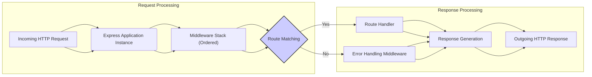

# Project Design Document: Express.js Framework

**Version:** 1.1
**Date:** October 26, 2023
**Author:** AI Software Architect

## 1. Introduction

This document provides an enhanced architectural design of the Express.js framework, focusing on aspects relevant to threat modeling. It details the core components, their interactions, and the flow of data, highlighting potential security implications. This document aims to provide a robust foundation for security assessments and the identification of potential vulnerabilities within applications built using Express.js.

## 2. Goals and Objectives

The primary goals of Express.js are to provide:

*   A minimalist and adaptable framework for building web applications and APIs in Node.js.
*   A structured way to handle HTTP requests and responses.
*   A flexible middleware system for extending functionality and managing request processing.
*   An unopinionated foundation that allows developers to integrate various tools and libraries.
*   A vibrant ecosystem that fosters community contributions and extensions.

## 3. Architectural Overview

Express.js employs a middleware-driven architecture where incoming requests are processed through a pipeline of functions. This modular approach allows for separation of concerns and facilitates the implementation of cross-cutting functionalities, including security measures.

## 4. Core Components

*   **Application Instance (`express()`):** The central object responsible for managing the application's lifecycle, including routing, middleware registration, and configuration. It acts as a request listener for the underlying Node.js HTTP server.
*   **Router:** A component dedicated to defining and managing application routes. It maps incoming request paths and HTTP methods to specific handler functions. Routers can be modular and mounted at different paths within the application.
*   **Middleware:** Functions that intercept and process requests as they flow through the application. Middleware functions have access to the request object (`req`), the response object (`res`), and the `next` function to pass control to the subsequent middleware. Types of middleware include:
    *   **Application-level middleware:** Bound to the application instance.
    *   **Router-level middleware:** Bound to specific `Router` instances.
    *   **Error-handling middleware:** Specialized middleware with four arguments (`err`, `req`, `res`, `next`) for handling errors.
    *   **Built-in middleware:** Provided by Express.js (e.g., `express.static`, `express.json`, `express.urlencoded`).
    *   **Third-party middleware:** Developed by the community for various functionalities.
*   **Request Object (`req`):** An object containing details about the incoming HTTP request, such as headers, parameters (route and query), body, cookies, and session information.
*   **Response Object (`res`):** An object used to construct and send the HTTP response back to the client. It provides methods for setting headers, status codes, and sending data in various formats.

## 5. Detailed Design

### 5.1. Application Initialization and Configuration

*   An Express.js application starts by creating an instance of the application using `express()`.
*   Configuration settings are applied to the application instance, including:
    *   Setting the application environment (e.g., 'development', 'production').
    *   Configuring view engines for server-side rendering.
    *   Specifying static file directories.
    *   Setting application variables.

### 5.2. Routing and Request Handling

*   Routes are defined using methods associated with the application or router instances (e.g., `app.get()`, `router.post()`).
*   Each route definition includes a path, an HTTP method, and one or more handler functions (middleware or final route handlers).
*   The `Router` component matches incoming requests to defined routes based on the URL path and HTTP method. Route parameters defined using colons (e.g., `/users/:userId`) are extracted and made available in `req.params`.
*   When a matching route is found, the associated handler functions are executed sequentially.

### 5.3. Middleware Pipeline

*   Middleware functions are added to the application or router using methods like `app.use()` or `router.use()`. The order in which middleware is added is crucial, as they are executed in that sequence for each incoming request.
*   Each middleware function receives the `req`, `res`, and `next` function as arguments.
*   Middleware can perform various actions:
    *   Execute code.
    *   Make changes to the request and response objects.
    *   End the request-response cycle.
    *   Call the next middleware in the stack using `next()`.
*   Error-handling middleware is invoked when an error is passed to the `next()` function. It's defined with four arguments (`err`, `req`, `res`, `next`).

### 5.4. Request-Response Flow

1. An incoming HTTP request is received by the Node.js HTTP server and passed to the Express.js application instance.
2. The request enters the middleware stack.
3. Each middleware function in the stack is executed in order.
4. The router attempts to match the request's URL and method to a defined route.
5. If a match is found, the route's handler function(s) are executed.
6. Route handlers typically process the request, interact with data sources, and generate a response using the `res` object.
7. The response is sent back to the client.
8. If an error occurs during any stage, it can be caught and handled by error-handling middleware.

### 5.5. Response Generation and Handling

*   The `res` object provides methods for sending various types of responses:
    *   `res.send()`: Sends a response of various types.
    *   `res.json()`: Sends a JSON-formatted response.
    *   `res.render()`: Renders a server-side template.
    *   `res.redirect()`: Redirects the client to a new URL.
    *   `res.sendFile()`: Sends a file as the response.
    *   `res.sendStatus()`: Sets the response status code and sends the corresponding status text as the response body.
    *   `res.status()`: Sets the HTTP status code.
    *   `res.set()`: Sets HTTP response headers.

### 5.6. State Management

*   Express.js itself doesn't enforce a specific state management solution but commonly integrates with middleware for:
    *   **Sessions:** Using middleware like `express-session` to store user-specific data across requests, typically using cookies to maintain session identifiers. Security considerations include session fixation, session hijacking, and secure cookie attributes (`HttpOnly`, `Secure`, `SameSite`).
    *   **Cookies:**  Cookies can be set directly using `res.cookie()`. Security considerations involve the proper use of cookie attributes to prevent cross-site scripting (XSS) and other attacks.

### 5.7. Interaction with External Systems

*   Express.js applications frequently interact with external systems, including:
    *   **Databases:**  Using libraries like Mongoose (for MongoDB), Sequelize (for SQL databases), or others to interact with data stores. Security considerations include preventing SQL injection and securing database credentials.
    *   **APIs:** Making requests to external APIs using libraries like `node-fetch` or Axios. Security considerations include secure storage of API keys and proper handling of API responses.
    *   **Authentication Providers:** Integrating with third-party authentication services (e.g., OAuth providers). Security considerations involve secure redirection URLs and proper token handling.

## 6. Security Considerations (Detailed for Threat Modeling)

*   **Middleware Vulnerabilities:**
    *   **Third-party middleware:** Vulnerabilities in external middleware packages can directly impact the application. Regular security audits and dependency updates are crucial.
    *   **Custom middleware:**  Improperly implemented custom middleware can introduce vulnerabilities like authentication bypasses or data leaks.
*   **Input Validation and Sanitization:**
    *   **Missing or insufficient validation:** Failure to validate user input can lead to various injection attacks (SQL, NoSQL, command injection, LDAP injection).
    *   **Lack of sanitization:** Not sanitizing input before displaying it can result in cross-site scripting (XSS) vulnerabilities.
*   **Output Encoding:**
    *   **Improper encoding:** Failure to encode output data based on the context (HTML, URL, JavaScript) can lead to XSS vulnerabilities.
*   **Authentication and Authorization:**
    *   **Weak authentication:** Using insecure password storage or transmission mechanisms.
    *   **Authorization flaws:**  Improperly implemented access controls can lead to unauthorized access to resources.
    *   **Session management vulnerabilities:** Session fixation, session hijacking due to insecure cookie handling or predictable session IDs.
*   **Cross-Site Request Forgery (CSRF):**
    *   **Lack of CSRF protection:**  Applications without CSRF tokens are vulnerable to malicious requests initiated from other websites.
*   **Denial of Service (DoS):**
    *   **Resource exhaustion:**  Vulnerabilities that allow attackers to consume excessive server resources (CPU, memory, network).
    *   **Lack of rate limiting:**  Susceptibility to brute-force attacks and other forms of abuse.
*   **Dependency Vulnerabilities:**
    *   **Outdated dependencies:** Using outdated packages with known security vulnerabilities. Regular dependency audits and updates are essential.
*   **Error Handling and Logging:**
    *   **Verbose error messages:** Exposing sensitive information in error messages in production environments.
    *   **Insufficient logging:**  Lack of proper logging can hinder incident response and forensic analysis.
*   **HTTP Header Security:**
    *   **Missing security headers:** Not setting headers like `Strict-Transport-Security`, `X-Frame-Options`, `X-Content-Type-Options`, and `Content-Security-Policy` can expose the application to various attacks.
*   **Data Security:**
    *   **Insecure data storage:** Storing sensitive data in plain text or using weak encryption.
    *   **Data breaches:**  Vulnerabilities that allow unauthorized access to stored data.
*   **Configuration and Deployment:**
    *   **Insecure defaults:** Using default configurations that are not secure.
    *   **Exposed configuration files:**  Accidentally exposing sensitive configuration details.
    *   **Lack of HTTPS:** Transmitting sensitive data over unencrypted HTTP connections.

## 7. Assumptions and Constraints

*   This document describes the general architecture of Express.js. Specific implementations and security measures will vary depending on the application built using the framework.
*   It is assumed that developers have a basic understanding of web security principles and best practices.
*   The security considerations listed are not exhaustive and should be used as a starting point for a comprehensive threat modeling exercise.

## 8. Future Considerations

*   Potential enhancements to the core framework to provide more built-in security features.
*   Evolving best practices for securing Express.js applications.
*   Integration with newer web security standards and technologies.
*   Improvements in tooling for security analysis and vulnerability detection in Express.js applications.

This enhanced design document provides a more detailed and security-focused view of the Express.js framework, making it a more effective resource for threat modeling and security assessments. By understanding the architecture and potential vulnerabilities, developers and security professionals can build more secure web applications.
