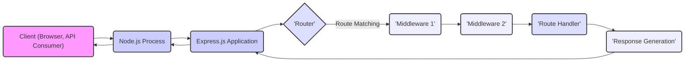
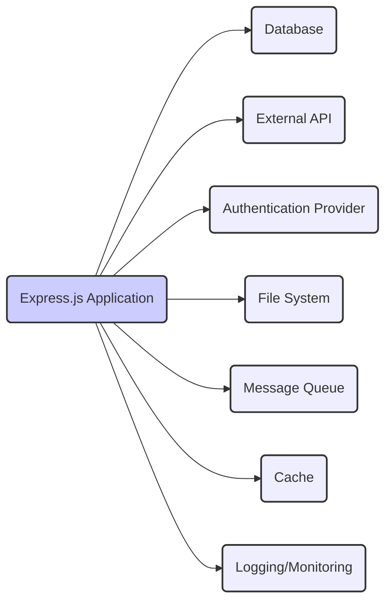

# Project Design Document: Express.js Framework

**Version:** 1.1
**Date:** October 26, 2023
**Author:** AI Software Architect

## 1. Introduction

This document provides an enhanced architectural design overview of the Express.js framework. It aims to offer a more detailed understanding of the key components, interactions, and data flows within Express.js to facilitate a more robust threat modeling exercise. This document serves as a comprehensive blueprint for understanding the system's structure and identifying potential security vulnerabilities.

## 2. Goals

* Provide a clear, concise, and more detailed architectural description of the Express.js framework.
* Identify key components and elaborate on their specific responsibilities and functionalities.
* Illustrate the flow of requests and responses within the framework with greater clarity.
* Highlight external dependencies and interactions with more specific examples.
* Serve as a robust foundation for subsequent threat modeling activities, enabling the identification of a wider range of potential threats.

## 3. Target Audience

* Security engineers and architects responsible for in-depth threat modeling and security assessments.
* Developers working with or extending the Express.js framework who require a deeper understanding of its architecture.
* DevOps engineers involved in deploying, managing, and securing Express.js applications.

## 4. Scope

This document focuses on the core architectural elements and fundamental concepts of the Express.js framework itself. While it acknowledges the interaction with applications built using Express.js and the underlying Node.js runtime environment, it primarily focuses on the framework's internal mechanisms and interfaces. Specific application logic and detailed Node.js internals remain outside the primary scope.

## 5. High-Level Architecture

Express.js is a minimalist and flexible web application framework built for Node.js. It provides a robust set of features for building single-page, multi-page, and hybrid web applications, as well as RESTful APIs. It operates as a routing and middleware management layer on top of Node.js's built-in HTTP module, simplifying the process of building web servers.

## 6. Key Components

* **Application Object (`express()`):** The foundational element of an Express.js application. An instance returned by the `express()` function, it serves as the central point for configuring and managing the web server.
    * **Routing Management:**  Holds the application's routing configuration, mapping HTTP methods and paths to specific handler functions.
    * **Middleware Stack:** Manages the ordered collection of middleware functions that will be executed during the request-response cycle.
    * **Server Configuration:** Provides methods for configuring server-level settings, such as the port to listen on, view engine, and static file serving.
    * **Event Handling:** Emits events that can be used to hook into the application's lifecycle.

* **Router:** A component responsible for defining, organizing, and matching routes to their corresponding handlers. It enables modular application design by allowing the creation of independent route definitions.
    * **Route Definition:** Allows defining routes using HTTP methods (GET, POST, PUT, DELETE, PATCH, OPTIONS, HEAD) and URL paths, potentially including parameters.
    * **Route Parameter Handling:** Extracts parameters from the URL path and makes them available in the `req.params` object.
    * **Middleware Integration:** Allows attaching middleware functions specifically to certain routes or groups of routes.
    * **Mounting:** Enables mounting router instances at specific paths, creating sub-applications or API versions.

* **Middleware:** Functions that intercept and process requests during their journey through the Express.js application. They operate on the request and response objects and can perform a wide range of tasks.
    * **Request/Response Manipulation:** Can modify the request headers, body, or parameters, and similarly, manipulate the response.
    * **Authentication and Authorization:** Commonly used to verify user credentials and control access to resources.
    * **Logging:** Can record information about incoming requests and outgoing responses for monitoring and debugging.
    * **Data Parsing:**  Parses request bodies (e.g., JSON, URL-encoded data) into a usable format.
    * **Error Handling:** Specialized middleware to catch and handle errors that occur during request processing.
    * **Chaining:** Middleware functions are executed sequentially, forming a pipeline. The `next()` function is crucial for passing control to the subsequent middleware.

* **Request Object (`req`):** An object representing the incoming HTTP request, providing access to all the information sent by the client.
    * **Headers (`req.headers`):** Contains all the HTTP headers sent with the request.
    * **Parameters:**
        * **Route Parameters (`req.params`):**  Parameters extracted from the URL path based on route definitions.
        * **Query String Parameters (`req.query`):** Parameters appended to the URL after the question mark (`?`).
    * **Body (`req.body`):**  Contains the data sent in the request body (requires body-parsing middleware).
    * **Cookies (`req.cookies`):**  Cookies sent by the client (requires cookie-parsing middleware).
    * **IP Address (`req.ip`, `req.ips`):**  Information about the client's IP address.
    * **Request Method (`req.method`):** The HTTP method used for the request (e.g., GET, POST).
    * **Request URL (`req.url`):** The requested URL.

* **Response Object (`res`):** An object used to construct and send the HTTP response back to the client.
    * **Status Code (`res.statusCode`):**  Sets the HTTP status code of the response (e.g., 200 OK, 404 Not Found).
    * **Headers (`res.setHeader()`, `res.set()`):**  Methods for setting response headers.
    * **Sending Data:**
        * **`res.send()`:** Sends the HTTP response. Can send various data types.
        * **`res.json()`:** Sends a JSON response.
        * **`res.render()`:** Renders a view template and sends the HTML response.
        * **`res.sendFile()`:** Sends a file as an attachment or inline.
    * **Redirection (`res.redirect()`):**  Sends an HTTP redirect to a different URL.
    * **Cookie Management (`res.cookie()`, `res.clearCookie()`):** Methods for setting and clearing cookies in the client's browser.

* **Route Handlers:** Callback functions associated with specific routes. They are executed when a matching route is found and all preceding middleware has completed.
    * **Request Processing:** Contains the application-specific logic to handle the incoming request.
    * **Response Generation:** Uses the `res` object to send the appropriate response back to the client.
    * **Access to Request Information:** Receives the `req` object to access request data.

## 7. Data Flow

The typical flow of an HTTP request through an Express.js application involves a series of steps, with middleware playing a crucial role in processing and transforming the request and response.

```mermaid
graph LR
    A("Incoming HTTP Request") --> B("Node.js HTTP Server");
    B --> C("Express.js Application Instance");
    C --> D{"'Router'"};
    D -- "Route Matching" --> E["'Middleware 1'"];
    E -- "next()" --> F["'Middleware 2'"];
    F -- "next()" --> G["'Route Handler'"];
    G -- "Response Generation (res.send(), etc.)" --> H("Express.js Application Instance");
    H --> I("Node.js HTTP Server");
    I --> J("HTTP Response to Client");
    style A fill:#f9f,stroke:#333,stroke-width:2px
    style B fill:#ccf,stroke:#333,stroke-width:2px
    style C fill:#ccf,stroke:#333,stroke-width:2px
    style D fill:#ddf,stroke:#333,stroke-width:2px
    style E fill:#eef,stroke:#333,stroke-width:2px
    style F fill:#eef,stroke:#333,stroke-width:2px
    style G fill:#ddf,stroke:#333,stroke-width:2px
    style H fill:#ccf,stroke:#333,stroke-width:2px
    style I fill:#ccf,stroke:#333,stroke-width:2px
    style J fill:#f9f,stroke:#333,stroke-width:2px
```

**Detailed Steps:**

1. **Incoming HTTP Request:** A client initiates an HTTP request targeting the Express.js application.
2. **Node.js HTTP Server:** The underlying Node.js HTTP server receives the incoming request and passes it to the Express.js application instance.
3. **Express.js Application Instance:** The Express.js application receives the request and begins processing it.
4. **Router:** The application's router examines the request's HTTP method and URL path to find a matching route definition.
5. **Middleware Chain:** If a matching route is found, the associated middleware functions are executed sequentially in the order they were defined for that route (or globally for the application).
    * Each middleware function receives the `req` (request) and `res` (response) objects, along with the `next()` function.
    * Middleware can perform actions like:
        * Parsing request bodies (e.g., JSON, URL-encoded data).
        * Authenticating the user.
        * Logging request details.
        * Modifying request or response headers.
        * Terminating the request-response cycle if necessary (e.g., for unauthorized access).
    * Calling `next()` passes control to the next middleware in the chain. If `next()` is not called, the request processing stops at that middleware.
6. **Route Handler:** Once all preceding middleware has been executed (and called `next()`), the route handler function associated with the matched route is invoked.
7. **Response Generation:** The route handler executes the core application logic for the request and uses the `res` object to generate and send the HTTP response back to the client. This might involve:
    * Sending JSON data (`res.json()`).
    * Rendering a template (`res.render()`).
    * Sending a file (`res.sendFile()`).
    * Redirecting the client (`res.redirect()`).
    * Simply sending a status code and message (`res.send()`).
8. **Express.js Application Instance:** The generated response is passed back through the Express.js application instance.
9. **Node.js HTTP Server:** The Node.js HTTP server takes the completed response and sends it back to the originating client.
10. **HTTP Response to Client:** The client receives the final HTTP response from the server.

## 8. External Interactions

Express.js applications frequently interact with external systems to fulfill their functionality. These interactions introduce potential trust boundaries and security considerations.

* **Clients (Web Browsers, Mobile Apps, API Consumers):** Initiate requests and consume responses. This is the primary interaction point and a major trust boundary. Examples include:
    * Web browsers sending GET and POST requests.
    * Mobile applications making API calls.
    * Other servers or services consuming APIs exposed by the Express.js application.
* **Databases (SQL like PostgreSQL, MySQL; NoSQL like MongoDB, Couchbase):** Used for persistent data storage and retrieval. Interactions involve querying, inserting, updating, and deleting data.
* **External APIs (REST, GraphQL, SOAP):** Express.js applications often act as clients to other services, consuming data or triggering actions. Examples include:
    * Calling third-party payment gateways.
    * Integrating with social media platforms.
    * Using mapping or geolocation services.
* **Authentication Providers (OAuth 2.0 providers like Google, Facebook; OpenID Connect):** Used for federated authentication and authorization. Interactions involve redirecting users, exchanging authorization codes for tokens, and verifying tokens.
* **File System:** Used for reading configuration files, serving static assets, and potentially storing uploaded files.
* **Message Queues (RabbitMQ, Kafka, Redis Pub/Sub):** Facilitate asynchronous communication between services or components. Express.js applications might publish or subscribe to messages.
* **Caching Systems (Redis, Memcached):** Used to improve performance by storing frequently accessed data in memory.
* **Logging and Monitoring Services (e.g., Splunk, ELK stack, Prometheus):** Used for collecting and analyzing application logs and performance metrics.

## 9. Security Considerations (Detailed)

This section expands on the initial security considerations, providing more specific examples and categorizing potential threats based on the architectural components.

* **Middleware Vulnerabilities:**
    * **Dependency Vulnerabilities:** Using outdated middleware packages with known security flaws (e.g., vulnerabilities in `body-parser` allowing for denial-of-service).
    * **Malicious Middleware:**  Introducing third-party middleware with intentionally malicious code.
    * **Configuration Errors:** Incorrectly configuring middleware, leading to security bypasses (e.g., permissive CORS settings).
* **Route Handling Vulnerabilities:**
    * **Injection Attacks:**
        * **SQL Injection:**  Improperly sanitizing user input in route handlers that interact with databases.
        * **Command Injection:**  Executing arbitrary system commands based on user-controlled input.
        * **Cross-Site Scripting (XSS):**  Rendering unsanitized user input in templates, allowing attackers to inject malicious scripts.
    * **Insecure Direct Object References (IDOR):**  Exposing internal object IDs without proper authorization checks, allowing users to access resources they shouldn't.
    * **Path Traversal:** Allowing users to access files or directories outside of the intended scope.
* **Request and Response Object Manipulation:**
    * **Header Manipulation:**  Attackers potentially manipulating request headers before they reach the application or exploiting vulnerabilities in how the application processes headers.
    * **Cookie Security:**  Lack of secure cookie flags (HttpOnly, Secure, SameSite) leading to cookie theft or manipulation.
    * **Session Hijacking:**  Vulnerabilities in session management allowing attackers to steal or reuse valid session IDs.
* **Authentication and Authorization:**
    * **Broken Authentication:** Weak password policies, lack of multi-factor authentication, or vulnerabilities in authentication logic.
    * **Broken Authorization:**  Failing to properly enforce access controls, allowing users to perform actions they are not authorized for.
    * **JWT Vulnerabilities:**  Improperly verifying JWT signatures or using weak signing algorithms.
* **External Interaction Security:**
    * **API Key Management:**  Storing API keys insecurely or exposing them.
    * **Man-in-the-Middle (MITM) Attacks:**  Lack of HTTPS or proper certificate validation when communicating with external services.
    * **Data Breaches:**  Exposure of sensitive data during transmission or storage when interacting with external systems.
* **Denial of Service (DoS):**
    * **Resource Exhaustion:**  Allowing excessive resource consumption through large requests or inefficient processing.
    * **Slowloris Attacks:**  Sending slow, incomplete requests to tie up server resources.
* **Error Handling and Logging:**
    * **Information Disclosure:**  Verbose error messages revealing sensitive information about the application's internal workings.
    * **Insufficient Logging:**  Lack of adequate logging making it difficult to detect and investigate security incidents.

## 10. Assumptions

* The underlying Node.js runtime environment is assumed to be a supported and patched version, free from known critical vulnerabilities.
* Developers utilizing Express.js are expected to have a basic understanding of web security principles and follow secure coding practices.
* Third-party middleware packages are assumed to be developed with security considerations in mind, but their code should still be reviewed and vetted for potential vulnerabilities.
* The hosting infrastructure and network are assumed to have basic security measures in place (e.g., firewalls).

## 11. Out of Scope

* Detailed analysis of the internal workings of the Node.js HTTP module.
* Specific implementation details of individual applications built on top of Express.js.
* Comprehensive security audits of specific middleware packages (unless directly impacting the core framework's architecture).
* Platform-specific deployment and infrastructure security configurations (e.g., OS hardening, container security).
* Business logic vulnerabilities within specific application implementations.
