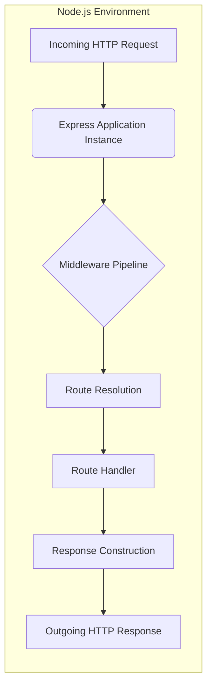

# Project Design Document: Express.js Framework (Improved)

**Version:** 1.1
**Date:** October 26, 2023
**Author:** AI Software Architect

## 1. Introduction

This document provides an enhanced architectural design of the Express.js framework, specifically tailored for threat modeling activities. It offers a detailed breakdown of the framework's structure, core components, data flow, and inherent security considerations. This document aims to be a practical resource for security professionals and developers to understand potential attack surfaces and vulnerabilities within Express.js applications.

Express.js is a minimalist, unopinionated web application framework for Node.js. Its core philosophy revolves around providing essential web application features as a series of middleware function calls, offering flexibility without abstracting away the underlying capabilities of Node.js. This middleware-centric approach is crucial for understanding its security posture.

## 2. Goals and Objectives

The primary goal of this improved document is to provide an even more robust and detailed architectural understanding of Express.js to facilitate advanced threat modeling. Specific objectives include:

*   Clearly and comprehensively define the major components and their interactions, with a focus on security implications.
*   Provide more granular detail on the flow of data and control through the framework, highlighting trust boundaries.
*   Explicitly identify potential attack surfaces and common vulnerability patterns associated with each component and interaction.
*   Serve as a practical guide for security assessments and penetration testing of Express.js applications.

## 3. Architectural Overview

Express.js employs a middleware pipeline architecture. Incoming HTTP requests are processed sequentially by a stack of middleware functions before reaching the designated route handler. The response journey follows a similar, though often less explicitly defined, path. Understanding this pipeline is fundamental to identifying where security controls can be implemented and where vulnerabilities might arise.

**Key Architectural Concepts (Enhanced):**

*   **Middleware Pipeline:**  An ordered sequence of functions that intercept and process incoming requests and outgoing responses. Each middleware function operates within a defined scope and can modify the request and response objects, terminate the cycle, or pass control to the next middleware. The order of middleware is critical and dictates the processing sequence, directly impacting security.
*   **Route Resolution:** The process of matching an incoming request's method and path against defined routes within the application. This involves pattern matching and parameter extraction, which can be potential areas for manipulation.
*   **Request and Response Objects (Detailed):** These objects encapsulate all information about the HTTP transaction. The `req` object contains data from the client, including headers, parameters, body, and cookies – all potential sources of malicious input. The `res` object provides methods for sending data back to the client, and improper use can lead to vulnerabilities like information disclosure.
*   **Express Application Instance:** The central object created by the `express()` function. It manages the middleware pipeline, routing definitions, and application-level settings. Its configuration directly impacts the application's security posture.

## 4. Component Breakdown (Enhanced)

This section provides a more detailed breakdown of the key components within the Express.js framework, with a stronger emphasis on security aspects.

*   **`express()` Function (Security Focus):**
    *   Creates the core application instance. Initial configuration choices made here (e.g., enabling trust proxy settings) have direct security implications regarding how the application handles requests from reverse proxies.
    *   The application instance is the entry point for all requests, making it a critical point for security controls.
*   **Router (Security Focus):**
    *   Responsible for mapping incoming requests to specific handlers. Incorrectly configured routes or overly permissive route definitions can expose unintended functionality.
    *   Route parameters and regular expressions used in route definitions can be vulnerable to Regular Expression Denial of Service (ReDoS) attacks if not carefully constructed.
    *   Mounting routers at different paths creates distinct routing domains, which can be used to enforce access control policies.
*   **Middleware Pipeline (Security Focus):**
    *   The heart of Express.js's architecture and a crucial area for security. Middleware can be categorized by function, including:
        *   **Security Middleware:** Specifically designed to enforce security policies (e.g., `helmet` for setting security headers, `csurf` for CSRF protection).
        *   **Authentication Middleware:** Verifies the identity of the user making the request (e.g., using `passport`).
        *   **Authorization Middleware:** Determines if an authenticated user has permission to access a resource.
        *   **Input Validation Middleware:** Sanitizes and validates incoming data to prevent injection attacks.
        *   **Error Handling Middleware:**  Crucial for preventing information leakage through error messages. Improperly implemented error handlers can reveal sensitive details about the application's internal workings.
    *   The order of middleware in the pipeline is paramount. For example, authentication middleware should typically precede authorization middleware.
*   **Request Object (`req`) (Security Focus):**
    *   A primary source of potentially malicious input. Attackers can manipulate various parts of the request (headers, parameters, body, cookies) to exploit vulnerabilities.
    *   Understanding the different properties of the `req` object (e.g., `req.params`, `req.query`, `req.body`, `req.cookies`, `req.headers`) is essential for implementing proper input validation and sanitization.
*   **Response Object (`res`) (Security Focus):**
    *   Used to send data back to the client. Improper use can lead to vulnerabilities such as:
        *   **Information Disclosure:** Sending sensitive data in the response body or headers.
        *   **Cross-Site Scripting (XSS):**  Rendering unsanitized user input in the response.
        *   **Insecure Cookie Handling:**  Not setting appropriate flags (e.g., `httpOnly`, `secure`, `sameSite`) on cookies.
    *   Methods like `res.send()`, `res.json()`, `res.render()`, and `res.redirect()` need to be used securely.
*   **View Engine Integration (Optional, Security Focus):**
    *   While providing dynamic content generation, view engines can introduce XSS vulnerabilities if not used carefully.
    *   It's crucial to use templating engines that offer automatic escaping of output or to manually sanitize data before rendering.

## 5. Data Flow (Enhanced)

The following diagram provides a more detailed illustration of the data flow within an Express.js application, highlighting potential points of interaction and security considerations.

```mermaid
graph LR
    subgraph "Request Processing"
        A["Incoming HTTP Request"] --> B("Express Application Instance");
        B --> C["Middleware 1 (e.g., Logging)"];
        C -- "Processed Request" --> D["Middleware 2 (e.g., Authentication)"];
        D -- "Authenticated Request" --> E["Middleware 3 (e.g., Input Validation)"];
        E -- "Validated Request" --> F["Route Resolution"];
        F -- "Matched Route" --> G["Route-Specific Middleware (if any)"];
        G -- "Authorized Request" --> H["Route Handler Function"];
    end

    subgraph "Response Processing"
        H --> I["Response Generation"];
        I --> J["Middleware (for response processing, e.g., Security Headers)"];
        J --> K["Outgoing HTTP Response"];
    end
```

**Detailed Data Flow (Enhanced):**

1. **Incoming HTTP Request:** The client initiates a request, potentially containing malicious data.
2. **Express Application Instance:** The request is received, and the processing begins.
3. **Middleware Pipeline (Detailed):**
    *   **Initial Middleware:**  Functions like logging middleware might be the first to process the request.
    *   **Authentication Middleware:** Verifies the user's identity. Failure here might result in immediate response and termination of the cycle.
    *   **Input Validation Middleware:** Scrutinizes the request data for malicious content. Invalid input should be rejected or sanitized.
    *   **Other Middleware:**  Various other middleware functions can perform tasks like request body parsing, cookie handling, etc.
4. **Route Resolution:** The router matches the request to a specific route definition.
5. **Route-Specific Middleware:** Middleware defined specifically for a particular route is executed, often for authorization checks.
6. **Route Handler Function:** The core logic for handling the request is executed. This is where business logic resides and where data is processed.
7. **Response Generation:** The route handler constructs the response using the `res` object.
8. **Response Processing Middleware:** Middleware can also operate on the response before it's sent, for example, to set security headers.
9. **Outgoing HTTP Response:** The final response is sent back to the client.

## 6. Security Considerations (Comprehensive)

This section provides a more in-depth look at security considerations relevant to Express.js applications, offering specific examples and mitigation strategies.

*   **Input Validation (Detailed):**
    *   **Vulnerability:** Failure to validate user inputs can lead to various injection attacks (XSS, SQL Injection, Command Injection), data corruption, and unexpected application behavior.
    *   **Mitigation:**
        *   Implement robust input validation using libraries like `express-validator` or custom middleware.
        *   Validate data type, format, length, and allowed values.
        *   Sanitize input to remove potentially harmful characters or code.
        *   Apply context-specific encoding when rendering data in HTML, URLs, or other contexts.
*   **Authentication and Authorization (Detailed):**
    *   **Vulnerability:** Weak or missing authentication allows unauthorized access. Improper authorization can lead to privilege escalation.
    *   **Mitigation:**
        *   Use strong and well-vetted authentication mechanisms (e.g., OAuth 2.0, OpenID Connect).
        *   Implement multi-factor authentication (MFA).
        *   Store passwords securely using strong hashing algorithms (e.g., bcrypt).
        *   Enforce the principle of least privilege in authorization rules.
        *   Regularly review and update access control policies.
*   **Session Management (Detailed):**
    *   **Vulnerability:** Insecure session management can lead to session hijacking, session fixation, and unauthorized access.
    *   **Mitigation:**
        *   Use secure session middleware like `express-session` with appropriate configurations (e.g., secure cookie flags, secret key management).
        *   Implement session regeneration after login to prevent session fixation.
        *   Set appropriate session timeouts.
        *   Consider using HTTP-only and secure flags for session cookies.
*   **Cross-Site Scripting (XSS) (Detailed):**
    *   **Vulnerability:** Allows attackers to inject malicious scripts into web pages viewed by other users.
    *   **Mitigation:**
        *   **Output Encoding:** Encode data before rendering it in HTML. Use templating engines with automatic escaping features.
        *   **Content Security Policy (CSP):** Implement CSP headers to control the sources from which the browser is allowed to load resources.
        *   **Input Sanitization:** Sanitize user input to remove potentially harmful scripts, but encoding is generally preferred for preventing XSS.
*   **Cross-Site Request Forgery (CSRF) (Detailed):**
    *   **Vulnerability:** Enables attackers to force authenticated users to perform unintended actions.
    *   **Mitigation:**
        *   Use anti-CSRF tokens (synchronizer tokens) with middleware like `csurf`.
        *   Implement proper SameSite cookie attributes.
        *   Verify the Origin or Referer header (though less reliable).
*   **SQL Injection (Detailed):**
    *   **Vulnerability:** Occurs when user-provided data is directly included in SQL queries.
    *   **Mitigation:**
        *   **Parameterized Queries (Prepared Statements):** Always use parameterized queries or prepared statements when interacting with databases.
        *   **Object-Relational Mappers (ORMs):** ORMs often provide built-in protection against SQL injection.
        *   **Principle of Least Privilege for Database Access:** Grant database users only the necessary permissions.
*   **Denial of Service (DoS) (Detailed):**
    *   **Vulnerability:** Overwhelming the application with requests, making it unavailable to legitimate users.
    *   **Mitigation:**
        *   **Rate Limiting:** Implement rate limiting middleware to restrict the number of requests from a single IP address.
        *   **Request Size Limits:** Limit the size of incoming requests to prevent resource exhaustion.
        *   **Timeouts:** Set appropriate timeouts for requests and connections.
        *   Consider using a Web Application Firewall (WAF).
*   **Error Handling and Information Disclosure (Detailed):**
    *   **Vulnerability:** Revealing sensitive information in error messages can aid attackers.
    *   **Mitigation:**
        *   Implement generic error messages for production environments.
        *   Log detailed error information securely on the server-side.
        *   Avoid displaying stack traces or internal application details to users.
*   **Dependency Management (Detailed):**
    *   **Vulnerability:** Using outdated or vulnerable dependencies can introduce security risks.
    *   **Mitigation:**
        *   Regularly audit and update dependencies using tools like `npm audit` or `yarn audit`.
        *   Use dependency management tools to track and manage dependencies.
        *   Be aware of the security advisories for your dependencies.
*   **HTTP Header Security (Detailed):**
    *   **Vulnerability:** Missing or misconfigured security headers can leave the application vulnerable to various attacks.
    *   **Mitigation:**
        *   Use middleware like `helmet` to set common security headers (e.g., `Strict-Transport-Security`, `X-Frame-Options`, `Content-Security-Policy`, `X-Content-Type-Options`, `Referrer-Policy`, `Permissions-Policy`).
        *   Understand the purpose and implications of each security header.

## 7. Deployment Considerations (Security Focused)

The deployment environment significantly impacts the security of Express.js applications.

*   **HTTPS/TLS:** Ensure all communication is encrypted using HTTPS. Configure TLS certificates correctly.
*   **Reverse Proxies:** If using reverse proxies (e.g., Nginx, Apache), configure them securely and ensure Express.js is configured to trust the proxy.
*   **Container Security:** When using containers, follow security best practices for container image creation and runtime.
*   **Serverless Security:** In serverless environments, pay attention to IAM roles and permissions.
*   **Network Security:** Implement firewalls and network segmentation to restrict access to the application.
*   **Operating System Security:** Keep the underlying operating system and Node.js runtime updated with security patches.

## 8. Dependencies (Security Focused)

Be particularly mindful of the security implications of the dependencies used in your Express.js application. Regularly review and update them. Pay close attention to dependencies related to:

*   **Authentication and Authorization:** These are critical for security.
*   **Data Validation and Sanitization:** Vulnerabilities here can lead to injection attacks.
*   **Session Management:** Insecure session handling is a common vulnerability.
*   **Database Interaction:** Ensure your database drivers and ORMs are up-to-date and used securely.
*   **Security Middleware:** While helpful, ensure these middleware are correctly configured.

## 9. Future Considerations

Future enhancements to Express.js could focus on:

*   **Built-in Security Defaults:**  Providing more secure defaults out-of-the-box to reduce common misconfigurations.
*   **Improved Type Safety and Security Analysis Tools:**  Better integration with TypeScript and static analysis tools to identify potential vulnerabilities early in the development process.
*   **Standardized Security Middleware Recommendations:**  Providing clearer guidance on recommended security middleware and best practices for their use.

## 10. Conclusion

This improved design document provides a more detailed and security-focused architectural overview of the Express.js framework. It emphasizes potential attack surfaces, common vulnerabilities, and mitigation strategies. This enhanced understanding is crucial for effectively threat modeling Express.js applications and building more secure and resilient web services. By carefully considering the architecture, components, data flow, and security implications outlined in this document, developers and security professionals can work together to minimize risks and protect their applications.