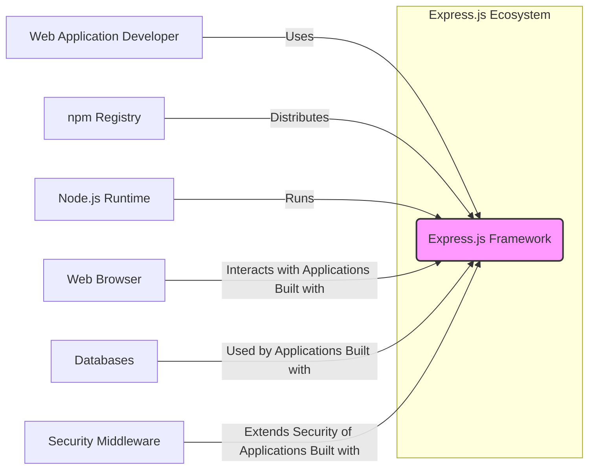

# BUSINESS POSTURE

- Business Priorities and Goals:
  - Provide a minimal, flexible, and performant web application framework for Node.js.
  - Enable developers to quickly build and deploy web applications and APIs.
  - Maintain a large and active community to support and extend the framework.
  - Ensure the framework is easy to learn and use, promoting developer productivity.
  - Remain open-source and freely available to encourage widespread adoption.
- Business Risks:
  - Security vulnerabilities in the framework could lead to widespread application security issues for users.
  - Lack of maintenance or community support could lead to the framework becoming outdated and less secure.
  - Breaking changes in new versions could disrupt existing applications and developer workflows.
  - Negative publicity from security incidents or critical bugs could damage the framework's reputation and adoption.

# SECURITY POSTURE

- Existing Security Controls:
  - security control: Open Source Code - publicly accessible source code on GitHub allows for community review and identification of potential vulnerabilities. Implemented: GitHub Repository.
  - security control: Community Contributions - relies on community contributions for bug fixes, security patches, and feature development. Implemented: GitHub pull requests and issue tracking.
  - security control: npm Ecosystem - leverages the security features of the npm registry for package distribution and dependency management. Implemented: npm registry.
  - accepted risk: Reliance on Community Security - security relies heavily on the vigilance and contributions of the open-source community.
  - accepted risk: Dependency Vulnerabilities - potential vulnerabilities in dependencies used by Express.js need to be monitored and addressed.

- Recommended Security Controls:
  - security control: Automated Security Scanning - Implement automated Static Application Security Testing (SAST) and Dependency Scanning in the CI/CD pipeline to identify potential vulnerabilities early in the development process.
  - security control: Regular Security Audits - Conduct periodic security audits by external security experts to identify and address potential weaknesses in the framework.
  - security control: Security Vulnerability Disclosure Policy - Establish a clear and public security vulnerability disclosure policy to guide users and security researchers on how to report vulnerabilities responsibly.
  - security control: Security Champions - Designate security champions within the development team to promote security awareness and best practices.

- Security Requirements:
  - Authentication:
    - Requirement: Express.js itself does not enforce authentication, but it should provide mechanisms and guidance for developers to easily integrate authentication middleware.
    - Existing Control: Middleware ecosystem (e.g., Passport.js) provides authentication solutions.
  - Authorization:
    - Requirement: Express.js should provide mechanisms and guidance for developers to implement authorization controls to protect resources based on user roles and permissions.
    - Existing Control: Middleware ecosystem (e.g., express-jwt, express-acl) provides authorization solutions.
  - Input Validation:
    - Requirement: Express.js should encourage and facilitate input validation to prevent common vulnerabilities like injection attacks.
    - Existing Control: Middleware ecosystem (e.g., express-validator) provides input validation solutions. Framework documentation and examples should emphasize input validation best practices.
  - Cryptography:
    - Requirement: Express.js itself does not handle cryptography directly for application data, but it relies on Node.js crypto library and should provide guidance on using cryptography securely when needed in applications built with Express.js.
    - Existing Control: Node.js crypto library is available. Guidance in documentation and examples should promote secure cryptographic practices.

# DESIGN

## C4 CONTEXT



- Context Diagram Elements:
  - Element:
    - Name: Express.js Framework
    - Type: Software System
    - Description: A minimal and flexible Node.js web application framework. It provides a set of features for building web applications and APIs.
    - Responsibilities: Routing HTTP requests, handling middleware, managing request and response objects, providing a foundation for web application development in Node.js.
    - Security controls: Relies on community review, open-source nature, and security practices of the Node.js ecosystem.
  - Element:
    - Name: Web Application Developer
    - Type: Person
    - Description: Developers who use Express.js to build web applications and APIs.
    - Responsibilities: Writing application code using Express.js, implementing business logic, configuring middleware, deploying and maintaining applications. Responsible for application-level security built on top of Express.js.
    - Security controls: Responsible for implementing security controls in applications built with Express.js, such as authentication, authorization, input validation, and secure data handling.
  - Element:
    - Name: npm Registry
    - Type: Software System
    - Description: The Node Package Manager registry, used to distribute and manage Node.js packages, including Express.js.
    - Responsibilities: Hosting and distributing the Express.js package, providing version control, and ensuring package integrity.
    - Security controls: Package signing, malware scanning, and vulnerability scanning of packages in the registry.
  - Element:
    - Name: Node.js Runtime
    - Type: Software System
    - Description: The JavaScript runtime environment that executes Express.js applications.
    - Responsibilities: Providing the execution environment for JavaScript code, handling I/O operations, and providing core JavaScript functionalities.
    - Security controls: Security features of the Node.js runtime environment, including sandboxing, security updates, and built-in crypto libraries.
  - Element:
    - Name: Web Browser
    - Type: Software System
    - Description: Client-side application used by end-users to interact with web applications built using Express.js.
    - Responsibilities: Rendering web pages, executing client-side JavaScript, and communicating with web servers.
    - Security controls: Browser security features such as sandboxing, Content Security Policy (CSP), and protection against cross-site scripting (XSS).
  - Element:
    - Name: Databases
    - Type: Software System
    - Description: Data storage systems used by applications built with Express.js to persist and retrieve data. Examples include PostgreSQL, MySQL, MongoDB.
    - Responsibilities: Storing application data, providing data access and manipulation capabilities, ensuring data integrity and availability.
    - Security controls: Database access controls, encryption at rest and in transit, data validation, and security auditing.
  - Element:
    - Name: Security Middleware
    - Type: Software System
    - Description: Third-party middleware packages that extend the security capabilities of Express.js applications. Examples include Passport.js for authentication, Helmet for security headers, and express-validator for input validation.
    - Responsibilities: Providing reusable security functionalities that can be easily integrated into Express.js applications.
    - Security controls: Security features provided by the middleware itself, and the responsibility of developers to configure and use the middleware correctly.

## C4 CONTAINER

```mermaid
flowchart LR
    subgraph "Express.js Ecosystem"
        A("Express.js Core" <br> "Node.js Library")
        B("Documentation Website" <br> "Static Website")
    end
    C["npm Registry"] -- Provides Package --> A
    D["GitHub Repository"] -- Source Code & Contributions --> A & B
    E["Web Browser"] -- Accesses --> B
    F["Web Application Developer"] -- Uses --> A & B
    style A fill:#f9f,stroke:#333,stroke-width:2px
    style B fill:#ccf,stroke:#333,stroke-width:2px
```

- Container Diagram Elements:
  - Element:
    - Name: Express.js Core
    - Type: Library
    - Description: The core Express.js library distributed as an npm package. It contains the framework's core functionalities for routing, middleware, and request/response handling.
    - Responsibilities: Providing the fundamental building blocks for web application development with Express.js.
    - Security controls: Code review, community contributions, and automated security scanning of the codebase. Relies on Node.js runtime security.
  - Element:
    - Name: Documentation Website
    - Type: Static Website
    - Description: The official website for Express.js, providing documentation, guides, examples, and API references.
    - Responsibilities: Providing comprehensive and up-to-date documentation for developers using Express.js.
    - Security controls: HTTPS, Content Security Policy (CSP), regular security updates of website dependencies, and protection against common web vulnerabilities.
  - Element:
    - Name: npm Registry
    - Type: Package Registry
    - Description:  Distributes the Express.js Core package.
    - Responsibilities: Hosting and distributing the Express.js package.
    - Security controls: Package signing, malware scanning.
  - Element:
    - Name: GitHub Repository
    - Type: Source Code Repository
    - Description: Hosts the source code of Express.js Core and the Documentation Website. Used for collaboration, issue tracking, and version control.
    - Responsibilities: Managing source code, tracking issues and feature requests, facilitating community contributions.
    - Security controls: Access controls, branch protection, code review processes, and vulnerability scanning of dependencies.
  - Element:
    - Name: Web Browser
    - Type: Client Application
    - Description: Used by developers to access the Documentation Website.
    - Responsibilities: Rendering the website content.
    - Security controls: Browser security features.
  - Element:
    - Name: Web Application Developer
    - Type: Person
    - Description: Developers who use Express.js and its documentation.
    - Responsibilities: Developing applications, consulting documentation.
    - Security controls: Secure development practices.

## DEPLOYMENT

- Deployment Architecture:
  - Express.js itself is a library and is not deployed as a standalone application. Deployment refers to applications built using Express.js and the Express.js documentation website.
  - Documentation Website Deployment (Chosen for detailed description): The Express.js documentation website is likely deployed as a static website on a web hosting platform or Content Delivery Network (CDN).

```mermaid
flowchart LR
    subgraph "Web Hosting / CDN"
        A("Web Server" <br> "nginx/Apache")
        B("Static Content Storage" <br> "File System / Cloud Storage")
    end
    C["DNS"] -- Resolves to --> A
    D["Web Browser"] -- Accesses via HTTPS --> A
    A -- Serves Static Content from --> B
    style A fill:#f9f,stroke:#333,stroke-width:2px
    style B fill:#ccf,stroke:#333,stroke-width:2px
```

- Deployment Diagram Elements (Documentation Website):
  - Element:
    - Name: Web Server (nginx/Apache)
    - Type: Software
    - Description: A web server (e.g., nginx or Apache) that serves the static content of the Express.js documentation website.
    - Responsibilities: Handling HTTP requests, serving static files, managing HTTPS connections.
    - Security controls: HTTPS configuration, web server hardening, access controls, and regular security updates.
  - Element:
    - Name: Static Content Storage (File System / Cloud Storage)
    - Type: Data Store
    - Description: Storage for the static files of the documentation website (HTML, CSS, JavaScript, images). Could be a file system on the web server or a cloud storage service like AWS S3 or Google Cloud Storage.
    - Responsibilities: Storing and providing access to static website files.
    - Security controls: Access controls, data encryption at rest (if using cloud storage), and regular backups.
  - Element:
    - Name: DNS
    - Type: Infrastructure
    - Description: Domain Name System that resolves the documentation website's domain name to the web server's IP address.
    - Responsibilities: Domain name resolution.
    - Security controls: DNSSEC to protect against DNS spoofing and cache poisoning.
  - Element:
    - Name: Web Browser
    - Type: Client Application
    - Description: Used by developers to access the documentation website.
    - Responsibilities: Rendering the website content.
    - Security controls: Browser security features.

## BUILD

```mermaid
flowchart LR
    A["Developer"] -- Code Changes --> B("GitHub Repository")
    B -- Trigger --> C("CI/CD System" <br> "GitHub Actions")
    C -- Checkout Code --> D("Build Environment")
    D -- Run Linters & SAST --> D
    D -- Run Tests --> D
    D -- Build Documentation --> E("Build Artifacts" <br> "npm Package, Website Files")
    E -- Publish npm Package --> F("npm Registry")
    E -- Deploy Website Files --> G("Web Hosting / CDN")
    style B fill:#f9f,stroke:#333,stroke-width:2px
    style C fill:#ccf,stroke:#333,stroke-width:2px
    style E fill:#eef,stroke:#333,stroke-width:2px
```

- Build Process Elements:
  - Element:
    - Name: Developer
    - Type: Person
    - Description: Developers contributing to the Express.js project.
    - Responsibilities: Writing code, submitting pull requests, and participating in code reviews.
    - Security controls: Secure coding practices, code review process, and authentication to GitHub.
  - Element:
    - Name: GitHub Repository
    - Type: Code Repository
    - Description: Hosts the source code of Express.js.
    - Responsibilities: Version control, collaboration, and triggering the CI/CD pipeline.
    - Security controls: Access controls, branch protection, and audit logs.
  - Element:
    - Name: CI/CD System (GitHub Actions)
    - Type: Automation System
    - Description: Automated system for building, testing, and publishing Express.js. Likely GitHub Actions.
    - Responsibilities: Automating the build, test, and deployment processes.
    - Security controls: Secure configuration of CI/CD pipelines, access controls, secret management, and audit logs.
  - Element:
    - Name: Build Environment
    - Type: Computing Environment
    - Description: Environment where the build process is executed.
    - Responsibilities: Providing the necessary tools and dependencies for building and testing Express.js.
    - Security controls: Secure build environment, dependency scanning, and isolation from production environments.
  - Element:
    - Name: Build Artifacts (npm Package, Website Files)
    - Type: Digital Output
    - Description: The output of the build process, including the npm package for Express.js Core and the static files for the documentation website.
    - Responsibilities: Representing the distributable and deployable components of Express.js.
    - Security controls: Integrity checks (e.g., checksums, signatures) for build artifacts.
  - Element:
    - Name: npm Registry
    - Type: Package Registry
    - Description:  Hosts the Express.js npm package.
    - Responsibilities: Distributing the Express.js package to developers.
    - Security controls: Package signing, malware scanning.
  - Element:
    - Name: Web Hosting / CDN
    - Type: Infrastructure
    - Description: Hosts the Express.js documentation website.
    - Responsibilities: Serving the documentation website to users.
    - Security controls: Web server hardening, HTTPS, and CDN security features.

# RISK ASSESSMENT

- Critical Business Processes:
  - Maintaining the integrity and availability of the Express.js framework.
  - Ensuring the security of the Express.js framework to protect users' applications.
  - Providing accurate and up-to-date documentation for developers.
  - Maintaining a healthy and active community around the framework.

- Data to Protect and Sensitivity:
  - Source code of Express.js: High sensitivity. Confidentiality and integrity are crucial to prevent unauthorized modifications or exposure of vulnerabilities.
  - Documentation content: Medium sensitivity. Integrity and availability are important to ensure developers have access to correct information.
  - Website content and assets: Low to medium sensitivity. Availability and integrity are important for user experience.
  - Build artifacts (npm package): High sensitivity. Integrity is critical to prevent supply chain attacks and ensure users are using a secure and untampered package.

# QUESTIONS & ASSUMPTIONS

- Questions:
  - What is the intended audience for this design document? (e.g., Express.js maintainers, security auditors, developers using Express.js).
  - What is the specific scope of threat modeling that will be performed using this document? (e.g., framework vulnerabilities, supply chain risks, infrastructure security).
  - Are there any specific security concerns or past incidents that should be considered in the threat model?
  - What is the acceptable risk level for the Express.js project and its users?

- Assumptions:
  - BUSINESS POSTURE: The primary business goal is to provide a secure, reliable, and easy-to-use web framework for the Node.js community. Security is a high priority due to the widespread use of Express.js.
  - SECURITY POSTURE: The project currently relies heavily on community contributions and open-source principles for security. There is an opportunity to enhance security through more proactive measures like automated security scanning and formal security audits.
  - DESIGN: The design focuses on the core components of the Express.js ecosystem: the framework library, documentation website, npm distribution, and build process. The deployment diagram focuses on the documentation website as an example of a deployed component within the ecosystem. The build process is assumed to be automated using a CI/CD system like GitHub Actions.