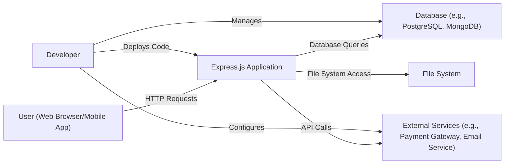
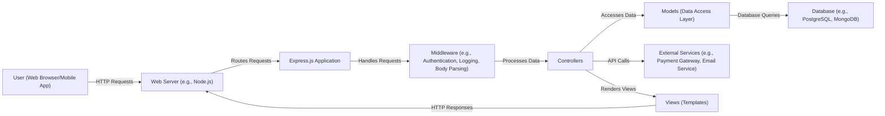
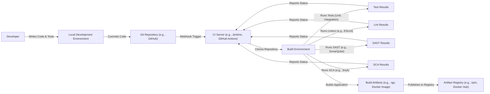

Okay, let's create a design document for the Express.js project, keeping in mind its purpose and potential security considerations.

# BUSINESS POSTURE

Express.js is a minimal and flexible Node.js web application framework that provides a robust set of features for web and mobile applications.  It's widely used, forming the foundation for countless applications and APIs.

Priorities:

*   Provide a simple, unopinionated, and extensible framework for building web applications.
*   Maintain high performance and low overhead.
*   Ensure a large and active community for support and contributions.
*   Maintain backward compatibility where possible, to avoid breaking existing applications.
*   Facilitate rapid development of web applications and APIs.

Goals:

*   Be the leading web application framework for Node.js.
*   Enable developers to easily create robust and scalable applications.
*   Provide a stable and reliable platform for production deployments.

Business Risks:

*   Security vulnerabilities in the framework could expose a vast number of applications to attacks.  This is the most critical risk, given Express.js's widespread use.
*   Performance bottlenecks could impact the performance of applications built with the framework.
*   Lack of maintenance or updates could lead to the framework becoming obsolete or insecure.
*   Breaking changes could disrupt existing applications and damage the framework's reputation.
*   Competition from other frameworks could reduce Express.js's market share.

# SECURITY POSTURE

Existing Security Controls:

*   security control: Regular updates and patches to address reported vulnerabilities. (Described in the project's GitHub repository and release notes).
*   security control: Community involvement in identifying and reporting security issues. (GitHub Issues and community forums).
*   security control: Documentation providing guidance on secure coding practices. (Express.js official documentation).
*   security control: Middleware ecosystem that allows developers to easily add security features like helmet (HTTP headers), CORS, CSRF protection, and input validation. (Available as separate npm packages).
*   security control: Use of secure coding practices within the framework itself (though this needs continuous review). (Visible in the source code).

Accepted Risks:

*   accepted risk: Reliance on third-party middleware for some security features introduces a dependency risk.  Vulnerabilities in these middleware packages could impact applications.
*   accepted risk: The unopinionated nature of Express.js means that developers are responsible for implementing many security best practices themselves.  This can lead to insecure configurations if developers are not knowledgeable about security.
*   accepted risk: The framework's flexibility allows for a wide range of configurations, some of which may be inherently insecure.

Recommended Security Controls:

*   security control: Implement a robust security review process for all code changes, including automated and manual checks.
*   security control: Provide more built-in security features to reduce reliance on third-party middleware.
*   security control: Offer "secure by default" configurations and templates to guide developers towards secure setups.
*   security control: Conduct regular security audits and penetration testing of the framework.
*   security control: Establish a clear vulnerability disclosure program with defined response times.
*   security control: Integrate Software Composition Analysis (SCA) tools to identify and manage vulnerabilities in dependencies.

Security Requirements:

*   Authentication: The framework itself doesn't handle authentication directly, but it should facilitate the easy integration of authentication middleware (e.g., Passport.js).
*   Authorization: Similar to authentication, authorization is typically handled by middleware. The framework should provide clear mechanisms for implementing authorization checks.
*   Input Validation: The framework should encourage and facilitate input validation, ideally through integration with validation libraries.  This is crucial for preventing injection attacks.
*   Cryptography: The framework should not handle cryptography directly, but it should allow for the easy use of Node.js's built-in crypto module or external cryptography libraries. Secure handling of secrets (e.g., API keys, passwords) should be emphasized in documentation.

# DESIGN

## C4 CONTEXT

Context Diagram Element Description:

*   Element:
    *   Name: User
    *   Type: Person
    *   Description: Represents a user interacting with the Express.js application through a web browser or mobile app.
    *   Responsibilities: Initiates HTTP requests to the application.
    *   Security controls: Browser security features (e.g., same-origin policy, HTTPS), user-provided security measures (e.g., strong passwords).

*   Element:
    *   Name: Express.js Application
    *   Type: Software System
    *   Description: The web application built using the Express.js framework.
    *   Responsibilities: Handles incoming HTTP requests, processes data, interacts with databases and external services, and returns responses to the user.
    *   Security controls: Input validation, output encoding, authentication and authorization middleware, secure session management, error handling, protection against common web vulnerabilities (e.g., XSS, CSRF, SQL injection).

*   Element:
    *   Name: Database
    *   Type: Software System
    *   Description: A database system used to store and retrieve application data.
    *   Responsibilities: Stores data persistently, provides data access to the Express.js application.
    *   Security controls: Access control, encryption at rest and in transit, database security hardening, regular backups.

*   Element:
    *   Name: External Services
    *   Type: Software System
    *   Description: Third-party services used by the Express.js application.
    *   Responsibilities: Provides specific functionalities (e.g., payment processing, email sending).
    *   Security controls: Secure API communication (HTTPS), API key management, rate limiting, input validation for data sent to external services.

*   Element:
    *   Name: File System
    *   Type: Software System
    *   Description: The file system of the server hosting the Express.js application.
    *   Responsibilities: Stores files, including application code, configuration files, and potentially user-uploaded content.
    *   Security controls: File system permissions, secure storage of sensitive files, input validation for file uploads.

*   Element:
    *   Name: Developer
    *   Type: Person
    *   Description: The developer responsible for building and maintaining the Express.js application.
    *   Responsibilities: Writes code, configures the application, manages deployments, and ensures security.
    *   Security controls: Secure coding practices, access control to development tools and environments, use of secure development lifecycle processes.

## C4 CONTAINER

Container Diagram Element Description:

*   Element:
    *   Name: User
    *   Type: Person
    *   Description: Represents a user interacting with the application.
    *   Responsibilities: Initiates HTTP requests.
    *   Security controls: Browser security features, user-provided security.

*   Element:
    *   Name: Web Server
    *   Type: Container (Node.js runtime)
    *   Description: The Node.js runtime environment that hosts the Express.js application.
    *   Responsibilities: Executes JavaScript code, handles network connections.
    *   Security controls: Node.js security best practices, secure configuration of the runtime environment.

*   Element:
    *   Name: Express.js Application
    *   Type: Container (Express.js Framework)
    *   Description: The core Express.js application, defining routes and middleware.
    *   Responsibilities: Handles routing, request processing, middleware execution.
    *   Security controls: Secure routing practices, proper error handling.

*   Element:
    *   Name: Middleware
    *   Type: Container (Middleware Functions)
    *   Description: Middleware functions that perform specific tasks (e.g., authentication, logging, body parsing).
    *   Responsibilities: Intercepts and processes requests before they reach the controllers.
    *   Security controls: Secure middleware configuration, input validation, authentication and authorization checks.

*   Element:
    *   Name: Controllers
    *   Type: Container (Controller Functions)
    *   Description: Functions that handle specific application logic.
    *   Responsibilities: Processes requests, interacts with models, renders views.
    *   Security controls: Input validation, output encoding, secure handling of user data.

*   Element:
    *   Name: Models
    *   Type: Container (Data Access Layer)
    *   Description: Functions that interact with the database.
    *   Responsibilities: Retrieves and manipulates data in the database.
    *   Security controls: Parameterized queries, prevention of SQL injection, secure data access practices.

*   Element:
    *   Name: Database
    *   Type: Container (Database System)
    *   Description: The database system used by the application.
    *   Responsibilities: Stores and retrieves data.
    *   Security controls: Database security hardening, access control, encryption.

*   Element:
    *   Name: External Services
    *   Type: Container (External APIs)
    *   Description: Third-party services used by the application.
    *   Responsibilities: Provides external functionalities.
    *   Security controls: Secure API communication, API key management.

*   Element:
    *   Name: Views
    *   Type: Container (Template Files)
    *   Description: Template files used to render dynamic content.
    *   Responsibilities: Generates HTML responses.
    *   Security controls: Output encoding, prevention of cross-site scripting (XSS).

## DEPLOYMENT

Possible Deployment Solutions:

1.  Traditional Server Deployment (e.g., Virtual Machine)
2.  Platform as a Service (PaaS) (e.g., Heroku, AWS Elastic Beanstalk)
3.  Containerized Deployment (e.g., Docker, Kubernetes)
4.  Serverless Deployment (e.g., AWS Lambda, Azure Functions)

Chosen Solution: Containerized Deployment (Docker, Kubernetes)

```mermaid
graph LR
    Developer["Developer"] -- "Pushes Code" --> GitRepo["Git Repository (e.g., GitHub)"];
    GitRepo -- "Triggers Build" --> CI_CD["CI/CD Pipeline (e.g., Jenkins, GitHub Actions)"];
    CI_CD -- "Builds Docker Image" --> DockerImage["Docker Image"];
    DockerImage -- "Pushes to Registry" --> ContainerRegistry["Container Registry (e.g., Docker Hub, ECR)"];
    ContainerRegistry -- "Pulls Image" --> KubernetesCluster["Kubernetes Cluster"];
    KubernetesCluster -- "Deploys" --> Pod["Pod (Express.js Container)"];
    Pod -- "Exposes Service" --> Service["Kubernetes Service"];
    Service -- "Load Balances" --> LoadBalancer["Load Balancer"];
    LoadBalancer -- "Routes Traffic" --> User["User"];
    KubernetesCluster -- "Manages" --> Database["Database (Managed Service or Pod)"];

```

Deployment Diagram Element Description:

*   Element:
    *   Name: Developer
    *   Type: Person
    *   Description: The developer working on the Express.js application.
    *   Responsibilities: Writes code, commits changes, initiates deployments.
    *   Security controls: Secure coding practices, access control to development tools.

*   Element:
    *   Name: Git Repository
    *   Type: Software System
    *   Description: The version control system storing the application code.
    *   Responsibilities: Stores code, tracks changes, enables collaboration.
    *   Security controls: Access control, branch protection rules.

*   Element:
    *   Name: CI/CD Pipeline
    *   Type: Software System
    *   Description: The automated pipeline for building, testing, and deploying the application.
    *   Responsibilities: Automates the deployment process, runs tests, builds Docker images.
    *   Security controls: Secure configuration of the pipeline, access control, vulnerability scanning.

*   Element:
    *   Name: Docker Image
    *   Type: Artifact
    *   Description: The packaged Express.js application and its dependencies.
    *   Responsibilities: Provides a consistent and reproducible runtime environment.
    *   Security controls: Use of minimal base images, vulnerability scanning of the image.

*   Element:
    *   Name: Container Registry
    *   Type: Software System
    *   Description: A repository for storing and managing Docker images.
    *   Responsibilities: Stores Docker images, provides access to the Kubernetes cluster.
    *   Security controls: Access control, image signing, vulnerability scanning.

*   Element:
    *   Name: Kubernetes Cluster
    *   Type: Infrastructure
    *   Description: The cluster of machines that run the containerized application.
    *   Responsibilities: Orchestrates containers, manages resources, ensures high availability.
    *   Security controls: Network policies, role-based access control (RBAC), security context constraints.

*   Element:
    *   Name: Pod
    *   Type: Container Instance
    *   Description: A running instance of the Express.js application container.
    *   Responsibilities: Executes the application code.
    *   Security controls: Resource limits, security context.

*   Element:
    *   Name: Service
    *   Type: Kubernetes Resource
    *   Description: An abstraction that defines a logical set of Pods and a policy by which to access them.
    *   Responsibilities: Provides a stable endpoint for accessing the application.
    *   Security controls: Network policies.

*   Element:
    *   Name: Load Balancer
    *   Type: Infrastructure
    *   Description: Distributes incoming traffic across multiple Pods.
    *   Responsibilities: Ensures high availability and scalability.
    *   Security controls: Secure configuration, SSL/TLS termination.

*   Element:
     *   Name: User
     *   Type: Person
     *   Description: End-user of application.
     *   Responsibilities: Access application.
     *   Security controls: N/A.

*   Element:
    *   Name: Database
    *   Type: Software System/Infrastructure
    *   Description: The database used by the application (can be a managed service or deployed within the cluster).
    *   Responsibilities: Stores and retrieves data.
    *   Security controls: Database security hardening, access control, encryption.

## BUILD

Build Process Description:

1.  Developer writes code and tests on their local machine.
2.  Code is committed and pushed to a Git repository (e.g., GitHub).
3.  A webhook triggers the CI server (e.g., Jenkins, GitHub Actions).
4.  The CI server clones the repository into a build environment.
5.  The build environment runs unit and integration tests.
6.  Linters (e.g., ESLint) are run to check code style and potential errors.
7.  Static Application Security Testing (SAST) tools (e.g., SonarQube) are run to identify potential security vulnerabilities in the code.
8.  Software Composition Analysis (SCA) tools (e.g., Snyk) are run to identify vulnerabilities in dependencies.
9.  If all tests and checks pass, the application is built, producing build artifacts (e.g., a .tgz package for npm, a Docker image).
10. The build artifacts are published to an artifact registry (e.g., npm, Docker Hub).
11. Test, lint, SAST, and SCA results are reported back to the CI server, and developers are notified of any failures.

Security Controls:

*   security control: Use of a CI/CD pipeline to automate the build process and ensure consistency.
*   security control: Automated testing (unit, integration) to catch bugs early.
*   security control: Code linting to enforce coding standards and identify potential errors.
*   security control: Static Application Security Testing (SAST) to identify security vulnerabilities in the code.
*   security control: Software Composition Analysis (SCA) to identify vulnerabilities in dependencies.
*   security control: Secure configuration of the CI server and build environment.
*   security control: Access control to the Git repository and CI server.
*   security control: Use of a secure artifact registry.

# RISK ASSESSMENT

Critical Business Processes:

*   Serving web requests: The core function of Express.js is to handle HTTP requests and serve responses. Any disruption to this process would directly impact users.
*   Data processing: Express.js applications often process sensitive data, such as user information, financial transactions, or proprietary business data.
*   API interactions: Many Express.js applications serve as APIs, interacting with other systems and services.  The security and reliability of these interactions are critical.

Data Sensitivity:

*   User data (PII): Names, email addresses, passwords (hashed), addresses, phone numbers, etc. (High sensitivity)
*   Financial data: Credit card numbers, transaction details, bank account information. (High sensitivity)
*   Authentication tokens: Session tokens, API keys, JWTs. (High sensitivity)
*   Application configuration data: Database credentials, API keys for external services. (High sensitivity)
*   Business data: Proprietary data, trade secrets, internal documents. (Variable sensitivity, potentially high)
*   Log data: May contain sensitive information if not properly configured. (Variable sensitivity)
*   User-generated content: May contain malicious code or sensitive information. (Variable sensitivity)

# QUESTIONS & ASSUMPTIONS

Questions:

*   What specific types of applications are most commonly built with Express.js (e.g., e-commerce, social media, internal tools)? This helps prioritize security considerations.
*   What is the typical deployment environment for Express.js applications? (Cloud provider, on-premise, etc.)
*   What is the level of security expertise among the typical Express.js developer? This informs the need for secure-by-default configurations and documentation.
*   Are there any specific regulatory compliance requirements (e.g., GDPR, HIPAA, PCI DSS) that commonly apply to Express.js applications?
*   What is the process for reporting and addressing security vulnerabilities in Express.js itself?

Assumptions:

*   BUSINESS POSTURE: The Express.js project prioritizes security, but also needs to balance this with ease of use and flexibility.
*   BUSINESS POSTURE: The project has limited resources for security, relying heavily on community contributions.
*   SECURITY POSTURE: Developers using Express.js have varying levels of security expertise.
*   SECURITY POSTURE: Many Express.js applications rely on third-party middleware for security features.
*   DESIGN: Express.js applications are often deployed in cloud environments.
*   DESIGN: The build process for Express.js applications is often automated using CI/CD pipelines.
*   DESIGN: Express.js is used in a wide variety of applications, from small personal projects to large enterprise systems.