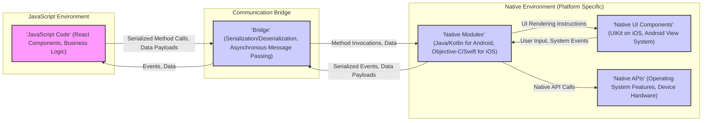
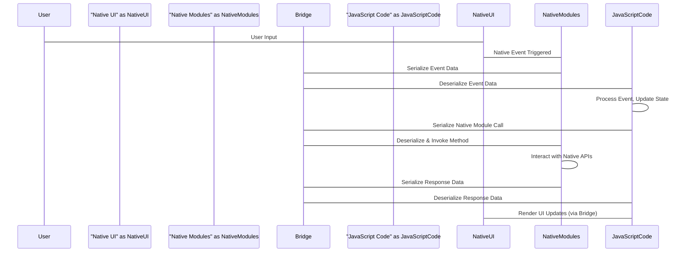

# Project Design Document: React Native (Improved)

**Version:** 1.1
**Date:** October 26, 2023
**Author:** AI Software Architect

## 1. Introduction

This document provides an enhanced architectural design of the React Native framework, as represented by the project hosted at [https://github.com/facebook/react-native](https://github.com/facebook/react-native). This improved design document aims to provide a more detailed and nuanced understanding of the system's components, interactions, and data flow, specifically tailored for subsequent threat modeling activities. We will delve deeper into the communication pathways and component responsibilities to facilitate a more comprehensive security analysis.

React Native enables the development of native mobile applications using JavaScript and the React library. Its key feature is the ability to write code that can be shared across multiple platforms, primarily iOS and Android, while still leveraging native UI components and device capabilities.

## 2. Goals and Objectives

The core objectives of React Native, from a design and security perspective, include:

*   **Secure Cross-Platform Development:**  Enable code reuse across platforms without compromising security on any specific platform.
*   **Efficient Native Integration:** Provide secure and performant mechanisms for JavaScript code to interact with native platform features and APIs.
*   **Maintainable and Extensible Architecture:** Design a modular architecture that allows for secure extensions and updates.
*   **Developer-Friendly Security Practices:**  Encourage and facilitate the adoption of secure coding practices within the React Native development workflow.
*   **Clear Separation of Concerns:**  Maintain a clear separation between the JavaScript logic and the native platform implementations to enhance security and maintainability.

## 3. System Architecture

The architecture of React Native involves a clear division between the JavaScript and native environments, connected by a bridge. This separation is crucial for understanding potential trust boundaries and communication vulnerabilities.

**Detailed Architectural Layers:**

*   **JavaScript Environment:**
    *   Executes the application logic written in JavaScript, typically using the React library and its component-based architecture.
    *   Manages the application state and orchestrates UI updates based on user interactions and data changes.
    *   Relies on a JavaScript engine (JavaScriptCore or Hermes) for execution. This engine itself can be a potential area of vulnerability.
*   **Communication Bridge:**
    *   The central point of interaction between the JavaScript and native environments.
    *   Handles the serialization of JavaScript data and method calls into a format suitable for the native side and vice versa. This serialization process can introduce vulnerabilities if not handled carefully (e.g., insecure deserialization).
    *   Communication is asynchronous, meaning that method calls do not block the execution of either the JavaScript or native threads.
    *   The bridge acts as a potential attack surface if an attacker can inject or intercept messages.
*   **Native Environment:**
    *   Contains platform-specific code written in native languages.
    *   Provides access to native device features and APIs that are not directly accessible from JavaScript.
    *   Renders the user interface using native UI components, ensuring a native look and feel and optimal performance.
    *   Hosts native modules that are specifically designed to bridge the gap between JavaScript and native functionality. These modules are critical for accessing device hardware and OS-level features.

## 4. Key Components (with Security Focus)

*   **JavaScript Engine (JavaScriptCore/Hermes):**
    *   Executes the JavaScript codebase. Vulnerabilities in the engine itself could lead to arbitrary code execution.
    *   Hermes, being optimized for React Native, might have different security characteristics than standard JavaScriptCore.
*   **React Components:**
    *   Reusable UI building blocks. Security vulnerabilities here could involve rendering issues leading to information disclosure or UI manipulation.
    *   Improper handling of user input within components can lead to cross-site scripting (XSS)-like vulnerabilities if web views are involved.
*   **Native Modules:**
    *   Platform-specific code that exposes native functionalities to JavaScript. These are critical attack surfaces if not implemented securely.
    *   Potential vulnerabilities include:
        *   Buffer overflows in native code.
        *   Improper access control leading to unauthorized resource access.
        *   Exposure of sensitive data through insecure APIs.
        *   Injection vulnerabilities if receiving data from JavaScript without proper sanitization.
*   **Native UI Components:**
    *   Platform-specific UI elements. While generally secure, vulnerabilities in the underlying native UI frameworks could be exploited.
    *   Incorrect handling of user input or data within native UI components can lead to crashes or unexpected behavior.
*   **Bridge (MessageQueue):**
    *   The core communication channel. Security concerns include:
        *   **Message Injection:**  An attacker potentially injecting malicious messages into the queue.
        *   **Message Interception:** An attacker eavesdropping on communication between JavaScript and native code.
        *   **Insecure Serialization/Deserialization:** Vulnerabilities in the serialization or deserialization process could lead to code execution or data corruption.
*   **Layout Engine (Yoga):**
    *   Calculates UI layout. While primarily a layout engine, vulnerabilities could potentially lead to denial-of-service if malformed layout instructions are processed.
*   **Packager (Metro):**
    *   Bundles JavaScript code and assets. Security concerns involve ensuring the integrity of the bundled code and preventing the inclusion of malicious code during the bundling process.
*   **Native Host Application:**
    *   The container app. Security depends on standard mobile application security practices, including proper signing, secure storage, and network communication.

## 5. Data Flow (Detailed for Threat Analysis)

Understanding the flow of data is crucial for identifying potential interception and manipulation points.

*   **User Interaction to JavaScript:**
    *   User interacts with a `'Native UI Component'`.
    *   The native component triggers a native event.
    *   This event is passed to a `'Native Module'`.
    *   The `'Native Module'` serializes the event data.
    *   The serialized data is sent across the `'Bridge'` to the `'JavaScript Code'`.
    *   **Threats:**  Tampering with the event data in the native module before serialization or during transmission across the bridge.
*   **JavaScript to Native Module Invocation:**
    *   `'JavaScript Code'` calls a method on a `'Native Module'`.
    *   The method name and arguments are serialized by the `'Bridge'`.
    *   The serialized payload is sent to the appropriate `'Native Module'`.
    *   The `'Native Module'` deserializes the data and executes the corresponding native function.
    *   **Threats:**  Injecting malicious method calls or arguments from the JavaScript side. Insecure deserialization on the native side.
*   **Native Module to Native API:**
    *   A `'Native Module'` interacts with `'Native APIs'` (e.g., accessing the camera, location services).
    *   **Threats:**  Vulnerabilities in the native APIs themselves. Improper authorization checks within the native module before calling the API.
*   **Native Module Response to JavaScript:**
    *   A `'Native Module'` prepares a response (data or event).
    *   The response data is serialized.
    *   The serialized data is sent across the `'Bridge'`.
    *   The `'JavaScript Code'` receives and deserializes the response.
    *   **Threats:**  Tampering with the response data in the native module before serialization or during transmission. Insecure deserialization on the JavaScript side.

## 6. Security Considerations (Detailed)

Expanding on the initial considerations, here are more specific security concerns:

*   **Bridge Security:**
    *   **Message Integrity:** Ensure messages are not tampered with during transit. Consider using checksums or digital signatures.
    *   **Confidentiality:** Sensitive data transmitted over the bridge should be encrypted.
    *   **Rate Limiting:** Implement mechanisms to prevent denial-of-service attacks by flooding the bridge with messages.
*   **Native Module Vulnerabilities:**
    *   **Input Validation:**  Strictly validate all data received from JavaScript to prevent injection attacks (e.g., SQL injection if the native module interacts with a database).
    *   **Memory Management:**  Properly manage memory to prevent buffer overflows and other memory corruption issues.
    *   **Access Control:** Implement proper authorization checks to ensure that JavaScript code cannot invoke sensitive native functions without proper permissions.
*   **Third-Party Library Risks:**
    *   **Vulnerability Scanning:** Regularly scan both JavaScript and native dependencies for known vulnerabilities.
    *   **License Compliance:** Ensure compliance with the licenses of third-party libraries, as some licenses may have security implications.
*   **Data Storage Security:**
    *   Utilize platform-specific secure storage mechanisms (e.g., Keychain on iOS, Keystore on Android) for sensitive data.
    *   Avoid storing sensitive data in plain text in shared preferences or local storage.
*   **Network Security:**
    *   Enforce HTTPS for all communication with backend services.
    *   Implement proper certificate pinning to prevent man-in-the-middle attacks.
    *   Be cautious about embedding web views and ensure they are not vulnerable to XSS.
*   **JavaScript Code Security:**
    *   Follow secure coding practices to prevent vulnerabilities like prototype pollution or logic flaws that could be exploited.
    *   Be mindful of the risks of dynamically evaluating JavaScript code.
*   **Build and Deployment Security:**
    *   Secure the build pipeline to prevent the introduction of malicious code during the build process.
    *   Ensure proper code signing to verify the authenticity of the application.
*   **Permissions Management:**
    *   Request only the necessary permissions and explain to the user why those permissions are needed.
    *   Handle permission denials gracefully.
*   **Code Push Security:**
    *   If using code push, ensure that updates are signed and verified to prevent malicious updates.
    *   Consider the potential for vulnerabilities during the update process.

## 7. Deployment

The deployment process remains largely the same, but security considerations during deployment are paramount:

*   **Secure Build Environment:** Ensure the build environment is secure and free from malware.
*   **Code Signing Certificates:** Protect code signing certificates and private keys.
*   **App Store Security:** Adhere to the security guidelines and review processes of the respective app stores.
*   **Distribution Channels:** Be mindful of the security of the distribution channels used (e.g., avoiding unofficial app stores).

## 8. Technologies Used

The core technologies remain the same, but understanding their security implications is important:

*   **JavaScript:**  Prone to certain types of vulnerabilities if not coded carefully.
*   **React:**  Potential for UI-related vulnerabilities if components are not implemented securely.
*   **Native Languages (Java/Kotlin, Objective-C/Swift):**  Susceptible to traditional native code vulnerabilities like buffer overflows.
*   **Native UI Frameworks:**  Generally secure but can have vulnerabilities that need to be addressed through OS updates.
*   **Node.js, npm/Yarn:**  Supply chain security risks associated with dependencies.
*   **Metro:**  Potential for vulnerabilities if not updated or configured securely.
*   **Yoga:**  Generally considered safe but should be monitored for potential issues.
*   **JavaScriptCore/Hermes:**  The security of the JavaScript engine is critical.

## 9. Conclusion

This enhanced design document provides a more detailed and security-focused overview of the React Native architecture. By understanding the interactions between the JavaScript and native environments, the role of the bridge, and the potential vulnerabilities within key components, security professionals can conduct more effective threat modeling exercises and develop appropriate mitigation strategies. A thorough analysis of the data flow and the specific security considerations outlined in this document is crucial for building secure React Native applications.