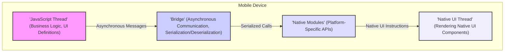

# Project Design Document: React Native (Improved)

**1. Introduction**

This document provides an enhanced design overview of the React Native project, an open-source framework by Meta for building native mobile applications using JavaScript and React. This iteration aims to offer a more detailed understanding of the system's architecture, the roles and interactions of its key components, and the flow of data within a typical React Native application. This document is intended to serve as a robust foundation for subsequent threat modeling and security analysis.

**2. Goals and Objectives**

*   Deliver a more granular and descriptive explanation of the React Native architecture.
*   Clearly define the responsibilities and interactions of each key component within the framework.
*   Illustrate various data flow scenarios within a React Native application, providing context for different operations.
*   Highlight potential security vulnerabilities based on a deeper understanding of the design, categorized for clarity.
*   Act as a comprehensive and up-to-date reference for ongoing development, security assessments, and architectural discussions.

**3. High-Level Architecture**

React Native's architecture centers around the concept of bridging the gap between JavaScript-based application logic and native platform capabilities. This allows developers to leverage JavaScript and React for UI definition and business logic while utilizing native UI components for a performant and platform-consistent user experience.



**4. Detailed Architecture and Key Components**

A React Native application comprises several interconnected components, each with a specific role:

*   **JavaScript Thread (Often running JavaScriptCore or Hermes):**
    *   Executes the application's JavaScript code, including React component definitions and business logic.
    *   Manages the application's state and responds to user interactions.
    *   Utilizes a JavaScript engine (like JavaScriptCore on iOS or Hermes, Meta's optimized engine) to interpret and execute the code.
    *   Bundled using tools like Metro, which packages the JavaScript code, assets, and dependencies.
*   **The Bridge (Asynchronous Messenger):**
    *   Facilitates asynchronous, bi-directional communication between the JavaScript thread and the native environment.
    *   Serializes JavaScript objects and function calls into a format that can be understood by the native side, and vice versa.
    *   Operates asynchronously to prevent blocking the UI thread, ensuring a smooth user experience.
    *   Relies on a message queue to manage communication between the two realms.
*   **Native Modules (Platform-Specific Functionality):**
    *   Provide access to platform-specific APIs and functionalities that are not directly available in JavaScript.
    *   Written in native code (Objective-C/Swift for iOS, Java/Kotlin for Android).
    *   Expose methods that can be called from the JavaScript thread via the bridge.
    *   Examples include modules for accessing the camera, geolocation services, sensors, and local storage.
    *   Developers can create custom native modules to extend the framework's capabilities with platform-specific features.
*   **Native UI Thread (Main Application Thread):**
    *   Responsible for rendering the user interface and handling user interactions on the native platform.
    *   Receives instructions from the JavaScript thread (via the bridge) on how to update the UI.
    *   Utilizes the platform's native UI rendering system (UIKit on iOS, Android Views on Android) to create and manage UI elements.
*   **Shadow Tree (Virtual Representation of the UI):**
    *   A lightweight, in-memory representation of the UI maintained in the JavaScript thread.
    *   React uses the shadow tree to efficiently calculate UI updates.
    *   When the application state changes, React updates the shadow tree and then calculates the minimal set of changes needed to update the actual native UI.
*   **UI Manager (Native Side):**
    *   A native component responsible for receiving UI update instructions from the bridge.
    *   Translates these instructions into calls to the native UI rendering system to create, update, and destroy native UI components.
*   **Bundler (e.g., Metro):**
    *   A development tool that bundles all the JavaScript code, assets (images, fonts), and dependencies into one or more JavaScript files that can be loaded by the application.
    *   Performs transformations and optimizations on the code during the bundling process.

**5. Data Flow Scenarios**

Understanding how data flows through a React Native application is crucial for identifying potential security vulnerabilities. Here are a few common scenarios:

*   **User Interaction Triggering a Native Action:**
    *   User interacts with a UI element (e.g., presses a button).
    *   The native UI component detects the interaction.
    *   A native event is generated and sent to the JavaScript thread via the bridge.
    *   JavaScript code handles the event, potentially updating the application state or triggering an API call.

    ```mermaid
    sequenceDiagram
        participant "User" as U
        participant "Native UI" as NUI
        participant "Bridge" as B
        participant "JavaScript" as JS

        U->NUI: User Interaction
        NUI->B: Native Event
        B->JS: Serialized Event
        JS->JS: Event Handling
    ```

*   **JavaScript Initiating a Native Function Call:**
    *   JavaScript code needs to access a platform-specific feature (e.g., accessing the device's contacts).
    *   JavaScript calls a method on a Native Module via the bridge.
    *   The bridge serializes the method call and its arguments.
    *   The native module receives the call, executes the native code, and returns a result (if any) via the bridge.

    ```mermaid
    sequenceDiagram
        participant "JavaScript" as JS
        participant "Bridge" as B
        participant "Native Module" as NM

        JS->B: Call Native Module Method
        B->NM: Serialized Method Call
        NM->B: Result (if any)
        B->JS: Serialized Result
    ```

*   **Fetching Data from a Remote Server:**
    *   JavaScript code initiates an HTTP request to a remote API.
    *   The request might be handled by a native networking module or a JavaScript-based networking library.
    *   The response from the server is received.
    *   The data is processed in JavaScript and used to update the UI.

    ```mermaid
    sequenceDiagram
        participant "JavaScript" as JS
        participant "Networking Library/Native Module" as NL
        participant "Remote Server" as RS

        JS->NL: Initiate HTTP Request
        NL->RS: Send Request
        RS->NL: Send Response
        NL->JS: Processed Data
    ```

**6. Security Considerations (Detailed)**

Based on the architecture and data flow, several potential security considerations need to be addressed:

*   **Bridge Security:**
    *   **Serialization/Deserialization Vulnerabilities:**
        *   **Risk:** Maliciously crafted data sent across the bridge could exploit vulnerabilities in the serialization or deserialization process, potentially leading to arbitrary code execution on either the JavaScript or native side.
        *   **Mitigation:** Implement robust input validation and sanitization on both sides of the bridge. Avoid using insecure serialization formats.
    *   **Man-in-the-Middle (MITM) Attacks:**
        *   **Risk:** Communication over the bridge, especially between the JavaScript thread and custom native modules, could be intercepted if not properly secured, potentially exposing sensitive data or allowing for manipulation of communication.
        *   **Mitigation:** Encrypt communication channels where necessary. Implement mutual authentication between the JavaScript and native sides.
*   **Native Module Security:**
    *   **Vulnerabilities in Native Code:**
        *   **Risk:** Security flaws (e.g., buffer overflows, memory leaks) in custom or third-party native modules can be exploited to compromise the application and the device.
        *   **Mitigation:** Conduct thorough security reviews and penetration testing of native modules. Follow secure coding practices for native development. Keep dependencies updated.
    *   **Exposure of Sensitive APIs and Data:**
        *   **Risk:** Native modules might inadvertently expose sensitive platform APIs or data to the JavaScript realm without proper authorization checks, potentially allowing malicious JavaScript code to access restricted resources.
        *   **Mitigation:** Implement strict access control and authorization mechanisms within native modules. Carefully review the APIs exposed to JavaScript.
*   **JavaScript Realm Security:**
    *   **Third-Party Library Vulnerabilities:**
        *   **Risk:** React Native applications rely heavily on npm packages. Vulnerabilities in these dependencies can be exploited if not managed properly.
        *   **Mitigation:** Regularly audit and update dependencies. Use tools like `npm audit` or `yarn audit` to identify and address vulnerabilities. Consider using a software composition analysis (SCA) tool.
    *   **Data Storage Security:**
        *   **Risk:** Sensitive data stored within the JavaScript realm (e.g., using `AsyncStorage`) might not be adequately protected and could be accessible to malicious actors or other applications.
        *   **Mitigation:** Use secure storage mechanisms provided by the native platform for sensitive data. Consider encryption at rest. Avoid storing highly sensitive information locally if possible.
    *   **Code Injection Vulnerabilities:**
        *   **Risk:** While less common in typical React Native development, vulnerabilities in custom JavaScript code or the use of `eval()`-like functions could potentially lead to code injection attacks.
        *   **Mitigation:** Avoid using dynamic code execution where possible. Implement proper input validation and sanitization to prevent injection attacks.
*   **Build and Distribution Security:**
    *   **Supply Chain Attacks:**
        *   **Risk:** Compromised build tools, dependencies, or development environments could introduce malicious code into the application during the build process.
        *   **Mitigation:** Implement secure development practices, including using trusted build pipelines and verifying the integrity of dependencies.
    *   **Code Signing and Integrity:**
        *   **Risk:** If the application package is not properly signed or its integrity is compromised, attackers could distribute modified versions of the application.
        *   **Mitigation:** Ensure proper code signing for both development and release builds. Implement mechanisms to verify the integrity of the application package.
*   **Platform-Specific Security:**
    *   **iOS/Android Security Models:**
        *   **Risk:** Failure to adhere to platform-specific security best practices (e.g., improper permissions management, insecure networking configurations) can create vulnerabilities.
        *   **Mitigation:** Follow platform-specific security guidelines and best practices. Request only necessary permissions. Implement secure networking configurations (e.g., using HTTPS).
    *   **Security on Jailbroken/Rooted Devices:**
        *   **Risk:** Applications running on jailbroken or rooted devices might be more susceptible to attacks due to weakened security controls.
        *   **Mitigation:** Consider implementing mechanisms to detect and respond to jailbroken/rooted environments, while being mindful of user privacy.
*   **Over-the-Air (OTA) Updates:**
    *   **Risk:** If OTA updates are not implemented securely, attackers could inject malicious code into updates, compromising users' devices.
        *   **Mitigation:** Ensure that OTA updates are downloaded over secure channels (HTTPS) and that the integrity and authenticity of updates are verified using digital signatures.

**7. Deployment**

Deployment of React Native applications follows standard mobile app deployment procedures:

*   **Bundling:** The JavaScript code and assets are bundled using Metro.
*   **Native Build:** The native code (including any custom native modules) is compiled for the target platform (iOS or Android).
*   **Packaging:** The bundled JavaScript and compiled native code are packaged into an application archive (IPA for iOS, APK/AAB for Android).
*   **Signing:** The application package is digitally signed using developer certificates to verify its authenticity and integrity.
*   **Distribution:** The signed application package is uploaded to the respective app stores (Apple App Store, Google Play Store) for distribution to users.

**8. Future Considerations**

*   **Hermes Engine Security Implications:**  As Hermes becomes more widely adopted, understanding its specific security characteristics and potential vulnerabilities will be crucial.
*   **New Architecture (Fabric and TurboModules) Security:** The ongoing architectural changes with Fabric and TurboModules aim to improve performance and interoperability. A thorough security assessment of these new components and their interactions will be necessary.
*   **Integration with WebAssembly (Wasm):**  Exploring the potential integration of WebAssembly with React Native could introduce new security considerations related to the execution of Wasm modules within the application.
*   **Enhanced End-to-End Encryption:** As privacy concerns grow, further exploration of end-to-end encryption strategies within React Native applications will be important.

This improved design document provides a more detailed and nuanced understanding of the React Native architecture, its components, and data flow. The expanded security considerations section offers a more comprehensive overview of potential threats, setting a stronger foundation for effective threat modeling and security mitigation strategies.