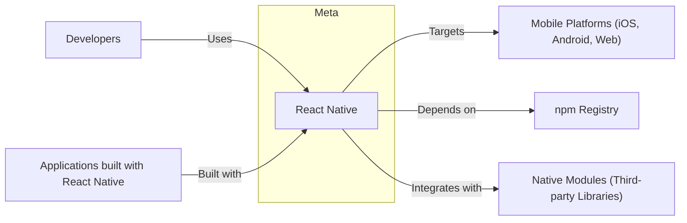
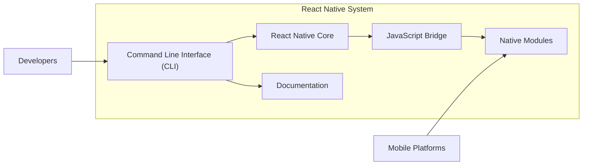

# BUSINESS POSTURE

- Business Priorities and Goals
  - Enable developers to build native mobile applications for multiple platforms (iOS, Android, Web, etc.) using a single codebase written in JavaScript and React.
  - Increase developer productivity and efficiency by providing a component-based architecture and hot reloading capabilities.
  - Foster a large and active community of developers and contributors to ensure the framework's continuous improvement and adoption.
  - Provide a performant and reliable platform for building user-facing mobile applications.
  - Support Facebook's and Meta's own mobile application development needs.
- Business Risks
  - Platform fragmentation and compatibility issues across different operating systems and devices.
  - Performance limitations compared to fully native applications in certain scenarios.
  - Security vulnerabilities in the framework itself or in third-party libraries used within React Native applications.
  - Developer adoption rate and competition from other cross-platform mobile development frameworks.
  - Dependence on the JavaScript ecosystem and potential supply chain risks.
  - Maintaining backward compatibility and managing breaking changes in framework updates.

# SECURITY POSTURE

- Existing Security Controls
  - security control: Code is hosted on GitHub, enabling public visibility and community review. Implemented: GitHub repository.
  - security control: Issue tracking system on GitHub for reporting and managing bugs and vulnerabilities. Implemented: GitHub Issues.
  - security control: Pull Request review process for code contributions. Implemented: GitHub Pull Requests.
  - security control: Continuous Integration (CI) pipelines for automated testing and build processes. Implemented: GitHub Workflows.
  - accepted risk: Reliance on open-source dependencies, which may contain vulnerabilities.
  - accepted risk: Potential for vulnerabilities to be introduced by community contributions.
- Recommended Security Controls
  - recommended security control: Implement automated Dependency Scanning to identify vulnerabilities in third-party libraries.
  - recommended security control: Integrate Static Application Security Testing (SAST) tools into the CI pipeline to detect potential code-level vulnerabilities.
  - recommended security control: Establish a clear Vulnerability Disclosure Policy and process for reporting and handling security issues.
  - recommended security control: Conduct regular security audits and penetration testing of the framework.
  - recommended security control: Provide security awareness training for core contributors and maintainers.
- Security Requirements
  - Authentication: Not directly applicable to the framework itself, but applications built with React Native will require robust authentication mechanisms.
  - Authorization: Access control to the React Native GitHub repository and development infrastructure should be properly managed.
  - Input Validation: React Native framework should encourage and facilitate secure coding practices, including input validation, to prevent vulnerabilities in applications built with it.
  - Cryptography: React Native should support and recommend best practices for using cryptography in applications for secure data storage and communication.

# DESIGN

## C4 CONTEXT



- C4 Context Elements
  - - Name: React Native
    - Type: Software System
    - Description: An open-source framework for building native mobile applications using JavaScript and React.
    - Responsibilities: Provides a cross-platform development environment, UI components, and APIs for building mobile applications.
    - Security controls: Code review, issue tracking, CI pipelines, dependency management.
  - - Name: Developers
    - Type: Person
    - Description: Software engineers who use React Native to build mobile applications.
    - Responsibilities: Write application code, integrate libraries, deploy applications.
    - Security controls: Secure coding practices, access control to development environments.
  - - Name: Mobile Platforms (iOS, Android, Web)
    - Type: Software System
    - Description: Target platforms where React Native applications are deployed and run.
    - Responsibilities: Provide operating system functionalities, execute applications, manage device resources.
    - Security controls: Platform security features (permissions, sandboxing, app signing).
  - - Name: npm Registry
    - Type: Software System
    - Description: Public registry for JavaScript packages, used to distribute and manage React Native and its dependencies.
    - Responsibilities: Host and serve JavaScript packages, manage package versions.
    - Security controls: Package signing, vulnerability scanning of packages (external to React Native project).
  - - Name: Native Modules (Third-party Libraries)
    - Type: Software System
    - Description: Native code modules and libraries that extend React Native functionality.
    - Responsibilities: Provide platform-specific features and functionalities, integrate with native APIs.
    - Security controls: Security of third-party libraries is the responsibility of their respective developers and maintainers. React Native project relies on community vetting and issue reporting.
  - - Name: Applications built with React Native
    - Type: Software System
    - Description: Mobile applications developed using the React Native framework.
    - Responsibilities: Provide specific functionalities to end-users, handle user data, interact with backend services.
    - Security controls: Application-level security controls implemented by developers (authentication, authorization, input validation, etc.).

## C4 CONTAINER



- C4 Container Elements
  - - Name: React Native Core
    - Type: Container - Software Library/Framework
    - Description: The core JavaScript framework code that provides the foundation for React Native applications, including the component model, virtual DOM, and reconciliation logic.
    - Responsibilities: Manages the application lifecycle, renders UI components, handles state management, and provides core APIs.
    - Security controls: SAST during development, code review, vulnerability scanning of dependencies.
  - - Name: JavaScript Bridge
    - Type: Container - Communication Channel
    - Description: A bridge that enables communication between JavaScript code running in a JavaScript engine and native code running on the mobile platform.
    - Responsibilities: Serializes and deserializes data between JavaScript and native environments, invokes native functions from JavaScript and vice versa.
    - Security controls: Input validation and sanitization at the bridge interface to prevent injection attacks, secure communication protocols if applicable.
  - - Name: Native Modules
    - Type: Container - Software Libraries
    - Description: Platform-specific native code modules that provide access to device features and native APIs.
    - Responsibilities: Implement platform-specific functionalities, interact with operating system services, and expose native APIs to JavaScript.
    - Security controls: Security of native modules depends on the quality and security practices of their developers. React Native project relies on community review and issue reporting.
  - - Name: Command Line Interface (CLI)
    - Type: Container - Command Line Tool
    - Description: A command-line tool that provides utilities for creating, building, running, and managing React Native projects.
    - Responsibilities: Project scaffolding, dependency management, building application bundles, running applications on emulators/devices.
    - Security controls: Access control to CLI tools and development environment, secure handling of credentials and API keys, input validation for CLI commands.
  - - Name: Documentation
    - Type: Container - Documentation Website
    - Description: Official documentation for React Native, providing guides, tutorials, API references, and best practices.
    - Responsibilities: Educate developers on how to use React Native, promote secure coding practices, and provide security guidelines.
    - Security controls: Access control to documentation website (if applicable), content security policy, protection against cross-site scripting (XSS) vulnerabilities.

## DEPLOYMENT

- Deployment Architecture Options for Applications Built with React Native:
  - Option 1: Direct deployment to app stores (Apple App Store, Google Play Store) for mobile applications.
  - Option 2: Web deployment as Progressive Web Apps (PWAs) or traditional web applications.
  - Option 3: Internal distribution for enterprise applications.

- Detailed Deployment Architecture (Option 1: App Store Deployment):

```mermaid
graph LR
    subgraph "Developer Environment"
        DEV_MACHINE["Developer Machine"]
        BUILD_SYSTEM["Build System (CI/CD)"]
    end
    subgraph "App Store (e.g., Google Play Store)"
        APP_STORE["App Store"]
    end
    subgraph "End User Device"
        USER_DEVICE["User Mobile Device"]
    end

    DEV_MACHINE --> BUILD_SYSTEM: Code Commit
    BUILD_SYSTEM --> BUILD_SYSTEM: Build & Test
    BUILD_SYSTEM --> APP_STORE: Application Package (.apk, .ipa)
    APP_STORE --> USER_DEVICE: Application Download & Install
    USER_DEVICE --> USER_DEVICE: Run React Native Application
```

- Deployment Elements (Option 1: App Store Deployment)
  - - Name: Developer Machine
    - Type: Infrastructure - Laptop/Workstation
    - Description: Developer's local machine used for writing code, testing, and initiating the build process.
    - Responsibilities: Code development, local testing, version control.
    - Security controls: Developer machine security (OS hardening, endpoint protection, access control), secure coding practices.
  - - Name: Build System (CI/CD)
    - Type: Infrastructure - Server/Cloud Service
    - Description: Automated build and deployment pipeline, typically using CI/CD tools like GitHub Actions, Jenkins, or cloud-based services.
    - Responsibilities: Automated building, testing, packaging, and signing of the application.
    - Security controls: Secure CI/CD pipeline configuration, access control to build system, secrets management for signing keys and credentials, build artifact integrity checks.
  - - Name: App Store (e.g., Google Play Store)
    - Type: Infrastructure - Cloud Service
    - Description: Digital distribution platform for mobile applications, managed by platform providers (Apple, Google).
    - Responsibilities: Application hosting, distribution, user authentication, payment processing (for paid apps).
    - Security controls: App Store security measures (app review process, malware scanning, developer account security).
  - - Name: User Mobile Device
    - Type: Infrastructure - Mobile Device (Smartphone, Tablet)
    - Description: End-user's mobile device where the React Native application is installed and run.
    - Responsibilities: Execute the application, provide user interface, access device resources, store application data.
    - Security controls: Device security features (OS security, device encryption, app permissions, sandboxing).

## BUILD

```mermaid
graph LR
    subgraph "Developer"
        DEV_ENV["Developer Environment"]
    end
    subgraph "Build System (CI/CD)"
        VERSION_CONTROL["Version Control System (e.g., GitHub)"]
        BUILD_AUTOMATION["Build Automation (e.g., GitHub Actions)"]
        DEPENDENCY_MGMT["Dependency Management (npm)"]
        SECURITY_SCANS["Security Scans (SAST, Dependency Scan)"]
        ARTIFACT_REPO["Artifact Repository"]
    end

    DEV_ENV --> VERSION_CONTROL: Code Commit
    VERSION_CONTROL --> BUILD_AUTOMATION: Trigger Build
    BUILD_AUTOMATION --> DEPENDENCY_MGMT: Fetch Dependencies
    BUILD_AUTOMATION --> SECURITY_SCANS: Run Security Checks
    BUILD_AUTOMATION --> ARTIFACT_REPO: Publish Artifacts
```

- Build Elements
  - - Name: Developer Environment
    - Type: Environment
    - Description: Local development environment used by developers to write and test code.
    - Responsibilities: Code development, local testing, committing code to version control.
    - Security controls: Developer machine security, secure coding practices, code review before commit.
  - - Name: Version Control System (e.g., GitHub)
    - Type: System
    - Description: Central repository for source code, managing versions and changes.
    - Responsibilities: Source code storage, version tracking, collaboration, access control.
    - Security controls: Access control to repository, branch protection, audit logging.
  - - Name: Build Automation (e.g., GitHub Actions)
    - Type: System
    - Description: Automated system for building, testing, and packaging the software.
    - Responsibilities: Automate build process, run tests, perform security scans, create build artifacts.
    - Security controls: Secure CI/CD pipeline configuration, access control to build system, secrets management, build artifact integrity checks.
  - - Name: Dependency Management (npm)
    - Type: System
    - Description: Tool for managing project dependencies, downloading and installing required libraries.
    - Responsibilities: Dependency resolution, package installation, vulnerability management (to some extent).
    - Security controls: Dependency scanning tools, using package lock files to ensure consistent builds, verifying package integrity (checksums).
  - - Name: Security Scans (SAST, Dependency Scan)
    - Type: System
    - Description: Automated tools for scanning code and dependencies for security vulnerabilities.
    - Responsibilities: Identify potential security flaws in code and dependencies during the build process.
    - Security controls: SAST tool configuration, dependency scanning tool configuration, vulnerability reporting and remediation process.
  - - Name: Artifact Repository
    - Type: System
    - Description: Storage location for build artifacts (e.g., application packages).
    - Responsibilities: Store and manage build artifacts, provide access to artifacts for deployment.
    - Security controls: Access control to artifact repository, artifact integrity checks, secure storage.

# RISK ASSESSMENT

- Critical Business Processes We Are Trying to Protect
  - Development and maintenance of the React Native framework itself.
  - Development of applications built using React Native.
  - Maintaining the reputation and trust in the React Native framework.
- Data We Are Trying to Protect and Their Sensitivity
  - React Native Framework Source Code: Sensitivity - Medium (Intellectual Property, Open Source but maintained by Meta).
  - Developer Contributions (Code, Issues, Pull Requests): Sensitivity - Low to Medium (Publicly available but contributions to the project).
  - Build Artifacts (Framework releases, CLI tools): Sensitivity - Medium (Integrity and availability are important).
  - Usage Data and Telemetry (If collected): Sensitivity - Low to Medium (Privacy considerations).
  - Developer Credentials and API Keys (Used in build/deployment): Sensitivity - High (Confidentiality and integrity are critical).

# QUESTIONS & ASSUMPTIONS

- Questions
  - What is the intended audience for this design document? Is it for internal Meta teams, the open-source community, or for security auditors?
  - Are there specific regulatory compliance requirements that need to be considered for React Native or applications built with it?
  - What is the acceptable level of risk for security vulnerabilities in the React Native framework and related tools?
  - Are there any specific security incidents or vulnerabilities that have been previously identified and need to be addressed in this design?
- Assumptions
  - The primary goal of React Native is to facilitate cross-platform mobile application development.
  - Security is a significant concern for both the React Native framework and applications built with it.
  - The React Native project follows standard open-source development practices, including code review and community contributions.
  - Security controls are primarily focused on preventing vulnerabilities in the framework and ensuring secure development practices for applications.
  - The deployment model described is for typical app store distribution of applications built with React Native.