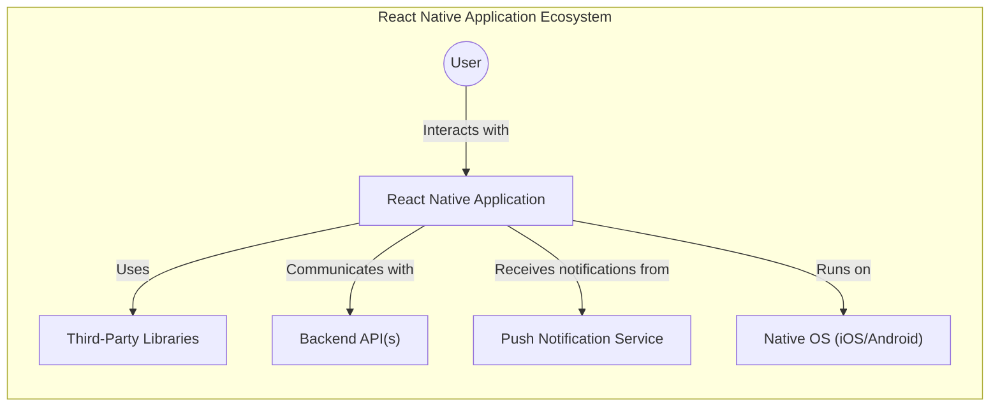
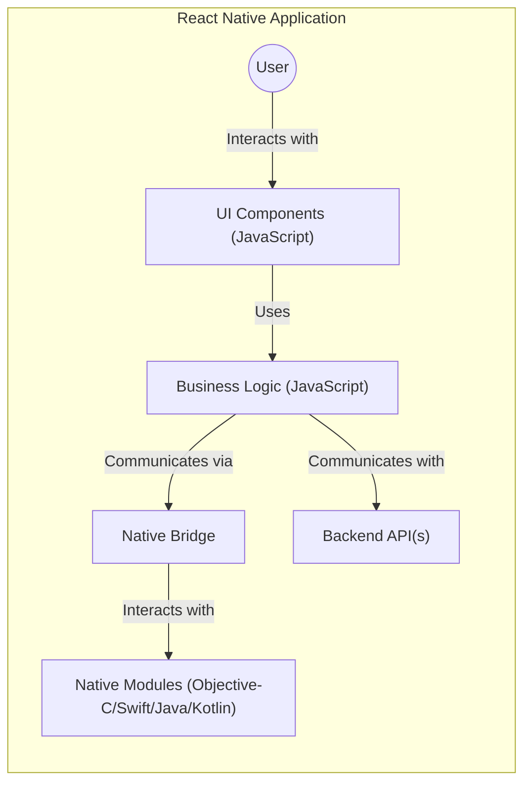
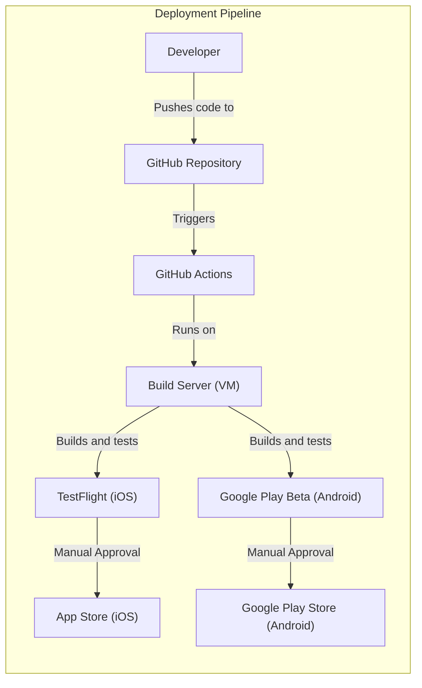
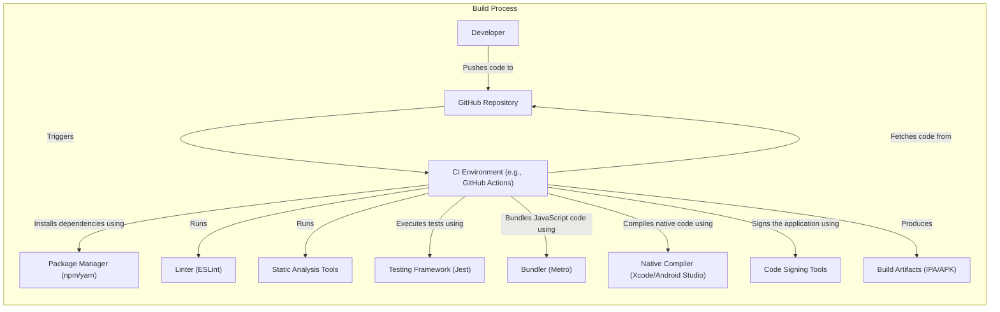

# Project Design Document: React Native

## BUSINESS POSTURE

React Native is a framework for building native mobile applications using JavaScript and React. It's developed and maintained by Facebook (Meta) and a large open-source community. Given its widespread use and backing by a major technology company, the business posture can be characterized as follows:

Priorities and Goals:

*   Enable developers to build cross-platform mobile applications (iOS and Android) with a single codebase, reducing development time and cost.
*   Provide a native-like user experience, ensuring high performance and responsiveness.
*   Maintain a vibrant and active open-source community, fostering contributions and continuous improvement.
*   Support a wide range of devices and operating system versions.
*   Provide a stable and reliable framework for building production-ready applications.
*   Facilitate rapid development and iteration through features like hot reloading.

Business Risks:

*   Security vulnerabilities in the framework or its dependencies could expose applications built with React Native to attacks.
*   Performance issues or bugs could lead to a poor user experience and negative reviews.
*   Lack of compatibility with new operating system versions or devices could limit the reach of applications.
*   Fragmentation of the ecosystem due to third-party libraries and tools could lead to inconsistencies and maintenance challenges.
*   Competition from other cross-platform frameworks (e.g., Flutter, Ionic) could reduce React Native's market share.
*   Reliance on Meta for maintenance and updates introduces a single point of failure.

## SECURITY POSTURE

React Native, being a framework, provides building blocks but relies heavily on the developer's implementation for security. The following outlines the existing security controls, accepted risks, recommendations, and requirements:

Existing Security Controls:

*   security control: Secure Communication: React Native apps can use standard HTTPS protocols for secure communication with backend services. (Implemented in application code using libraries like `fetch` or `axios`).
*   security control: Data Storage: Developers can leverage platform-specific secure storage mechanisms (e.g., Keychain on iOS, Keystore on Android) for sensitive data. (Implemented using third-party libraries or native modules).
*   security control: Code Obfuscation: Tools like ProGuard (Android) and bitcode (iOS) can be used to obfuscate the application code, making it harder to reverse engineer. (Implemented during the build process).
*   security control: Community Vetting: The open-source nature of React Native allows for community scrutiny and identification of potential vulnerabilities. (Ongoing process).

Accepted Risks:

*   accepted risk: Third-party Library Vulnerabilities: React Native applications often rely on numerous third-party libraries, which may contain vulnerabilities.
*   accepted risk: JavaScript-based Attacks: As React Native uses JavaScript, it's potentially susceptible to JavaScript-specific attacks like XSS if not handled carefully.
*   accepted risk: Platform-Specific Vulnerabilities: The underlying native platforms (iOS and Android) may have vulnerabilities that could affect React Native applications.
*   accepted risk: Reverse Engineering: Despite obfuscation, determined attackers can still reverse engineer the application code.

Recommended Security Controls:

*   Implement robust input validation and sanitization to prevent injection attacks.
*   Use a secure coding style guide and conduct regular code reviews.
*   Implement certificate pinning to prevent man-in-the-middle attacks.
*   Regularly update all dependencies, including React Native itself and third-party libraries.
*   Perform penetration testing and security audits.
*   Implement runtime application self-protection (RASP) techniques.

Security Requirements:

*   Authentication:
    *   Applications should use secure authentication mechanisms, such as OAuth 2.0 or OpenID Connect.
    *   Multi-factor authentication (MFA) should be considered for sensitive applications.
    *   Secure storage of authentication tokens is crucial.
*   Authorization:
    *   Applications should implement proper authorization checks to ensure users can only access resources they are permitted to.
    *   Role-based access control (RBAC) or attribute-based access control (ABAC) should be used.
*   Input Validation:
    *   All user inputs should be validated and sanitized to prevent injection attacks (e.g., XSS, SQL injection).
    *   Use a whitelist approach to input validation whenever possible.
*   Cryptography:
    *   Use strong, industry-standard cryptographic algorithms for data encryption and hashing.
    *   Securely manage cryptographic keys.
    *   Avoid using deprecated or weak cryptographic algorithms.

## DESIGN

### C4 CONTEXT

Element Descriptions:

*   Element:
    *   Name: User
    *   Type: Person
    *   Description: The end-user interacting with the React Native application.
    *   Responsibilities: Interacting with the application's user interface, providing input, and receiving output.
    *   Security controls: None directly implemented by the user, but user education on security best practices is important.

*   Element:
    *   Name: React Native Application
    *   Type: Software System
    *   Description: The mobile application built using the React Native framework.
    *   Responsibilities: Providing the application's functionality, handling user input, displaying data, and communicating with backend services.
    *   Security controls: Input validation, secure communication (HTTPS), secure data storage, authentication, and authorization.

*   Element:
    *   Name: Backend API(s)
    *   Type: Software System
    *   Description: Backend services that the React Native application interacts with.
    *   Responsibilities: Providing data and business logic to the application.
    *   Security controls: API authentication, authorization, input validation, rate limiting, and secure communication (HTTPS).

*   Element:
    *   Name: Push Notification Service
    *   Type: Software System
    *   Description: Service used to send push notifications to the application (e.g., Firebase Cloud Messaging, Apple Push Notification service).
    *   Responsibilities: Delivering push notifications to the application.
    *   Security controls: Secure communication (HTTPS), authentication of the application, and authorization of notification content.

*   Element:
    *   Name: Third-Party Libraries
    *   Type: Software System
    *   Description: External libraries used by the React Native application.
    *   Responsibilities: Providing specific functionalities not included in the core framework.
    *   Security controls: Regular updates and vulnerability scanning of third-party libraries.

*   Element:
    *   Name: Native OS (iOS/Android)
    *   Type: Software System
    *   Description: The underlying operating system on which the React Native application runs.
    *   Responsibilities: Providing the runtime environment for the application.
    *   Security controls: OS-level security features, such as sandboxing, permission management, and secure boot.

### C4 CONTAINER

Element Descriptions:

*   Element:
    *   Name: User
    *   Type: Person
    *   Description: The end-user interacting with the React Native application.
    *   Responsibilities: Interacting with the application's user interface.
    *   Security controls: None directly implemented.

*   Element:
    *   Name: UI Components (JavaScript)
    *   Type: Container: JavaScript
    *   Description: React components that define the user interface.
    *   Responsibilities: Rendering the UI and handling user interactions.
    *   Security controls: Input validation, output encoding (to prevent XSS).

*   Element:
    *   Name: Business Logic (JavaScript)
    *   Type: Container: JavaScript
    *   Description: JavaScript code that implements the application's business logic.
    *   Responsibilities: Handling data manipulation, application state, and communication with backend services.
    *   Security controls: Input validation, secure communication (HTTPS), authentication, and authorization logic.

*   Element:
    *   Name: Native Bridge
    *   Type: Container: Other
    *   Description: The mechanism that allows JavaScript code to communicate with native code.
    *   Responsibilities: Facilitating communication between JavaScript and native modules.
    *   Security controls: Secure data serialization and deserialization, validation of data passed between JavaScript and native code.

*   Element:
    *   Name: Native Modules (Objective-C/Swift/Java/Kotlin)
    *   Type: Container: Native Code
    *   Description: Native code that provides access to platform-specific APIs and features.
    *   Responsibilities: Implementing platform-specific functionality.
    *   Security controls: Secure coding practices for the respective native language, secure access to device resources.

*   Element:
    *   Name: Backend API(s)
    *   Type: Software System
    *   Description: External API that application is using.
    *   Responsibilities: Providing data and business logic to the application.
    *   Security controls: API authentication, authorization, input validation, rate limiting, and secure communication (HTTPS).

### DEPLOYMENT

React Native applications are typically deployed to the Apple App Store (for iOS) and the Google Play Store (for Android). There are several ways to manage this deployment, including:

1.  Manual Deployment: Using Xcode (for iOS) and Android Studio (for Android) to build and archive the application, then manually uploading it to the respective stores.
2.  Fastlane: An open-source platform that automates the entire mobile app release process, including building, signing, and submitting the app to the stores.
3.  Continuous Integration/Continuous Deployment (CI/CD) Services: Services like Bitrise, CircleCI, and GitHub Actions can be used to automate the build, test, and deployment process.

Chosen Solution (CI/CD with GitHub Actions):

Element Descriptions:

*   Element:
    *   Name: Developer
    *   Type: Person
    *   Description: The developer working on the React Native application.
    *   Responsibilities: Writing code, committing changes, and triggering the deployment pipeline.
    *   Security controls: Code reviews, secure coding practices.

*   Element:
    *   Name: GitHub Repository
    *   Type: Source Code Repository
    *   Description: The repository hosting the React Native application's source code.
    *   Responsibilities: Storing the codebase and tracking changes.
    *   Security controls: Access control to the repository, branch protection rules.

*   Element:
    *   Name: GitHub Actions
    *   Type: CI/CD Platform
    *   Description: The CI/CD service used to automate the build, test, and deployment process.
    *   Responsibilities: Running the defined workflows for building, testing, and deploying the application.
    *   Security controls: Secure storage of secrets (e.g., API keys, signing certificates), access control to the workflows.

*   Element:
    *   Name: Build Server (VM)
    *   Type: Virtual Machine
    *   Description: The virtual machine on which the GitHub Actions workflows run.
    *   Responsibilities: Providing the environment for building and testing the application.
    *   Security controls: Secure configuration of the VM, regular security updates.

*   Element:
    *   Name: TestFlight (iOS)
    *   Type: Beta Testing Platform
    *   Description: Apple's platform for distributing beta versions of iOS applications.
    *   Responsibilities: Allowing testers to install and test the application before release.
    *   Security controls: Access control to the beta builds.

*   Element:
    *   Name: Google Play Beta (Android)
    *   Type: Beta Testing Platform
    *   Description: Google's platform for distributing beta versions of Android applications.
    *   Responsibilities: Allowing testers to install and test the application before release.
    *   Security controls: Access control to the beta builds.

*   Element:
    *   Name: App Store (iOS)
    *   Type: Application Store
    *   Description: Apple's official store for distributing iOS applications.
    *   Responsibilities: Making the application available to end-users.
    *   Security controls: Apple's review process.

*   Element:
    *   Name: Google Play Store (Android)
    *   Type: Application Store
    *   Description: Google's official store for distributing Android applications.
    *   Responsibilities: Making the application available to end-users.
    *   Security controls: Google's review process.

### BUILD

The build process for React Native applications typically involves the following steps:

1.  Code Checkout: The source code is checked out from the repository (e.g., GitHub).
2.  Dependency Installation: Dependencies are installed using a package manager (e.g., npm, yarn).
3.  Linting and Static Analysis: Linters (e.g., ESLint) and static analysis tools are run to check for code quality and potential errors.
4.  Testing: Unit tests, integration tests, and end-to-end tests are executed.
5.  Bundling: The JavaScript code is bundled into a single file (or a set of files) using a bundler (e.g., Metro).
6.  Native Code Compilation: The native code (Objective-C/Swift for iOS, Java/Kotlin for Android) is compiled.
7.  Code Signing: The application is signed with a digital certificate.
8.  Artifact Creation: The final application package (IPA for iOS, APK for Android) is created.

Security Controls in the Build Process:

*   Dependency Scanning: Tools like npm audit or yarn audit can be used to scan for known vulnerabilities in dependencies.
*   Static Application Security Testing (SAST): SAST tools can be integrated into the build process to analyze the code for security vulnerabilities.
*   Software Composition Analysis (SCA): SCA tools can identify and track all open-source components and their licenses, as well as known vulnerabilities.
*   Code Signing: Ensures the integrity and authenticity of the application.
*   Secure Build Environment: The build environment should be secured to prevent unauthorized access and tampering.

## RISK ASSESSMENT

Critical Business Processes:

*   Mobile application functionality: Ensuring the application functions as intended and provides a good user experience.
*   User data management: Handling user data securely and in compliance with privacy regulations.
*   Backend service communication: Securely communicating with backend services to retrieve and update data.
*   Application updates: Delivering updates to the application to fix bugs and add new features.

Data Sensitivity:

*   Personally Identifiable Information (PII): Usernames, email addresses, phone numbers, etc. (High sensitivity)
*   Financial Data: Payment information, transaction history. (High sensitivity)
*   Location Data: User's location. (High sensitivity)
*   Usage Data: Application usage patterns. (Medium sensitivity)
*   Device Information: Device model, operating system version. (Low sensitivity)

## QUESTIONS & ASSUMPTIONS

Questions:

*   What specific third-party libraries are commonly used in React Native projects within the organization?
*   Are there any existing security policies or guidelines for mobile application development?
*   What is the process for handling security vulnerabilities discovered in React Native or its dependencies?
*   What level of penetration testing or security audits are performed on React Native applications?
*   What are the specific regulatory requirements (e.g., GDPR, CCPA) that apply to React Native applications?

Assumptions:

*   BUSINESS POSTURE: The organization prioritizes security and is willing to invest in necessary resources to secure React Native applications.
*   SECURITY POSTURE: Developers are aware of basic security principles and follow secure coding practices.
*   DESIGN: The application architecture follows a standard pattern with clear separation of concerns between UI, business logic, and native code. The application interacts with backend services through well-defined APIs.