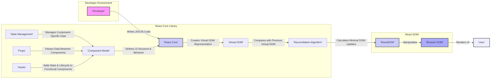

# Project Design Document: React Library

**Version:** 1.1
**Date:** October 26, 2023
**Prepared By:** AI Software Architect

## 1. Introduction

This document provides a detailed architectural design of the React JavaScript library, as represented by the project hosted on GitHub at [https://github.com/facebook/react](https://github.com/facebook/react). This document is specifically tailored to serve as a foundation for thorough threat modeling activities. It meticulously outlines the core components, data flows, interactions, and potential security considerations within the React library and its surrounding ecosystem.

## 2. Goals and Objectives

The primary goal of the React library is to offer a declarative, efficient, and flexible paradigm for constructing dynamic and interactive user interfaces. Key objectives include:

*   **Abstraction of DOM manipulation:** Simplifying the complexities of direct DOM manipulation for developers.
*   **Performance optimization:** Achieving high performance through techniques like the Virtual DOM and efficient reconciliation algorithms.
*   **Component reusability:** Enabling the creation of modular and reusable UI components, fostering maintainability and development speed.
*   **Community and ecosystem growth:**  Supporting a vibrant and active community through comprehensive documentation and a rich ecosystem of related libraries.

## 3. Target Audience

This document is specifically intended for the following technical audiences:

*   **Security Engineers:** Individuals responsible for identifying, analyzing, and mitigating potential security threats. This document provides the necessary architectural context for effective threat modeling.
*   **Software Architects and Senior Developers:** Professionals involved in the design, development, and integration of applications utilizing the React library.
*   **Technical Project Managers:** Individuals requiring a comprehensive understanding of the React architecture to manage project scope, risks, and resources.

## 4. Scope

This document focuses on the internal architecture and core functionalities of the React library itself. The scope encompasses:

*   **Core Rendering Engine:**  Detailed explanation of the Virtual DOM, reconciliation process, and rendering pipeline.
*   **Component Model:**  In-depth description of both class-based and functional components, including their lifecycle and interactions.
*   **State and Props Management:**  Mechanisms for managing component-level state and passing data between components.
*   **Interaction with the Browser DOM:**  How React interacts with and manipulates the browser's Document Object Model.
*   **Key Abstractions and Concepts:**  Explanation of fundamental concepts like JSX, Hooks, and Context.
*   **Core Extension Libraries:**  Overview of essential related libraries such as React DOM and React Native (from an architectural perspective of their interaction with the core).

This document explicitly excludes:

*   **Specific Implementations of User Applications:**  The design of individual applications built using React is outside the scope.
*   **Detailed Build Process Configuration:**  Specific configurations for build tools like Webpack or Parcel are not covered.
*   **JavaScript Engine Internals:**  The underlying workings of the JavaScript runtime environment are not discussed.
*   **Operating System or Hardware Specifics:**  The document does not delve into the details of the underlying operating system or hardware.

## 5. High-Level Architecture

The following diagram illustrates the high-level architecture and key interactions within the React ecosystem, highlighting potential trust boundaries and data flows relevant to security considerations:

### 5.1. Key Entities and Trust Boundaries

*   **Developer:** Writes the application code. Potential for introducing vulnerabilities through insecure coding practices.
*   **React Core:** The trusted core library responsible for managing the component lifecycle and Virtual DOM.
*   **Virtual DOM:** An in-memory representation. While not directly exposed, its manipulation logic is critical for preventing DOM-based vulnerabilities.
*   **Reconciliation Algorithm:**  The process of diffing and patching the DOM. Bugs in this algorithm could lead to unexpected behavior or security issues.
*   **Component Model:** The framework for building UI elements. Components themselves can be sources of vulnerabilities if not implemented securely.
*   **State Management:**  Handles component-specific data. Improper state management can lead to data leaks or inconsistent application behavior.
*   **Props:**  Mechanism for passing data. Data passed through props should be treated carefully, especially when originating from untrusted sources.
*   **Hooks:**  Allow functional components to access React features. Improper use of hooks can lead to unexpected side effects or performance issues.
*   **ReactDOM:**  Responsible for interacting with the browser's DOM. This is a critical trust boundary as it directly manipulates the user interface.
*   **Browser DOM:** The actual rendered UI in the browser. The target of many client-side attacks.
*   **User:** Interacts with the rendered application. The ultimate target of security threats.

### 5.2. Data Flow with Security Considerations

The typical data flow in a React application, with a focus on security implications, involves:

*   **Developer Input (Code):** Developers write JSX and JavaScript. **Security Risk:** Introduction of vulnerabilities like XSS through insecure component logic or direct DOM manipulation (avoiding React's abstractions).
*   **Component Definition:** React components encapsulate UI and logic. **Security Risk:**  Components might handle user input insecurely or expose sensitive data.
*   **State and Props Management:** Data is managed within components and passed between them. **Security Risk:**  Sensitive data stored in state or passed via props could be vulnerable if not handled correctly (e.g., exposed in client-side storage or logs).
*   **Virtual DOM Creation:** React creates an in-memory representation. **Security Consideration:** While not a direct vulnerability point, the logic for creating the Virtual DOM must be robust to prevent unexpected states.
*   **Reconciliation:** The algorithm compares the Virtual DOMs. **Security Consideration:**  Bugs in the reconciliation process could potentially lead to unexpected DOM updates or expose information.
*   **DOM Updates (via ReactDOM):** ReactDOM manipulates the browser DOM. **Critical Security Point:**  This is where vulnerabilities like XSS can manifest if data is not properly sanitized before being rendered.
*   **User Interaction:** User actions trigger events. **Security Risk:** User input is a primary source of potential threats. Input must be validated and sanitized.

## 6. Key Components and Functionality with Security Implications

*   **JSX (JavaScript XML):** A syntax extension for writing HTML-like structures. **Security Consideration:** While JSX itself doesn't introduce vulnerabilities, the JavaScript logic within it can be a source of issues if not carefully written (e.g., embedding unsanitized user input).
*   **Virtual DOM:**  An abstraction layer that helps prevent direct DOM manipulation vulnerabilities. **Security Benefit:** Reduces the risk of manual DOM manipulation errors that could lead to XSS. However, developers must still use React's mechanisms correctly.
*   **Components (Class and Functional):** The fundamental building blocks. **Security Consideration:** Components are where most application logic resides. Input validation, secure data handling, and proper event handling are crucial within components to prevent vulnerabilities.
    *   **Class Components:**  Lifecycle methods can be misused or contain vulnerabilities if not implemented securely.
    *   **Functional Components with Hooks:** Hooks like `useEffect` can introduce side effects that might have security implications if not managed properly (e.g., making insecure API calls).
*   **State:** Local data within a component. **Security Consideration:** Sensitive data should not be stored directly in component state if it's not necessary for rendering and should be handled with care to prevent unintended exposure.
*   **Props:** Data passed between components. **Security Consideration:** Data received via props, especially from external sources or user input, should be treated as potentially untrusted and validated.
*   **Lifecycle Methods (Class Components):**  `componentDidMount`, `componentDidUpdate`, `componentWillUnmount`. **Security Consideration:**  Ensure proper cleanup of resources and prevention of memory leaks, which could indirectly impact security.
*   **Hooks (Functional Components):** `useState`, `useEffect`, `useContext`, etc. **Security Consideration:** Improper use of hooks, especially `useEffect` for asynchronous operations or subscriptions, can lead to vulnerabilities if not handled carefully.
*   **Reconciliation:** The algorithm for updating the DOM. **Security Consideration:** While generally secure, bugs in the reconciliation logic could theoretically lead to unexpected DOM manipulation.
*   **ReactDOM:** The interface for rendering to the browser DOM. **Critical Security Point:**  Developers must rely on ReactDOM's built-in sanitization and avoid using methods like `dangerouslySetInnerHTML` unless absolutely necessary and with extreme caution, as it bypasses React's protection against XSS.

## 7. Data Flow Details with Security Considerations

The unidirectional data flow provides a degree of predictability, which can aid in security analysis:

*   **Data Down (Parent to Child via Props):** **Security Consideration:** Ensure that parent components are not inadvertently passing sensitive or unfiltered data to child components that might render it insecurely.
*   **Actions Up (Child to Parent via Callbacks):** **Security Consideration:** Validate data received from child components before updating parent state or performing actions. This prevents malicious data from propagating through the application.

## 8. External Dependencies and Integrations with Security Implications

React applications often integrate with external libraries and services, introducing potential security risks:

*   **JavaScript Libraries (e.g., Routing, State Management, API Clients):** **Security Risk:**  Third-party libraries can contain vulnerabilities. Regular security audits and updates are crucial. Be aware of the supply chain risks associated with dependencies.
*   **Build Tools (e.g., Webpack, Parcel):** **Security Risk:** Vulnerabilities in build tools can compromise the build process and introduce malicious code into the application. Keep build tools updated.
*   **Testing Frameworks (e.g., Jest, React Testing Library):** **Security Consideration:** While primarily for testing, ensure that testing configurations do not inadvertently expose sensitive information.
*   **Backend APIs:** **Critical Security Boundary:** Communication with backend APIs is a major area of concern. Implement proper authentication, authorization, input validation, and protection against injection attacks.
*   **Browser APIs:** **Security Consideration:** Be mindful of the security implications of using specific browser APIs. For example, local storage should not be used for sensitive data without encryption.

## 9. Security Considerations (Detailed)

This section expands on the initial security considerations, providing more specific examples and recommendations:

*   **Cross-Site Scripting (XSS):**
    *   **Mitigation:** Rely on React's default escaping of values in JSX. Avoid using `dangerouslySetInnerHTML` unless absolutely necessary and with thorough sanitization of the input using a trusted library. Implement Content Security Policy (CSP) headers.
*   **Cross-Site Request Forgery (CSRF):**
    *   **Mitigation:** Implement standard CSRF prevention techniques, such as synchronizer tokens (e.g., using libraries that handle this automatically for API requests).
*   **Dependency Vulnerabilities:**
    *   **Mitigation:** Regularly audit project dependencies using tools like `npm audit` or `yarn audit`. Keep dependencies updated to their latest secure versions. Consider using a dependency management tool that flags known vulnerabilities.
*   **Server-Side Rendering (SSR) Security:**
    *   **Mitigation:** When using SSR, ensure the server environment is secure and protected against common web server vulnerabilities. Sanitize data rendered on the server-side as well.
*   **Input Validation and Sanitization:**
    *   **Mitigation:** Implement robust input validation on both the client-side (for user experience) and, critically, on the server-side to prevent injection attacks and ensure data integrity. Sanitize user input before rendering it to the DOM.
*   **State Management Security:**
    *   **Mitigation:** Avoid storing sensitive information directly in client-side state or local storage without proper encryption. Consider using secure storage mechanisms or encrypting sensitive data.
*   **Authentication and Authorization:**
    *   **Mitigation:** Implement secure authentication and authorization mechanisms when interacting with backend APIs. Do not rely solely on client-side checks for authorization.
*   **Code Injection:**
    *   **Mitigation:** Avoid dynamically generating code based on user input. Be extremely cautious when using features that evaluate strings as code.
*   **Denial of Service (DoS):**
    *   **Mitigation:** Be aware of potential DoS vulnerabilities, such as rendering excessively large lists or performing computationally expensive operations on the client-side. Implement pagination and other performance optimization techniques.

## 10. Deployment Model and Security Implications

The deployment model can also influence security considerations:

*   **Content Delivery Networks (CDNs):** **Security Consideration:** Ensure the integrity of the files served from the CDN. Consider using Subresource Integrity (SRI) hashes to verify file integrity.
*   **Static Site Hosting:** **Security Consideration:** While generally secure, ensure proper access controls and security configurations for the hosting platform.
*   **Server-Side Rendering (SSR):** **Security Consideration:** The server environment introduces additional attack surfaces. Secure the server infrastructure and the Node.js environment.

## 11. Conclusion

This enhanced design document provides a more detailed and security-focused understanding of the React library's architecture. It highlights key components, data flows, and potential security considerations that are crucial for effective threat modeling. By carefully considering these aspects, security engineers and developers can build more secure and resilient applications using React. This document should serve as a valuable resource for identifying potential vulnerabilities and implementing appropriate mitigation strategies throughout the software development lifecycle.