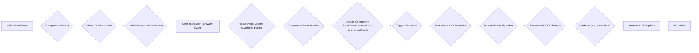

# Project Design Document: React Library

**Version:** 1.1
**Date:** October 26, 2023
**Author:** AI Software Architect

## 1. Introduction

This document provides an enhanced architectural design of the React JavaScript library, focusing on its core components, interactions, and data flow. This design is intended to be used as the foundation for subsequent threat modeling activities. The scope of this document primarily covers the client-side rendering aspects of React as found in the linked GitHub repository, specifically how it operates within a web browser environment.

## 2. Goals and Objectives

The primary goals of the React library are to:

*   Enable developers to build interactive and dynamic user interfaces in a declarative manner.
*   Promote the creation of reusable and composable UI components.
*   Optimize UI updates and rendering performance through the use of a virtual DOM.
*   Simplify the management of application state and data flow.
*   Provide a consistent development experience across different browsers and environments.

## 3. Architectural Overview

React follows a component-based architecture. User interfaces are constructed by composing independent, self-contained components. Each component manages its own rendering logic and can hold internal state. React utilizes a virtual DOM as an abstraction layer between the component logic and the actual browser DOM, enabling efficient updates. The data flow in a typical React application is unidirectional, flowing from parent components to child components via props.

## 4. Key Components and Modules

*   **Core Library (`react` package):** Contains the fundamental APIs for defining components, managing state, and interacting with the virtual DOM. This includes functions like `createElement`, `useState`, `useEffect`, and the `Component` class.
*   **Components:** The fundamental building blocks of React UIs.
    *   **Functional Components:** JavaScript functions that return JSX. They can utilize Hooks to manage state and lifecycle effects.
    *   **Class Components:** JavaScript classes that extend `React.Component`. They have lifecycle methods and can manage state using `this.state`.
*   **JSX (JavaScript XML):** A syntactic extension that allows developers to write HTML-like structures directly within JavaScript code, describing the desired UI output. JSX is transformed into standard JavaScript function calls (using `React.createElement`).
*   **Props (Properties):** Data passed down from parent components to child components. Props are read-only from the perspective of the child component, enforcing the unidirectional data flow.
*   **State:** Internal data managed by a component. Changes to state trigger a re-render of the component and its descendants. State can be local to a component or managed externally using state management libraries.
*   **Virtual DOM:** An in-memory representation of the actual browser DOM. React uses the virtual DOM to efficiently determine the minimal set of changes required to update the real DOM.
*   **Reconciliation Algorithm:** The process where React compares the current virtual DOM with the previous version to identify the differences (the "diff"). This algorithm is crucial for performance optimization.
*   **Renderer (`react-dom` package for browsers):** Responsible for taking the changes determined by the reconciliation algorithm and applying them to the actual browser DOM. Different renderers exist for different target environments (e.g., `react-native` for mobile).
*   **Event System (Synthetic Events):** React implements its own cross-browser event system that wraps native browser events. This provides consistency and allows for optimizations like event delegation. Synthetic events are pooled for performance.
*   **Hooks:** Functions that allow functional components to "hook into" React state and lifecycle features. Common hooks include `useState`, `useEffect`, and `useContext`.
*   **Context API:** A mechanism for sharing values between components without explicitly passing props through every level of the component tree. This is useful for sharing global data.
*   **Refs:** A way to access DOM nodes or React elements directly. While sometimes necessary, overuse of refs can make data flow less predictable.
*   **Build Tools (e.g., Babel, Webpack, Parcel):** While not part of the core React library, these tools are essential for the development workflow. They handle tasks like:
    *   **JSX Transformation:** Converting JSX syntax into standard JavaScript.
    *   **Bundling:** Combining multiple JavaScript modules into single files for the browser.
    *   **Code Optimization:** Minification, tree-shaking, etc.
    *   **Transpilation:** Converting modern JavaScript features into code compatible with older browsers.

## 5. Data Flow

The data flow in a React application is generally unidirectional. Data flows down from parent components to child components via props. Changes in child components that need to affect parent components typically involve calling callback functions (often passed down as props) that update the state in the parent, triggering a re-render.

*   **Initial State/Props:** The component starts with its initial state and props.
*   **Component Render:** The component's render function (or the function body for functional components) is executed.
*   **Virtual DOM Creation:** React creates a virtual DOM representation of the component's output.
*   **Initial Browser DOM Render:** The renderer applies the initial virtual DOM to create the actual DOM in the browser.
*   **User Interaction (Browser Event):** A user interacts with the application in the browser.
*   **React Event System (Synthetic Event):** The browser event is captured and processed by React's synthetic event system.
*   **Component Event Handler:** A function defined within the component is invoked in response to the event.
*   **Update Component State/Props (via setState or prop callback):** The event handler updates the component's internal state (using `setState` for class components or state hooks for functional components) or calls a callback function passed as a prop to update state in a parent component.
*   **Trigger Re-render:** Changes to state or props trigger a re-render of the component and its affected descendants.
*   **New Virtual DOM Creation:** React creates a new virtual DOM based on the updated state and props.
*   **Reconciliation Algorithm:** React compares the new virtual DOM with the previous one to identify the differences.
*   **Determine DOM Changes:** The reconciliation process calculates the minimal set of changes needed to update the actual DOM.
*   **Renderer (e.g., react-dom):** The appropriate renderer receives the instructions for DOM updates.
*   **Browser DOM Update:** The renderer updates the actual browser DOM.
*   **UI Update:** The user interface reflects the changes.

## 6. Security Considerations (Detailed)

*   **Cross-Site Scripting (XSS):**
    *   **Mitigation:** React helps prevent XSS by automatically escaping values inserted into the DOM using JSX.
    *   **Vulnerabilities:**  Rendering user-provided HTML directly using `dangerouslySetInnerHTML` bypasses React's sanitization and can introduce XSS vulnerabilities. Similarly, rendering URLs or other attributes from untrusted sources without proper sanitization can be risky.
*   **Cross-Site Request Forgery (CSRF):**
    *   **Mitigation:** React itself doesn't inherently prevent CSRF. Mitigation typically involves server-side implementations like checking the `Origin` or `Referer` headers, using anti-CSRF tokens, and employing SameSite cookies.
    *   **Vulnerabilities:** If the application makes state-changing requests to the server without proper CSRF protection, attackers can potentially trick users into making unintended requests.
*   **Dependency Management:**
    *   **Mitigation:** Regularly auditing and updating dependencies using tools like `npm audit` or `yarn audit` is crucial. Using a software composition analysis (SCA) tool can help identify known vulnerabilities in dependencies.
    *   **Vulnerabilities:**  React applications rely on numerous third-party libraries. Vulnerabilities in these dependencies can be exploited if not addressed promptly.
*   **Server-Side Rendering (SSR) Vulnerabilities:**
    *   **Mitigation:** When using SSR, ensure the server-side rendering environment is secure and protected against injection attacks. Sanitize data before rendering it on the server.
    *   **Vulnerabilities:**  If the SSR process is vulnerable, attackers could potentially inject malicious scripts that are executed on the server or during the initial page load.
*   **Client-Side Data Handling:**
    *   **Mitigation:** Avoid storing sensitive information directly in the client-side code or local storage if possible. If necessary, encrypt sensitive data before storing it client-side.
    *   **Vulnerabilities:**  Sensitive data stored on the client-side can be vulnerable to access or modification by malicious scripts or users with access to the browser's developer tools.
*   **State Management Security:**
    *   **Mitigation:**  Be mindful of the data stored in the application's state, especially if using global state management libraries. Avoid storing sensitive information in the global state if it's not necessary.
    *   **Vulnerabilities:**  If the state contains sensitive information, vulnerabilities in the application logic or state management implementation could expose this data.
*   **Build Process Security:**
    *   **Mitigation:** Secure the development and build pipeline. Use trusted sources for dependencies and ensure the integrity of build tools. Implement measures to prevent supply chain attacks.
    *   **Vulnerabilities:**  Compromised build tools or processes could inject malicious code into the application's final bundle.
*   **Prototype Pollution:**
    *   **Mitigation:** Be cautious when merging objects, especially when the structure of the objects being merged is not fully controlled. Avoid using libraries or patterns known to be susceptible to prototype pollution.
    *   **Vulnerabilities:**  Prototype pollution can allow attackers to inject properties into built-in JavaScript object prototypes, potentially leading to unexpected behavior or security vulnerabilities.

## 7. Technologies Used

*   **JavaScript (ECMAScript):** The core programming language.
*   **JSX:**  The syntax extension for embedding XML-like structures.
*   **HTML:**  Defines the structure of the user interface.
*   **CSS:**  Used for styling the user interface.
*   **DOM (Document Object Model):** The browser's representation of the HTML structure that React manipulates.
*   **Node.js and npm/yarn/pnpm:**  Typically used for managing dependencies and running build scripts.

## 8. Deployment Considerations

React applications are typically deployed as static assets, which can be served from various environments. Security considerations vary depending on the deployment method:

*   **Content Delivery Networks (CDNs):** Ensure the CDN configuration is secure, using HTTPS and appropriate access controls. Subresource Integrity (SRI) can be used to verify the integrity of files loaded from CDNs.
*   **Static Site Hosting (e.g., Netlify, Vercel, AWS S3):** Secure the hosting environment and configure appropriate permissions. Ensure HTTPS is enabled.
*   **Traditional Web Servers (e.g., Apache, Nginx):** Follow standard web server security best practices, including HTTPS configuration, security headers, and regular updates.
*   **Server-Side Rendering (SSR) Environments (e.g., Node.js):** Secure the server environment, protect against injection attacks, and implement proper authentication and authorization mechanisms. Be mindful of potential vulnerabilities in server-side dependencies.

## 9. Future Considerations

*   **Server Components:**  This emerging feature allows certain components to render on the server, potentially improving performance and reducing client-side JavaScript. This introduces new security considerations related to server-side rendering and data fetching.
*   **React Native:** For building native mobile applications. This uses a different rendering environment and has its own set of security considerations related to mobile app development.
*   **Continued Evolution of the Core Library:**  Ongoing development may introduce new features and APIs that could have security implications that need to be evaluated.

This document provides a more detailed architectural understanding of the React library, intended to facilitate a comprehensive threat modeling process. The subsequent threat modeling exercise will build upon this design to identify potential vulnerabilities and recommend appropriate mitigation strategies.