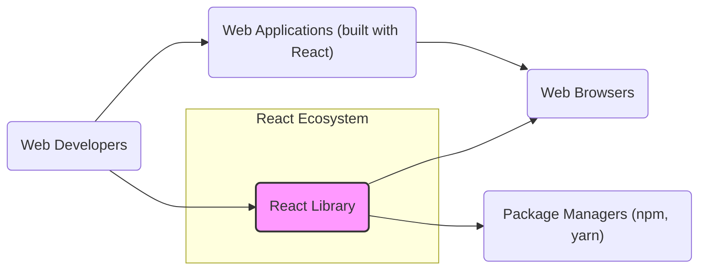
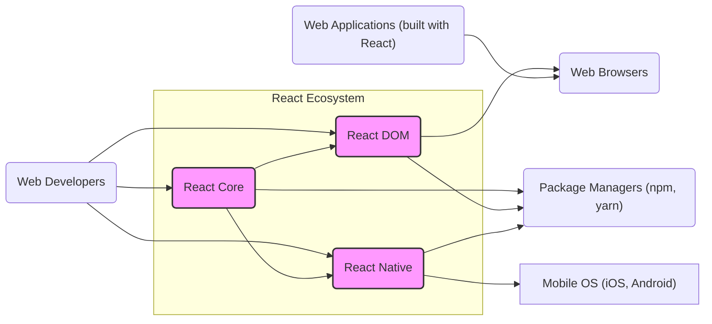
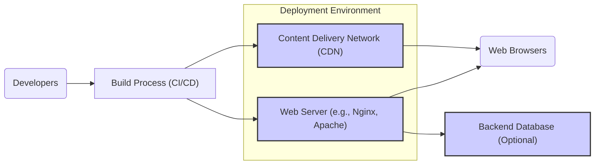
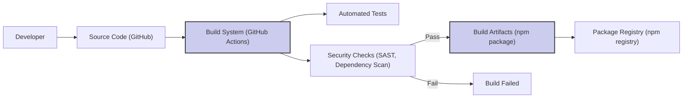

# BUSINESS POSTURE

- Business Priorities and Goals:
  - Enable developers to build user interfaces efficiently and effectively.
  - Provide a declarative and component-based approach to UI development.
  - Foster a large and active community around the library.
  - Ensure high performance and responsiveness of user interfaces built with React.
  - Maintain and improve the library to meet evolving web development needs.
  - Promote wide adoption of React across various platforms and applications.

- Business Risks:
  - Security vulnerabilities in the React library could impact a vast number of applications.
  - Supply chain attacks targeting React's dependencies or build process could compromise the library.
  - Performance issues in React could lead to negative user experiences and developer dissatisfaction.
  - Lack of community support or decline in contributions could hinder the library's development and adoption.
  - Changes in web standards or browser technologies could render React obsolete or require significant rework.
  - Misuse of React by developers leading to insecure or poorly performing applications, reflecting negatively on the library's reputation.

# SECURITY POSTURE

- Existing Security Controls:
  - security control: Code reviews are performed by maintainers and community members (described in GitHub contribution guidelines).
  - security control: Automated testing including unit and integration tests (implemented in GitHub Actions workflows).
  - security control: Static analysis tools and linters are likely used during development (inferred from common JavaScript development practices).
  - security control: Dependency scanning for known vulnerabilities in third-party libraries (potentially integrated into GitHub Actions or other CI/CD pipelines).
  - security control: Public vulnerability reporting process via GitHub issues and security channels (described in community guidelines).
  - accepted risk: Reliance on community contributions for security vulnerability discovery and patching.
  - accepted risk: Open source nature makes the codebase publicly accessible for vulnerability research (both beneficial and potentially risky).
  - accepted risk:  Security of applications built with React is primarily the responsibility of the application developers, not the React library itself.

- Recommended Security Controls:
  - security control: Implement a formal security audit by a third-party security firm to identify potential vulnerabilities in the React core and build process.
  - security control: Establish a bug bounty program to incentivize external security researchers to find and report vulnerabilities.
  - security control: Enhance supply chain security measures by using dependency pinning, Software Bill of Materials (SBOM), and signing build artifacts.
  - security control: Implement fuzz testing to discover unexpected behavior and potential vulnerabilities in core components.
  - security control: Create and maintain security-focused documentation and guidelines for developers using React to build secure applications.

- Security Requirements:
  - Authentication: Not directly applicable to React library itself. Authentication is handled by applications built with React and backend services.
  - Authorization: Not directly applicable to React library itself. Authorization is handled by applications built with React and backend services.
  - Input Validation: React primarily deals with rendering data, not direct user input handling. Input validation is the responsibility of application developers using React, especially when handling data from external sources or user inputs within React components. React's virtual DOM and JSX help prevent some forms of DOM-based XSS by default, but developers must still be cautious with dynamic content rendering.
  - Cryptography: Not directly applicable to React library itself. Cryptographic operations are handled by applications built with React when needed, using browser APIs or external libraries. React should not introduce any cryptographic vulnerabilities or weaknesses.

# DESIGN

## C4 CONTEXT

- Context Diagram Elements:
  - - Name: React Library
    - Type: Software System
    - Description: The React JavaScript library for building user interfaces. It provides a component-based and declarative approach to UI development.
    - Responsibilities:
      - Providing core UI rendering and component management functionalities.
      - Exposing APIs for developers to build user interfaces.
      - Ensuring performance and compatibility across different browsers.
    - Security controls:
      - Security control: Code reviews.
      - security control: Automated testing.
      - security control: Static analysis.
      - security control: Dependency scanning.

  - - Name: Web Developers
    - Type: Person
    - Description: Software engineers who use React to build web applications.
    - Responsibilities:
      - Using React library to develop user interfaces.
      - Integrating React into web applications.
      - Ensuring secure and performant application development practices.
    - Security controls:
      - security control: Secure coding practices training.
      - security control: Code reviews within development teams.
      - security control: Application security testing.

  - - Name: Web Browsers
    - Type: Software System
    - Description: Web browsers (Chrome, Firefox, Safari, Edge, etc.) that execute web applications built with React.
    - Responsibilities:
      - Rendering web applications built with React.
      - Providing JavaScript execution environment.
      - Enforcing browser security policies (CSP, Same-Origin Policy, etc.).
    - Security controls:
      - security control: Browser security updates and patches.
      - security control: Browser security features (CSP, XSS filters, etc.).

  - - Name: Package Managers (npm, yarn)
    - Type: Software System
    - Description: Package managers used by developers to download and manage React library and its dependencies.
    - Responsibilities:
      - Providing access to React library packages.
      - Managing dependencies of React and developer projects.
      - Ensuring integrity of downloaded packages.
    - Security controls:
      - security control: Package registry security measures (authentication, malware scanning).
      - security control: Package integrity checks (checksums, signatures).

  - - Name: Web Applications (built with React)
    - Type: Software System
    - Description: Web applications developed by web developers using the React library. These applications are deployed and run in web browsers.
    - Responsibilities:
      - Providing specific functionalities to end-users.
      - Handling user data and interactions.
      - Implementing application-level security controls.
    - Security controls:
      - security control: Application-level authentication and authorization.
      - security control: Input validation and output encoding.
      - security control: Secure data storage and transmission.

## C4 CONTAINER

- Container Diagram Elements:
  - - Name: React Core
    - Type: Library
    - Description: The core logic of React, including component model, virtual DOM, and reconciliation algorithm. Platform-agnostic.
    - Responsibilities:
      - Managing component lifecycle and state.
      - Performing virtual DOM diffing and reconciliation.
      - Providing core APIs for React development.
    - Security controls:
      - security control: Code reviews.
      - security control: Automated testing.
      - security control: Static analysis.
      - security control: Fuzz testing (recommended).

  - - Name: React DOM
    - Type: Library
    - Description: React package for working with the DOM in web browsers. Provides browser-specific implementations of React's rendering logic.
    - Responsibilities:
      - Rendering React components to the browser DOM.
      - Handling browser events.
      - Interacting with browser APIs.
    - Security controls:
      - security control: Code reviews.
      - security control: Automated testing (browser compatibility tests).
      - security control: Static analysis.

  - - Name: React Native
    - Type: Library
    - Description: React package for building native mobile applications using JavaScript and React. Provides platform-specific implementations for mobile platforms.
    - Responsibilities:
      - Rendering React components to native mobile UI elements.
      - Bridging JavaScript code with native mobile platform APIs.
      - Enabling cross-platform mobile development.
    - Security controls:
      - security control: Code reviews.
      - security control: Automated testing (platform-specific tests).
      - security control: Static analysis.

  - - Name: Web Developers, Web Browsers, Package Managers (npm, yarn), Web Applications (built with React)
    - Type, Description, Responsibilities, Security controls: Same as described in C4 Context diagram.

  - - Name: Mobile OS (iOS, Android)
    - Type: Software System
    - Description: Mobile operating systems on which React Native applications run.
    - Responsibilities:
      - Executing React Native applications.
      - Providing native APIs for applications.
      - Enforcing mobile platform security policies.
    - Security controls:
      - security control: Mobile OS security updates and patches.
      - security control: Mobile platform security features and permissions.
      - security control: App store security reviews.

## DEPLOYMENT

React library itself is not deployed. Applications built with React are deployed. A common deployment scenario for web applications built with React is using a CDN and web servers.

- Deployment Diagram Elements:
  - - Name: Content Delivery Network (CDN)
    - Type: Infrastructure
    - Description: A network of geographically distributed servers that cache static assets (JavaScript, CSS, images) of web applications.
    - Responsibilities:
      - Hosting and delivering static assets of React applications.
      - Improving application loading speed and performance.
      - Handling high traffic loads.
    - Security controls:
      - security control: CDN provider security measures (DDoS protection, access controls).
      - security control: HTTPS for asset delivery.
      - security control: Content Security Policy (CSP) headers.

  - - Name: Web Server (e.g., Nginx, Apache)
    - Type: Infrastructure
    - Description: Web servers that host the dynamic parts of web applications, serve HTML, and potentially handle API requests.
    - Responsibilities:
      - Serving HTML and dynamic content of React applications.
      - Handling server-side logic and API endpoints (if applicable).
      - Managing application server environment.
    - Security controls:
      - security control: Web server hardening and security configuration.
      - security control: HTTPS for communication.
      - security control: Web Application Firewall (WAF) (optional).
      - security control: Regular security patching and updates.

  - - Name: Backend Database (Optional)
    - Type: Infrastructure
    - Description: Databases used by backend services to store and manage application data. Not directly related to React library deployment but relevant for full-stack applications.
    - Responsibilities:
      - Storing application data.
      - Providing data access to backend services.
      - Ensuring data integrity and availability.
    - Security controls:
      - security control: Database access controls and authentication.
      - security control: Data encryption at rest and in transit.
      - security control: Regular database backups.
      - security control: Database security hardening.

  - - Name: Build Process (CI/CD)
    - Type: Process
    - Description: Automated build and deployment pipelines that package and deploy React applications to CDN and web servers.
    - Responsibilities:
      - Automating the build, test, and deployment process.
      - Ensuring consistent and repeatable deployments.
      - Integrating security checks into the deployment pipeline.
    - Security controls:
      - security control: Secure CI/CD pipeline configuration and access controls.
      - security control: Security scanning during build process.
      - security control: Artifact signing and verification.

  - - Name: Developers, Web Browsers
    - Type, Description, Responsibilities, Security controls: Same as described in C4 Context diagram.

## BUILD

- Build Process Elements:
  - - Name: Developer
    - Type: Person
    - Description: Software developer contributing code to the React project.
    - Responsibilities:
      - Writing and committing code changes.
      - Participating in code reviews.
      - Addressing build failures and security issues.
    - Security controls:
      - security control: Developer authentication and authorization to code repository.
      - security control: Secure development environment.
      - security control: Code review process.

  - - Name: Source Code (GitHub)
    - Type: Data Store
    - Description: The GitHub repository hosting the React source code.
    - Responsibilities:
      - Storing and versioning the source code.
      - Managing code contributions and branches.
      - Providing access control to the codebase.
    - Security controls:
      - security control: GitHub access controls and permissions.
      - security control: Branch protection rules.
      - security control: Audit logs.

  - - Name: Build System (GitHub Actions)
    - Type: Software System
    - Description: Automated build system, likely GitHub Actions, used to compile, test, and package React.
    - Responsibilities:
      - Automating the build process.
      - Running tests and security checks.
      - Generating build artifacts.
    - Security controls:
      - security control: Secure CI/CD pipeline configuration.
      - security control: Access control to CI/CD system.
      - security control: Secrets management in CI/CD.

  - - Name: Tests
    - Type: Process
    - Description: Automated tests (unit, integration, etc.) run during the build process to ensure code quality and functionality.
    - Responsibilities:
      - Verifying code correctness and functionality.
      - Detecting regressions and bugs.
      - Improving code reliability.
    - Security controls:
      - security control: Secure test environment.
      - security control: Test code review.

  - - Name: Security Checks (SAST, Dependency Scan)
    - Type: Process
    - Description: Automated security checks integrated into the build process, including Static Application Security Testing (SAST) and dependency vulnerability scanning.
    - Responsibilities:
      - Identifying potential security vulnerabilities in the code.
      - Detecting vulnerable dependencies.
      - Enforcing security standards.
    - Security controls:
      - security control: Configuration and maintenance of security scanning tools.
      - security control: Review and remediation of security findings.

  - - Name: Build Artifacts (npm package)
    - Type: Data Store
    - Description: The packaged React library, typically as an npm package, ready for distribution.
    - Responsibilities:
      - Containing the compiled and packaged React library.
      - Being ready for publishing to package registries.
      - Ensuring integrity and authenticity of the package.
    - Security controls:
      - security control: Artifact signing (recommended).
      - security control: Storage of artifacts in secure location.

  - - Name: Package Registry (npm registry)
    - Type: Software System
    - Description: Public package registry (like npm registry) where React packages are published and distributed.
    - Responsibilities:
      - Hosting and distributing React packages.
      - Providing access to developers for downloading packages.
      - Ensuring package integrity and availability.
    - Security controls:
      - security control: Package registry security measures (authentication, malware scanning).
      - security control: Package integrity checks (checksums, signatures).

# RISK ASSESSMENT

- Critical Business Processes:
  - Developer adoption and usage of React: A security vulnerability in React could severely impact developer trust and adoption, hindering its primary business goal.
  - Security of applications built with React: While React itself is a library, its security directly impacts the security of countless applications built upon it. Widespread vulnerabilities could lead to widespread application vulnerabilities.
  - Community trust and contribution: Security incidents can erode community trust and reduce contributions, impacting the long-term health and evolution of React.

- Data to Protect and Sensitivity:
  - Source code of React: Highly sensitive. Compromise could lead to supply chain attacks, intellectual property theft, and loss of competitive advantage (though React is open source, integrity is crucial).
  - Build artifacts (npm packages): Highly sensitive. Compromise could lead to distribution of malware to millions of developers and applications.
  - Developer and contributor accounts: Moderately sensitive. Compromise could lead to unauthorized code changes or malicious package releases.
  - Vulnerability reports: Moderately sensitive. Premature disclosure could be exploited by attackers before patches are available.

# QUESTIONS & ASSUMPTIONS

- Questions:
  - What specific security scanning tools are currently used in the React build process?
  - Is there a formal process for handling and triaging security vulnerability reports?
  - Are there any specific security compliance requirements that React project needs to adhere to?
  - What is the process for security patching and releasing updates for React in case of vulnerabilities?
  - Are there any existing security awareness training programs for React developers and contributors?

- Assumptions:
  - React project uses GitHub Actions for its CI/CD pipeline.
  - React packages are published to the npm registry.
  - Security is a high priority for the React project maintainers and community.
  - The primary use case for React is building web applications, although React Native is also a significant part of the ecosystem.
  - The target audience for this document is someone involved in threat modeling for systems that depend on or are built with React.