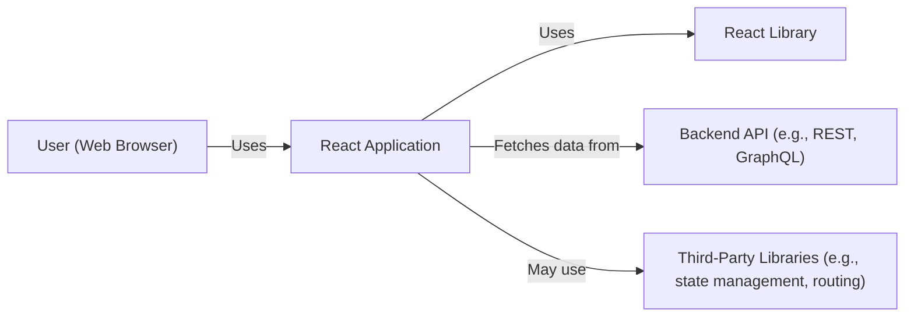
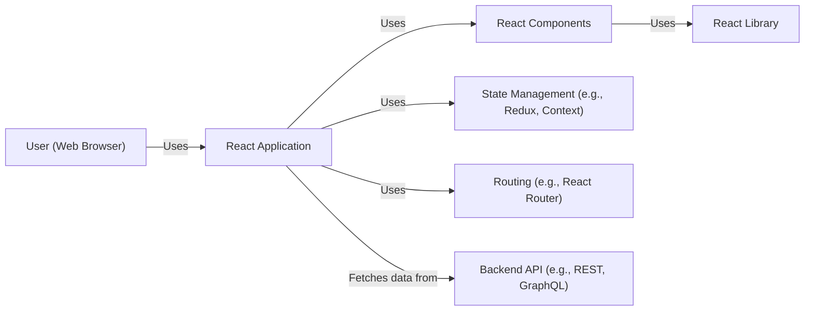
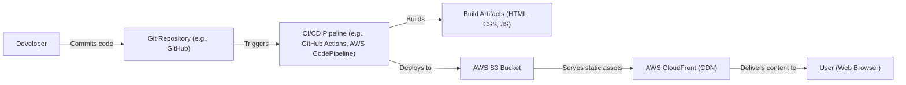
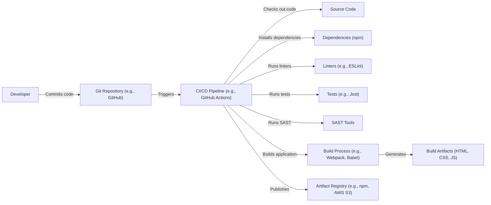

# Project Design Document: React

## BUSINESS POSTURE

React is a well-established, widely-used open-source project maintained by Meta (Facebook) and a large community of contributors. Its primary goal is to provide a JavaScript library for building user interfaces (UIs) or UI components, particularly for single-page applications where fast updates and rendering are crucial.

Business Priorities:

*   Maintainability: Ensure the library remains maintainable and evolvable over time, given its widespread use and the fast-paced nature of front-end development.
*   Performance: Provide high performance for rendering and updating UIs, which is critical for user experience.
*   Backward Compatibility: Minimize breaking changes between versions to avoid disrupting existing applications that rely on React.
*   Community Adoption: Foster a large and active community of users and contributors.
*   Developer Experience: Offer a good developer experience with clear APIs, helpful documentation, and useful tools.

Business Risks:

*   Security Vulnerabilities: Given React's widespread use, any security vulnerabilities could have a significant impact on a vast number of applications. Cross-site scripting (XSS) is a particular concern.
*   Supply Chain Attacks: Compromise of the React build process or its dependencies could lead to malicious code being distributed to many users.
*   Performance Degradation: Changes to the library could inadvertently introduce performance regressions, affecting user experience.
*   Loss of Community Trust: Failure to address security issues promptly or introducing significant breaking changes could erode trust and lead to developers switching to alternative frameworks.
*   Competition: The JavaScript ecosystem is highly competitive, and new frameworks or libraries could emerge that offer advantages over React.

## SECURITY POSTURE

Existing Security Controls:

*   security control: Code Reviews: All changes to the React codebase undergo code review by maintainers. (Described in contributing guidelines and pull request process).
*   security control: Static Analysis: The codebase is likely scanned for potential security vulnerabilities using static analysis tools. (Inferred from best practices and Meta's security posture).
*   security control: Testing: React has an extensive test suite that helps prevent regressions, including security-related ones. (Visible in the repository's test directory).
*   security control: Security Policy: React has a security policy that outlines how to report vulnerabilities. (SECURITY.md file in the repository).
*   security control: Dependency Management: Dependencies are carefully managed and monitored for known vulnerabilities. (Inferred from best practices and Meta's security posture).
*   security control: Content Security Policy (CSP) Compatibility: React is designed to be compatible with CSP, a browser security mechanism that helps mitigate XSS attacks. (Inferred from documentation and best practices).

Accepted Risks:

*   accepted risk: Third-Party Libraries: React relies on some third-party libraries, which could introduce vulnerabilities. While dependencies are managed, there's always a residual risk.
*   accepted risk: User-Implemented Components: React applications often include custom components developed by users. These components are outside the control of the React core team and may contain vulnerabilities.
*   accepted risk: Server-Side Rendering (SSR) Security: While React itself is a client-side library, it can be used for SSR. SSR introduces additional security considerations that are the responsibility of the application developer.

Recommended Security Controls:

*   security control: Dynamic Analysis: Implement dynamic analysis (e.g., fuzzing) to identify vulnerabilities that might be missed by static analysis.
*   security control: Software Composition Analysis (SCA): Use SCA tools to continuously monitor dependencies for known vulnerabilities and automatically generate alerts.
*   security control: Regular Security Audits: Conduct regular security audits by independent third-party experts.

Security Requirements:

*   Authentication: Not directly applicable to React itself, as it's a UI library. Authentication is the responsibility of the application using React.
*   Authorization: Similar to authentication, authorization is handled at the application level, not within React itself.
*   Input Validation:
    *   React encourages the use of controlled components, where form data is handled by React components. This provides a central point for input validation.
    *   Developers should use appropriate validation techniques to prevent XSS and other injection attacks.
    *   React's JSX syntax helps prevent some forms of XSS by automatically escaping values, but developers must still be cautious when using `dangerouslySetInnerHTML`.
*   Cryptography: Not directly applicable to React itself. Cryptographic operations (e.g., hashing passwords) should be handled on the server-side or using appropriate Web Crypto APIs.

## DESIGN

### C4 CONTEXT

Element Descriptions:

*   Element:
    *   Name: User (Web Browser)
    *   Type: Person
    *   Description: A person interacting with the React application through a web browser.
    *   Responsibilities: Initiates interactions, views UI, provides input.
    *   Security controls: Browser security mechanisms (e.g., same-origin policy, CSP).

*   Element:
    *   Name: React Application
    *   Type: Software System
    *   Description: A web application built using the React library.
    *   Responsibilities: Renders UI, handles user interactions, manages application state, communicates with backend APIs.
    *   Security controls: Input validation, output encoding, proper use of React's security features, application-specific security logic.

*   Element:
    *   Name: React Library
    *   Type: Software System
    *   Description: The React library itself (e.g., `react`, `react-dom`).
    *   Responsibilities: Provides components and APIs for building UIs, manages the virtual DOM, handles updates and rendering.
    *   Security controls: Code reviews, static analysis, testing, security policy.

*   Element:
    *   Name: Backend API (e.g., REST, GraphQL)
    *   Type: Software System
    *   Description: A backend API that the React application communicates with to fetch or send data.
    *   Responsibilities: Provides data to the React application, handles business logic, interacts with databases.
    *   Security controls: Authentication, authorization, input validation, rate limiting, protection against common web vulnerabilities.

*   Element:
    *   Name: Third-Party Libraries (e.g., state management, routing)
    *   Type: Software System
    *   Description: Third-party libraries used by the React application for additional functionality.
    *   Responsibilities: Varies depending on the library (e.g., managing application state, handling navigation).
    *   Security controls: Dependent on the specific library; developers should choose well-maintained libraries with good security practices.

### C4 CONTAINER

Element Descriptions:

*   Element:
    *   Name: User (Web Browser)
    *   Type: Person
    *   Description: A person interacting with the React application through a web browser.
    *   Responsibilities: Initiates interactions, views UI, provides input.
    *   Security controls: Browser security mechanisms (e.g., same-origin policy, CSP).

*   Element:
    *   Name: React Application
    *   Type: Web Application
    *   Description: A web application built using the React library.
    *   Responsibilities: Renders UI, handles user interactions, manages application state, communicates with backend APIs.
    *   Security controls: Input validation, output encoding, proper use of React's security features, application-specific security logic.

*   Element:
    *   Name: React Components
    *   Type: Container
    *   Description: Reusable UI components built using React.
    *   Responsibilities: Render specific parts of the UI, handle user interactions within their scope.
    *   Security controls: Input validation, output encoding, proper use of React's security features (e.g., avoiding `dangerouslySetInnerHTML` when possible).

*   Element:
    *   Name: State Management (e.g., Redux, Context)
    *   Type: Container
    *   Description: A library or mechanism for managing application state.
    *   Responsibilities: Stores and updates application state, provides access to state for components.
    *   Security controls: Secure handling of sensitive data in state, proper access control to state updates.

*   Element:
    *   Name: Routing (e.g., React Router)
    *   Type: Container
    *   Description: A library for handling navigation within the React application.
    *   Responsibilities: Maps URLs to components, manages navigation history.
    *   Security controls: Protection against URL manipulation attacks, secure handling of route parameters.

*   Element:
    *   Name: Backend API (e.g., REST, GraphQL)
    *   Type: API
    *   Description: A backend API that the React application communicates with to fetch or send data.
    *   Responsibilities: Provides data to the React application, handles business logic, interacts with databases.
    *   Security controls: Authentication, authorization, input validation, rate limiting, protection against common web vulnerabilities.

*   Element:
    *   Name: React Library
    *   Type: Library
    *   Description: The React library itself (e.g., `react`, `react-dom`).
    *   Responsibilities: Provides components and APIs for building UIs, manages the virtual DOM, handles updates and rendering.
    *   Security controls: Code reviews, static analysis, testing, security policy.

### DEPLOYMENT

Deployment Solutions:

1.  Static Hosting (e.g., Netlify, Vercel, AWS S3 + CloudFront, GitHub Pages): This is the most common deployment method for React applications. The build process generates static HTML, CSS, and JavaScript files, which are then uploaded to a static hosting service.
2.  Server-Side Rendering (SSR) with Node.js (e.g., Next.js, custom server): The React application is rendered on the server, and the resulting HTML is sent to the client. This improves initial load time and SEO.
3.  Containerized Deployment (e.g., Docker, Kubernetes): The React application (either statically built or with SSR) is packaged into a Docker container and deployed to a container orchestration platform like Kubernetes.

Chosen Solution (Static Hosting with AWS S3 + CloudFront):

Element Descriptions:

*   Element:
    *   Name: Developer
    *   Type: Person
    *   Description: A developer working on the React application.
    *   Responsibilities: Writes code, commits changes to the Git repository.
    *   Security controls: Code reviews, secure coding practices.

*   Element:
    *   Name: Git Repository (e.g., GitHub)
    *   Type: Version Control System
    *   Description: A Git repository hosting the source code of the React application.
    *   Responsibilities: Stores code, tracks changes, enables collaboration.
    *   Security controls: Access control, branch protection rules, code signing.

*   Element:
    *   Name: CI/CD Pipeline (e.g., GitHub Actions, AWS CodePipeline)
    *   Type: Automation Tool
    *   Description: A CI/CD pipeline that automates the build, test, and deployment process.
    *   Responsibilities: Runs tests, builds the application, deploys the build artifacts.
    *   Security controls: Secure configuration, access control, secrets management.

*   Element:
    *   Name: Build Artifacts (HTML, CSS, JS)
    *   Type: Files
    *   Description: The static files generated by the build process.
    *   Responsibilities: Represent the deployable version of the React application.
    *   Security controls: Integrity checks, secure storage.

*   Element:
    *   Name: AWS S3 Bucket
    *   Type: Cloud Storage
    *   Description: An AWS S3 bucket used to store the static build artifacts.
    *   Responsibilities: Stores the files, serves them to CloudFront.
    *   Security controls: Access control, encryption at rest, versioning.

*   Element:
    *   Name: AWS CloudFront (CDN)
    *   Type: Content Delivery Network
    *   Description: A CDN that distributes the React application globally.
    *   Responsibilities: Caches content, reduces latency, improves performance.
    *   Security controls: HTTPS, access control, WAF integration.

*   Element:
    *   Name: User (Web Browser)
    *   Type: Person
    *   Description: A person interacting with the React application through a web browser.
    *   Responsibilities: Initiates interactions, views UI, provides input.
    *   Security controls: Browser security mechanisms (e.g., same-origin policy, CSP).

### BUILD

Build Process Description:

1.  Developer commits code to the Git repository (e.g., GitHub).
2.  The commit triggers the CI/CD pipeline (e.g., GitHub Actions).
3.  The CI pipeline checks out the source code.
4.  The CI pipeline installs dependencies using a package manager (e.g., npm).
5.  The CI pipeline runs linters (e.g., ESLint) to enforce code style and identify potential errors.
6.  The CI pipeline runs tests (e.g., Jest) to ensure the code functions correctly.
7.  The CI pipeline runs SAST tools to scan for security vulnerabilities.
8.  The CI pipeline runs the build process (e.g., using Webpack and Babel) to transpile and bundle the code into static build artifacts (HTML, CSS, JavaScript).
9.  The CI pipeline publishes the build artifacts to an artifact registry (e.g., npm for the library itself, or AWS S3 for a deployed application).

Security Controls:

*   security control: Dependency Management: Use a package manager (npm) with lock files (package-lock.json or yarn.lock) to ensure consistent and reproducible builds. Regularly update dependencies and audit them for known vulnerabilities.
*   security control: Linting: Use linters (e.g., ESLint) to enforce code style, identify potential errors, and prevent some security issues.
*   security control: Testing: Write comprehensive tests (unit, integration, end-to-end) to catch bugs and regressions, including security-related ones.
*   security control: Static Application Security Testing (SAST): Integrate SAST tools into the CI pipeline to automatically scan the codebase for vulnerabilities.
*   security control: Software Composition Analysis (SCA): Use SCA tools to identify and track dependencies, and to alert on known vulnerabilities in those dependencies.
*   security control: Secure CI/CD Configuration: Configure the CI/CD pipeline securely, with appropriate access controls and secrets management.
*   security control: Code Signing: Consider code signing the published artifacts (e.g., npm packages) to ensure their integrity.

## RISK ASSESSMENT

Critical Business Processes:

*   Serving user interfaces: React is fundamentally about rendering UIs. Any disruption to this capability would directly impact users.
*   Maintaining developer productivity: React's ease of use and large community are key to its success. Security vulnerabilities or performance issues could hinder developer productivity.
*   Protecting user data: While React itself doesn't handle user data directly, it's often used in applications that do. Vulnerabilities in React could be exploited to compromise user data.

Data Sensitivity:

*   React library code: The React library code itself is not sensitive data, as it's open source. However, its integrity is critical.
*   Build artifacts: The build artifacts (HTML, CSS, JavaScript) are also not inherently sensitive, but they could contain embedded secrets or API keys if developers are not careful.
*   User data (handled by applications built with React): Applications built with React may handle sensitive user data (e.g., personal information, financial data). The sensitivity of this data depends on the specific application. React itself does not handle this data.

## QUESTIONS & ASSUMPTIONS

Questions:

*   What specific SAST and SCA tools are currently used in the React build process?
*   Are there any specific performance benchmarks or targets that must be met?
*   What is the process for handling security vulnerabilities reported by external researchers?
*   What is the frequency of security audits, and are the results publicly available?
*   Are there any plans to implement dynamic analysis or fuzzing?
*   What level of detail is available regarding dependency management and auditing?

Assumptions:

*   BUSINESS POSTURE: React aims for broad compatibility and avoids frequent breaking changes.
*   BUSINESS POSTURE: Meta prioritizes the security of its open-source projects, including React.
*   SECURITY POSTURE: The React team follows secure coding practices and addresses reported vulnerabilities promptly.
*   SECURITY POSTURE: Basic security measures like code reviews and static analysis are in place.
*   DESIGN: React applications typically interact with backend APIs for data persistence and business logic.
*   DESIGN: The deployment model will vary depending on the specific application using React.
*   DESIGN: The build process uses standard JavaScript tooling (npm, Webpack, Babel).