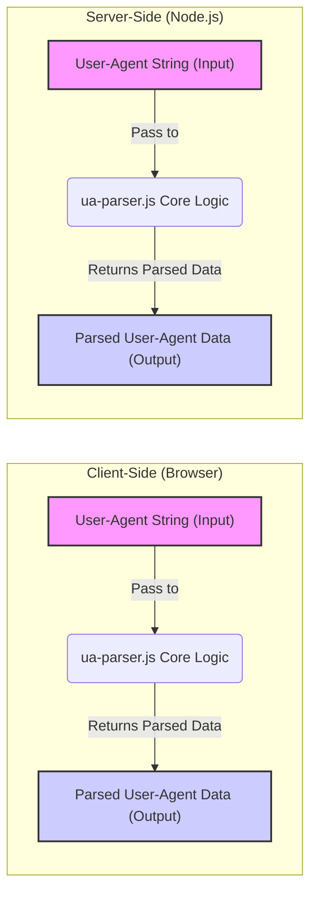
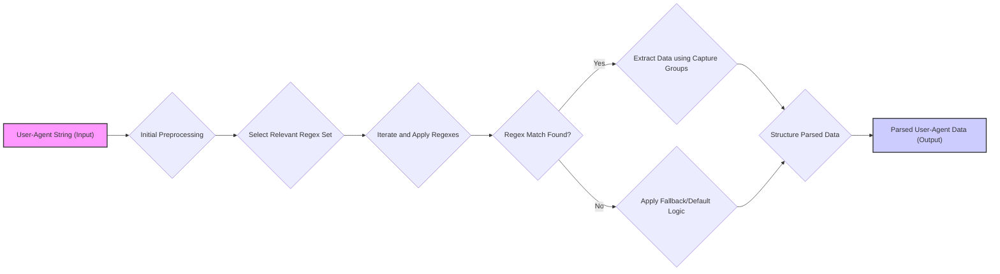

# Project Design Document: ua-parser-js

**Version:** 1.1
**Date:** October 26, 2023
**Author:** AI Software Architect

## 1. Introduction

This document provides an enhanced and more detailed design overview of the `ua-parser-js` project, a widely adopted JavaScript library for parsing User-Agent strings. This revised document builds upon the previous version, offering greater clarity and depth regarding the project's architecture, components, and data flow, specifically tailored for effective threat modeling.

## 2. Project Overview

`ua-parser-js` is a mature and widely used JavaScript library designed to interpret User-Agent strings, extracting valuable information about the user's browsing environment. This includes details about the browser name and version, operating system, device type (desktop, mobile, tablet, etc.), and potentially other relevant characteristics. The library is versatile, supporting seamless integration into both client-side (browser) and server-side (Node.js) JavaScript environments. Its core functionality relies on a well-defined set of regular expressions and internal data structures to facilitate accurate parsing.

## 3. Goals and Objectives

* **Primary Goal:** To provide an accurate and reliable mechanism for parsing User-Agent strings, enabling applications to understand the context of user requests.
* **Key Objectives:**
    * **Accuracy:** Maintain a high level of accuracy in parsing a diverse range of User-Agent string formats, including those from new and emerging browsers and devices.
    * **Performance:** Offer a lightweight and performant JavaScript library that minimizes processing overhead in both browser and server environments.
    * **Broad Compatibility:** Ensure seamless operation and consistent API across various browser versions and Node.js environments.
    * **Maintainability:**  Structure the codebase and parsing rules to facilitate easy updates and maintenance, adapting to the ever-evolving landscape of User-Agent strings.
    * **Security:** Minimize potential security vulnerabilities, particularly those related to regular expression processing.

## 4. Architecture and Design

### 4.1. High-Level Architecture

The high-level architecture highlights the dual-environment nature of `ua-parser-js`. The core parsing logic remains consistent, accepting a User-Agent string as input and producing structured parsed data as output, regardless of whether it's running in a browser or on a server.

### 4.2. Component Description

* **`ua-parser.js` Core Logic:** This central JavaScript file encapsulates the entire parsing process. Key components within this file include:
    * **Regular Expression Sets:** A carefully curated and organized collection of regular expressions. These regexes are the heart of the parsing engine, designed to match specific patterns within User-Agent strings to identify browser types, operating systems, and device information. These sets might be categorized for different types of information extraction.
    * **Parsing Functions (Categorized):**  A series of functions responsible for applying the defined regular expressions to the input User-Agent string. These functions often follow a structured approach, iterating through relevant regex sets and applying conditional logic based on successful matches. Different functions might handle parsing for browser, OS, and device information separately.
    * **Data Extraction and Structuring Logic:** Code responsible for extracting relevant substrings from the matched portions of the User-Agent string (using capture groups within the regexes) and structuring this information into a consistent output format (typically a JavaScript object with well-defined properties).
    * **API Entry Points:**  The public interface of the library, typically consisting of one or more functions (e.g., a primary `parse()` function) that users call to initiate the parsing process. This API abstracts away the internal complexity of the parsing logic.
    * **Internal Utility Functions:** Helper functions used within the core logic for tasks like string manipulation or data normalization.

* **Regular Expression Data (Potentially):** While often embedded within the `ua-parser.js` file, the regular expressions might be managed in separate data files (e.g., JSON or dedicated JavaScript modules). This separation can improve maintainability and allow for easier updates to the parsing rules without modifying the core logic.

### 4.3. Data Flow

The data flow illustrates the steps involved in parsing a User-Agent string:

1. **Input:** The process begins with receiving a User-Agent string as input.
2. **Initial Preprocessing:** The input string might undergo initial transformations, such as trimming leading/trailing whitespace or converting the string to a consistent case (e.g., lowercase) to simplify regex matching.
3. **Select Relevant Regex Set:** Based on the structure of the User-Agent string or prior matching attempts, the library selects a specific set of regular expressions that are most likely to contain relevant information.
4. **Iterate and Apply Regexes:** The library iterates through the selected set of regular expressions, attempting to match each regex against the input string.
5. **Regex Match Found?:** A conditional check to determine if a regular expression successfully matched a portion of the input string.
6. **Extract Data using Capture Groups:** If a match is found, the library uses the capture groups defined within the matching regular expression to extract specific pieces of information (e.g., browser name, version number).
7. **Structure Parsed Data:** The extracted data points are then organized into a structured format, typically a JavaScript object with properties representing different aspects of the user agent (browser, OS, device).
8. **Apply Fallback/Default Logic:** If no matching regular expression is found within a particular set, the library might apply fallback logic or assign default/unknown values to the corresponding fields in the output data.
9. **Output:** The final structured data representing the parsed User-Agent information is returned.

### 4.4. Deployment Model

`ua-parser-js` offers flexible deployment options:

* **Client-Side (Browser):** The library can be directly included in web pages using standard `<script>` tags. The parsing logic executes within the user's browser environment.
* **Server-Side (Node.js):** The library can be easily integrated into Node.js applications by installing it via npm (`npm install ua-parser-js`) and importing it into the relevant modules. The parsing logic executes on the server.

## 5. Security Considerations

This section details potential security considerations for `ua-parser-js`, essential for thorough threat modeling:

* **Regular Expression Denial of Service (ReDoS):**
    * **Threat:** The heavy reliance on regular expressions makes the library susceptible to ReDoS attacks. Maliciously crafted User-Agent strings with specific patterns can cause catastrophic backtracking in the regex engine, leading to excessive CPU consumption and potentially causing the application or browser to become unresponsive.
    * **Mitigation Strategies:**
        * **Careful Regex Design:** Employing efficient and well-tested regular expressions that avoid unbounded repetitions and overlapping patterns.
        * **Regex Complexity Analysis:** Utilizing tools and techniques to analyze the complexity of the regular expressions and identify potentially problematic patterns.
        * **Timeouts/Limits:** Implementing timeouts or resource limits on regex execution to prevent excessively long processing times for specific User-Agent strings.
        * **Input Sanitization (Limited):** While direct sanitization of the entire User-Agent string might be impractical, understanding potential attack patterns can inform the design of more robust regexes.

* **Data Injection through Malicious User-Agent Strings:**
    * **Threat:** Although primarily focused on data extraction, vulnerabilities in the parsing logic could potentially be exploited by carefully crafted User-Agent strings to inject unexpected data into the application's data structures or influence downstream logic. This is less likely to lead to direct code execution but could cause incorrect application behavior or data corruption.
    * **Mitigation Strategies:**
        * **Robust Parsing Logic:** Implementing parsing functions that handle unexpected or malformed input gracefully and avoid making assumptions about the structure of the User-Agent string.
        * **Output Validation:** Validating the structure and content of the parsed output before using it in critical application logic.
        * **Principle of Least Privilege:**  Ensuring that the parsed data is used with appropriate context and does not grant unintended access or capabilities.

* **Dependency Vulnerabilities (Indirect):**
    * **Threat:** While `ua-parser-js` might not have direct runtime dependencies for its core functionality, vulnerabilities in the underlying JavaScript environment (browser or Node.js) could still impact the library's security.
    * **Mitigation Strategies:**
        * **Regular Updates:** Keeping the runtime environment (browser or Node.js) up-to-date with the latest security patches.
        * **Dependency Management Practices:** If the development process involves dependencies for building or testing, employing secure dependency management practices to avoid introducing vulnerabilities.

* **Information Disclosure (Indirect):**
    * **Threat:** While the library itself doesn't inherently handle sensitive user data beyond the User-Agent string, improper handling of the *parsed* data in downstream applications could lead to unintended information disclosure. For example, logging the parsed User-Agent information without proper redaction could expose details about user devices and software.
    * **Mitigation Strategies:**
        * **Careful Data Handling:** Implementing appropriate safeguards when storing or transmitting the parsed User-Agent data, considering potential privacy implications.
        * **Review Logging Practices:** Ensuring that logging mechanisms do not inadvertently expose sensitive information derived from the parsed User-Agent data.

* **Logic Errors in Parsing Rules:**
    * **Threat:** Errors or inconsistencies in the regular expressions or parsing logic can lead to inaccurate parsing of User-Agent strings. While not a direct security vulnerability in the traditional sense, this can impact the reliability and correctness of applications that depend on this library.
    * **Mitigation Strategies:**
        * **Thorough Testing:** Implementing comprehensive unit and integration tests to ensure the accuracy of the parsing logic across a wide range of User-Agent strings.
        * **Community Feedback and Updates:**  Actively monitoring community feedback and incorporating updates to address parsing errors and support new User-Agent string formats.

* **Input Validation:**
    * **Threat:**  Lack of explicit input validation on the User-Agent string before processing could expose the library to unexpected inputs that might trigger vulnerabilities or errors.
    * **Mitigation Strategies:** While full validation might be complex, consider basic checks like maximum length or character encoding to mitigate some potential issues.

## 6. Dependencies

* **None (for core runtime functionality):** The core `ua-parser.js` library is generally self-contained and does not rely on external runtime dependencies for its primary parsing functions.
* **Development Dependencies:** The project likely utilizes development dependencies for tasks such as testing (e.g., Jest), linting (e.g., ESLint), and building. These dependencies are relevant for the development lifecycle but do not directly impact the runtime security of the library.

## 7. Future Considerations

* **Performance Benchmarking and Optimization:** Continuously monitor and optimize the performance of the parsing logic, particularly focusing on the efficiency of the regular expressions.
* **Security Audits:** Conducting regular security audits, specifically focusing on the regular expression patterns and parsing logic, to proactively identify and address potential vulnerabilities.
* **Automated Regex Testing:** Implementing robust automated testing mechanisms to ensure the accuracy and security of the regular expressions as they are updated.
* **Modularization and Customization:** Exploring options for modularizing the library to allow users to include only the specific parsing capabilities they require, potentially reducing the attack surface and improving performance.
* **Community Engagement:** Maintaining an active and responsive community to facilitate feedback, bug reports, and contributions related to parsing accuracy and security.

This enhanced design document provides a more in-depth understanding of the `ua-parser-js` project, with a strong emphasis on security considerations relevant for threat modeling. The details outlined here will be invaluable for identifying potential attack vectors and developing effective mitigation strategies to ensure the secure and reliable operation of applications utilizing this library.