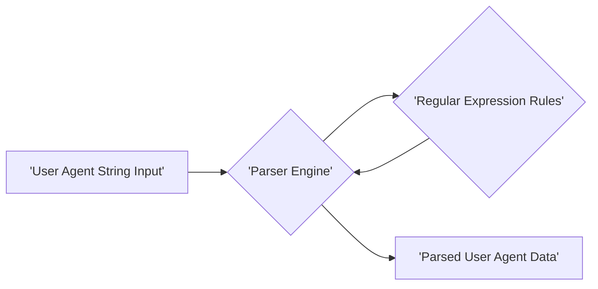
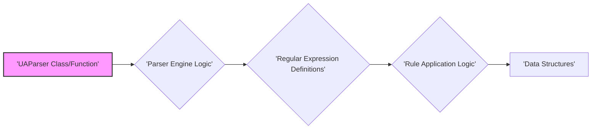
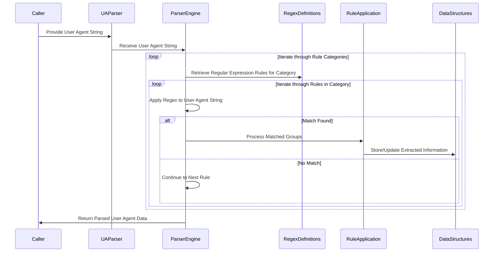

## Project Design Document: ua-parser-js (Improved)

**1. Introduction**

This document provides an enhanced design overview of the `ua-parser-js` project, a JavaScript library dedicated to parsing user agent strings. This detailed description is specifically crafted to facilitate comprehensive threat modeling. It elaborates on the architecture, internal components, data flow, and critical security considerations relevant for identifying potential vulnerabilities.

**2. Goals and Non-Goals**

* **Goals:**
    * To provide accurate and reliable parsing of user agent strings from diverse sources, including web browsers, mobile devices, bots, and other software agents.
    * To extract granular information from user agent strings, such as browser name, browser version, operating system name and version, device type and model, and rendering engine details.
    * To offer a performant and lightweight JavaScript library suitable for integration into both client-side (browser) and server-side (Node.js) JavaScript environments.
    * To maintain a robust and regularly updated repository of regular expressions and parsing rules to ensure compatibility with the ever-evolving landscape of user agent strings.
    * To expose a clear, well-documented, and easy-to-use API for developers to seamlessly integrate user agent parsing capabilities into their applications.

* **Non-Goals:**
    * The library does not handle the retrieval or acquisition of user agent strings. It operates solely on the provided string input.
    * The library does not provide real-time, on-demand updates to its parsing rules. Rule updates are managed through periodic library releases and version updates.
    * The library is not intended to provide advanced analytical features or reporting capabilities beyond the fundamental parsing and extraction of information from user agent strings.
    * The library does not handle user authentication, authorization, or any form of user identity management.
    * The library does not persist or store user agent data. Its function is purely to parse and return the extracted information.

**3. System Architecture**

The `ua-parser-js` library employs a rule-based architecture where the input user agent string is processed against a defined set of regular expression patterns to extract relevant information.

* **User Agent String Input:** This represents the raw user agent string passed to the library's parsing function. The origin of this string can vary depending on the deployment context (e.g., `navigator.userAgent` in browsers, HTTP request headers in Node.js).
* **Parser Engine:** This is the core processing unit of the library. It receives the input user agent string and orchestrates the application of the defined parsing rules. The engine iterates through the rules, attempting to match them against the input string.
* **Regular Expression Rules:** This component houses a collection of regular expressions and associated logic that define how to identify and extract specific pieces of information from the user agent string. These rules are typically structured in JSON or JavaScript files, often categorized by the type of information they target (e.g., browser, OS, device).
* **Parsed User Agent Data:** This is the structured output generated by the parsing process. It is typically a JavaScript object containing the extracted attributes, such as browser name, version, operating system details, device information, and rendering engine.

**4. Component Design (Detailed)**

The library's internal structure can be further detailed into the following components:

* **`UAParser` Class/Function:** This serves as the primary interface for interacting with the library. It provides methods like `parse()` to initiate the parsing process and potentially methods for configuring parsing options.
* **Parser Engine Logic:** This component implements the core algorithm for processing the user agent string. It involves:
    * **Tokenization (Implicit):** While not explicit tokenization, the engine effectively breaks down the string by attempting to match various regular expressions.
    * **Rule Iteration:**  The engine iterates through the ordered list of regular expression rules. The order of these rules can be significant for accurate parsing.
    * **Matching:**  Utilizes JavaScript's regular expression matching capabilities (`String.prototype.match()`, `RegExp.prototype.exec()`).
    * **Result Extraction:**  Extracts captured groups from successful regular expression matches.
* **Regular Expression Definitions:** These are the core parsing rules, typically organized into categories (browser, OS, device, engine). Each rule consists of:
    * **Regular Expression Pattern:** The actual regular expression used for matching.
    * **Replacement/Transformation Logic:**  Instructions on how to process the matched groups to extract the desired information (e.g., mapping group indices to specific attributes, applying transformations).
* **Rule Application Logic:** This component handles the logic for applying the results of regular expression matches. This includes:
    * **Conditional Logic:**  Rules might be applied conditionally based on previous matches or other criteria.
    * **Data Mapping:**  Mapping the extracted values from the regular expression matches to the corresponding fields in the output data structure.
    * **Value Normalization:**  Applying transformations or normalizations to the extracted values (e.g., converting version strings to a standard format).
* **Data Structures:** The library utilizes JavaScript objects and arrays to store:
    * **Parsing Rules:** The collection of regular expression definitions and their associated logic.
    * **Parsed Output:** The structured object containing the extracted user agent information.
* **Configuration Options (Optional):** The library might offer options to customize parsing behavior, such as:
    * **Providing a custom set of rules.**
    * **Specifying the order of rule application.**
    * **Enabling or disabling specific parsing features.**

**5. Data Flow (Detailed)**

The flow of data within the library can be described in more detail:

1. The `parse()` method of the `UAParser` is invoked with the raw user agent string as input.
2. The Parser Engine Logic receives the input string.
3. The Parser Engine iterates through the categorized Regular Expression Definitions (e.g., starting with browser rules).
4. For each regular expression rule, the engine attempts to match the pattern against the input user agent string using JavaScript's regex matching capabilities.
5. **If a match is found:**
    * The matched groups are extracted.
    * The Rule Application Logic for that specific rule is executed. This might involve:
        * Mapping the captured groups to specific output fields (e.g., the first captured group becomes the browser name).
        * Applying transformations or normalizations to the extracted values.
        * Potentially triggering further processing or applying subsequent rules based on the current match.
    * The extracted and processed information is stored in the internal Data Structures (the object representing the parsed user agent data).
6. **If no match is found for a particular rule:** The engine proceeds to the next rule in the sequence.
7. After iterating through all relevant rules, the Data Structures containing the parsed user agent information are returned as the output of the `parse()` method.

**6. Security Considerations (Pre-Threat Modeling - Enhanced)**

Building upon the initial considerations, here are more specific security concerns:

* **Regular Expression Denial of Service (ReDoS):**
    * **Threat:** Maliciously crafted user agent strings with repeating patterns can cause catastrophic backtracking in poorly written regular expressions, leading to CPU exhaustion and denial of service.
    * **Example:** A user agent string designed to maximize backtracking in a complex browser version parsing regex.
* **Input Validation Vulnerabilities:**
    * **Threat:**  The library might not adequately handle unexpected or malformed user agent strings, leading to errors, exceptions, or unexpected behavior that could be exploited.
    * **Example:**  User agent strings containing unusual characters, excessively long strings, or strings that violate expected formatting.
* **Data Integrity of Rules:**
    * **Threat:** If the regular expression rules are compromised (e.g., through a supply chain attack or malicious contribution), the library could produce incorrect or misleading parsing results, potentially impacting security decisions based on this data.
    * **Example:**  A modified rule that incorrectly identifies a malicious bot as a legitimate user.
* **Dependency Vulnerabilities:**
    * **Threat:**  Vulnerabilities in any external dependencies used by the library (even if minimal) could be exploited.
    * **Example:** A vulnerability in a build tool or testing framework dependency.
* **Logic Errors in Rule Application:**
    * **Threat:**  Flaws in the logic that applies the results of regular expression matches could lead to incorrect parsing or the omission of crucial information.
    * **Example:**  A bug in the code that maps captured groups to output fields, leading to incorrect browser version detection.
* **Information Disclosure (Contextual):**
    * **Threat:** While the library itself doesn't handle sensitive data, the parsed user agent information can contribute to browser fingerprinting. If this information is used without proper consideration, it could contribute to tracking or profiling users.
    * **Example:**  Using the detailed OS and browser version to uniquely identify users across sessions.
* **Client-Side Exposure (Browser Deployment):**
    * **Threat:** When deployed in a browser, the library's code, including the regular expression rules, is exposed to the client. This could allow attackers to analyze the rules and craft specific user agent strings to bypass detection or exploit vulnerabilities.
* **Server-Side Exploitation (Node.js Deployment):**
    * **Threat:** In a Node.js environment, if the user agent string is derived from untrusted sources (e.g., HTTP headers), vulnerabilities in the parsing logic could be exploited to cause server-side issues.

**7. Deployment Considerations (Detailed)**

The deployment environment significantly impacts the security considerations:

* **Browser Environment:**
    * **Exposure:** The entire library code, including parsing rules, is exposed to the client-side.
    * **Attack Vectors:**  Client-side attacks, manipulation of the library's behavior, analysis of regex rules for crafting bypasses.
    * **Mitigation:**  Code obfuscation (limited effectiveness), ensuring the library is served over HTTPS.
* **Node.js Environment:**
    * **Control:** More control over the execution environment.
    * **Attack Vectors:** Server-side vulnerabilities if parsing untrusted input, ReDoS attacks impacting server resources.
    * **Mitigation:**  Input sanitization before parsing, resource limits to mitigate ReDoS.

**8. Technologies Used**

* **JavaScript (ECMAScript):** The core programming language for the library's logic.
* **Regular Expressions:** The fundamental mechanism for pattern matching and information extraction.
* **npm (Node Package Manager):** Used for package distribution and dependency management.
* **JSON (JavaScript Object Notation):**  Likely used for storing and structuring the regular expression rules.

**9. Future Considerations**

* **Automated Rule Testing and Validation:** Implementing robust automated testing to ensure the accuracy and security of regular expression rules.
* **Performance Benchmarking and Optimization:** Continuously monitoring and optimizing the performance of the parsing engine to mitigate potential ReDoS vulnerabilities.
* **Rule Extensibility and Customization:** Providing a secure and well-defined mechanism for users to extend or customize the parsing rules.
* **Security Audits:** Periodic security audits by external experts to identify potential vulnerabilities.
* **Content Security Policy (CSP) Considerations:**  For browser deployments, ensuring the library is compatible with strict CSP directives.

This improved design document provides a more detailed and nuanced understanding of the `ua-parser-js` project, specifically tailored for effective threat modeling. It highlights potential attack surfaces and vulnerabilities based on the library's architecture, components, and data flow in different deployment contexts.