# BUSINESS POSTURE

This project, ua-parser-js, is a javascript library for parsing user agent strings. It is designed to be used by web applications and services to identify information about users' browsers, operating systems, devices, and browser engines from the user agent string sent in HTTP requests.

Business priorities and goals for using ua-parser-js in a web application or service:

- Enhance user experience: By accurately identifying user devices and browsers, applications can tailor content, optimize performance, and ensure compatibility across different platforms.
- Improve web analytics: User agent data is crucial for web analytics, providing insights into user demographics, technology adoption, and browsing behavior. This data helps businesses understand their audience and make data-driven decisions.
- Fraud detection and security: User agent information can be used as part of fraud detection mechanisms and security measures to identify suspicious or malicious activities.
- Content adaptation: Based on device and browser information, applications can adapt content delivery, such as serving different image sizes or video formats, to optimize performance and bandwidth usage.

Most important business risks that need to be addressed:

- Incorrect user agent parsing: Inaccurate parsing can lead to incorrect device detection, content delivery issues, and flawed analytics data, negatively impacting user experience and business decisions.
- Performance impact: Integrating and using the library should not introduce significant performance overhead to the application, especially in high-traffic scenarios.
- Security vulnerabilities in the library: Vulnerabilities in ua-parser-js could be exploited by attackers if not properly maintained and updated. This could lead to application compromise or data breaches if user agent parsing is used for security-sensitive operations.
- Privacy concerns: Handling user agent data needs to be compliant with privacy regulations (e.g., GDPR, CCPA). While user agent strings are generally considered less sensitive than other personal data, their use should be transparent and aligned with privacy policies.
- Dependency risk: Relying on an external library introduces a dependency. The project's maintenance, security updates, and licensing terms are external factors that the business needs to consider.

# SECURITY POSTURE

Existing security controls:

- security control: Software Composition Analysis (SCA) - Regularly scanning dependencies for known vulnerabilities using tools like npm audit or similar. This is implied as good practice for any JavaScript project.
- security control: Input validation - The library itself performs input validation on user agent strings to parse them correctly. This is inherent to the library's functionality.
- security control: Open Source Review - The project is open source, allowing for community review and scrutiny of the code, which can help identify potential security issues. This is inherent to the open-source nature of the project.

Accepted risks:

- accepted risk: Dependency vulnerabilities -  Accepting the risk of potential vulnerabilities in ua-parser-js and its dependencies, mitigated by regular updates and monitoring.
- accepted risk: Parsing errors - Accepting the risk of occasional parsing errors or inaccuracies due to the complexity and variability of user agent strings.

Recommended security controls:

- security control: Automated security testing - Implement automated security tests, including unit tests and integration tests, to verify the library's parsing logic and resilience against potentially malicious user agent strings.
- security control: Regular updates - Establish a process for regularly updating ua-parser-js to the latest version to incorporate security patches and bug fixes.
- security control: Security code review - Conduct periodic security code reviews of the integration of ua-parser-js into the application to ensure secure usage and prevent potential misuse.
- security control: Rate limiting - If user agent parsing is used in a way that could be abused (e.g., in public APIs), implement rate limiting to prevent denial-of-service attacks.
- security control: Monitoring and logging - Monitor the usage of ua-parser-js and log any errors or anomalies that could indicate security issues or parsing problems.

Security requirements:

- Authentication: Not directly applicable to ua-parser-js itself, as it's a library. Authentication is relevant for the applications that use ua-parser-js.
- Authorization: Not directly applicable to ua-parser-js itself. Authorization is relevant for the applications that use ua-parser-js and control access to features that rely on user agent data.
- Input validation: ua-parser-js must robustly handle various user agent string formats, including potentially malformed or malicious ones, without causing crashes or unexpected behavior. The library should perform input validation to ensure it processes user agent strings safely.
- Cryptography: Not directly applicable to ua-parser-js itself, as it does not handle sensitive data or require encryption. Cryptography might be relevant for the applications using ua-parser-js if they handle user agent data in a security-sensitive context (e.g., logging or analytics where data needs to be protected).

# DESIGN

## C4 CONTEXT

```mermaid
flowchart LR
    subgraph "Web Application Context"
    center "Web Application"
    end

    user["User"]
    analytics["Analytics System"]
    security["Security Monitoring System"]

    user -->> center: HTTP Request (User Agent)
    center -->> analytics: User Agent Data
    center -->> security: User Agent Data

    style center fill:#f9f,stroke:#333,stroke-width:2px
```

Context Diagram Elements:

- Element:
    - Name: User
    - Type: Person
    - Description: End-user accessing the web application through a web browser or other user agent.
    - Responsibilities: Accessing the web application, generating HTTP requests with user agent strings.
    - Security controls: Browser security controls, user device security controls, user authentication (handled by Web Application).

- Element:
    - Name: Web Application
    - Type: Software System
    - Description: The web application that utilizes ua-parser-js to parse user agent strings from incoming HTTP requests.
    - Responsibilities: Receiving HTTP requests, parsing user agent strings using ua-parser-js, using parsed data for analytics, content adaptation, and security monitoring, responding to user requests.
    - Security controls: Web Application Firewall (WAF), Input validation (using ua-parser-js), Output encoding, Session management, Access control, Security logging and monitoring.

- Element:
    - Name: Analytics System
    - Type: Software System
    - Description: An external system that collects and analyzes user agent data (among other data) from the Web Application for business intelligence and reporting.
    - Responsibilities: Receiving and storing user agent data, generating reports and dashboards based on analytics data.
    - Security controls: Access control, Data encryption at rest and in transit, Audit logging.

- Element:
    - Name: Security Monitoring System
    - Type: Software System
    - Description: An external system that monitors the Web Application for security threats and anomalies, potentially using user agent data for threat detection.
    - Responsibilities: Receiving security logs and data, analyzing data for security threats, alerting security teams.
    - Security controls: Access control, Security Information and Event Management (SIEM), Intrusion Detection/Prevention System (IDS/IPS).

## C4 CONTAINER

```mermaid
flowchart LR
    subgraph "Web Application Container"
    webapp["Web Application Server"]
    uaparser["ua-parser-js Library"]
    end

    webapp -->> uaparser: Parse User Agent String

    style webapp fill:#f9f,stroke:#333,stroke-width:2px
    style uaparser fill:#ccf,stroke:#333,stroke-width:2px
```

Container Diagram Elements:

- Element:
    - Name: Web Application Server
    - Type: Container - Web Server
    - Description: The server-side component of the web application, responsible for handling HTTP requests, processing business logic, and rendering web pages. This container includes the application code that utilizes the ua-parser-js library.
    - Responsibilities: Receiving HTTP requests, routing requests, executing application logic, using ua-parser-js to parse user agent strings, generating responses.
    - Security controls: Web Application Firewall (WAF) in front of the server, Input validation (including ua-parser-js), Output encoding, Session management, Access control, Security logging and monitoring, Operating system and web server hardening.

- Element:
    - Name: ua-parser-js Library
    - Type: Container - JavaScript Library
    - Description: The ua-parser-js library integrated into the Web Application Server. It is responsible for parsing user agent strings.
    - Responsibilities: Parsing user agent strings provided by the Web Application Server, returning structured data about browser, OS, device, and engine.
    - Security controls: Software Composition Analysis (SCA) during build and deployment, Input validation within the library itself, Regular updates to the library.

## DEPLOYMENT

Deployment Architecture: Cloud-based Deployment (e.g., AWS, Azure, GCP)

```mermaid
flowchart LR
    subgraph "Cloud Environment"
        subgraph "Load Balancer"
            lb["Load Balancer"]
        end
        subgraph "Web Application Servers"
            webapp1["Web Application Server Instance 1"]
            webapp2["Web Application Server Instance 2"]
        end
        subgraph "Analytics Infrastructure"
            analyticsdb["Analytics Database"]
        end
        subgraph "Security Monitoring Infrastructure"
            siem["SIEM System"]
        end
    end

    user["User"] -->> lb: HTTP Request
    lb -->> webapp1: HTTP Request
    lb -->> webapp2: HTTP Request
    webapp1 -->> analyticsdb: User Agent Data
    webapp2 -->> analyticsdb: User Agent Data
    webapp1 -->> siem: Security Logs
    webapp2 -->> siem: Security Logs

    style lb fill:#eef,stroke:#333,stroke-width:2px
    style webapp1 fill:#f9f,stroke:#333,stroke-width:2px
    style webapp2 fill:#f9f,stroke:#333,stroke-width:2px
    style analyticsdb fill:#efe,stroke:#333,stroke-width:2px
    style siem fill:#fee,stroke:#333,stroke-width:2px
```

Deployment Diagram Elements:

- Element:
    - Name: Load Balancer
    - Type: Infrastructure - Load Balancer
    - Description: Distributes incoming HTTP requests across multiple Web Application Server instances for scalability and high availability.
    - Responsibilities: Load balancing, SSL termination, traffic routing, health checks.
    - Security controls: DDoS protection, SSL/TLS encryption, Access control lists (ACLs), Web Application Firewall (WAF) integration.

- Element:
    - Name: Web Application Server Instance 1 & 2
    - Type: Infrastructure - Virtual Machine/Container Instance
    - Description: Instances of the Web Application Server running the application code and ua-parser-js library.
    - Responsibilities: Hosting and running the web application, processing requests, parsing user agents, interacting with other systems.
    - Security controls: Operating system hardening, Security patching, Instance-level firewalls, Intrusion Detection System (IDS) on host, Security monitoring agents, Container security (if containerized).

- Element:
    - Name: Analytics Database
    - Type: Infrastructure - Database
    - Description: Database system used to store and manage analytics data, including user agent information.
    - Responsibilities: Storing analytics data, providing data access for analytics queries and reporting.
    - Security controls: Database access control, Data encryption at rest and in transit, Database activity monitoring, Regular backups, Vulnerability scanning.

- Element:
    - Name: SIEM System
    - Type: Infrastructure - Security Monitoring System
    - Description: Security Information and Event Management system used to collect, analyze, and correlate security logs from the Web Application Servers and other infrastructure components.
    - Responsibilities: Security log aggregation, threat detection, security alerting, incident response support.
    - Security controls: Access control, Data encryption at rest and in transit, Security event correlation rules, Alerting and notification mechanisms.

## BUILD

```mermaid
flowchart LR
    developer["Developer"] --> sourcecode["Source Code Repository (GitHub)"]
    sourcecode --> buildserver["Build Server (CI/CD)"]
    buildserver --> tests["Automated Tests (Unit, Integration, Security)"]
    tests -- Yes --> artifacts["Build Artifacts (npm package)"]
    tests -- No --> buildserver
    artifacts --> registry["Package Registry (npm registry)"]
    registry --> deployment["Deployment Pipeline"]

    style sourcecode fill:#eef,stroke:#333,stroke-width:2px
    style buildserver fill:#f9f,stroke:#333,stroke-width:2px
    style tests fill:#efe,stroke:#333,stroke-width:2px
    style artifacts fill:#ccf,stroke:#333,stroke-width:2px
    style registry fill:#fee,stroke:#333,stroke-width:2px
    style deployment fill:#eef,stroke:#333,stroke-width:2px
```



Build Process Description:

1. Developer commits code changes to the Source Code Repository (GitHub).
2. Build Server (CI/CD system like GitHub Actions, Jenkins, etc.) automatically triggers a build upon code changes.
3. Build Server performs the following steps:
    - Fetches source code from the repository.
    - Installs dependencies (npm install).
    - Runs automated tests, including unit tests, integration tests, and security tests (e.g., linting, SAST, dependency scanning - npm audit).
4. If all tests pass, the Build Server proceeds to create Build Artifacts, which in this case is an npm package.
5. Build Artifacts are published to a Package Registry (npm registry).
6. Deployment Pipeline then retrieves the package from the registry for deployment to various environments.

Security Controls in Build Process:

- security control: Secure Source Code Repository - Using GitHub with access controls, branch protection, and audit logging.
- security control: Automated Build Process - Using a CI/CD system to automate builds, reducing manual errors and ensuring consistency.
- security control: Automated Tests - Implementing unit, integration, and security tests to catch bugs and vulnerabilities early in the development lifecycle.
- security control: Static Application Security Testing (SAST) - Integrating SAST tools to scan the code for potential security vulnerabilities during the build process.
- security control: Dependency Scanning (SCA) - Using npm audit or similar tools to scan dependencies for known vulnerabilities.
- security control: Code Linting - Using linters to enforce code quality and coding standards, reducing potential security issues arising from coding errors.
- security control: Build Artifact Signing - Signing build artifacts to ensure integrity and authenticity.
- security control: Access Control to Build System - Restricting access to the build server and CI/CD pipelines to authorized personnel.
- security control: Audit Logging of Build Process - Logging all build activities for auditing and security monitoring.

# RISK ASSESSMENT

Critical business processes we are trying to protect:

- User experience and content delivery: Ensuring accurate device detection for optimal content delivery and user experience.
- Web analytics accuracy: Maintaining the integrity and accuracy of web analytics data derived from user agent information.
- Application availability and performance: Preventing performance degradation or denial of service due to inefficient or vulnerable user agent parsing.

Data we are trying to protect and their sensitivity:

- User agent strings: User agent strings themselves are considered semi-public data, readily available in HTTP requests. However, aggregated and analyzed user agent data can reveal trends and patterns about user behavior and technology adoption.
    - Sensitivity: Low to Medium. User agent strings are not directly PII (Personally Identifiable Information), but when combined with other data, they can contribute to user profiling.
- Analytics data derived from user agent strings: Aggregated and processed user agent data used for analytics.
    - Sensitivity: Medium. This data is used for business intelligence and decision-making. Confidentiality and integrity are important for accurate business insights.

# QUESTIONS & ASSUMPTIONS

Questions:

- What is the specific context in which ua-parser-js will be used? (e.g., public-facing website, internal application, API). This will help refine the threat model and security requirements.
- What are the specific performance requirements for user agent parsing? (e.g., latency, throughput). This will influence design choices and performance optimizations.
- What are the data retention policies for user agent data and derived analytics data? This is important for privacy compliance.
- Are there any specific regulatory compliance requirements related to user data processing (e.g., GDPR, CCPA)? This will impact security and privacy controls.

Assumptions:

- BUSINESS POSTURE:
    - ua-parser-js is used to enhance user experience, improve web analytics, and potentially for basic security monitoring in a typical web application.
    - The business prioritizes both user experience and data-driven decision-making based on web analytics.
    - The business has a moderate risk appetite, balancing innovation with security and privacy considerations.

- SECURITY POSTURE:
    - The application development follows secure software development lifecycle (SSDLC) principles.
    - Basic security controls like dependency scanning and input validation are already in place or planned.
    - The organization is concerned about dependency vulnerabilities and aims to maintain a reasonable security posture.

- DESIGN:
    - ua-parser-js is integrated into the backend web application server.
    - The application is deployed in a cloud environment for scalability and resilience.
    - A standard CI/CD pipeline is used for building and deploying the application and its dependencies.
    - User agent data is primarily used for analytics and potentially for basic security logging, not for critical security decisions like authentication or authorization.