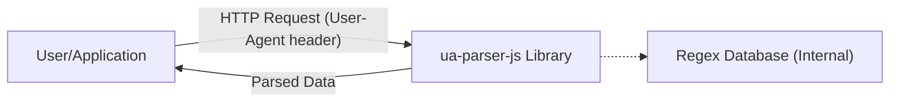
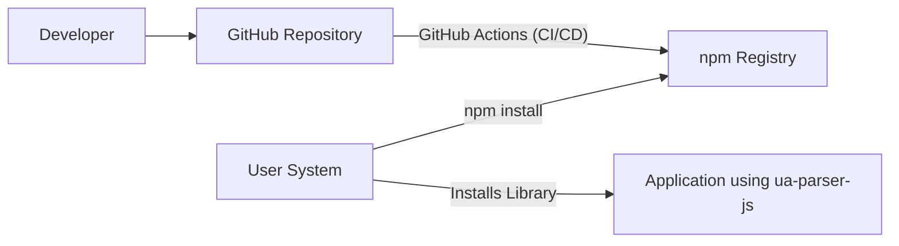
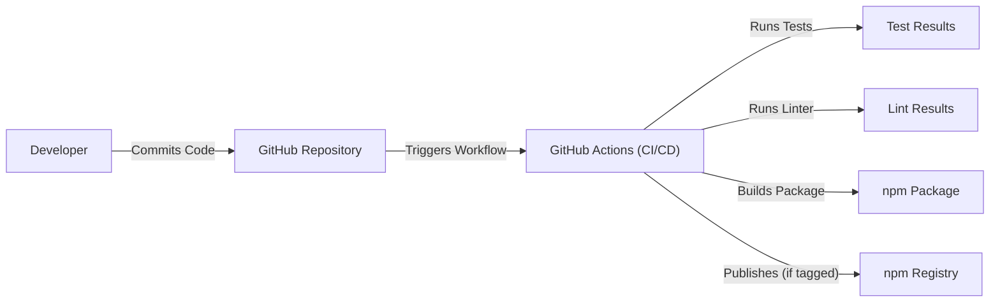

# BUSINESS POSTURE

Business Priorities and Goals:

The primary goal of the ua-parser-js project is to provide a reliable and accurate JavaScript library for parsing User-Agent strings and extracting information about the browser, engine, OS, CPU, and device. This enables developers to tailor user experiences, gather analytics, and perform compatibility checks. The project prioritizes accuracy, performance, and ease of use. It's a widely used library, suggesting a need for stability and backward compatibility.

Business Risks:

- Inaccurate parsing: Incorrectly identifying the user's browser, OS, or device can lead to misconfigured user experiences, broken functionality, and flawed analytics data. This is the primary business risk.
- Performance bottlenecks: Slow parsing can negatively impact the performance of applications that use the library, especially those that process large numbers of User-Agent strings.
- Security vulnerabilities: While User-Agent parsing itself isn't inherently a high-security risk, vulnerabilities in the library (e.g., ReDoS - Regular expression Denial of Service) could be exploited to cause denial-of-service attacks on applications using it.
- Maintenance overhead: As browsers and devices evolve, the library needs constant updates to maintain accuracy. Failure to keep up with these changes will lead to the "Inaccurate parsing" risk above.
- Lack of adoption/community support: If the library is difficult to use or lacks community support, developers may choose alternative solutions, diminishing the project's value.

# SECURITY POSTURE

Existing Security Controls:

- security control: Regular expression best practices: The library's core functionality relies on regular expressions. The project description doesn't explicitly state adherence to secure regular expression practices (e.g., avoiding catastrophic backtracking), but it's implicitly necessary for preventing ReDoS vulnerabilities. Implemented in source code.
- security control: Unit tests: The project includes a comprehensive suite of unit tests to ensure the accuracy of the parsing logic and to catch regressions. Implemented in test suite.
- security control: Continuous integration (GitHub Actions): The project uses GitHub Actions for automated testing and linting on every push and pull request. This helps maintain code quality and prevent the introduction of new bugs. Implemented in GitHub Actions configuration.
- security control: Dependency management: The project uses a package manager (npm) to manage its dependencies. This allows for tracking and updating dependencies, reducing the risk of using vulnerable libraries. Implemented in package.json.
- security control: Code linting: The project uses a linter (likely ESLint, based on common practice) to enforce code style and identify potential issues. Implemented in linter configuration and GitHub Actions.

Accepted Risks:

- accepted risk: Limited input sanitization: The library primarily operates on User-Agent strings, which are inherently untrusted input. While the library itself may not perform extensive input sanitization, it's assumed that applications using the library will handle input validation appropriately.
- accepted risk: Reliance on regular expressions: The core functionality depends on regular expressions, which can be a source of vulnerabilities if not crafted carefully. The project accepts the risk of potential ReDoS vulnerabilities, mitigating it through careful regular expression design and testing.

Recommended Security Controls:

- security control: Regular expression fuzzing: Implement fuzz testing specifically targeting the regular expressions used in the library. This can help identify potential ReDoS vulnerabilities that might be missed by unit tests.
- security control: Security-focused static analysis: Integrate a static analysis tool that specifically focuses on security vulnerabilities (e.g., Snyk, Semgrep) into the CI pipeline.
- security control: Dependency vulnerability scanning: Integrate a tool like Dependabot or Snyk to automatically scan for known vulnerabilities in dependencies and generate pull requests for updates.

Security Requirements:

- Authentication: Not applicable. This library does not handle authentication.
- Authorization: Not applicable. This library does not handle authorization.
- Input Validation: The library should handle potentially malformed or excessively long User-Agent strings gracefully, without crashing or causing excessive resource consumption. While full sanitization isn't the library's responsibility, basic checks for length and obviously invalid characters could be considered.
- Cryptography: Not applicable. This library does not handle cryptographic operations.

# DESIGN

## C4 CONTEXT

Element Descriptions:

- Element:
    - Name: User/Application
    - Type: External entity (user or application)
    - Description: Represents a user's web browser or an application that utilizes the ua-parser-js library.
    - Responsibilities: Sends HTTP requests with User-Agent headers; consumes the parsed data provided by the library.
    - Security controls: Input validation (at the application level, not within the library itself).
- Element:
    - Name: ua-parser-js Library
    - Type: Software System
    - Description: The core library that parses User-Agent strings.
    - Responsibilities: Parses User-Agent strings; extracts browser, engine, OS, CPU, and device information; provides an API for accessing the parsed data.
    - Security controls: Regular expression best practices, unit tests, continuous integration, dependency management, code linting.
- Element:
    - Name: Regex Database (Internal)
    - Type: Data Store
    - Description: An internal collection of regular expressions used for parsing. This is not an external database but rather a set of regular expressions embedded within the library's code.
    - Responsibilities: Stores the regular expressions used for matching User-Agent strings.
    - Security controls: Regular expression fuzzing (recommended), security-focused static analysis (recommended).

## C4 CONTAINER

Since this is a simple library, the container diagram is essentially the same as the context diagram. The library itself is the single "container."

Element Descriptions:

- Element:
    - Name: User/Application
    - Type: External entity (user or application)
    - Description: Represents a user's web browser or an application that utilizes the ua-parser-js library.
    - Responsibilities: Sends HTTP requests with User-Agent headers; consumes the parsed data provided by the library.
    - Security controls: Input validation (at the application level, not within the library itself).
- Element:
    - Name: ua-parser-js Library
    - Type: Container (JavaScript Library)
    - Description: The core library that parses User-Agent strings.
    - Responsibilities: Parses User-Agent strings; extracts browser, engine, OS, CPU, and device information; provides an API for accessing the parsed data.
    - Security controls: Regular expression best practices, unit tests, continuous integration, dependency management, code linting.
- Element:
    - Name: Regex Database (Internal)
    - Type: Data Store
    - Description: An internal collection of regular expressions used for parsing. This is not an external database but rather a set of regular expressions embedded within the library's code.
    - Responsibilities: Stores the regular expressions used for matching User-Agent strings.
    - Security controls: Regular expression fuzzing (recommended), security-focused static analysis (recommended).

## DEPLOYMENT

Deployment Solutions:

- npm package: The primary deployment method is as an npm package. Developers install the library using `npm install ua-parser-js`.
- CDN: The library is also available via CDNs like jsDelivr and unpkg, allowing developers to include it directly in web pages without needing to install it locally.
- Bundled with applications: Developers can bundle the library directly into their applications using tools like Webpack or Browserify.

Chosen Deployment Solution (npm package):

Element Descriptions:

- Element:
    - Name: Developer
    - Type: Person
    - Description: The developer(s) of the ua-parser-js library.
    - Responsibilities: Writes code, manages the repository, publishes releases.
    - Security controls: Code reviews, secure coding practices.
- Element:
    - Name: GitHub Repository
    - Type: Code Repository
    - Description: The source code repository hosted on GitHub.
    - Responsibilities: Stores the source code, manages versions, tracks issues.
    - Security controls: Access controls, branch protection rules.
- Element:
    - Name: GitHub Actions (CI/CD)
    - Type: CI/CD Pipeline
    - Description: Automated workflows for building, testing, and publishing the library.
    - Responsibilities: Runs tests, lints code, publishes the package to npm.
    - Security controls: Secure configuration, dependency vulnerability scanning (recommended).
- Element:
    - Name: npm Registry
    - Type: Package Registry
    - Description: The public npm registry where the library is published.
    - Responsibilities: Stores and distributes the published package.
    - Security controls: Registry security measures (e.g., two-factor authentication for publishing).
- Element:
    - Name: User System
    - Type: Developer's machine/Build server
    - Description: System where developer is installing ua-parser-js library.
    - Responsibilities: Download and install library.
    - Security controls: Verify downloaded package integrity.
- Element:
    - Name: Application using ua-parser-js
    - Type: Application
    - Description: Application that is using ua-parser-js library.
    - Responsibilities: Use library to parse User-Agent.
    - Security controls: Input validation.

## BUILD

Build Process Description:

1.  Developers commit code to the GitHub repository.
2.  GitHub Actions triggers a workflow on push and pull request events.
3.  The workflow performs the following steps:
    -   Checks out the code.
    -   Sets up the Node.js environment.
    -   Installs dependencies using npm.
    -   Runs the unit tests.
    -   Runs the linter.
    -   If the commit is tagged (indicating a release), builds the npm package and publishes it to the npm registry.

Security Controls in Build Process:

- security control: Automated testing: Unit tests are run automatically on every build to ensure code quality and prevent regressions.
- security control: Code linting: A linter is used to enforce code style and identify potential issues.
- security control: Dependency management: npm is used to manage dependencies, allowing for tracking and updating.
- security control: Continuous integration: GitHub Actions provides a consistent and automated build environment.
- security control: (Recommended) Dependency vulnerability scanning: Integrate a tool like Dependabot or Snyk to automatically scan for vulnerabilities in dependencies.
- security control: (Recommended) Security-focused static analysis: Integrate a static analysis tool that specifically focuses on security vulnerabilities.

# RISK ASSESSMENT

Critical Business Processes:

-   Accurate User-Agent parsing: This is the core function of the library and is critical for applications that rely on it for functionality, analytics, or user experience customization.
-   Maintaining library stability and compatibility: Given its widespread use, ensuring the library remains stable and backward-compatible is crucial.

Data Sensitivity:

-   User-Agent strings: While not typically considered highly sensitive data, User-Agent strings can reveal information about the user's browser, operating system, and device. In some cases, this information could be combined with other data to potentially identify or track users.  The sensitivity is generally low, but it's not entirely zero.

# QUESTIONS & ASSUMPTIONS

Questions:

-   Are there any specific compliance requirements (e.g., GDPR, CCPA) that the library needs to consider, even indirectly?  While the library itself doesn't handle personal data directly, its usage within applications might have implications.
-   What is the expected volume of User-Agent strings that the library will need to process in typical use cases? This can help assess performance requirements and potential bottlenecks.
-   Are there any plans to expand the library's functionality beyond User-Agent parsing?
-   What is the process for handling security vulnerabilities reported by external researchers?

Assumptions:

-   BUSINESS POSTURE: The project prioritizes accuracy and performance over extensive security features. The library is intended to be a lightweight and efficient tool.
-   SECURITY POSTURE: Developers using the library are responsible for handling input validation and other security considerations within their own applications. The library itself focuses on securely parsing the provided User-Agent string.
-   DESIGN: The library's internal design is relatively simple, with the core logic centered around regular expressions. The deployment process relies on standard npm packaging and CDN availability. The build process is automated using GitHub Actions.