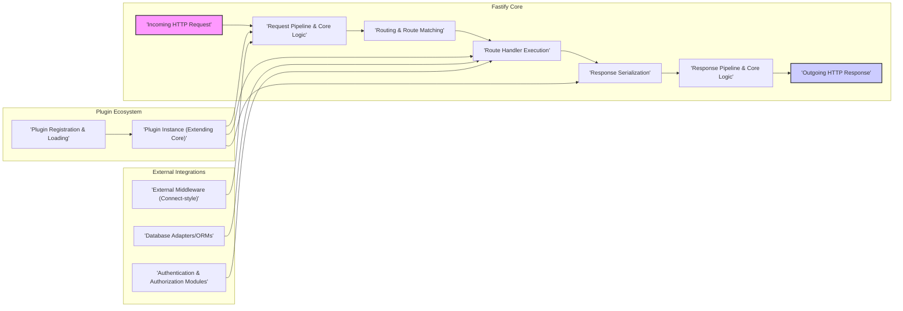

# Project Design Document: Fastify Web Framework

**Version:** 1.1
**Date:** October 26, 2023
**Author:** Gemini (AI Language Model)

## 1. Introduction

This document provides an enhanced design overview of the Fastify web framework, an open-source project located at [https://github.com/fastify/fastify](https://github.com/fastify/fastify). Building upon the previous version, this document aims for greater clarity and detail regarding Fastify's architecture, components, and data flow. The primary purpose remains to serve as a robust foundation for subsequent threat modeling exercises, enabling a deeper understanding of the system's internal mechanisms and external interactions from a security perspective.

## 2. Goals and Objectives

Fastify's core objectives are centered around delivering:

*   **Exceptional Performance:** Achieving minimal overhead and maximum throughput in handling HTTP requests, making it suitable for performance-critical applications.
*   **Superior Developer Experience:** Offering an intuitive and efficient API, complemented by a rich and versatile plugin ecosystem to streamline development.
*   **Robust Extensibility:** Empowering developers to seamlessly extend and customize the framework's capabilities through well-defined extension points.
*   **Unwavering Stability and Reliability:** Providing a dependable and stable platform for building production-ready web applications and APIs.

This design document meticulously outlines the architectural elements and design choices that contribute to the realization of these key objectives.

## 3. High-Level Architecture

Fastify employs a highly modular, plugin-based architecture built upon the foundation of Node.js. It leverages the core `http` module for low-level networking and prioritizes efficient request processing and routing.

**Key Architectural Concepts:**

*   **Core Framework:** The fundamental layer responsible for managing the request lifecycle, routing logic, and response generation. It provides the essential building blocks for web application development.
*   **Plugin System:** A central and powerful mechanism for extending Fastify's core functionality. Plugins are reusable modules that can add new features, modify existing behavior, or integrate with external services.
*   **Request/Response Pipelines:** Well-defined sequences of operations that govern the processing of incoming requests and the construction of outgoing responses. These pipelines include hooks for intercepting and modifying the flow.
*   **Optimized Router:**  Fastify utilizes a highly performant trie-based router for efficiently mapping incoming request paths and HTTP methods to their corresponding handler functions.
*   **Serialization Management:**  The process of converting internal data structures into formats suitable for HTTP responses (primarily JSON). Fastify offers optimized JSON serialization and allows for custom serializers.

## 4. Component Design

This section provides a more detailed breakdown of the key components within the Fastify framework and their respective roles.

### 4.1. Core Components

*   **Server Instance:** The primary object responsible for listening for incoming network connections and orchestrating the entire request lifecycle. It leverages Node.js's built-in `http` or `https` modules.
*   **Request Object (`FastifyRequest`):** An enhanced abstraction over Node.js's `IncomingMessage`. It provides convenient access to request data such as headers, parameters (path, query), and the request body. It also includes Fastify-specific functionalities.
*   **Reply Object (`FastifyReply`):** An abstraction over Node.js's `ServerResponse`, offering a fluent API for constructing and sending HTTP responses. It includes methods for setting status codes, headers, and sending payloads.
*   **Router (Radix Tree):** The core routing engine that efficiently matches incoming request paths and methods to registered route handlers. Its trie-based implementation ensures high performance even with a large number of routes.
*   **Route Handler Functions:** User-defined asynchronous functions that contain the application's business logic for processing specific requests. They receive the `FastifyRequest` and `FastifyReply` objects as arguments.
*   **Plugin System & Encapsulation:** A sophisticated system for registering and managing plugins. Fastify utilizes encapsulation to create isolated scopes for plugins, preventing naming conflicts and ensuring modularity. Plugins can extend core functionality, add routes, or register hooks.
*   **Hook System (Lifecycle Hooks):**  Provides developers with the ability to tap into various stages of the request lifecycle. Key hooks include:
    *   `onRequest`: Executed at the very beginning of the request lifecycle.
    *   `preParsing`: Executed before the request body is parsed.
    *   `preValidation`: Executed before schema validation.
    *   `preHandler`: Executed before the route handler. Crucial for authentication and authorization.
    *   `preSerialization`: Executed before the response is serialized.
    *   `onSend`: Executed after the route handler but before the response is sent to the client. Allows modification of the payload or headers.
    *   `onResponse`: Executed after the response has been sent to the client.
    *   `onError`: Executed when an error occurs during the request lifecycle.
*   **Schema Validation (JSON Schema):** An optional but highly recommended feature for enforcing data integrity. Fastify integrates with JSON Schema to validate request bodies, query parameters, and response payloads, ensuring data conforms to predefined structures.
*   **Serialization & Content Negotiation:**  Manages the conversion of data into response formats. Fastify provides optimized JSON serialization using `fast-json-stringify` and supports custom serializers for other content types. It also handles content negotiation based on the `Accept` header.
*   **Logging (Pino):**  Provides a built-in, highly performant logging mechanism powered by Pino. It offers configurable log levels and output formats, essential for monitoring and debugging.
*   **Error Handling:**  Provides a structured way to manage errors that occur during request processing. Fastify includes a default error handler and allows developers to define custom error handling logic for specific error types or routes.

### 4.2. Plugin System Components

*   **Plugin Registration Function:** A function exported by a plugin module that encapsulates the plugin's logic. It receives the Fastify server instance and plugin-specific options as arguments.
*   **Plugin Scope and Encapsulation Context:**  Plugins are registered within specific scopes, which determine their access to the Fastify instance and other plugins. Encapsulation ensures that plugins operate in isolated contexts, preventing unintended side effects.
*   **Plugin Metadata:**  Information associated with a plugin, such as its name, version, and dependencies.

### 4.3. Ecosystem Components (External)

*   **Connect-style Middleware:**  Functions that conform to the traditional Connect/Express middleware signature. Fastify provides compatibility for integrating with existing middleware.
*   **Database Connectors and ORMs:** Libraries used to interact with various database systems (e.g., `pg` for PostgreSQL, `mongoose` for MongoDB).
*   **Authentication and Authorization Libraries:** Modules for implementing user authentication and authorization mechanisms (e.g., Passport.js, Auth0 SDKs).
*   **External API Clients:** Libraries for making requests to other APIs and services.

## 5. Data Flow

The following diagram provides a more detailed illustration of the typical flow of an HTTP request through a Fastify application, highlighting the key stages and hooks involved.

```mermaid
graph LR
    A["'Incoming HTTP Request'"]
    B["'Node.js Connection Handling'"]
    C["'Fastify Server Instance Receives Request'"]
    D["'onRequest Hooks'"]
    E["'Request Parsing (Headers, URL)'"]
    F["'preParsing Hooks'"]
    G["'Body Parsing (Based on Content-Type)'"]
    H["'preValidation Hooks'"]
    I["'Schema Validation (if configured)'"]
    J["'preHandler Hooks (Authentication, Authorization)'"]
    K["'Routing & Route Matching'"]
    L["'Route Handler Function Execution'"]
    M["'preSerialization Hooks'"]
    N["'Response Serialization'"]
    O["'onSend Hooks (Modify Payload/Headers)'"]
    P["'Response Sending'"]
    Q["'onResponse Hooks'"]
    R["'Outgoing HTTP Response'"]
    S["'onError Hooks (if error occurs)'"]

    A --> B --> C --> D --> E --> F --> G --> H --> I --> J --> K --> L
    L --> M --> N --> O --> P --> Q --> R
    I -- Error --> S --> P
    G -- Error --> S --> P
    F -- Error --> S --> P
    E -- Error --> S --> P
    D -- Error --> S --> P
    C -- Error --> S --> P
    B -- Error --> S --> P
    A -- Error --> S --> P
```

**Detailed Data Flow Description:**

1. **Incoming HTTP Request:** A client initiates an HTTP request to the server.
2. **Node.js Connection Handling:** The underlying Node.js `http` or `https` module handles the initial network connection.
3. **Fastify Server Instance Receives Request:** The request is passed to the registered Fastify server instance.
4. **`onRequest` Hooks:** Registered `onRequest` hooks are executed. These hooks run earliest in the lifecycle and can be used for tasks like logging or request tracking.
5. **Request Parsing:** Fastify parses the request headers and URL to extract relevant information.
6. **`preParsing` Hooks:** Registered `preParsing` hooks are executed. These hooks can be used to modify the raw request data before body parsing.
7. **Body Parsing:** If the request includes a body (e.g., POST, PUT), Fastify parses it based on the `Content-Type` header (e.g., JSON, URL-encoded, multipart/form-data).
8. **`preValidation` Hooks:** Registered `preValidation` hooks are executed before schema validation.
9. **Schema Validation:** If schema validation is configured for the route, the request body and parameters are validated against the defined JSON schema. If validation fails, an error is typically thrown, triggering the `onError` hook.
10. **`preHandler` Hooks:** Registered `preHandler` hooks are executed. These are commonly used for authentication and authorization checks, ensuring the user has the necessary permissions to access the requested resource.
11. **Routing & Route Matching:** The Fastify router efficiently matches the request path and HTTP method to the appropriate registered route handler.
12. **Route Handler Function Execution:** The corresponding route handler function is executed. This function contains the core business logic for processing the request and generating a response.
13. **`preSerialization` Hooks:** Registered `preSerialization` hooks are executed before the response payload is serialized. These hooks can be used to modify the data before serialization.
14. **Response Serialization:** The response payload is serialized into the appropriate format (typically JSON) using the configured serializer.
15. **`onSend` Hooks:** Registered `onSend` hooks are executed before the response is sent to the client. These hooks can modify the response payload or headers.
16. **Response Sending:** The serialized response, along with headers and status code, is sent back to the client.
17. **`onResponse` Hooks:** Registered `onResponse` hooks are executed after the response has been fully sent to the client.
18. **Outgoing HTTP Response:** The client receives the complete HTTP response.
19. **`onError` Hooks:** If an error occurs at any point during the request lifecycle, the registered `onError` hooks are executed. These hooks allow for centralized error handling and logging.

## 6. Security Considerations (For Threat Modeling)

This section expands on potential security vulnerabilities and threats relevant to Fastify applications, providing more specific examples for threat modeling.

*   **Input Validation Vulnerabilities:**
    *   **Cross-Site Scripting (XSS):** Failure to sanitize user-provided input in request parameters, headers, or body can allow attackers to inject malicious scripts into web pages viewed by other users.
    *   **SQL Injection:** If user input is directly incorporated into database queries without proper sanitization or parameterized queries, attackers can manipulate the queries to gain unauthorized access to or modify database data.
    *   **Command Injection:** If user input is used to construct system commands without proper sanitization, attackers can execute arbitrary commands on the server.
    *   **Path Traversal:** Insufficient validation of file paths provided by users can allow attackers to access files and directories outside of the intended scope.
    *   **Header Injection:**  Manipulating HTTP headers can lead to vulnerabilities like HTTP response splitting or cache poisoning.
*   **Authentication and Authorization Weaknesses:**
    *   **Broken Authentication:** Weak password policies, lack of multi-factor authentication, or vulnerabilities in authentication logic can allow unauthorized access.
    *   **Broken Authorization:** Insufficient checks to ensure users only access resources they are permitted to, leading to privilege escalation.
    *   **Session Management Issues:** Vulnerabilities like session fixation, session hijacking, or insecure session storage can compromise user sessions.
    *   **Insecure Direct Object References (IDOR):** Exposing internal object IDs without proper authorization checks can allow users to access or modify resources belonging to others.
*   **Serialization/Deserialization Flaws:**
    *   **Remote Code Execution (RCE):** Deserializing untrusted data can lead to the execution of arbitrary code on the server if vulnerable deserialization libraries or custom logic are used.
    *   **Information Disclosure:** Insecure deserialization can expose sensitive information contained within serialized objects.
*   **Plugin Security Risks:**
    *   **Vulnerable Dependencies:** Third-party plugins may have their own dependencies with known vulnerabilities, which can be exploited.
    *   **Malicious Plugins:**  Compromised or intentionally malicious plugins can introduce backdoors or other security risks.
    *   **Lack of Isolation:** Insufficient isolation between plugins can allow a vulnerability in one plugin to affect others.
*   **Dependency Management Issues:**
    *   **Use of Outdated Libraries:**  Failing to update dependencies can leave the application vulnerable to known security flaws in those libraries.
    *   **Supply Chain Attacks:**  Attackers can compromise dependencies to inject malicious code into the application.
*   **Error Handling and Information Disclosure:**
    *   **Verbose Error Messages:**  Displaying detailed error messages to users can reveal sensitive information about the application's internal workings, aiding attackers.
    *   **Stack Traces in Responses:**  Including stack traces in error responses can expose code paths and potential vulnerabilities.
*   **Logging Security Concerns:**
    *   **Logging Sensitive Data:**  Accidentally logging sensitive information like passwords, API keys, or personal data can lead to data breaches.
    *   **Insufficient Logging:**  Lack of adequate logging can hinder incident response and forensic analysis.
    *   **Log Injection:**  Attackers can inject malicious data into logs, potentially leading to command execution or log manipulation.
*   **HTTP Header Security Misconfigurations:**
    *   **Missing Security Headers:**  Lack of headers like `Content-Security-Policy`, `Strict-Transport-Security`, `X-Frame-Options`, and `X-Content-Type-Options` can leave the application vulnerable to attacks like XSS, clickjacking, and MIME sniffing.
*   **Rate Limiting and Denial of Service (DoS):**
    *   **Lack of Rate Limiting:**  Without rate limiting, attackers can overwhelm the server with excessive requests, leading to denial of service.
*   **Cross-Site Request Forgery (CSRF):**
    *   **Missing CSRF Protection:**  Failure to implement CSRF tokens or other protection mechanisms can allow attackers to trick users into making unintended requests on the application.
*   **Server Configuration Vulnerabilities:**
    *   **Default Credentials:** Using default credentials for administrative interfaces or databases.
    *   **Exposed Management Interfaces:**  Leaving administrative or debugging interfaces accessible to the public.
*   **Code Injection Vulnerabilities:**
    *   **Template Injection:**  Improperly handling user input within template engines can allow attackers to inject and execute arbitrary code.
    *   **Server-Side Request Forgery (SSRF):**  Allowing the server to make requests to arbitrary URLs based on user input can be exploited to access internal resources or interact with external systems.

## 7. Deployment Considerations

The security of a Fastify application is also influenced by its deployment environment.

*   **Reverse Proxies (Nginx, Apache):**  Properly configuring reverse proxies is crucial for security. This includes:
    *   **SSL/TLS Termination:** Ensuring secure communication using HTTPS.
    *   **Security Header Enforcement:**  Setting security headers to protect against common web attacks.
    *   **Request Filtering and Rate Limiting:**  Mitigating DoS attacks and malicious requests.
*   **Containerization (Docker, Kubernetes):**
    *   **Secure Image Building:**  Using minimal base images and avoiding the inclusion of unnecessary tools.
    *   **Vulnerability Scanning:** Regularly scanning container images for vulnerabilities.
    *   **Network Policies:**  Implementing network policies to restrict communication between containers.
    *   **Resource Limits:**  Setting resource limits to prevent resource exhaustion attacks.
*   **Cloud Platforms (AWS, Azure, GCP):** Leveraging cloud-specific security services is essential:
    *   **Web Application Firewalls (WAFs):**  Protecting against common web application attacks.
    *   **Identity and Access Management (IAM):**  Managing access to cloud resources securely.
    *   **Security Monitoring and Logging:**  Utilizing cloud logging and monitoring services for security analysis.
*   **Serverless Environments (AWS Lambda, Google Cloud Functions):**
    *   **Principle of Least Privilege:**  Granting only necessary permissions to serverless functions.
    *   **Secure Environment Variables Management:**  Storing sensitive information securely.
    *   **Regular Security Audits:**  Auditing serverless configurations and deployments.

## 8. Future Considerations

*   **Strengthened Security Defaults:**  Exploring and implementing more secure default configurations for new Fastify applications.
*   **Enhanced Plugin Security Framework:**  Developing more robust mechanisms for plugin verification, sandboxing, and dependency scanning to mitigate risks associated with third-party plugins.
*   **Comprehensive Security Best Practices Documentation and Tooling:**  Providing more detailed guidance and tools to assist developers in building secure Fastify applications, including static analysis tools and security linters.
*   **Integration with Security Scanning Tools:**  Improving integration with popular security scanning tools to facilitate automated vulnerability detection.
*   **Formal Security Audits:**  Conducting regular formal security audits by external experts to identify and address potential vulnerabilities.

This improved design document provides a more detailed and nuanced understanding of the Fastify web framework, specifically tailored for effective threat modeling. By elaborating on components, data flow, and security considerations with concrete examples, it aims to empower security professionals to identify and mitigate potential risks more effectively.