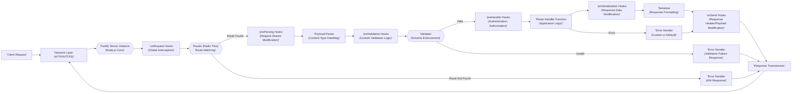

# Project Design Document: Fastify Web Framework

**Version:** 1.1
**Date:** October 26, 2023
**Author:** AI Software Architect

## 1. Introduction

This document provides an enhanced design overview of the Fastify web framework (referenced from [https://github.com/fastify/fastify](https://github.com/fastify/fastify)). This revised document aims to provide even greater clarity and detail regarding the key architectural components, data flow, and design decisions to facilitate more effective future threat modeling activities.

## 2. Goals

*   Provide a comprehensive and refined architectural overview of the Fastify framework.
*   Offer more detailed descriptions of key components and their interactions, including specific examples where relevant.
*   Elaborate on the typical request lifecycle within Fastify, highlighting critical stages for security analysis.
*   Strengthen the identification of areas relevant for security considerations and potential threat vectors, providing more specific examples.
*   Serve as an improved and more detailed basis for subsequent threat modeling exercises.

## 3. Target Audience

*   Security engineers performing in-depth threat modeling and security assessments.
*   Developers contributing to or extending the Fastify framework requiring a deeper understanding of its architecture.
*   Operations teams deploying and managing Fastify applications who need to understand security implications.

## 4. Architectural Overview

Fastify is a high-performance Node.js web framework designed for speed and efficiency. Its plugin-based architecture allows for extensive customization and extension. The core of Fastify's architecture centers around efficiently processing incoming HTTP requests and directing them to the appropriate handlers.

## 5. Detailed Design

### 5.1. Core Components (Enhanced Descriptions)

*   **Server Instance:** The fundamental unit of a Fastify application. It instantiates the Node.js HTTP/HTTPS server and manages the entire request processing pipeline, including listeners, route registration, and lifecycle management. It encapsulates the core logic of Fastify.
*   **Router (Radix Tree):** A highly optimized component responsible for efficiently matching incoming request paths and methods to their corresponding handlers. Fastify's use of a radix tree enables extremely fast lookups, crucial for performance. Misconfigurations here could lead to unintended route access.
*   **Request Object (Encapsulated):**  Provides a standardized interface to access the details of an incoming HTTP request. This includes headers, parameters (path and query), the request body (stream), and connection information. Fastify enhances the native Node.js request object with additional utilities and context.
*   **Reply Object (Interface):**  Offers a consistent and controlled way to construct and send HTTP responses. It includes methods for setting status codes, headers, and the response payload. It also manages response lifecycle hooks.
*   **Plugins (Extensibility Mechanism):**  The primary way to extend Fastify's core functionality. Plugins can encapsulate routes, add decorators, register hooks, and contribute custom logic. The isolation and security of plugins are important considerations.
*   **Hooks (Lifecycle Interceptors):** Functions registered to intercept and potentially modify the request/response flow at specific points in the lifecycle. Examples include `onRequest` (for logging), `preHandler` (for authentication), and `onSend` (for modifying response headers). Improperly implemented hooks can introduce vulnerabilities.
*   **Decorators (Shared Functionality):**  A mechanism to add custom properties or methods to the Fastify server instance, request object, or reply object. This promotes code reuse and consistency. Care must be taken to avoid naming collisions and ensure secure decorator implementations.
*   **Payload Parser (Content Handling):**  Responsible for interpreting the request body based on the `Content-Type` header. Fastify includes default parsers for JSON, URL-encoded data, and plain text. Custom parsers can be registered, but their security must be carefully considered.
*   **Serializer (Response Formatting):** Converts data into a format suitable for the HTTP response body. Fastify offers optimized JSON serialization and allows for custom serializers to handle different data formats or enhance security (e.g., by sanitizing output).
*   **Validator (Schema Enforcement):**  Used to ensure that incoming request data and outgoing response data conform to predefined schemas (often using JSON Schema). This is critical for data integrity and preventing injection attacks.

### 5.2. Request Lifecycle (More Detail)

The journey of an HTTP request through Fastify is a series of well-defined stages:

*   **Request Reception:** The underlying Node.js HTTP/HTTPS server receives the raw request from the network.
*   **Fastify Handover:** The request is passed to the registered Fastify server instance for processing.
*   **`onRequest` Hooks (Global Interception):**  These hooks execute earliest in the lifecycle, allowing for global actions like logging, request ID generation, or preliminary security checks.
*   **Routing Decision (Path and Method Matching):** The router analyzes the request's HTTP method and path to find a matching route handler. This is a performance-critical step.
*   **Route Not Found Handling:** If no matching route is found, Fastify's error handling kicks in, typically resulting in a 404 Not Found response. Custom not found handlers can be registered.
*   **`preParsing` Hooks (Pre-Processing Stream):** These hooks allow modification of the raw request stream before it's parsed. This can be used for tasks like decompression or custom data transformations.
*   **Payload Parsing (Content Interpretation):** Based on the `Content-Type` header, the appropriate parser is invoked to convert the request body into a usable format (e.g., a JavaScript object for JSON). Vulnerabilities can arise from flaws in the parsing logic.
*   **`preValidation` Hooks (Pre-Validation Logic):**  Allows for custom logic to be executed before the main validation step.
*   **Input Validation (Schema Enforcement):** If a schema is defined for the route, the request's parameters, query string, and payload are validated against it. This is a crucial security step to prevent invalid or malicious data from reaching the handler.
*   **`preHandler` Hooks (Authorization and More):** These hooks are commonly used for authentication, authorization, and other pre-processing tasks that need to occur before the main handler logic.
*   **Handler Execution (Application Logic):** The route's designated handler function is executed. This is where the core business logic for the request resides. Security vulnerabilities within this logic are common.
*   **`preSerialization` Hooks (Pre-Formatting Data):**  Allows modification of the data that will be sent in the response before it's serialized.
*   **Response Serialization (Output Formatting):** The response data is converted into the appropriate format (e.g., JSON string) based on configuration and accepted content types.
*   **`onSend` Hooks (Response Manipulation):** These hooks can modify the response payload or headers just before the response is sent to the client.
*   **Response Transmission (Sending to Client):** The formatted response is sent back to the client over the network.
*   **`onResponse` Hooks (Post-Transmission Actions):** These hooks execute after the response has been sent, allowing for tasks like logging response times or cleanup.
*   **Error Handling (Exception Management):** If an error occurs at any point, Fastify's error handling mechanism is triggered. This involves invoking error handlers and `onError` hooks to manage and format error responses.

### 5.3. Plugin System (Security Considerations)

Fastify's plugin system is powerful but requires careful consideration from a security perspective:

*   **Encapsulation and Isolation:** Plugins can be encapsulated, preventing them from accidentally interfering with other parts of the application. This helps in managing dependencies and security boundaries.
*   **Namespace Collisions:**  Care must be taken to avoid naming collisions when registering decorators or other shared resources within plugins.
*   **Third-Party Plugin Risks:**  Using community-developed plugins introduces a dependency on external code. It's crucial to vet the security of these plugins, check for updates, and be aware of potential vulnerabilities.
*   **Plugin Registration Order:** The order in which plugins are registered can sometimes be significant, especially for hooks and decorators that might depend on each other.

### 5.4. Error Handling (Security Implications)

The way Fastify handles errors has security implications:

*   **Default Error Responses:** Fastify's default error handler provides basic information. Overly verbose error messages can leak sensitive information about the application's internal workings.
*   **Custom Error Handling:** Developers can customize error responses to provide more user-friendly messages, but care must be taken to avoid exposing internal details.
*   **`onError` Hooks (Centralized Handling):**  Provide a central place to log errors, sanitize error messages, or trigger security alerts.

## 6. Data Flow Diagram (Enhanced)

## 7. Key Components for Threat Modeling (More Specifics)

When performing threat modeling, focus on these components and potential vulnerabilities:

*   **Network Layer:**  Susceptible to DDoS attacks, man-in-the-middle attacks (if HTTPS is not enforced or configured correctly).
*   **Router:**  Route hijacking (due to overlapping or poorly defined routes), unintended exposure of internal endpoints.
*   **Payload Parser:**  JSON injection, XML External Entity (XXE) attacks (if XML parsing is used), buffer overflow vulnerabilities in custom parsers.
*   **Validator:**  Bypass vulnerabilities if validation schemas are incomplete or incorrect, leading to injection attacks or data corruption.
*   **Handler Function:**  SQL injection, NoSQL injection, command injection, cross-site scripting (XSS) if not handling output encoding, business logic flaws, insecure direct object references (IDOR).
*   **Serializer:**  Information disclosure if sensitive data is inadvertently serialized in responses, cross-site scripting (XSS) if not properly escaping output.
*   **Plugins:**  Vulnerabilities in third-party plugin code, insecure plugin configurations.
*   **Hooks:**  Bypassing security checks by manipulating the request flow in hooks, introducing vulnerabilities through poorly written hook logic.
*   **Error Handler:**  Information leakage through overly detailed error messages, potential denial-of-service if error handling logic is flawed.

## 8. Security Considerations (Categorized)

*   **Input Security:**
    *   **Validation:** Implement robust input validation using schemas for all request data (parameters, query, body).
    *   **Sanitization:** Sanitize user-provided input before processing or storing it to prevent injection attacks.
    *   **Content Security:**  Be cautious when handling different content types and ensure parsers are secure.
*   **Output Security:**
    *   **Encoding:**  Properly encode output data based on the context (HTML, JavaScript, URLs) to prevent XSS attacks.
    *   **Secure Headers:**  Utilize security headers like `Content-Security-Policy`, `Strict-Transport-Security`, `X-Frame-Options`, etc.
    *   **Rate Limiting:** Implement rate limiting to protect against brute-force attacks and denial-of-service.
*   **Authentication and Authorization:**
    *   **Secure Authentication:** Use strong authentication mechanisms (e.g., OAuth 2.0, JWT) and avoid storing passwords directly.
    *   **Granular Authorization:** Implement fine-grained authorization to control access to specific resources and functionalities.
*   **Transport Security:**
    *   **HTTPS Enforcement:**  Always enforce HTTPS to encrypt communication.
    *   **TLS Configuration:**  Use strong TLS configurations and keep certificates up-to-date.
*   **Dependency Management:**
    *   **Vulnerability Scanning:** Regularly scan dependencies for known vulnerabilities and update them promptly.
    *   **Supply Chain Security:**  Be mindful of the security of third-party plugins and libraries.
*   **Error Handling and Logging:**
    *   **Secure Error Handling:** Avoid exposing sensitive information in error messages.
    *   **Security Logging:** Implement comprehensive security logging to detect and investigate security incidents.
*   **Plugin Security:**
    *   **Careful Selection:**  Thoroughly vet the security of third-party plugins before using them.
    *   **Regular Updates:** Keep plugins updated to patch security vulnerabilities.

## 9. Deployment Considerations

Fastify application deployment choices significantly impact security:

*   **Containerization (Docker):** Provides isolation and reproducibility but requires secure container image management and orchestration.
*   **Serverless Functions:**  Reduces operational overhead but introduces security considerations related to the serverless platform's security model and function permissions.
*   **Platform-as-a-Service (PaaS):**  Relies on the PaaS provider's security measures, requiring understanding of their security responsibilities.
*   **Standalone Servers:** Requires careful configuration and hardening of the underlying operating system and network.

## 10. Dependencies

Fastify's security posture is also influenced by its dependencies:

*   **Node.js:**  Keep Node.js updated to benefit from security patches.
*   **Routing Library:**  Ensure the routing library is free from vulnerabilities that could lead to route hijacking.
*   **JSON Parsing/Serialization Libraries:**  Use well-vetted and actively maintained libraries to avoid parsing-related vulnerabilities.
*   **Schema Validation Library:**  The security of the validation library is critical for preventing data injection.

## 11. Future Considerations

*   **Formal Security Audits:**  Conduct regular formal security audits of the Fastify core and popular plugins by reputable security firms.
*   **Security Best Practices Documentation:**  Develop comprehensive documentation outlining security best practices for developing and deploying Fastify applications.
*   **Integration with Security Tools (Improved):**  Enhance integration with static application security testing (SAST) and dynamic application security testing (DAST) tools.
*   **Community Security Engagement:** Foster a strong security-conscious community to encourage vulnerability reporting and responsible disclosure.

This improved design document provides a more detailed and structured understanding of the Fastify web framework's architecture, specifically tailored for threat modeling. By focusing on the intricacies of each component and the request lifecycle, security engineers can more effectively identify and mitigate potential security risks.