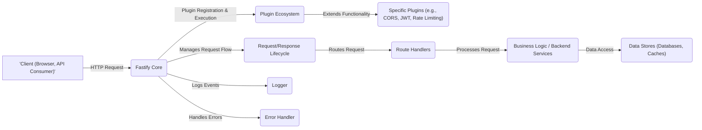

# Project Design Document: Fastify Web Framework

**Version:** 1.1
**Date:** October 26, 2023
**Author:** AI Software Architect

## 1. Introduction

This document provides an enhanced architectural design of the Fastify web framework (as represented by the project at https://github.com/fastify/fastify). This document aims to provide a more in-depth understanding of the framework's structure, key components, and data flow, specifically tailored for effective threat modeling. It builds upon the previous version by adding more detail and focusing on security-relevant aspects.

## 2. Goals and Objectives

The primary goal of this document is to provide a comprehensive and detailed architectural overview of the Fastify framework to facilitate thorough threat modeling. Specific objectives include:

*   Clearly identifying the core components of the Fastify framework and their functionalities.
*   Describing the interactions and dependencies between these components, highlighting potential trust boundaries.
*   Illustrating the detailed flow of data through the framework during request processing, pinpointing data transformation and validation points.
*   Explicitly highlighting key security-relevant aspects of the design, such as authentication and authorization mechanisms, input handling, and output encoding.
*   Providing a robust and granular basis for identifying potential threats, vulnerabilities, and attack vectors within the Fastify framework and applications built upon it.

## 3. System Architecture

### 3.1. High-Level Architecture

The following diagram illustrates the high-level architecture of a typical Fastify application, emphasizing the interactions between key modules:

### 3.2. Detailed Request/Response Lifecycle

This diagram provides a more granular view of the steps involved in processing an incoming request within a Fastify application, highlighting security-relevant hooks and processes:

## 4. Key Components

The Fastify framework comprises several key components, each with specific functionalities and security implications:

*   **Fastify Core:** The central orchestrator, responsible for managing the request lifecycle, plugin registration, routing, and overall framework operation. Its security is paramount as it controls the execution flow.
*   **Request Object:** Encapsulates the incoming HTTP request, providing access to headers (potential injection points), parameters, query strings, and the raw body (major source of untrusted data). Proper handling and validation are crucial.
*   **Reply Object:** Used to construct and send the HTTP response. Security considerations include setting appropriate headers (e.g., security headers), encoding response bodies to prevent XSS, and handling errors gracefully to avoid information leakage.
*   **Router:**  Matches incoming request paths and methods to registered route handlers. Vulnerabilities in the router could lead to unintended route access or denial of service. Fastify's trie-based router is designed for performance and security.
*   **Route Handlers:** Application-defined functions that process requests. These are the primary locations where business logic vulnerabilities (e.g., insecure data handling, logic flaws) can occur.
*   **Plugins:** Extend Fastify's functionality. Untrusted or poorly written plugins can introduce significant security risks, including vulnerabilities and backdoors. Careful vetting and sandboxing (if possible) are important.
*   **Hooks:** Intercept and modify the request/response lifecycle. Improperly implemented hooks can bypass security checks or introduce new vulnerabilities. For example, a poorly written `onRequest` hook could allow unauthorized access.
*   **Decorators:** Add custom properties and methods. While generally safe, misuse of decorators could potentially expose sensitive information or create unexpected behavior.
*   **Serializers:** Convert data to response format. Improper serialization can lead to information disclosure or vulnerabilities if sensitive data is not correctly handled. Fastify's default fast JSON stringifier helps mitigate some risks.
*   **Logger:** Records events. Secure logging practices are essential for auditing and incident response. Logs should not contain sensitive information and should be protected from unauthorized access.
*   **Error Handler:** Manages errors. Improper error handling can leak sensitive information about the application's internal workings, aiding attackers. Custom error handlers should be carefully designed.

## 5. Data Flow

The flow of data through a Fastify application during a typical request, with security considerations highlighted:

*   An HTTP request is received by the Fastify server (potential for network-level attacks).
*   The request is passed to the Fastify core.
*   `onRequest` hooks are executed (can be used for early security checks, like rate limiting or IP blocking).
*   The raw request body is processed by `preParsing` hooks (can be used to sanitize or transform the raw body before parsing).
*   The request body is parsed (potential for vulnerabilities in the body parser if not up-to-date).
*   Request data is validated using `preValidation` hooks (crucial for preventing injection attacks and ensuring data integrity).
*   The router matches the request to a specific route handler.
*   `preHandler` hooks associated with the route are executed (often used for authentication and authorization checks).
*   Authentication and authorization checks are performed (critical security step to verify user identity and permissions).
*   The route handler function is executed, processing the request and generating data for the response (business logic vulnerabilities can occur here).
*   `preSerialization` hooks are executed to modify the response data before serialization (can be used to sanitize output or remove sensitive information).
*   The response data is serialized into the appropriate format (e.g., JSON) (potential for information disclosure if serialization is not handled correctly).
*   `onSend` hooks are executed to modify the response before it's sent (can be used to add security headers).
*   The HTTP response is sent back to the client (ensure secure transport, e.g., HTTPS).
*   `onResponse` hooks are executed after the response has been sent.
*   Logging occurs throughout the lifecycle via the logger (ensure secure logging practices).
*   Errors are caught and handled by the error handler (prevent information leakage through error messages).

## 6. Security Considerations (Detailed)

This section expands on the initial security considerations, providing more specific examples of potential threats:

*   **Input Validation:**
    *   **Threats:** SQL injection, command injection, cross-site scripting (XSS), path traversal, buffer overflows.
    *   **Mitigation:** Utilize `preValidation` hooks and schema validation libraries (e.g., Joi, Yup) to strictly define and enforce expected input formats and types. Sanitize user input to remove potentially malicious characters.
*   **Authentication and Authorization:**
    *   **Threats:** Brute-force attacks, credential stuffing, session hijacking, privilege escalation, insecure direct object references (IDOR).
    *   **Mitigation:** Implement robust authentication mechanisms (e.g., multi-factor authentication), use strong password hashing algorithms, implement proper session management, and enforce the principle of least privilege for authorization. Leverage plugins like `@fastify/jwt` or `@fastify/passport`.
*   **Cross-Site Scripting (XSS) Prevention:**
    *   **Threats:** Stealing session cookies, redirecting users to malicious sites, defacing websites.
    *   **Mitigation:** Employ proper output encoding (escaping) of user-generated content before rendering it in HTML. Utilize security headers like `Content-Security-Policy` (CSP).
*   **Cross-Site Request Forgery (CSRF) Prevention:**
    *   **Threats:** Unauthorized actions performed on behalf of an authenticated user.
    *   **Mitigation:** Implement anti-CSRF tokens (synchronizer tokens) or utilize techniques like the SameSite cookie attribute.
*   **HTTP Header Security:**
    *   **Threats:** Various attacks exploiting missing or misconfigured headers (e.g., man-in-the-middle attacks, clickjacking).
    *   **Mitigation:** Configure security headers like `Strict-Transport-Security` (HSTS), `X-Content-Type-Options`, `X-Frame-Options`, and `Referrer-Policy`. Fastify plugins can assist with this.
*   **Dependency Management:**
    *   **Threats:** Exploiting known vulnerabilities in outdated dependencies.
    *   **Mitigation:** Regularly update dependencies and use tools like `npm audit` or `yarn audit` to identify and address vulnerabilities.
*   **Rate Limiting:**
    *   **Threats:** Denial-of-service (DoS) attacks, brute-force attacks.
    *   **Mitigation:** Implement rate limiting middleware or plugins to restrict the number of requests from a single IP address or user within a specific timeframe.
*   **Error Handling:**
    *   **Threats:** Information leakage through verbose error messages, aiding attackers in understanding the system's internals.
    *   **Mitigation:** Implement custom error handlers that log detailed errors securely but return generic error messages to the client.
*   **Logging:**
    *   **Threats:** Exposure of sensitive information in logs, unauthorized access to log files.
    *   **Mitigation:** Avoid logging sensitive data, secure log storage and access, and implement log rotation and retention policies.
*   **Plugin Security:**
    *   **Threats:** Vulnerabilities or malicious code within third-party plugins.
    *   **Mitigation:** Carefully vet and select plugins from trusted sources. Review plugin code if possible. Keep plugins updated. Consider using a plugin security scanner.

## 7. Deployment Considerations

The deployment environment significantly impacts the security posture of a Fastify application. Consider the following:

*   **Standalone Node.js Server:**
    *   **Security Implications:** Requires careful configuration of the operating system, firewall rules, and process management to ensure security. Exposed directly to the internet if not behind a reverse proxy.
*   **Containerization (Docker):**
    *   **Security Implications:** Provides isolation but requires secure container image creation and management. Vulnerabilities in the base image or misconfigurations can introduce risks. Ensure proper resource limits and security scanning of images.
*   **Serverless Environments (e.g., AWS Lambda, Google Cloud Functions):**
    *   **Security Implications:** Security is largely managed by the cloud provider, but developers are still responsible for secure coding practices and proper configuration of IAM roles and permissions. Cold starts can introduce timing vulnerabilities.
*   **Behind a Reverse Proxy (e.g., Nginx, Apache):**
    *   **Security Implications:** Offloads tasks like SSL termination, load balancing, and some security features (e.g., WAF). Requires secure configuration of the reverse proxy itself. Ensure proper communication (e.g., using HTTPS) between the proxy and the Fastify application.

## 8. Technologies Used

The Fastify framework and typical applications built with it utilize the following key technologies, each with its own security considerations:

*   **Node.js:**  Ensure the Node.js runtime is up-to-date to patch known vulnerabilities. Be aware of potential security risks in the Node.js ecosystem.
*   **JavaScript (or TypeScript):**  Follow secure coding practices to avoid common web application vulnerabilities. Be mindful of prototype pollution vulnerabilities in JavaScript.
*   **HTTP:**  Understand HTTP security mechanisms and best practices, including secure headers and methods.
*   **JSON:**  Be aware of potential vulnerabilities related to JSON parsing, such as JSON injection.
*   **Pino:**  Ensure secure configuration and storage of logs generated by Pino.
*   **Trie-based Router:**  While generally secure, be aware of potential vulnerabilities in routing logic if complex or dynamic routes are used.
*   **Various Plugins:**  As mentioned before, plugin security is a critical consideration.

## 9. Future Considerations

Future enhancements to the Fastify project and its design could further improve security:

*   **Built-in Security Middleware:**  Consider incorporating more built-in middleware for common security tasks like CSRF protection or basic rate limiting.
*   **Improved Plugin Security Mechanisms:**  Explore ways to provide better isolation or sandboxing for plugins.
*   **Enhanced Security Auditing Tools:**  Develop or integrate tools to help developers identify potential security vulnerabilities in their Fastify applications.
*   **Formal Security Audits:**  Conduct regular formal security audits of the Fastify core and key plugins.
*   **Security-Focused Documentation and Examples:**  Provide more comprehensive documentation and examples on how to build secure Fastify applications.

This enhanced design document provides a more detailed and security-focused overview of the Fastify framework, serving as a more robust foundation for subsequent threat modeling activities. By understanding the intricacies of the architecture and potential security implications of each component and data flow, we can more effectively identify and mitigate potential risks.