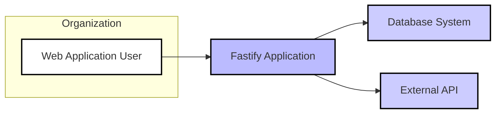
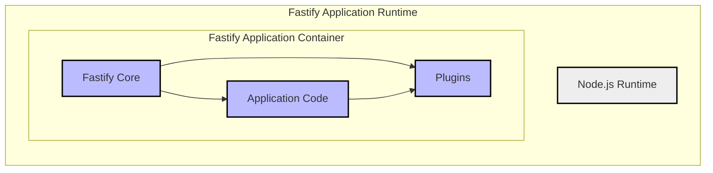
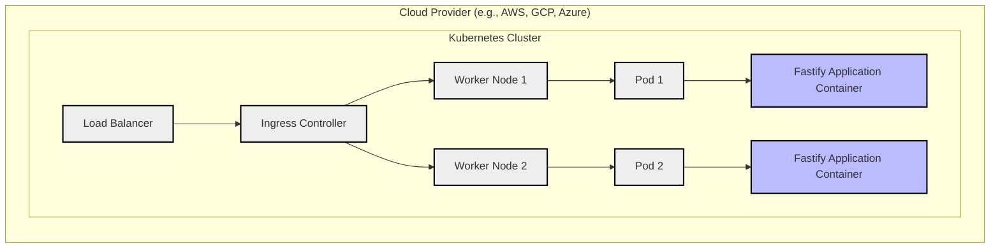
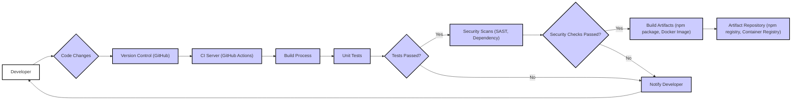

# BUSINESS POSTURE

Fastify is a fast and low overhead web framework for Node.js. It is designed to be performant and developer-friendly, making it suitable for building web applications and APIs where speed and efficiency are critical.

Business Priorities and Goals:
- Primary goal: Provide a high-performance, efficient, and developer-friendly web framework for Node.js.
- Enable developers to build fast and scalable web applications and APIs quickly.
- Foster a strong and active open-source community around the framework.
- Maintain and improve the framework's performance, stability, and security.
- Offer a flexible and extensible framework through a plugin ecosystem.

Business Risks:
- Performance degradation due to vulnerabilities or inefficient code.
- Security vulnerabilities in the framework or its plugins could lead to application breaches.
- Lack of community support or maintainability could lead to project stagnation.
- Breaking changes in new versions could disrupt existing applications.
- Adoption risk if developers prefer other frameworks.
- Supply chain risks related to dependencies and build process.

# SECURITY POSTURE

Existing Security Controls:
- security control: Open Source Security Audits - The project is open source, allowing for community review and security audits. Location: GitHub repository is publicly accessible.
- security control: Dependency Management -  Uses `npm` or `yarn` for dependency management, which includes mechanisms for vulnerability scanning of dependencies. Location: `package.json` and `package-lock.json` or `yarn.lock`.
- security control: Code Reviews - Contributions are likely reviewed by maintainers before merging. Location: GitHub Pull Request process.
- security control: Static Analysis - Likely uses linters and code formatters to maintain code quality and potentially catch some basic security issues. Location: Project configuration files (e.g., `.eslintrc.js`).
- security control: Testing -  Includes unit and integration tests to ensure functionality and potentially catch regressions. Location: `test/` directory in the repository.
- security control: HTTPS enforcement -  Framework encourages and facilitates the use of HTTPS for secure communication. Location: Documentation and examples.

Accepted Risks:
- accepted risk: Reliance on community contributions for security vulnerability discovery and patching.
- accepted risk: Potential vulnerabilities in dependencies that are not immediately patched.
- accepted risk: Security of applications built with Fastify is ultimately the responsibility of the application developers.
- accepted risk: Open source nature means vulnerabilities are publicly disclosed once found.

Recommended Security Controls:
- security control: Automated Security Scanning - Implement automated security scanning tools (SAST, DAST, dependency scanning) in the CI/CD pipeline.
- security control: Regular Penetration Testing - Conduct periodic penetration testing or security audits by external security experts.
- security control: Security Champions - Designate security champions within the core team to focus on security best practices and awareness.
- security control: Security Vulnerability Disclosure Policy - Establish a clear process for reporting and handling security vulnerabilities.
- security control: Signed Releases - Sign releases to ensure integrity and prevent tampering.
- security control: SBOM Generation - Generate Software Bill of Materials (SBOM) for releases to improve supply chain transparency.

Security Requirements:
- Authentication: Applications built with Fastify should implement robust authentication mechanisms to verify user identity. This is typically handled at the application level, but Fastify should provide tools and guidance to facilitate secure authentication.
- Authorization: Applications should implement fine-grained authorization to control access to resources based on user roles and permissions. Fastify should provide mechanisms to integrate authorization logic.
- Input Validation: Fastify applications must validate all user inputs to prevent injection attacks (e.g., SQL injection, XSS). Fastify should provide tools for input validation and sanitization.
- Cryptography: Applications should use cryptography appropriately to protect sensitive data in transit and at rest. Fastify should support or integrate with libraries for cryptographic operations.
- Secure Defaults: Fastify should have secure defaults to minimize the risk of misconfiguration leading to vulnerabilities.
- Error Handling:  Fastify should handle errors gracefully and avoid exposing sensitive information in error messages.
- Logging and Monitoring: Fastify applications should implement comprehensive logging and monitoring for security auditing and incident response.
- Rate Limiting and DoS Protection: Fastify applications should implement rate limiting and other mechanisms to protect against denial-of-service attacks.
- HTTP Security Headers: Fastify should facilitate the setting of HTTP security headers (e.g., Content-Security-Policy, Strict-Transport-Security, X-Frame-Options) to enhance application security.

# DESIGN

## C4 CONTEXT

Context Diagram Elements:

- Name: Web Application User
  - Type: Person
  - Description: End-users who interact with web applications built using Fastify.
  - Responsibilities: Accessing and using web applications and APIs.
  - Security controls: User authentication at the application level, strong passwords, multi-factor authentication (application responsibility).

- Name: Fastify Application
  - Type: Software System
  - Description: Web applications and APIs built using the Fastify framework. This is the system being designed.
  - Responsibilities: Handling user requests, processing data, interacting with databases and external systems, and returning responses.
  - Security controls: Input validation, output encoding, authentication, authorization, session management, error handling, logging, rate limiting, HTTPS enforcement (application responsibility, facilitated by Fastify).

- Name: Database System
  - Type: External System
  - Description: Databases used by Fastify applications to store and retrieve data. Examples include PostgreSQL, MySQL, MongoDB.
  - Responsibilities: Storing application data, providing data access to the Fastify application.
  - Security controls: Database access controls, encryption at rest, encryption in transit, regular backups, vulnerability patching (database system responsibility).

- Name: External API
  - Type: External System
  - Description: External APIs that Fastify applications may interact with to retrieve data or perform actions. Examples include payment gateways, social media APIs, third-party services.
  - Responsibilities: Providing external services and data to the Fastify application.
  - Security controls: API authentication and authorization, secure API communication (API provider responsibility), input validation and output encoding when interacting with external APIs (application responsibility).

## C4 CONTAINER

Container Diagram Elements:

- Name: Node.js Runtime
  - Type: Runtime Environment
  - Description: The JavaScript runtime environment that executes the Fastify application.
  - Responsibilities: Providing the execution environment for the Fastify application, managing resources.
  - Security controls: Operating system security, runtime environment updates, resource limits (infrastructure responsibility).

- Name: Fastify Core
  - Type: Container - Library/Framework
  - Description: The core Fastify framework, providing the foundation for building web applications. Handles routing, request/response processing, plugin management, and core functionalities.
  - Responsibilities: Core framework functionalities, request handling, routing, plugin management, lifecycle management.
  - Security controls: Secure coding practices in framework development, vulnerability scanning, security audits, input validation utilities, secure defaults.

- Name: Plugins
  - Type: Container - Library/Framework Extension
  - Description:  Fastify's plugin ecosystem, allowing developers to extend the framework's functionality. Plugins can add features like database connectors, authentication middleware, and more.
  - Responsibilities: Extending Fastify's functionality, providing reusable components.
  - Security controls: Plugin security audits (community responsibility), dependency scanning, secure plugin development guidelines, plugin review process (community responsibility).

- Name: Application Code
  - Type: Container - Application Component
  - Description: The custom application code developed by users of Fastify, which utilizes the Fastify core and plugins to implement specific application logic.
  - Responsibilities: Implementing application-specific business logic, handling user requests, interacting with databases and external systems.
  - Security controls: Secure coding practices, input validation, output encoding, authentication, authorization, session management, error handling, logging, rate limiting, HTTPS enforcement (developer responsibility).

## DEPLOYMENT

Deployment Architecture: Cloud Containerized Deployment (Example)

Deployment Diagram Elements:

- Name: Load Balancer
  - Type: Infrastructure
  - Description: Distributes incoming traffic across multiple instances of the Fastify application for high availability and scalability.
  - Responsibilities: Traffic distribution, load balancing, health checks.
  - Security controls: DDoS protection, TLS termination, access control lists (infrastructure provider responsibility).

- Name: Ingress Controller
  - Type: Infrastructure
  - Description: Manages external access to the Kubernetes cluster services, routing traffic to the appropriate pods based on rules.
  - Responsibilities: Routing external requests to services within the cluster, TLS termination, path-based routing.
  - Security controls: Ingress rules, TLS configuration, rate limiting, WAF integration (infrastructure provider/cluster administrator responsibility).

- Name: Worker Node 1 & Worker Node 2
  - Type: Infrastructure
  - Description: Virtual machines or physical servers that run the Kubernetes pods.
  - Responsibilities: Providing compute resources for running containers, managing container runtime.
  - Security controls: Operating system security hardening, kernel patching, container runtime security, network segmentation (infrastructure provider/cluster administrator responsibility).

- Name: Pod 1 & Pod 2
  - Type: Container Orchestration Unit
  - Description: The smallest deployable units in Kubernetes, encapsulating one or more containers. In this case, each pod runs a Fastify Application Container.
  - Responsibilities: Running and managing application containers, providing networking and storage resources to containers within the pod.
  - Security controls: Pod security policies/admission controllers, resource limits, network policies (cluster administrator responsibility).

- Name: Fastify Application Container
  - Type: Software Container
  - Description: Docker container image containing the Fastify application, Node.js runtime, and dependencies.
  - Responsibilities: Running the Fastify application, serving requests.
  - Security controls: Container image vulnerability scanning, minimal container image, application-level security controls (developer/DevOps responsibility).

## BUILD

Build Process Elements:

- Name: Developer
  - Type: Person
  - Description: Software developers contributing to the Fastify project.
  - Responsibilities: Writing code, fixing bugs, adding features, committing code changes.
  - Security controls: Secure development training, code review participation, following secure coding guidelines.

- Name: Code Changes
  - Type: Data
  - Description: Modifications to the codebase made by developers.
  - Responsibilities: Representing changes to the software.
  - Security controls: Version control history, code review process.

- Name: Version Control (GitHub)
  - Type: Tool
  - Description: GitHub repository used for version control and collaboration.
  - Responsibilities: Storing code, managing versions, tracking changes, facilitating collaboration.
  - Security controls: Access controls, branch protection, audit logs, two-factor authentication for developers (GitHub responsibility).

- Name: CI Server (GitHub Actions)
  - Type: Tool
  - Description: Continuous Integration server (e.g., GitHub Actions) that automates the build, test, and security check process.
  - Responsibilities: Automating build pipeline, running tests, performing security scans.
  - Security controls: Secure CI/CD pipeline configuration, access controls, secret management, audit logs (CI/CD platform responsibility).

- Name: Build Process
  - Type: Process
  - Description: Steps involved in compiling, packaging, and preparing the software for release. For Node.js projects, this typically involves installing dependencies, running build scripts, and packaging the application.
  - Responsibilities: Compiling code, packaging artifacts, preparing for deployment.
  - Security controls: Build environment hardening, dependency management, secure build scripts, minimized build dependencies.

- Name: Unit Tests
  - Type: Process
  - Description: Automated tests to verify the functionality of individual components.
  - Responsibilities: Ensuring code quality, detecting regressions, verifying functionality.
  - Security controls: Test coverage, security-focused test cases.

- Name: Security Scans (SAST, Dependency)
  - Type: Process
  - Description: Automated security scans including Static Application Security Testing (SAST) to find vulnerabilities in code and dependency scanning to identify vulnerable dependencies.
  - Responsibilities: Identifying potential security vulnerabilities in code and dependencies.
  - Security controls: SAST tool configuration, dependency vulnerability database updates, automated reporting.

- Name: Build Artifacts (npm package, Docker Image)
  - Type: Data
  - Description: The packaged software ready for distribution or deployment, such as npm packages or Docker images.
  - Responsibilities: Distributable software package.
  - Security controls: Artifact signing, integrity checks, vulnerability scanning of artifacts.

- Name: Artifact Repository (npm registry, Container Registry)
  - Type: Tool
  - Description: Repositories for storing and distributing build artifacts, such as npm registry for npm packages and container registries for Docker images.
  - Responsibilities: Storing and distributing build artifacts.
  - Security controls: Access controls, vulnerability scanning of stored artifacts, audit logs, secure artifact storage (repository provider responsibility).

# RISK ASSESSMENT

Critical Business Processes:
- Providing a reliable and secure web framework for developers.
- Maintaining the framework's performance and stability.
- Ensuring the framework is free from critical security vulnerabilities.
- Supporting the community of users and contributors.

Data Sensitivity:
- The Fastify framework itself does not directly handle sensitive user data.
- However, applications built with Fastify may handle sensitive data.
- The security of Fastify is crucial because vulnerabilities could impact many applications and potentially expose sensitive data handled by those applications.
- Sensitivity level: High (Indirectly impacts sensitive data through applications built with it).

# QUESTIONS & ASSUMPTIONS

Questions:
- What is the target audience for this design document? (Developers, Security team, Management?) - Assumption: Mixed audience, including technical and non-technical stakeholders.
- What are the specific security concerns of the organization using this document? - Assumption: General security concerns related to web applications and open-source software.
- Are there any specific compliance requirements that need to be considered? - Assumption: General best practices for software security are sufficient for this document.
- What is the risk appetite of the organization using this document? - Assumption: Moderate risk appetite, aiming for a balance between security and development velocity.

Assumptions:
- BUSINESS POSTURE: The primary business goal is to provide a high-quality, performant, and secure web framework.
- SECURITY POSTURE: The project follows standard open-source security practices. Security is a high priority, but resources are limited, requiring prioritization of security controls.
- DESIGN: The design is based on common web application architectures and cloud deployment patterns. The focus is on the Fastify framework itself and its immediate ecosystem, not on specific applications built with it.