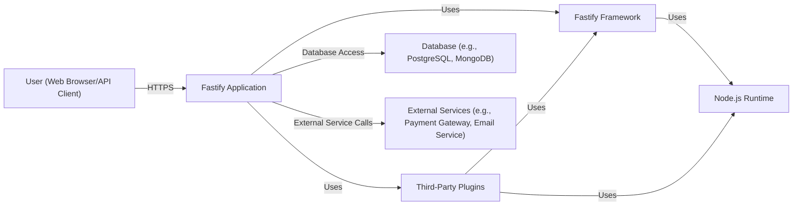
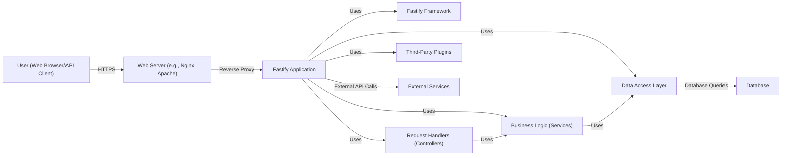
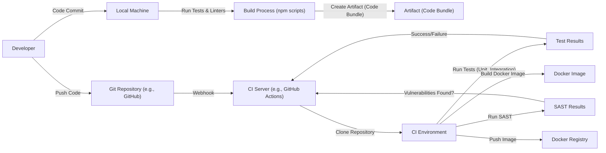

Okay, let's create a design document for the Fastify project, focusing on aspects relevant for threat modeling.

# BUSINESS POSTURE

Fastify is a web framework highly focused on providing the best developer experience with the least overhead and a powerful plugin architecture.  It's designed to be fast and low-overhead, making it suitable for high-performance applications.  The project is open-source and community-driven.

Priorities:

*   Performance: Minimize overhead and maximize request throughput.
*   Developer Experience:  Provide a simple, intuitive API and clear documentation.
*   Extensibility:  Enable developers to easily extend functionality via plugins.
*   Stability and Reliability: Ensure the framework is robust and dependable.
*   Community Growth:  Maintain an active and engaged community.

Goals:

*   Provide a viable alternative to other Node.js web frameworks (like Express.js).
*   Become a preferred choice for building high-performance APIs and microservices.
*   Maintain a low barrier to entry for new developers.

Business Risks:

*   Performance Degradation:  Changes to the codebase or dependencies could negatively impact performance, a core value proposition.
*   Security Vulnerabilities:  Vulnerabilities in the framework or its plugins could expose applications built with Fastify to attacks.
*   Breaking Changes:  Frequent or poorly managed breaking changes could alienate the community and hinder adoption.
*   Lack of Adoption:  If Fastify fails to gain sufficient traction, the project's long-term viability could be at risk.
*   Plugin Ecosystem Issues:  A poorly maintained or insecure plugin ecosystem could damage the framework's reputation and security.
*   Maintainer Burnout:  Reliance on a small number of maintainers could lead to burnout and project stagnation.

# SECURITY POSTURE

Existing Security Controls:

*   security control: Input Validation: Fastify uses a schema-based validation approach (using `ajv`) to validate request inputs (query parameters, body, headers). Implemented in core and documented.
*   security control: Secure Defaults: Fastify encourages secure defaults where possible, but some configurations require explicit developer action.
*   security control: Regular Dependency Updates: The project actively manages dependencies to address security vulnerabilities.  Visible through GitHub's Dependabot and frequent releases.
*   security control: Security Policy: Fastify has a documented security policy (SECURITY.md) outlining how to report vulnerabilities.
*   security control: Code Reviews: All contributions go through a code review process.
*   security control: Testing: Extensive test suite to ensure code quality and prevent regressions.
*   security control: HTTP Headers Management: Fastify allows developers to manage HTTP headers, including security-related headers.
*   security control: Plugin Architecture: While providing extensibility, the plugin architecture also introduces a potential attack surface. Fastify provides mechanisms for plugin developers to write secure plugins.

Accepted Risks:

*   accepted risk: Plugin Security: The security of third-party plugins is ultimately the responsibility of the plugin developers and the application developers who choose to use them. Fastify provides guidelines, but cannot guarantee the security of all plugins.
*   accepted risk: Ecosystem Dependencies: Fastify, like all Node.js projects, relies on a large number of npm packages. While efforts are made to keep these up-to-date, vulnerabilities in dependencies are an inherent risk.
*   accepted risk: Developer Error: Fastify provides tools and guidance, but developers can still write insecure code using the framework.

Recommended Security Controls:

*   security control: Content Security Policy (CSP) Integration: Provide easier, built-in support for configuring CSP headers.
*   security control: Enhanced Input Sanitization: While validation is present, consider adding more robust sanitization options to mitigate XSS risks.
*   security control: Official Security Plugins: Develop and maintain a set of officially supported security plugins (e.g., for authentication, authorization, rate limiting).
*   security control: Supply Chain Security: Implement measures to verify the integrity of the build process and published packages (e.g., SLSA, provenance).

Security Requirements:

*   Authentication: Fastify itself does not provide built-in authentication mechanisms. This is typically handled by plugins or external services.  Requirements should be defined at the application level.
*   Authorization: Similar to authentication, authorization is left to the application or plugins.  Requirements should be defined at the application level.
*   Input Validation: Fastify provides robust input validation via schemas.  Applications should leverage this for all user-provided data.  Validation rules should be strict and specific.
*   Cryptography: Fastify does not directly handle cryptography, but applications using it should use appropriate cryptographic libraries and practices for secure communication (HTTPS), data storage, and password hashing.
*   Output Encoding: Applications built with Fastify should properly encode output to prevent XSS vulnerabilities. This is primarily the responsibility of the application developer.

# DESIGN

## C4 CONTEXT

C4 Context Element Descriptions:

*   Element:
    *   Name: User (Web Browser/API Client)
    *   Type: Person
    *   Description: Represents a user interacting with the Fastify application, either through a web browser or by directly consuming an API.
    *   Responsibilities: Initiates requests to the Fastify application.
    *   Security controls: Uses HTTPS for secure communication.

*   Element:
    *   Name: Fastify Application
    *   Type: Software System
    *   Description: The application built using the Fastify framework.
    *   Responsibilities: Handles incoming requests, processes data, interacts with databases and external services, and returns responses.
    *   Security controls: Input validation, output encoding (developer responsibility), authentication and authorization (via plugins or custom implementation).

*   Element:
    *   Name: Fastify Framework
    *   Type: Framework
    *   Description: The core Fastify framework.
    *   Responsibilities: Provides routing, request handling, middleware support, and plugin architecture.
    *   Security controls: Schema-based input validation, secure defaults (where possible).

*   Element:
    *   Name: Third-Party Plugins
    *   Type: Library
    *   Description: Plugins that extend Fastify's functionality.
    *   Responsibilities: Provide specific features (e.g., authentication, logging, database integration).
    *   Security controls: Dependent on the individual plugin. Fastify provides guidelines for secure plugin development.

*   Element:
    *   Name: Database (e.g., PostgreSQL, MongoDB)
    *   Type: Database
    *   Description: A database used by the Fastify application to store data.
    *   Responsibilities: Stores and retrieves data.
    *   Security controls: Access control, encryption at rest, encryption in transit.

*   Element:
    *   Name: External Services (e.g., Payment Gateway, Email Service)
    *   Type: Software System
    *   Description: External services used by the Fastify application.
    *   Responsibilities: Provide specific functionalities (e.g., processing payments, sending emails).
    *   Security controls: Dependent on the specific service. Secure communication (HTTPS) is crucial.

*   Element:
    *   Name: Node.js Runtime
    *   Type: Runtime Environment
    *   Description: The Node.js runtime environment that Fastify runs on.
    *   Responsibilities: Executes JavaScript code.
    *   Security controls: Regular updates to address security vulnerabilities in Node.js itself.

## C4 CONTAINER

C4 Container Element Descriptions:

*   Element:
    *   Name: User (Web Browser/API Client)
    *   Type: Person
    *   Description: Represents a user interacting with the Fastify application.
    *   Responsibilities: Initiates requests.
    *   Security controls: Uses HTTPS.

*   Element:
    *   Name: Web Server (e.g., Nginx, Apache)
    *   Type: Container
    *   Description: A web server that acts as a reverse proxy in front of the Fastify application.
    *   Responsibilities: Handles TLS termination, load balancing, static asset serving.
    *   Security controls: TLS configuration, DDoS protection, web application firewall (WAF).

*   Element:
    *   Name: Fastify Application
    *   Type: Container
    *   Description: The application code built using Fastify.
    *   Responsibilities: Handles requests, processes data, interacts with other components.
    *   Security controls: Input validation, output encoding, authentication, authorization.

*   Element:
    *   Name: Fastify Framework
    *   Type: Framework
    *   Description: The core Fastify framework.
    *   Responsibilities: Routing, request handling, plugin management.
    *   Security controls: Schema-based input validation.

*   Element:
    *   Name: Request Handlers (Controllers)
    *   Type: Component
    *   Description: Code that handles specific routes and requests.
    *   Responsibilities: Processes incoming requests, calls business logic.
    *   Security controls: Input validation, authentication checks.

*   Element:
    *   Name: Business Logic (Services)
    *   Type: Component
    *   Description: Contains the core business logic of the application.
    *   Responsibilities: Implements business rules, orchestrates data access.
    *   Security controls: Authorization checks, data validation.

*   Element:
    *   Name: Data Access Layer
    *   Type: Component
    *   Description: Handles interaction with the database.
    *   Responsibilities: Executes database queries, maps data to objects.
    *   Security controls: Parameterized queries (to prevent SQL injection), access control.

*   Element:
    *   Name: Third-Party Plugins
    *   Type: Library
    *   Description: Plugins extending Fastify's functionality.
    *   Responsibilities: Provide specific features.
    *   Security controls: Dependent on the individual plugin.

*   Element:
    *   Name: Database
    *   Type: Container
    *   Description: The database used by the application.
    *   Responsibilities: Stores and retrieves data.
    *   Security controls: Access control, encryption.

*   Element:
    *   Name: External Services
    *   Type: Software System
    *   Description: External services used by the application.
    *   Responsibilities: Provide specific functionalities.
    *   Security controls: Dependent on the service; secure communication.

## DEPLOYMENT

Possible Deployment Solutions:

1.  Bare Metal/Virtual Machine: Deploying directly onto a server (physical or virtual).
2.  Docker Container: Packaging the application and its dependencies into a Docker container.
3.  Serverless (e.g., AWS Lambda, Google Cloud Functions): Deploying individual functions as serverless components.
4.  Platform as a Service (PaaS) (e.g., Heroku, AWS Elastic Beanstalk): Deploying to a managed platform.

Chosen Solution (for detailed description): Docker Container on a Kubernetes Cluster.

```mermaid
graph LR
    Developer["Developer"] -- "Code Push" --> GitRepository["Git Repository (e.g., GitHub)"];
    GitRepository -- "Webhook Trigger" --> CI_CD["CI/CD Pipeline (e.g., GitHub Actions, Jenkins)"];
    CI_CD -- "Build & Test" --> DockerImageRegistry["Docker Image Registry (e.g., Docker Hub, ECR)"];
    DockerImageRegistry -- "Image Pull" --> KubernetesCluster["Kubernetes Cluster"];
    KubernetesCluster -- "Runs" --> Pod["Pod (Fastify Application)"];
    Pod -- "Exposes" --> Service["Kubernetes Service"];
    Service -- "Ingress" --> IngressController["Ingress Controller (e.g., Nginx Ingress)"];
    IngressController -- "HTTPS" --> User["User"];
    KubernetesCluster -- "Runs" --> DatabasePod["Pod (Database)"];
```

Deployment Element Descriptions:

*   Element:
    *   Name: Developer
    *   Type: Person
    *   Description: The developer writing and deploying the Fastify application.
    *   Responsibilities: Writes code, pushes to Git repository.
    *   Security controls: Code reviews, secure coding practices.

*   Element:
    *   Name: Git Repository (e.g., GitHub)
    *   Type: Software System
    *   Description: Stores the application's source code.
    *   Responsibilities: Version control.
    *   Security controls: Access control, branch protection rules.

*   Element:
    *   Name: CI/CD Pipeline (e.g., GitHub Actions, Jenkins)
    *   Type: Software System
    *   Description: Automates the build, test, and deployment process.
    *   Responsibilities: Builds Docker image, runs tests, pushes image to registry.
    *   Security controls: Secure configuration, secrets management.

*   Element:
    *   Name: Docker Image Registry (e.g., Docker Hub, ECR)
    *   Type: Software System
    *   Description: Stores Docker images.
    *   Responsibilities: Provides access to Docker images for deployment.
    *   Security controls: Access control, image scanning.

*   Element:
    *   Name: Kubernetes Cluster
    *   Type: Infrastructure
    *   Description: Orchestrates containerized applications.
    *   Responsibilities: Manages deployments, scaling, networking.
    *   Security controls: Network policies, role-based access control (RBAC), pod security policies.

*   Element:
    *   Name: Pod (Fastify Application)
    *   Type: Container
    *   Description: A running instance of the Fastify application container.
    *   Responsibilities: Handles requests.
    *   Security controls: Container security context, resource limits.

*   Element:
    *   Name: Kubernetes Service
    *   Type: Kubernetes Resource
    *   Description: Provides a stable endpoint for accessing the Fastify application.
    *   Responsibilities: Load balancing across pods.
    *   Security controls: Network policies.

*   Element:
    *   Name: Ingress Controller (e.g., Nginx Ingress)
    *   Type: Container
    *   Description: Manages external access to the Kubernetes cluster.
    *   Responsibilities: TLS termination, routing.
    *   Security controls: TLS configuration, WAF.

*   Element:
    *   Name: User
    *   Type: Person
    *   Description: The end-user accessing the application.
    *   Responsibilities: Initiates requests.
    *   Security controls: HTTPS.
*   Element:
    *   Name: Pod (Database)
    *   Type: Container
    *   Description: A running instance of the Database container.
    *   Responsibilities: Database operations.
    *   Security controls: Container security context, resource limits.

## BUILD

Build Process Description:

1.  Developer commits code to their local machine.
2.  Local build process (using npm scripts) runs tests and linters.
3.  Developer pushes code to a Git repository (e.g., GitHub).
4.  A webhook triggers the CI server (e.g., GitHub Actions).
5.  The CI server clones the repository into a CI environment.
6.  The CI environment runs unit and integration tests.
7.  The CI environment runs a Static Application Security Testing (SAST) tool.
8.  If tests and SAST checks pass, the CI environment builds a Docker image.
9.  The CI environment pushes the Docker image to a Docker registry.

Security Controls:

*   security control: Local Tests and Linters: Enforce code quality and identify potential issues early.
*   security control: CI/CD Pipeline: Automates the build and test process, ensuring consistency.
*   security control: Unit and Integration Tests: Verify code correctness and prevent regressions.
*   security control: SAST: Scans the codebase for security vulnerabilities.
*   security control: Docker Image Security: Use minimal base images, scan for vulnerabilities, and follow best practices for Dockerfile security.
*   security control: Dependency Management: Regularly update dependencies and scan for vulnerabilities.
*   security control: Secrets Management: Avoid storing secrets in the codebase; use a secure secrets management solution.
*   security control: Supply Chain Security: Consider implementing measures like SLSA to verify the integrity of the build process.

# RISK ASSESSMENT

Critical Business Processes:

*   Serving web requests: The core function of Fastify is to handle HTTP requests and provide responses.  Any disruption to this process directly impacts users.
*   Plugin ecosystem interaction: Fastify's extensibility relies on plugins.  Vulnerabilities or instability in plugins can affect the overall system.

Data to Protect:

*   User Data (Sensitivity: Varies greatly depending on the application):  Applications built with Fastify may handle a wide range of user data, from personally identifiable information (PII) to financial data.  The sensitivity depends on the specific application.
*   Application Data (Sensitivity: Varies):  This includes any data stored or processed by the application, such as business data, configuration settings, etc.
*   Authentication Credentials (Sensitivity: High):  If the application handles authentication, protecting user credentials (passwords, API keys, etc.) is critical.
*   Session Data (Sensitivity: Medium to High):  Session data may contain sensitive information about the user's state and activity.
*   Configuration Data (Sensitivity: Medium to High): Configuration may contain secrets.

# QUESTIONS & ASSUMPTIONS

Questions:

*   What specific types of applications are most commonly built with Fastify (e.g., APIs, microservices, full-stack web apps)? This helps prioritize security considerations.
*   What is the typical deployment environment for Fastify applications? (Cloud provider, on-premise, etc.)
*   What is the level of security expertise within the Fastify community and among its users?
*   Are there any specific compliance requirements (e.g., GDPR, HIPAA, PCI DSS) that are commonly relevant to Fastify applications?
*   What is the process for handling security vulnerabilities in third-party plugins?
*   What level of logging and monitoring is typically implemented in Fastify applications?

Assumptions:

*   BUSINESS POSTURE: The primary goal is to provide a high-performance web framework.  Security is a high priority, but performance should not be significantly sacrificed.
*   SECURITY POSTURE: Developers using Fastify have a basic understanding of web security principles.  The Fastify core team is responsive to security reports.
*   DESIGN: Most Fastify applications will be deployed as containerized applications, likely using Docker and Kubernetes.  A reverse proxy (like Nginx) will often be used in front of the Fastify application.  The use of third-party plugins is common.