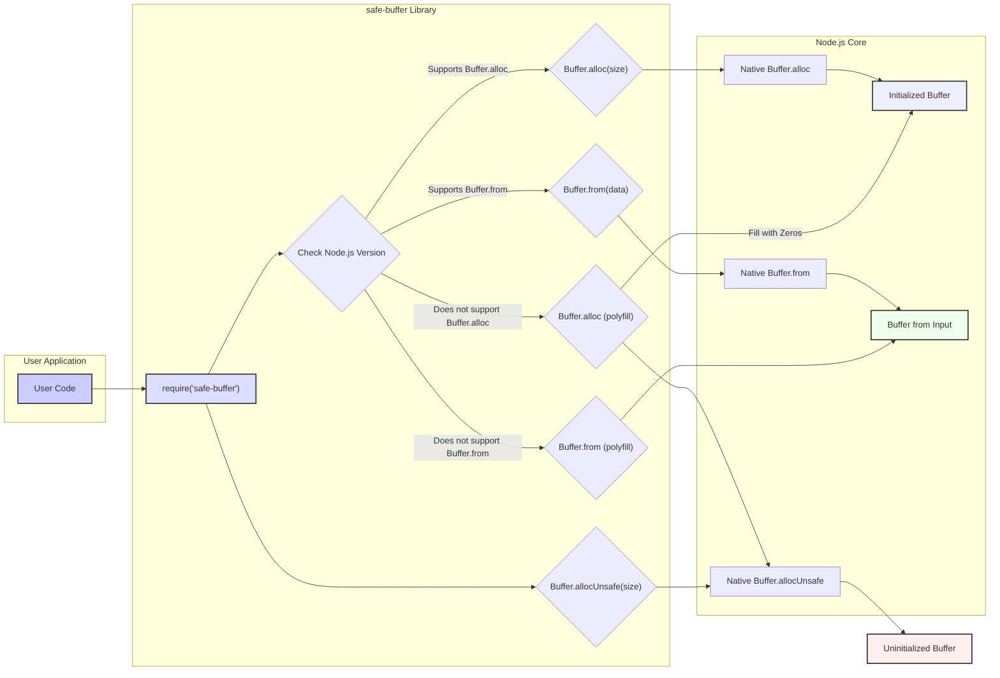

# Project Design Document: safe-buffer

**Version:** 1.1
**Date:** October 26, 2023
**Author:** AI Software Architect

## 1. Introduction

This document provides an enhanced and detailed design overview of the `safe-buffer` project, a Node.js library available on GitHub at [https://github.com/feross/safe-buffer](https://github.com/feross/safe-buffer). This revised document aims for greater clarity and precision in articulating the project's architecture, components, and data flow, thereby facilitating more effective threat modeling in subsequent stages.

`safe-buffer` is a critical library for ensuring safer buffer creation in Node.js, particularly in environments with older Node.js versions. It strategically backports the `Buffer.alloc()` and `Buffer.from()` methods from newer Node.js versions, offering a safer alternative to the potentially insecure `Buffer.allocUnsafe()` by guaranteeing memory initialization.

## 2. Goals and Objectives

*   To provide a consistent and secure API for instantiating `Buffer` objects across a wide range of Node.js versions.
*   To actively prevent the unintentional disclosure of sensitive data by ensuring that newly allocated buffers are initialized with zeros.
*   To offer a seamless, drop-in replacement for native `Buffer` methods in scenarios where memory safety is a paramount concern.
*   To maintain a high degree of backward compatibility, ensuring smooth integration with existing Node.js applications.
*   To deliver a performant solution that avoids the overhead of manual buffer zeroing when using `Buffer.allocUnsafe()`.

## 3. High-Level Design

The `safe-buffer` library operates as an intelligent intermediary between user code and the native Node.js `Buffer` API. It dynamically determines the available `Buffer` methods based on the detected Node.js version. The core principle is to utilize the safer native methods when available and provide robust polyfills for older environments.



## 4. Detailed Design

The `safe-buffer` library's core functionality revolves around providing safe and consistent `Buffer` creation. Key aspects of its design include:

*   **`Buffer.alloc(size, fill?, encoding?)` Implementation:**
    *   **Native Implementation:** If the Node.js environment supports `Buffer.alloc`, `safe-buffer` directly invokes the native method for optimal performance.
    *   **Polyfill Implementation:** In older environments, `safe-buffer`'s polyfill executes the following steps:
        *   An uninitialized buffer is created using `Buffer.allocUnsafe(size)`.
        *   The newly allocated memory is then explicitly filled with zeros (or the provided `fill` value) to eliminate any residual data.
*   **`Buffer.allocUnsafe(size)` Implementation:**
    *   `safe-buffer` directly exposes the native `Buffer.allocUnsafe` method without modification.
    *   **Security Responsibility:** It is crucial to understand that when using `Buffer.allocUnsafe`, the responsibility for handling potentially uninitialized memory rests entirely with the developer. `safe-buffer` does not introduce any safety mechanisms for this specific method.
*   **`Buffer.from(array)` Implementation:**
    *   **Native Implementation:** If available, the native `Buffer.from(array)` method is used for efficiency.
    *   **Polyfill Implementation:** The polyfill typically involves:
        *   Creating a new `Buffer` instance with the exact size of the input array.
        *   Iterating through the input array and copying each element into the newly created buffer.
*   **`Buffer.from(buffer)` Implementation:**
    *   **Native Implementation:** The native `Buffer.from(buffer)` is preferred when available.
    *   **Polyfill Implementation:** The polyfill creates a new `Buffer` with the same length as the source buffer and then copies the contents of the source buffer into the new buffer.
*   **`Buffer.from(string, encoding?)` Implementation:**
    *   **Native Implementation:** If the native `Buffer.from(string, encoding?)` is present, it is used directly.
    *   **Polyfill Implementation:** The polyfill handles the encoding of the input string into the buffer. This typically involves:
        *   Calculating the required buffer size based on the string and encoding.
        *   Creating a new `Buffer` of the calculated size.
        *   Writing the string's content into the buffer using the specified encoding.

## 5. Data Flow

The flow of data within `safe-buffer` can be described as follows:

*   The user application initiates a `Buffer` creation request by calling `Buffer.alloc()`, `Buffer.allocUnsafe()`, or `Buffer.from()` through the `safe-buffer` module.
*   `safe-buffer` immediately determines the current Node.js version to ascertain the availability of native `Buffer` methods.
*   **Scenario 1: Native Methods Available:** If the required native methods (`alloc` or `from`) are present, the call is directly forwarded to the corresponding native Node.js `Buffer` API.
*   **Scenario 2: Native Methods Unavailable (Polyfill):**
    *   For `Buffer.alloc()`, the polyfill creates an uninitialized buffer using `Buffer.allocUnsafe()` and subsequently fills it with zeros or the specified fill value.
    *   For `Buffer.from()`, the appropriate polyfill (for array, buffer, or string input) is executed, creating a new buffer and populating it with the provided data.
*   For `Buffer.allocUnsafe()`, the call is always directly passed to the native method, resulting in an uninitialized buffer.
*   Finally, the newly created `Buffer` object (either native or polyfilled) is returned to the user application.

## 6. Security Considerations

This section outlines potential security considerations relevant to `safe-buffer`, intended to guide the threat modeling process.

*   **Data Leakage from Uninitialized Memory:**
    *   **Threat:**  If `Buffer.allocUnsafe()` is used directly (outside of `safe-buffer`'s `alloc` polyfill in older Node.js versions), sensitive data residing in previously allocated memory might be exposed.
    *   **Mitigation:** `safe-buffer`'s `alloc` polyfill in older environments directly addresses this by zeroing out memory. Developers should prefer `Buffer.alloc()` provided by `safe-buffer` for safety.
*   **Vulnerabilities in Polyfill Implementations:**
    *   **Threat:**  Bugs or vulnerabilities within the polyfill implementations of `Buffer.alloc` or `Buffer.from` could introduce security risks, such as incorrect buffer sizing leading to buffer overflows or underflows.
    *   **Mitigation:** Rigorous testing and code reviews of the polyfill implementations are crucial. Staying updated with `safe-buffer` releases that address potential vulnerabilities is important.
*   **Dependency Chain Vulnerabilities:**
    *   **Threat:**  While `safe-buffer` has minimal dependencies, vulnerabilities in its dependencies (if any were introduced in future versions) could indirectly impact the security of applications using `safe-buffer`.
    *   **Mitigation:** Regularly audit the dependency tree for known vulnerabilities using tools like `npm audit` or `yarn audit`.
*   **Denial of Service (DoS) through Resource Exhaustion:**
    *   **Threat:**  Although less likely, vulnerabilities in the buffer allocation logic within the polyfills could potentially be exploited to cause excessive memory allocation, leading to a denial of service.
    *   **Mitigation:**  Careful attention to buffer sizing and allocation limits within the polyfills is necessary.
*   **Incorrect Encoding Handling in `Buffer.from(string)` Polyfill:**
    *   **Threat:**  If the string encoding is not handled correctly in the polyfill, it could lead to data corruption or misinterpretation of the string data.
    *   **Mitigation:**  Thorough testing of the string encoding logic in the polyfill is essential.

## 7. Deployment Considerations

*   `safe-buffer` is designed to be seamlessly integrated as a dependency within Node.js projects.
*   Installation is typically done using npm or yarn:
    *   `npm install safe-buffer`
    *   `yarn add safe-buffer`
*   To utilize `safe-buffer`, developers simply require it in their code:
    ```javascript
    const Buffer = require('safe-buffer').Buffer;

    // Use Buffer.alloc, Buffer.from, Buffer.allocUnsafe as needed
    const safeBuffer = Buffer.alloc(10);
    const bufferFrom = Buffer.from('hello');
    const unsafeBuffer = Buffer.allocUnsafe(5);
    ```
*   `safe-buffer` automatically detects the Node.js environment at runtime and adjusts its behavior accordingly, requiring no manual configuration.

## 8. Assumptions and Constraints

*   The underlying Node.js environment is assumed to be functioning correctly and providing accurate version information.
*   The accuracy of the Node.js version detection mechanism within `safe-buffer` is critical for its correct operation.
*   The polyfill implementations aim for functional equivalence with the native methods but might have subtle performance differences in certain scenarios.
*   `safe-buffer` adheres to semantic versioning principles, ensuring predictable updates and minimizing breaking changes.

## 9. Future Considerations

*   **TypeScript Definitions:** Providing official TypeScript definition files (`.d.ts`) would significantly enhance the developer experience for TypeScript users, offering static typing and improved code completion.
*   **Performance Benchmarking and Optimization:** Continuously benchmarking the performance of the polyfill implementations against native methods and exploring potential optimizations could further improve the library.
*   **WebAssembly (WASM) Implementation:** Investigating the potential of implementing core functionalities using WebAssembly could lead to performance gains, particularly in polyfill scenarios.
*   **Exploring Alternative Buffer Implementations:**  While unlikely to replace the core functionality, exploring alternative, potentially more secure or performant buffer implementations for specific use cases could be considered.
*   **Integration with Security Static Analysis Tools:** Providing guidance or specific rules for static analysis tools to recognize and recommend the use of `safe-buffer` in security-sensitive contexts could promote its adoption.

This improved design document provides a more detailed and nuanced understanding of the `safe-buffer` project. It offers a solid foundation for conducting thorough threat modeling and identifying potential security vulnerabilities.